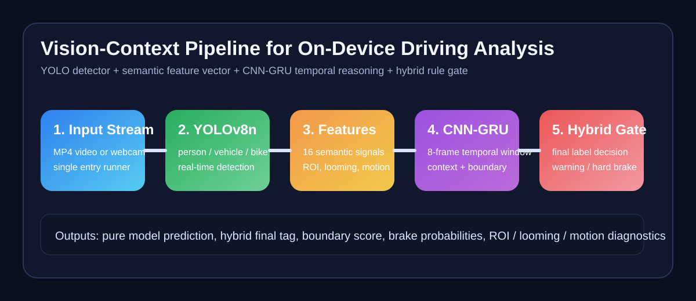

# 비전인식-맥락 연계형 온디바이스 파이프라인

실시간 주행 영상을 입력으로 받아 객체를 검출하고, 의미 기반 특징 벡터와 CNN-GRU 시계열 모델을 통해 주행 맥락을 해석하는 저장소다. 기본 목적은 **온디바이스에서 바로 실행 가능한 경량 파이프라인**을 제공하고, 이후 멀티모달 데이터셋 자동 구축으로 확장 가능한 기반을 만드는 것이다.



## 새 스레드/인수인계 시작점
GitHub만 보고 현재 상태를 빠르게 이어받아야 한다면 아래 순서로 보면 된다.

1. [프로젝트 종합 인수인계](docs/30_%ED%94%84%EB%A1%9C%EC%A0%9D%ED%8A%B8_%EC%A2%85%ED%95%A9%EC%9D%B8%EC%88%98%EC%9D%B8%EA%B3%84.md)
2. [논문 재현 가이드](docs/29_%EB%85%BC%EB%AC%B8%EC%9E%AC%ED%98%84%EA%B0%80%EC%9D%B4%EB%93%9C.md)
3. [세 모델 정의 재구성](docs/28_%EC%84%B8%EB%AA%A8%EB%8D%B8%EC%A0%95%EC%9D%98%EC%9E%AC%EA%B5%AC%EC%84%B1.md)

위 세 문서에는 현재 최종 모델 정의, 논문 재현 절차, 핵심 코드 위치, 산출물 경로, 해석 시 주의사항까지 정리되어 있다.

## 개요
이 프로젝트는 아래 흐름으로 동작한다.

1. `YOLOv8n`으로 `person / vehicle / bike`를 검출한다.
2. 현재 프레임 기준 `16차원 순간 특징 벡터`를 만든다.
3. 최근 `8프레임`을 `CNN-GRU`에 입력해 시간 변화를 학습한다.
4. raw detection 규칙으로 최종 태그를 보정한다.
5. UI에서 `순간 규칙 / CNN-GRU / CNN-GRU+규칙` 결과를 함께 확인한다.

## 핵심 기능
| 기능 | 설명 |
|---|---|
| 실시간 추론 | mp4 또는 웹캠을 입력으로 받아 즉시 동작 |
| 경량 detector | YOLOv8n 기반 3클래스 검출 |
| 맥락 인식 | 16차원 순간 특징 + CNN-GRU |
| 하이브리드 보정 | raw detection 규칙 + temporal 출력 결합 |
| 검수 루프 | 브레이크 구간 검수 UI 제공 |
| GitHub 실행성 | 상대경로 기반 실행, 최소 체크포인트 포함 |

## 저장소 구성
| 경로 | 용도 |
|---|---|
| `run_final_model.py` | 제안 최종 하이브리드 모델 실행 |
| `run_yolo_rule_model.py` | YOLO + 규칙형 baseline 실행 |
| `run_baseline_cnn_gru_model.py` | CNN-GRU 단독 baseline 실행 |
| `run_compare_three_models.py` | 세 모델 동시 비교 및 그래프 저장 |
| `src/vcp/` | 파이프라인 본체 코드 |
| `models/checkpoints/` | 실행용 최소 체크포인트 |
| `configs/` | 런타임/학습 설정 |
| `launchers/` | Windows 배치 실행 파일 |
| `data/annotations/context/` | 수동 맥락 라벨 원본 |
| `tests/` | 회귀 테스트 |
| `docs/` | 한국어 설계 문서 |
| `tasks/` | 작업 이력 및 체크리스트 |

## 빠른 시작
### 1. 설치
```powershell
cd C:\yolstm
python -m venv .venv
.\.venv\Scripts\activate
python -m pip install --upgrade pip
python -m pip install -r requirements.txt
python -m pip install -e .
```

### 2. 바로 실행
#### 제안 최종 모델
```powershell
cd C:\yolstm
.\.venv\Scripts\python.exe run_final_model.py
```

#### YOLO + 규칙형 baseline
```powershell
cd C:\yolstm
.\.venv\Scripts\python.exe run_yolo_rule_model.py
```

#### CNN-GRU 단독 baseline
```powershell
cd C:\yolstm
.\.venv\Scripts\python.exe run_baseline_cnn_gru_model.py
```

#### 세 모델 동시 비교
```powershell
cd C:\yolstm
.\.venv\Scripts\python.exe run_compare_three_models.py
```

기본 동작은 다음과 같다.
- 각 루트 실행 파일 상단의 `VIDEO_SOURCE`가 존재하면 해당 영상을 사용한다.
- 영상이 없으면 자동으로 `webcam:0`으로 전환한다.

## 간단 재현 코드
`spatial.py`의 핵심 동작을 처음 보는 사람도 바로 따라해볼 수 있도록, 루트에 단순화한 재현 스크립트를 함께 둔다.

```powershell
cd C:\yolstm
.\.venv\Scripts\python.exe practice_spatial_encoder.py
```

이 스크립트는 아래 과정을 한 번에 보여준다.
- 단일 프레임 로드
- YOLO 검출
- 16차원 의미 기반 특징 벡터 계산
- 결과 미리보기 이미지 저장

자세한 사용법은 [Spatial Encoder 간단 재현 가이드](docs/34_spatial_%EA%B0%84%EB%8B%A8%EC%9E%AC%ED%98%84%EA%B0%80%EC%9D%B4%EB%93%9C.md)를 참고한다.

## 논문 재현
이 저장소는 논문 초안 기준 실험을 다시 확인할 수 있도록 정리되어 있다. 기본적으로 아래 두 가지를 재현 대상으로 둔다.

1. 세 모델 비교 실행
   - `YOLO + 규칙`
   - `CNN-GRU 단독`
   - `CNN-GRU + 규칙`
2. 논문에 사용한 표/그래프 재생성

재현에 필요한 로컬 영상은 저장소에 포함하지 않는다. 아래 파일명을 기준으로 `data/raw/videos/` 경로에 준비하면 된다.

- `people_braking.mp4`
- `stopcar.mp4`
- `rainy_stopcar.mp4`
- `stopcar1.mp4`
- `stopcar2.mp4`
- `race.mp4`

### 논문 결과 재현 순서
```powershell
cd C:\yolstm
.\.venv\Scripts\python.exe run_compare_three_models.py
.\.venv\Scripts\python.exe scripts\export_three_class_paper_bar_chart.py
.\.venv\Scripts\python.exe scripts\export_three_model_class_count_graph.py
.\.venv\Scripts\python.exe scripts\export_manual_hard_brake_range_summary.py
.\.venv\Scripts\python.exe scripts\export_merged_brake_event_metric_comparison.py
```

주요 산출물은 아래 위치에 저장된다.

- `artifacts/comparisons/<video_stem>_three_model_compare/summary.json`
- `artifacts/comparisons/<video_stem>_three_model_compare/frame_comparison.csv`
- `artifacts/comparisons/<video_stem>_three_model_compare/comparison_plot.png`
- `three_class_paper_bar_chart.png`
- `manual_hard_brake_range_summary.png`
- `merged_brake_class_count_comparison.png`
- `paper_metric_comparison_with_event_score.png`

자세한 절차는 [논문 재현 가이드](docs/29_논문재현가이드.md)를 참고하면 된다.

## Jetson 배포
실제 배포 단계는 Jetson Orin Nano를 기준으로 별도 문서로 정리했다.

1. [Jetson 설치 체크리스트](docs/31_jetson_설치체크리스트.md)
2. [Jetson 배포 실행 매뉴얼](docs/32_jetson_배포실행매뉴얼.md)
3. [Jetson 성능 검증 표 양식](docs/33_jetson_성능검증표양식.md)

## 입력 소스 변경
각 루트 실행 파일 상단 설정만 수정하면 된다.

```python
USE_WEBCAM = False
WEBCAM_INDEX = 0
VIDEO_SOURCE = str(ROOT_DIR / "data" / "raw" / "videos" / "people_braking.mp4")
```

| 사용 방식 | 설정 |
|---|---|
| mp4 파일 | `USE_WEBCAM = False`, `VIDEO_SOURCE` 수정 |
| 웹캠 | `USE_WEBCAM = True`, `WEBCAM_INDEX` 수정 |

## 화면에서 확인할 수 있는 정보
- YOLO 검출 박스
- `pure model`: 순수 CNN-GRU 예측
- `hybrid final`: raw detection 규칙 보정 최종 태그
- `boundary`
- `brake_warning / hard_brake_risk / front_vehicle_follow` 확률
- `roi / center / roi_mean_area / roi_count_norm / roi_vertical_bias`

키 입력:
- `space`: 재생/일시정지
- `s`: 현재 화면 저장
- `q`: 종료

## 보조 실행 명령
### 최종 하이브리드 UI
```powershell
.\.venv\Scripts\python.exe -m vcp.tools.final_hybrid_model_ui
```

### 브레이크 구간 검수 UI
```powershell
.\.venv\Scripts\python.exe -m vcp.tools.brake_review_ui
```

### YOLO 3클래스 학습
```powershell
.\.venv\Scripts\python.exe -m vcp.tools.train_yolo_nano --data configs/datasets/yolo3cls_merged.yaml --model models/pretrained/yolov8n.pt --epochs 150 --final-epochs 20 --imgsz 640 --batch 16 --device 0 --optimizer Adam --patience 20 --project experiments/exp_011_yolo3cls_training/runs --name yolov8n_3cls_from_pretrained
```

### Temporal 학습
```powershell
.\.venv\Scripts\python.exe -m vcp.tools.train_temporal_gru --dataset-dir data/processed/<dataset_dir> --epochs 24 --batch-size 256 --hidden-dim 96 --cnn-channels 24 --device cuda:0 --project experiments/temporal_runs --name temporal_run
```

### 순간 feature 기반 pseudo-label dataset 생성
```powershell
.\.venv\Scripts\python.exe -m vcp.tools.build_rule_context_dataset --runs-root outputs/runs --output-root data/processed --dataset-name rule_context_instant_feat16_v2 --run-glob *_feat16instant_demo_* --window-size 8 --val-ratio 0.2 --baseline-window 8
```

### 세 모델 동시 비교 산출
```powershell
.\.venv\Scripts\python.exe run_compare_three_models.py
```

이 명령은 아래 산출물을 함께 저장한다.
- 프레임별 비교 CSV
- 요약 JSON/Markdown
- 비교 그래프 PNG
- 감지 이벤트 스크린샷
- 감지 이벤트 클립

## 테스트
```powershell
cd C:\yolstm
.\.venv\Scripts\python.exe -m pytest -q
```

## 포함된 실행용 체크포인트
| 파일 | 용도 |
|---|---|
| `models/checkpoints/yolo3cls_best.pt` | 3클래스 detector |
| `models/checkpoints/temporal_shared_best.pt` | 2번 CNN-GRU 단독 모델 |
| `models/checkpoints/temporal_final_best.pt` | 3번 CNN-GRU+규칙 모델 |
| `configs/hybrid_rule_params.json` | 하이브리드 룰 파라미터 |

## 문서 인덱스
추천 순서로 읽으면 된다.

1. [프로젝트 개요](docs/00_프로젝트개요.md)
2. [시스템 아키텍처](docs/01_시스템아키텍처.md)
3. [모델 설계](docs/03_모델설계.md)
4. [실험 방법](docs/05_실험방법.md)
5. [브레이크 리뷰 UI](docs/17_브레이크리뷰UI.md)
6. [최종 하이브리드 모델 UI](docs/20_최종하이브리드모델UI.md)
7. [세 모델 정의 재구성](docs/28_세모델정의재구성.md)
8. [논문 재현 가이드](docs/29_논문재현가이드.md)
9. [프로젝트 종합 인수인계](docs/30_프로젝트_종합인수인계.md)
10. [Jetson 설치 체크리스트](docs/31_jetson_설치체크리스트.md)
11. [Jetson 배포 실행 매뉴얼](docs/32_jetson_배포실행매뉴얼.md)
12. [Jetson 성능 검증 표 양식](docs/33_jetson_성능검증표양식.md)

## 저장소 정책
- 대용량 데이터셋, 실험 산출물, 영상 파일은 저장소에 포함하지 않는다.
- 실행에 필요한 최소 체크포인트만 `models/checkpoints/`에 포함한다.
- 문서와 코드 주석은 한국어 기준으로 유지한다.
- 학습 경로와 배포 경로는 분리 설계를 유지한다.

## 변경 이력
최근 변경 내용은 [CHANGELOG.md](CHANGELOG.md)에서 관리한다.
