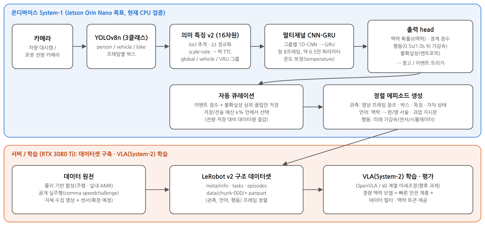
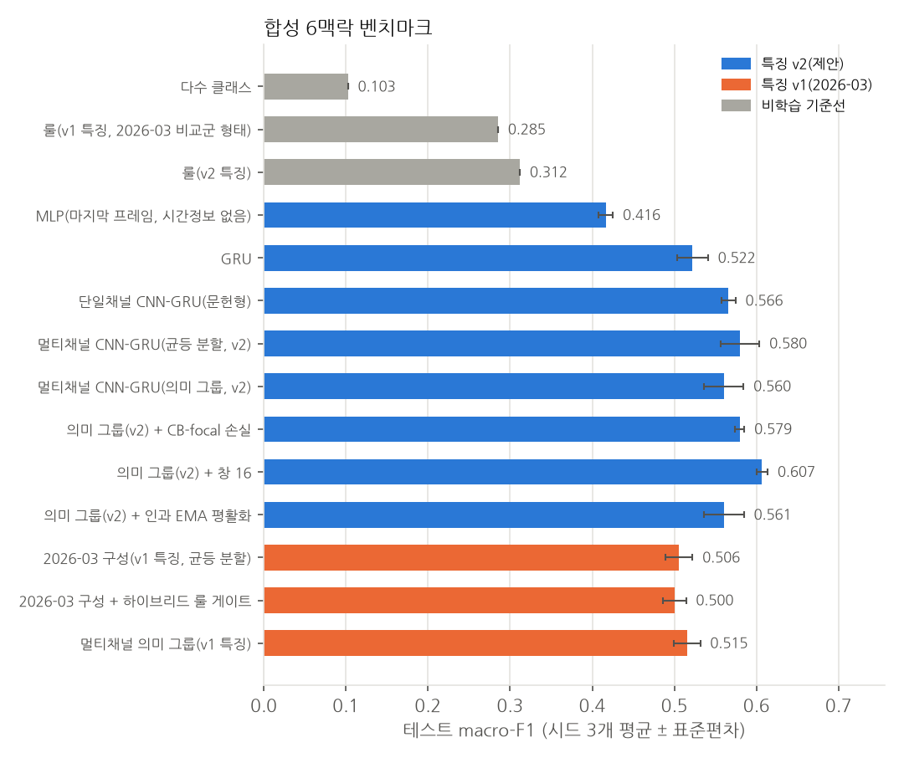
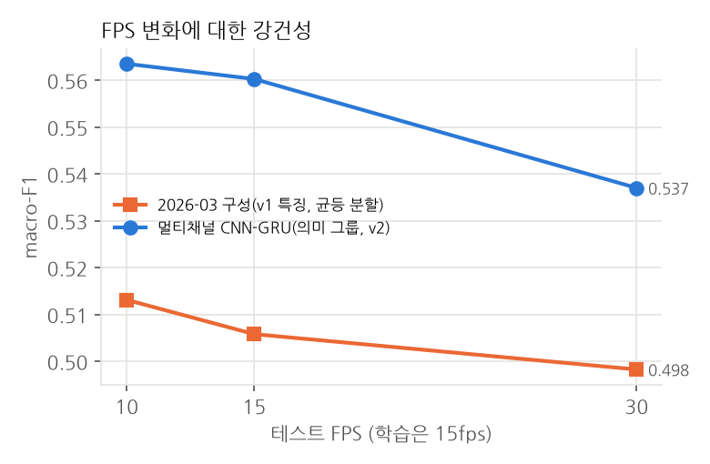
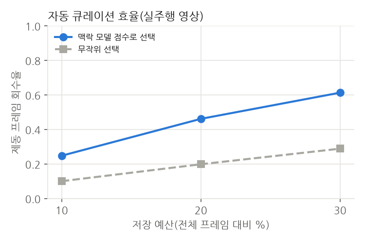
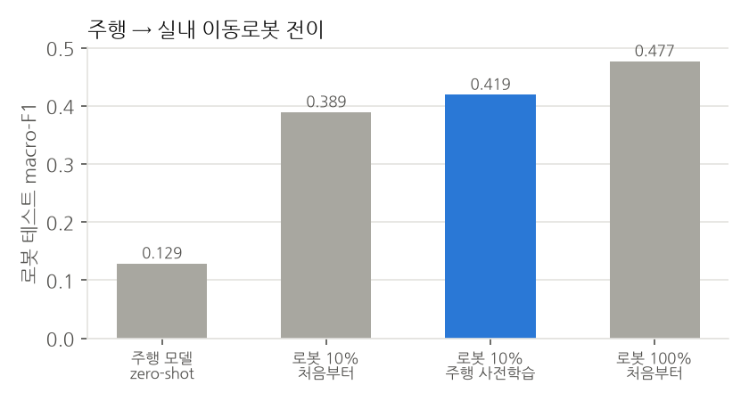

# 경량 의미 특징 기반 시계열 맥락 인식의 재평가와 피지컬 AI 데이터 자동 구축으로의 확장: 주행 및 실내 이동로봇 적용

<!-- 자동 생성 파일: scripts/build_paper.py (직접 수정 금지) -->

**초록** — 실시간 카메라 영상의 객체 검출 결과를 의미 특징으로 요약하고 경량 시계열 모델로 주행 맥락(추종, 제동 경고, 강한 제동 위험 등)을 인식하는 온디바이스 파이프라인을 다룬다. 2026년 3월 제출본(YOLOv8n + 16차원 특징 + 멀티채널 CNN-GRU + 하이브리드 룰 게이트)을 재검토하여 같은 영상 안 구간 분할과 검증셋 재사용에 의한 평가 누수, 특징 피크 기반 라벨을 같은 특징의 룰로 평가하는 순환 구조, 프레임 차분 특징의 FPS 의존성을 확인하였다. 이를 바로잡기 위해 (i) 추적·시간 정규화 기반 역 TTC 특징(v2), (ii) 라벨이 특징과 독립인 물리 기반 합성 벤치마크(주행 700개, 실내 이동로봇 500개 에피소드), (iii) 속도 센서 라벨의 공개 실주행 영상 검증, (iv) 에피소드/시간 블록 분할·검증셋 전용 튜닝·다중 시드의 자동 실험 프로토콜을 제시한다. 재평가 결과 성능을 좌우한 것은 특징 설계였다. 같은 구조에서 v1을 v2로 바꾸면 macro-F1이 합성 주행에서 0.506 ± 0.016에서 0.580 ± 0.023로, 실주행 영상(10-fold)에서 0.302 ± 0.085에서 0.442 ± 0.090로 올랐다. 반면 의미 기반 채널 그룹과 하이브리드 룰 게이트는 macro-F1 개선을 보이지 않았고, 정확도는 다수 클래스에 끌려 macro-F1과 반대 순위를 냈다. 두 특징을 결합하고 창을 16으로 늘린 구성은 합성 벤치마크에서 macro-F1 0.650 ± 0.012로 가장 높았으나, 실주행 영상에서는 v2 단독 대비 macro-F1 이점이 없었고 제동 AUROC만 0.782로 가장 높았다. 합성 데이터로만 학습한 모델은 실영상 제동 구간을 AUROC 0.687로 판별하였다. 나아가 같은 경량 모델을 피지컬 AI 데이터 엔진으로 확장하여 미래 가감속 예측 head, 맥락 기반 한/영 서술, 예산 기반 큐레이션, LeRobot 구조 내보내기를 구현하였다. 저장 예산 20%에서 모델 점수 기반 선별은 제동 프레임의 46.2%를 회수하였고(무작위 19.9%), 주행 사전학습은 로봇 데이터 10% 미세조정에서 macro-F1을 0.389 ± 0.026에서 0.419 ± 0.006로 높였다. temporal 모델은 클라우드 CPU 단일 스레드에서 창당 0.79 ms였으며, Jetson Orin Nano 실측은 향후 과제로 남긴다.

**주제어**: 맥락 인식, CNN-GRU, 역 TTC, 평가 누수, 합성 데이터, 피지컬 AI, VLA, 데이터 큐레이션, 이동로봇

---

## 1. 서론

로봇과 자율주행을 포괄하는 피지컬 AI는 대규모 (관측, 언어, 행동) 데이터로 학습한 VLA(Vision-Language-Action) 모델로 빠르게 옮겨 가고 있다[1-4]. 그러나 이런 데이터는 수집 비용이 크고, 실제 운용 중 녹화한 영상의 대부분은 학습 가치가 낮은 평범한 구간이다. 따라서 엣지 장치에서 "지금이 의미 있는 상황인가"를 싸게 판단하고, 그런 구간만 정렬된 형태로 남기는 경량 맥락 인식 계층이 필요하다. 최근 VLA 구조가 느린 추론 계통(System-2)과 빠른 반응 계통(System-1)을 나누는 흐름[4, 5]도 같은 요구를 보여 준다.

본 연구의 출발점은 2026년 3월에 제출한 모델이다. 이 모델은 YOLOv8n[6, 7]으로 사람/차량/이륜차를 검출하고, 박스를 16차원 의미 특징으로 바꾼 뒤, 특징 그룹별 1D-CNN과 GRU[8]를 결합한 멀티채널 CNN-GRU와 하이브리드 룰 게이트로 맥락을 판단하였다. 당시 보고에서 하이브리드 구성은 브레이크 관련 recall을 크게 높였다. 그러나 재검토 결과 다음 문제를 확인하였다.

1. **평가 누수**: 영상 6개 안에서 구간 단위로 학습/검증을 나눠 인접한 8프레임 창이 양쪽에 걸쳤고, 룰 임계값을 고른 검증셋에서 성능을 다시 보고했으며, 학습에 쓴 영상을 실측 비교에 다시 사용했다[9].
2. **라벨 순환**: 제동 구간 라벨을 ROI/looming 특징 피크로 부트스트랩했는데, 같은 특징으로 만든 룰 게이트가 이를 평가받았다.
3. **표본 부족과 지표 편향**: 검증셋의 브레이크 표본이 한 자릿수였고, 다수 클래스 비율에 가까운 정확도가 주 지표였다.
4. **구현-문서 불일치**: 배포 체크포인트의 채널 그룹이 문서와 달리 의미 그룹이 아닌 인덱스 균등 분할이었고, v1 특징의 클래스 비율 값 배치가 key 이름과 달랐다(값은 person, vehicle 순, 이름은 vehicle, person 순).
5. **FPS 의존 특징**: looming/motion이 프레임 차분이어서 배포 장치의 FPS가 바뀌면 같은 상황도 다른 값이 된다.

본 논문의 기여는 다음과 같다.

- 위 문제를 고친 평가 프로토콜(에피소드/시간 블록 단위 분할, 검증셋 전용 튜닝, 다중 시드, macro-F1·이벤트 단위 지표·bootstrap 신뢰구간)과 자동 실험 스위트를 제시한다.
- 박스 크기 변화율로 역 TTC를 추정하고 Δt로 정규화한 특징 v2를 제안하고, 세 도메인에서 v1 대비 효과와 FPS·노이즈 변화에 대한 강건성을 정량 비교한다.
- 특징과 독립인 물리량(TTC, 요구 감속도, 자차 감속도)으로 라벨을 만드는 합성 벤치마크를 주행과 실내 이동로봇(AMR) 두 도메인에 대해 구축한다.
- 속도 센서로 라벨을 만든 공개 실주행 영상에서 같은 파이프라인을 검증한다.
- 경량 맥락 모델을 VLA 데이터 구축과 연결한다: 행동 예측 보조 head, 맥락 기반 언어 서술, 예산 기반 큐레이션, LeRobot 구조 내보내기.

## 2. 관련 연구

**객체 검출과 시계열 맥락.** 단일 단계 검출기[6]와 그 경량 구현[7]은 엣지 장치에서 널리 쓰인다. 검출 결과나 프레임 특징을 RNN/GRU[8]나 시간 합성곱[10]으로 묶어 사고 예측[11]이나 운전 행동 인식[12]에 쓰는 연구가 있다. 본 연구는 원 영상 특징 대신 해석 가능한 저차원 의미 특징을 써서 모델을 수만 개 파라미터 규모로 유지한다.

**충돌 시간(TTC).** 단안 영상에서 물체 상의 크기 변화율로 TTC를 추정하는 원리는 지각 심리학에서 τ 이론으로 알려져 있다[13]. 박스 폭 w가 거리 Z에 반비례하면 d ln w / dt = −Ż/Z = 1/TTC 이므로, 거리 추정 없이 역 TTC를 얻을 수 있다.

**피지컬 AI와 VLA.** RT-2[1], OpenVLA[2], π0[3] 등은 웹 규모 사전학습과 로봇 시연 데이터를 결합한다. Open X-Embodiment[14]와 LeRobot[15]은 이종 로봇 데이터를 공통 형식으로 모으는 기반을 제공한다. 프레임 단위 추론 서술(embodied chain-of-thought)[16]이 정책 성능을 높인다는 보고와, 주행 분야에서 VLM을 계획에 쓰는 연구[17]도 있다. GR00T N1[4]은 느린 VLM 계통과 빠른 행동 계통을 분리한다. 본 연구는 VLA 자체가 아니라, 그 학습 데이터를 엣지에서 고르고 주석하는 경량 System-1 계층을 다룬다.

**평가 누수.** 시계열 데이터의 무작위/인접 분할은 성능을 과대평가하며[9, 18], 블록 단위 교차검증이 권장된다.

**불균형과 보정.** 희소 이벤트 클래스에는 focal loss[19]와 class-balanced 가중치[20]를, 확률 보정에는 temperature scaling[21]을 사용한다. 협동 로봇의 속도·분리 감시(SSM)[22]는 사람과의 거리·접근 속도에 따라 감속/정지하도록 규정하며, 본 연구의 AMR 라벨 체계(감속, 안전 정지)와 대응된다.

## 3. 방법

### 3.1 파이프라인
그림 1과 같이 카메라 프레임마다 YOLOv8n(3클래스)이 박스를 내고, 특징 추출기가 16차원 의미 벡터를 만든다. 최근 W(=8) 프레임의 벡터를 멀티채널 CNN-GRU에 넣어 맥락 확률, 경계 점수, (선택적으로) 행동을 출력한다. 출력은 경고/이벤트 트리거와 자동 큐레이션에 쓰이고, 선택된 구간은 (관측, 언어, 행동) 에피소드로 저장된다.



*그림 1. 시스템 구조. 온디바이스 System-1(맥락 인식·큐레이션)과 서버 측 데이터셋 구축·VLA 학습의 분리.*

### 3.2 의미 특징
**v1(2026-03).** 검출 수, 평균/최대 신뢰도, 평균 면적과 분산, 클래스 비율 3개, 클래스별 평균 신뢰도 3개, 중앙 ROI 위험도, motion, 중심 근접도, looming, occlusion으로 구성된다. looming은 ROI 박스 평균 면적의 프레임 간 증가량에 20을 곱한 값으로, FPS와 신규 객체 진입에 민감하다.

**v2(제안).** 전역 5개(검출 밀도, 평균 신뢰도, 평균 면적, 면적 분산, 검출 밀도 변화율), 선행 차량 6개(차량 비율, 존재, 크기, 하단 위치, 크기 변화율, 역 TTC), 취약 도로 이용자(VRU) 5개(사람/이륜차 비율, 존재, 크기, 접근 지표)로 구성된다. 선행 차량은 화면 하단 중앙 통로의 차량 중 하단 y가 가장 큰 박스이며, 직전 프레임 박스와 IoU ≥ 0.3이면 같은 객체로 연결한다. 크기 변화율은

  r_t = r_{t−1} + α_t ( (ln w_t − ln w_{t−1}) / Δt_t − r_{t−1} ),  α_t = 1 − exp(−Δt_t / τ)

로 계산하며(τ = 0.25 s), 역 TTC 특징은 max(0, r_t)를 [0, 1]로 자른 값이다. 연결이 끊긴 신규 객체는 r = 0에서 시작한다. Δt로 정규화하므로 같은 물리 상황이면 FPS와 무관하게 비슷한 값을 낸다(단위 테스트로 10/30fps에서 확인).

### 3.3 멀티채널 CNN-GRU
입력 X ∈ R^{W×D}를 의미 그룹 G_1..G_K로 나누고, 그룹마다 두 층 1D-CNN(커널 3, 채널 C)을 적용한 뒤 시간축으로 이어 붙여 GRU(은닉 H)에 넣는다. GRU 출력의 시간 평균에 맥락(softmax), 경계(sigmoid), 행동(회귀) head를 둔다. 의미 그룹은 v2에서 {global, vehicle, VRU}, v1에서 {global, vehicle, person, bike}이다. 2026-03 체크포인트는 실제로는 인덱스 균등 분할 [0–4], [5–8], [9–12], [13–15]를 사용했으며, 본 연구는 두 방식을 모두 비교한다. 학습 손실은 L = L_ctx + 0.5·L_bnd (+ λ·L_act)이며, 경계 타깃은 ±2프레임으로 확장하였다.

### 3.4 하이브리드 룰 게이트와 후처리
2026-03 하이브리드 게이트(ROI·중심·looming 조건과 경계/확률 조건으로 경고/강한 제동 클래스를 승격)를 그대로 벡터화해 재현하였다. 임계값은 검증셋에서만 고른다. 후처리로 인과 지수이동평균 평활화와 temperature scaling을 비교한다.

### 3.5 피지컬 AI / VLA 연계
- **행동 head**: 0.5초와 1.0초 뒤 자차 가감속을 smooth-L1로 회귀한다. 실데이터에서는 속도 센서, 합성 데이터에서는 시뮬레이터 값이 정답이다.
- **언어 서술**: 맥락 라벨과 물리량(속도, TTC, 확신도)으로 한국어/영어 서술을 템플릿 생성해 프레임 단위 추론 주석으로 저장한다. 에피소드 단위 과업 지시문은 도메인별로 둔다.
- **자동 큐레이션**: 이벤트 점수(제동 계열 확률 합) + 0.5 × 정규화 엔트로피로 2초 클립을 순위화해 저장 예산 k% 안에서 고른다.
- **내보내기**: LeRobot v2 디렉터리 구조(meta/info.json, tasks.jsonl, episodes.jsonl, data/chunk-000/*.parquet)로 관측(특징, 박스, 자차 상태, 영상 프레임 참조), 언어, 행동, 큐레이션 점수를 프레임 정렬해 저장한다. 공식 LeRobot 로더 검증은 향후 과제다.
- **로봇 전이**: 같은 3클래스 검출 체계를 실내 물류 환경에서 person=작업자, vehicle=지게차/AGV, bike=대차로 해석하고, 6맥락을 {이동, 추종, 감속, 안전 정지, 재개, 혼잡}으로 대응시킨다.

## 4. 데이터

### 4.1 물리 기반 합성 주행 데이터
3차선 도로에서 자차는 IDM[23]과 반응 지연(0.3–1.0 s), 1차 구동 지연을 따른다. 시나리오는 자유 주행, 추종, 선행차 급제동(3–8 m/s²), 끼어들기, 보행자/이륜차 횡단, 정체, 정지-출발 7종이다. 객체는 핀홀 카메라(640×480, f = 520 px, 높이 1.3 m)로 투영하고, 크기 의존 미검출, 박스 흔들림, 신뢰도 잡음, 사람↔이륜차 혼동, 오검출, 가림, 자차 가감속에 따른 피치 변화를 적용한다. 라벨은 GT 상태에서만 계산한다(표 1).

| 라벨 | 규칙(우선순위 높은 순) |
|---|---|
| hard_brake_risk | 진행 경로 객체 TTC < 1.8 s 또는 자차 감속 > 4 m/s² |
| brake_warning | TTC < 3.5 s 또는 자차 감속 > 2 m/s² |
| post_brake_recovery | 강한 제동 이벤트 종료 후 3 s 이내, 가속도 ≥ −0.5, 속도 < 이벤트 전의 85% |
| dense_traffic | 전방 35 m 내 차량 ≥ 4대이고 자차 속도 < 10 m/s |
| front_vehicle_follow | 진행 경로 선행차의 시간 간격 < 3 s 또는 거리 < 25 m |
| normal_drive | 그 외 |

표 1. 합성 데이터 라벨 규칙(TTC는 접근 속도 ≥ 1 m/s일 때만 계산).

에피소드는 30초, 15fps이며, 에피소드 단위로 train/val/test를 나눈다. 강건성 평가를 위해 테스트 에피소드와 같은 시드(같은 물리 상황)를 10/30fps, 노이즈 low/high로 다시 생성하였다. 생성된 메인 데이터는 700개 에피소드, 315,000 프레임이며 에피소드 단위 분할은 490/105/105이다. 라벨 비율은 normal_drive 37.7%, front_vehicle_follow 42.1%, brake_warning 5.1%, hard_brake_risk 3.0%, post_brake_recovery 5.9%, dense_traffic 6.3%이다. 시뮬레이터에서 근접 접촉(충돌 처리)이 발생한 에피소드는 52개로, 공격적 끼어들기 등 안전 임계 상황을 일부러 포함한 결과다.

### 4.2 실내 이동로봇(AMR) 합성 데이터
폭 2 m 통로, 로봇 속도 0.8–1.6 m/s, 카메라 높이 0.8 m, 최대 제동 2.5 m/s²로 바꾸고, 통로 주행, AGV 추종, AGV 급정지, 작업자 횡단, 마주 오는 작업자, 혼잡 6종 시나리오를 만든다. 감속/안전 정지 임계값은 TTC 3.0/1.5 s, 감속도 0.6/1.2 m/s²이다. 500개 에피소드, 225,000 프레임을 생성했고 라벨 비율은 normal_move 55.2%, follow_agent 32.2%, slow_down 2.9%, safety_stop 1.0%, resume 2.3%, crowded 6.3%이다. 근접 접촉 에피소드는 71개다.

### 4.3 공개 실주행 영상
comma.ai speedchallenge[24]의 학습 영상(20fps, 20,400프레임, 약 17분)과 프레임별 속도를 사용한다. 3클래스 YOLOv8n으로 모든 프레임을 검출해 저장한 뒤(CPU 평균 62.6 ms/프레임), 특징을 계산한다. 라벨은 속도를 0.5초 이동평균하고 미분한 가속도로 정한다: 속도 < 1.0이면 정지, 가속도 < −0.6이면 제동, > 0.6이면 가속, 그 외 정속(원 데이터셋은 속도 단위를 명시하지 않는다). 라벨 분포는 cruise 12,916, accelerating 2,783, braking 3,473, stopped 1,228 프레임이다. 영상을 10개 연속 블록으로 나눠 fold마다 test 1, val 1, train 8 블록을 쓰고, 블록 경계 ±1초는 평가에서 제외한다. 10fps 강건성 평가는 짝수 프레임만으로 특징을 다시 계산해 수행한다.

## 5. 실험 설정
- **비교군**: 다수 클래스, 룰(v1 특징: 2026-03 YOLO+rule 형태 / v2 특징: 역 TTC), MLP(마지막 프레임), GRU, 단일채널 CNN-GRU(문헌형), 멀티채널 CNN-GRU(균등 분할 / 의미 그룹), 2026-03 구성(+하이브리드 게이트), 제안 구성의 변형(CB-focal 손실, 창 16, EMA 평활화).
- **학습**: Adam(lr 10⁻³), 배치 512, 최대 14 에폭, 검증 macro-F1 기준 조기 종료(인내 4), 은닉 96, CNN 채널 24, 학습 창 stride 2. 시드 3개(합성), fold 10개(실데이터).
- **튜닝 원칙**: 룰 임계값, 하이브리드 게이트, temperature, EMA 계수, 경계 임계값은 모두 검증셋에서만 고르고 테스트셋에는 고정 적용한다.
- **지표**: 정확도, macro-F1, 클래스별 F1, 제동 이벤트 recall(GT 이벤트 시작 0.5초 전부터 종료까지 한 번이라도 검출), 검출 지연, 분당 오경보(GT 이벤트 ±1초와 겹치지 않는 2프레임 이상 예측 구간), 분당 라벨 전환, ECE, 에피소드 bootstrap 95% CI, 엔트로피의 오류 탐지 AUROC.
- **환경**: 학습·평가는 GPU 없는 클라우드 컨테이너(Intel(R) Xeon(R) Processor @ 2.80GHz, 4 논리 코어)에서 수행했다. 동일 코드는 `--device auto`로 RTX 3080 Ti에서도 실행된다.

## 6. 결과

### 6.1 합성 6맥락 벤치마크



*그림 2. 합성 벤치마크 테스트 macro-F1(에피소드 단위 분할, 시드 3개 평균 ± 표준편차). 파랑: 특징 v2, 주황: 특징 v1(2026-03), 회색: 비학습 기준선.*

| 모델 | 파라미터 | 정확도 | macro-F1 | macro-F1 95% CI | 제동 이벤트 recall | 제동 프레임 recall | 오경보/분 | 검출 지연 중앙값(s) | 라벨 전환/분 | ECE |
|---|---|---|---|---|---|---|---|---|---|---|
| 다수 클래스 | 0 | 0.444 | 0.103 | [0.092, 0.127] | 0.000 | 0.000 | 0.00 | - | 0.0 | - |
| 룰(v1 특징, 2026-03 비교군 형태) | 0 | 0.608 | 0.285 | [0.245, 0.317] | 0.788 | 0.117 | 1.07 | 0.30 | 230.1 | - |
| 룰(v2 특징) | 0 | 0.591 | 0.312 | [0.274, 0.338] | 0.962 | 0.311 | 8.86 | -0.23 | 229.1 | - |
| MLP(마지막 프레임, 시간정보 없음) | 11,623 | 0.646 ± 0.006 | 0.416 ± 0.009 | [0.342, 0.455] | 0.574 ± 0.006 | 0.132 ± 0.003 | 0.30 ± 0.12 | 0.43 ± 0.03 | 120.9 ± 22.1 | 0.022 ± 0.011 |
| GRU | 58,280 | 0.681 ± 0.005 | 0.522 ± 0.019 | [0.442, 0.561] | 0.708 ± 0.043 | 0.304 ± 0.036 | 0.96 ± 0.21 | 0.27 ± 0.07 | 53.7 ± 1.7 | 0.017 ± 0.005 |
| 단일채널 CNN-GRU(문헌형) | 38,791 | 0.683 ± 0.008 | 0.566 ± 0.008 | [0.490, 0.602] | 0.888 ± 0.053 | 0.545 ± 0.079 | 1.73 ± 0.85 | 0.36 ± 0.07 | 54.6 ± 6.3 | 0.020 ± 0.009 |
| 멀티채널 CNN-GRU(균등 분할, v2) | 65,096 | 0.693 ± 0.004 | 0.580 ± 0.023 | [0.504, 0.616] | 0.856 ± 0.100 | 0.487 ± 0.115 | 0.88 ± 0.54 | 0.44 ± 0.14 | 60.5 ± 8.4 | 0.014 ± 0.009 |
| 멀티채널 CNN-GRU(의미 그룹, v2) | 56,360 | 0.686 ± 0.002 | 0.560 ± 0.024 | [0.487, 0.594] | 0.811 ± 0.111 | 0.449 ± 0.121 | 0.82 ± 0.57 | 0.47 ± 0.12 | 54.7 ± 17.7 | 0.019 ± 0.006 |
| 의미 그룹(v2) + CB-focal 손실 | 56,360 | 0.688 ± 0.005 | 0.579 ± 0.006 | [0.504, 0.613] | 0.875 ± 0.048 | 0.531 ± 0.083 | 1.41 ± 0.79 | 0.33 ± 0.07 | 60.0 ± 5.3 | 0.045 ± 0.009 |
| 의미 그룹(v2) + 창 16 | 56,360 | 0.698 ± 0.005 | 0.607 ± 0.007 | [0.528, 0.643] | 0.885 ± 0.019 | 0.628 ± 0.062 | 2.10 ± 1.06 | 0.34 ± 0.19 | 49.5 ± 8.8 | 0.012 ± 0.002 |
| 의미 그룹(v2) + 인과 EMA 평활화 | 56,360 | 0.687 ± 0.004 | 0.561 ± 0.024 | [0.488, 0.594] | 0.808 ± 0.108 | 0.446 ± 0.117 | 0.74 ± 0.45 | 0.52 ± 0.08 | 47.3 ± 4.9 | 0.021 ± 0.009 |
| 2026-03 구성(v1 특징, 균등 분할) | 65,096 | 0.812 ± 0.009 | 0.506 ± 0.016 | [0.429, 0.552] | 0.519 ± 0.102 | 0.198 ± 0.031 | 0.70 ± 0.33 | 0.20 ± 0.00 | 27.8 ± 4.7 | 0.035 ± 0.007 |
| 2026-03 구성 + 하이브리드 룰 게이트 | 65,096 | 0.806 ± 0.011 | 0.500 ± 0.014 | [0.435, 0.540] | 0.715 ± 0.053 | 0.235 ± 0.014 | 1.05 ± 0.23 | 0.46 ± 0.08 | 49.2 ± 7.7 | 0.035 ± 0.007 |
| 멀티채널 의미 그룹(v1 특징) | 65,168 | 0.823 ± 0.007 | 0.515 ± 0.016 | [0.439, 0.563] | 0.503 ± 0.128 | 0.202 ± 0.038 | 0.44 ± 0.18 | 0.27 ± 0.07 | 23.8 ± 4.1 | 0.027 ± 0.009 |

표 2. 합성 벤치마크 테스트 결과(평균 ± 표준편차, 시드 3개). CI는 에피소드 bootstrap 95% 구간(시드별 평균), 지연은 제동 이벤트 시작 대비 첫 검출 시각의 중앙값이다. 정답 라벨 자체의 전환 빈도는 분당 8.0회다.

**(1) 정확도와 macro-F1은 반대 방향을 가리킨다.** 2026-03 구성(v1 특징, 균등 분할)의 정확도는 0.812 ± 0.009로 특징만 v2로 바꾼 같은 구조(0.693 ± 0.004)보다 높지만, macro-F1은 0.506 ± 0.016 대 0.580 ± 0.023로 뒤집힌다. 표 3처럼 v1 구성은 다수 클래스(정상 주행, 추종) F1이 높고 제동 계열 F1이 낮다. 2026-03 보고처럼 정확도를 주 지표로 쓰면 희소 이벤트 성능을 놓친다.

| 모델 | normal_drive | front_vehicle_follow | brake_warning | hard_brake_risk | post_brake_recovery | dense_traffic |
|---|---|---|---|---|---|---|
| 룰(v1 특징, 2026-03 비교군 형태) | 0.608 | 0.693 | 0.110 | 0.022 | 0.000 | 0.278 |
| 2026-03 구성(v1 특징, 균등 분할) | 0.883 | 0.851 | 0.179 | 0.283 | 0.093 | 0.746 |
| 2026-03 구성 + 하이브리드 룰 게이트 | 0.883 | 0.847 | 0.211 | 0.267 | 0.089 | 0.705 |
| 멀티채널 CNN-GRU(의미 그룹, v2) | 0.679 | 0.740 | 0.300 | 0.522 | 0.317 | 0.804 |
| 의미 그룹(v2) + CB-focal 손실 | 0.672 | 0.747 | 0.375 | 0.564 | 0.312 | 0.806 |

표 3. 클래스별 F1(테스트, 시드 평균).

**(2) 특징 v2가 가장 큰 개선 요인이다.** 같은 멀티채널 구조에서 특징만 v1에서 v2로 바꾸면 macro-F1이 0.506 ± 0.016에서 0.580 ± 0.023로(균등 분할), 제동 이벤트 recall이 0.519에서 0.856로 오른다. 시간 정보가 없는 MLP(0.416 ± 0.009)보다 GRU(0.522 ± 0.019), CNN-GRU 계열이 높아 시간 맥락의 효과도 확인된다.

**(3) 의미 기반 채널 그룹의 이점은 확인되지 않았다.** v2에서 의미 그룹(0.560 ± 0.024)은 균등 분할(0.580 ± 0.023), 단일채널(0.566 ± 0.008)과 시드 편차 범위 안에서 차이가 없었다. 2026-03 원고의 "의미 단위 채널 분리" 주장은 이 결과로 뒷받침되지 않는다. 대신 창 길이를 16프레임으로 늘린 구성이 0.607 ± 0.007로 가장 높았다.

**(4) 하이브리드 룰 게이트는 macro-F1을 높이지 않았다.** 검증셋에서만 임계값을 고르면, 게이트는 제동 이벤트 recall을 0.519에서 0.715로 올리는 대신 오경보를 0.70에서 1.05회/분으로 늘렸고, macro-F1은 0.500 ± 0.014였다. 2026-03에 보고한 brake-critical recall 1.0은 검증셋 튜닝·보고 중복과 소표본(당시 문헌형 모델 recall 0.1667=1/6로 미루어 검증셋 제동 표본 약 6개로 추정)의 영향으로 판단한다. 같은 특징의 룰 단독은 macro-F1 0.285에 분당 라벨 전환이 230회로, 프레임별 판단의 불안정성이 컸다.

**(5) 손실·후처리.** CB-focal 손실은 제동 계열 F1을 높였지만(표 3) ECE가 0.045로 커졌다. 인과 EMA 평활화는 분당 라벨 전환을 54.7에서 47.3회로 줄였으나 여전히 정답(분당 8.0회)보다 많다. 모든 학습 모델의 ECE는 temperature scaling 후 0.05 이하였다.

### 6.2 강건성: FPS와 검출 노이즈



*그림 3. 학습 15fps 모델을 10/15/30fps로 재생성한 같은 테스트 상황에 적용했을 때의 macro-F1.*

| 모델 | 10fps | 15fps(기준) | 30fps | 노이즈 low | 노이즈 high |
|---|---|---|---|---|---|
| 룰(v1 특징, 2026-03 비교군 형태) | 0.291 | 0.285 | 0.285 | 0.280 | 0.286 |
| 룰(v2 특징) | 0.319 | 0.312 | 0.309 | 0.342 | 0.288 |
| 2026-03 구성(v1 특징, 균등 분할) | 0.513 ± 0.022 | 0.506 ± 0.016 | 0.498 ± 0.012 | 0.507 ± 0.018 | 0.501 ± 0.015 |
| 2026-03 구성 + 하이브리드 룰 게이트 | 0.510 ± 0.019 | 0.500 ± 0.014 | 0.491 ± 0.011 | 0.499 ± 0.017 | 0.493 ± 0.014 |
| 멀티채널 의미 그룹(v1 특징) | 0.522 ± 0.018 | 0.515 ± 0.016 | 0.503 ± 0.011 | 0.514 ± 0.021 | 0.503 ± 0.014 |
| 멀티채널 CNN-GRU(균등 분할, v2) | 0.581 ± 0.021 | 0.580 ± 0.023 | 0.555 ± 0.030 | 0.601 ± 0.031 | 0.465 ± 0.014 |
| 멀티채널 CNN-GRU(의미 그룹, v2) | 0.564 ± 0.024 | 0.560 ± 0.024 | 0.537 ± 0.028 | 0.581 ± 0.039 | 0.457 ± 0.011 |
| 의미 그룹(v2) + CB-focal 손실 | 0.578 ± 0.005 | 0.579 ± 0.006 | 0.561 ± 0.008 | 0.607 ± 0.019 | 0.466 ± 0.015 |

표 4. 테스트 조건 변화에 따른 macro-F1.

특징 v2는 단위 테스트에서 FPS와 무관한 역 TTC 값을 냈지만(3.2절), 모델 수준에서는 30fps에서 v2 구성의 하락(0.560 → 0.537)이 v1 구성(0.506 → 0.498)보다 컸다. 처음에는 8프레임 창이 담는 시간이 0.53초에서 0.27초로 줄어든 탓으로 보았으나, 표 5의 보충 실험(시간 기준 창)에서 이 가설은 기각되었다. 검출 노이즈를 두 배로 키우면 v2 구성은 0.457로 떨어져 v1 구성(0.501)보다 낮아졌다. 박스 흔들림이 크기 변화율(역 TTC) 추정을 직접 교란하기 때문이며, 추적 필터 강화가 필요하다.

| 모델 | 파라미터 | macro-F1(15fps) | 30fps(8프레임 연속 창) | 30fps(2프레임 간격 창) | 제동 이벤트 recall | F1 normal_drive | F1 front_vehicle_follow | F1 brake_warning | F1 hard_brake_risk | F1 post_brake_recovery | F1 dense_traffic |
|---|---|---|---|---|---|---|---|---|---|---|---|
| 2026-03 구성(v1 특징, 균등 분할) | 65,096 | 0.506 ± 0.016 | 0.498 ± 0.012 | 0.501 ± 0.011 | 0.519 ± 0.102 | 0.883 | 0.851 | 0.179 | 0.283 | 0.093 | 0.746 |
| 멀티채널 CNN-GRU(균등 분할, v2) | 65,096 | 0.580 ± 0.023 | 0.555 ± 0.030 | 0.552 ± 0.029 | 0.856 ± 0.100 | 0.690 | 0.742 | 0.352 | 0.555 | 0.325 | 0.816 |
| 멀티채널 CNN-GRU(의미 그룹, v2) | 56,360 | 0.560 ± 0.024 | 0.537 ± 0.028 | 0.535 ± 0.031 | 0.811 ± 0.111 | 0.679 | 0.740 | 0.300 | 0.522 | 0.317 | 0.804 |
| 멀티채널 의미 그룹(v1+v2 결합 특징) | 57,512 | 0.613 ± 0.022 | 0.581 ± 0.028 | 0.581 ± 0.029 | 0.808 ± 0.113 | 0.889 | 0.860 | 0.352 | 0.431 | 0.329 | 0.815 |
| 멀티채널 의미 그룹(v1+v2 결합) + 창 16 | 57,512 | 0.650 ± 0.012 | 0.596 ± 0.025 | 0.606 ± 0.012 | 0.824 ± 0.053 | 0.892 | 0.873 | 0.431 | 0.479 | 0.394 | 0.833 |

표 5. 보충 실험(시드 3개): v1+v2 결합 특징과 30fps 시간 기준 창. 같은 설정의 모델을 다시 학습해 측정했으며, 표 2와 같은 구성(균등 분할 v1/v2, 의미 그룹 v2)은 동일한 수치가 재현되었다.

**시간 기준 창 가설은 기각되었다.** 30fps 입력을 2프레임 간격으로 골라 학습 때와 같은 0.53초를 보게 해도 v2 의미 그룹 모델의 macro-F1은 0.537 ± 0.028(연속 창)에서 0.535 ± 0.031(간격 창)로 회복되지 않았다. 따라서 30fps 하락의 주원인은 창 길이가 아니라 특징 계산 단계로 보인다. 프레임마다 독립인 박스 흔들림은 Δt가 짧을수록 변화율(Δln w/Δt) 잡음을 키우는데, 같은 메커니즘이 노이즈 증가 실험의 하락(표 4)과도 일치한다. 변화율을 고정 시간 간격으로 계산하거나 칼만 필터로 추정하는 개선이 필요하다.

**v1과 v2는 상보적이다.** 두 특징을 이어 붙인 32차원 입력은 macro-F1 0.613 ± 0.022(창 8), 0.650 ± 0.012(창 16)로 모든 구성 중 가장 높았고, 정확도(0.837)도 v1 구성 수준을 유지했다. 고노이즈 조건에서도 0.553로 v2 단독(0.457)보다 강건했다. v1의 정적 장면 요약(ROI 위험도, 클래스 구성)과 v2의 동적 접근 신호(역 TTC)가 서로 다른 맥락을 담당하기 때문이다.


### 6.3 실주행 영상 검증

| 모델 | 파라미터 | macro-F1 (20fps) | 제동 AUROC | 제동 이벤트 recall | 제동 프레임 recall | 오경보/분 | macro-F1 (10fps 재계산) |
|---|---|---|---|---|---|---|---|
| 다수 클래스 | 0 | 0.237 ± 0.111 | - | 0.000 ± 0.000 | 0.000 ± 0.000 | 0.00 ± 0.00 | - |
| 룰(v2 특징) | 0 | 0.416 ± 0.109 | - | 0.810 ± 0.214 | 0.408 ± 0.276 | 21.40 ± 16.53 | - |
| MLP(마지막 프레임, 시간정보 없음) | 11,429 | 0.398 ± 0.088 | 0.705 ± 0.119 | 0.394 ± 0.382 | 0.176 ± 0.186 | 2.69 ± 3.68 | 0.398 ± 0.089 |
| GRU | 58,086 | 0.432 ± 0.104 | 0.721 ± 0.132 | 0.434 ± 0.359 | 0.259 ± 0.220 | 3.41 ± 4.15 | 0.436 ± 0.111 |
| 단일채널 CNN-GRU(문헌형) | 38,597 | 0.457 ± 0.078 | 0.754 ± 0.090 | 0.537 ± 0.302 | 0.335 ± 0.207 | 5.69 ± 5.01 | 0.459 ± 0.090 |
| 멀티채널 CNN-GRU(균등 분할, v2) | 64,902 | 0.442 ± 0.090 | 0.731 ± 0.110 | 0.587 ± 0.322 | 0.318 ± 0.213 | 5.62 ± 3.80 | 0.442 ± 0.091 |
| 멀티채널 CNN-GRU(의미 그룹, v2) | 56,166 | 0.454 ± 0.112 | 0.711 ± 0.142 | 0.528 ± 0.329 | 0.290 ± 0.202 | 5.62 ± 5.57 | 0.459 ± 0.123 |
| 의미 그룹(v2) + 창 16 | 56,166 | 0.473 ± 0.118 | 0.744 ± 0.130 | 0.508 ± 0.308 | 0.353 ± 0.204 | 3.53 ± 3.10 | 0.473 ± 0.124 |
| 2026-03 구성(v1 특징, 균등 분할) | 64,902 | 0.302 ± 0.085 | 0.550 ± 0.109 | 0.131 ± 0.210 | 0.021 ± 0.050 | 1.26 ± 2.47 | 0.304 ± 0.089 |
| 멀티채널 의미 그룹(v1 특징) | 64,974 | 0.321 ± 0.086 | 0.566 ± 0.107 | 0.215 ± 0.282 | 0.051 ± 0.078 | 2.15 ± 3.85 | 0.324 ± 0.083 |
| 멀티채널 의미 그룹(v1+v2 결합 특징) | 57,318 | 0.428 ± 0.129 | 0.730 ± 0.118 | 0.636 ± 0.394 | 0.396 ± 0.284 | 5.63 ± 4.44 | 0.427 ± 0.129 |
| 멀티채널 의미 그룹(v1+v2 결합) + 창 16 | 57,318 | 0.445 ± 0.088 | 0.782 ± 0.099 | 0.610 ± 0.282 | 0.448 ± 0.254 | 3.65 ± 3.13 | 0.442 ± 0.097 |

표 6. comma.ai speedchallenge 실주행 영상의 자차 운동 상태 추정(10-fold 블록 교차검증 평균 ± 표준편차). 라벨은 속도 센서에서만 계산했다.

실영상에서도 특징 v2의 효과가 뚜렷했다. 같은 구조에서 v1 특징은 macro-F1 0.302 ± 0.085, 제동 AUROC 0.550 ± 0.109였고, v2 특징은 0.442 ± 0.090, 0.731 ± 0.110였다. 가장 높은 구성은 창 16의 의미 그룹 모델(0.473 ± 0.118)이지만 fold 간 표준편차가 0.1 안팎으로 커서 구조 간 차이는 통계적으로 구분되지 않는다. 룰 단독은 제동 이벤트 recall이 높으나(0.810) 분당 오경보가 21.4회로 실용성이 낮다. 합성 벤치마크에서 가장 좋았던 v1+v2 결합 특징은 실영상에서 macro-F1 0.445 ± 0.088(창 16)로 v2 단독과 구분되지 않았지만, 제동 AUROC는 0.782 ± 0.099로 가장 높았다. 가속 상태는 모든 모델에서 F1이 낮았는데, 전방 장면만으로는 자차의 가속 의도를 관측하기 어렵기 때문이다. 짝수 프레임만으로 특징을 다시 계산한 10fps 평가에서도 macro-F1이 유지되었다(표 6 마지막 열).

| 모델/점수 | AUROC(전체) | AUROC(이동 중) |
|---|---|---|
| 합성 학습 모델(v2, 의미 그룹) | 0.687 | 0.712 |
| 합성 학습 모델(v1, 균등 분할) | 0.570 | 0.586 |
| 특징 단독: 선행차 역 TTC | 0.729 | 0.726 |

표 7. 합성 데이터로만 학습한 6맥락 모델을 실영상에 그대로 적용했을 때 제동 구간 판별 AUROC(점수 = P(경고)+P(강한 제동)).

합성 데이터로만 학습한 v2 모델은 실영상 제동 구간을 AUROC 0.687로 판별해(v1 모델 0.570), 물리 기반 합성 데이터가 실제 영상으로 일부 전이됨을 보였다. 다만 역 TTC 특징 하나만으로도 0.729가 나와, 현재 판별력의 대부분은 학습 모델보다 특징 설계에서 온다.

### 6.4 피지컬 AI / VLA 연계

**행동 예측 보조 head.** 실주행 영상에서 맥락 모델에 0.5초·1.0초 뒤 가감속 회귀 head를 붙이면, 맥락 macro-F1은 0.430 ± 0.093(행동 head 없음)에서 0.443 ± 0.090로 유지되었고, 행동 MAE는 0.468 ± 0.120(0.5초)·0.468 ± 0.121(1.0초)로 학습셋 평균 예측(0.513 ± 0.190)보다 낮았다. 예측과 정답의 상관계수는 0.375 ± 0.189로, 전방 영상의 박스 수준 특징만으로는 자차 행동을 부분적으로만 설명할 수 있다. 따라서 이 head는 정밀한 제어 정책이 아니라 VLA 학습 데이터의 행동 사전(prior)·이상 탐지 신호로 쓰는 것이 적절하다.

| 모델 | 맥락 macro-F1 | 제동 이벤트 recall | 행동 MAE +0.5s | 행동 MAE +1.0s | MAE(학습 평균 예측) | MAE(0 예측) | 상관계수 +0.5s |
|---|---|---|---|---|---|---|---|
| 멀티채널 CNN-GRU(의미 그룹, v2) | 0.430 ± 0.093 | 0.577 ± 0.295 | - | - | - | - | - |
| 멀티채널(의미 그룹, v2) + 행동 보조 head | 0.443 ± 0.090 | 0.535 ± 0.312 | 0.468 ± 0.120 | 0.468 ± 0.121 | 0.513 ± 0.190 | 0.513 ± 0.192 | 0.375 ± 0.189 |

표 8. 실주행 영상 행동 보조 head(10-fold).

**자동 큐레이션.** 2초 클립 단위로 저장 예산을 정하면, 맥락 모델 점수로 고른 클립은 예산 10/20/30%에서 제동 프레임의 24.9%/46.2%/61.4%를 포함했다(무작위 선택 10.1%/19.9%/28.9%). 제동 이벤트 단위 포함률은 20% 예산에서 46.4%(무작위 35.4%)였다. 같은 저장량으로 학습 가치가 높은 구간을 두 배 이상 모을 수 있다는 뜻이며, 온디바이스 데이터 수집 비용 절감의 근거가 된다.



*그림 4. 실주행 영상에서 저장 예산 대비 제동 프레임 회수율(10-fold 평균).*

**실내 이동로봇(AMR) 도메인.** 같은 파이프라인을 로봇 시나리오에 적용한 결과는 표 9와 같다.

| 모델 | 파라미터 | macro-F1 | 감속/정지 이벤트 recall | 감속/정지 프레임 recall | 오경보/분 |
|---|---|---|---|---|---|
| MLP(마지막 프레임, 시간정보 없음) | 11,623 | 0.416 ± 0.002 | 0.431 ± 0.000 | 0.166 ± 0.006 | 1.10 ± 0.11 |
| GRU | 58,280 | 0.467 ± 0.009 | 0.523 ± 0.020 | 0.288 ± 0.034 | 0.80 ± 0.21 |
| 단일채널 CNN-GRU(문헌형) | 38,791 | 0.481 ± 0.010 | 0.557 ± 0.020 | 0.320 ± 0.027 | 0.86 ± 0.11 |
| 멀티채널 CNN-GRU(균등 분할, v2) | 65,096 | 0.480 ± 0.005 | 0.506 ± 0.026 | 0.316 ± 0.035 | 0.76 ± 0.13 |
| 멀티채널 CNN-GRU(의미 그룹, v2) | 56,360 | 0.477 ± 0.012 | 0.534 ± 0.046 | 0.321 ± 0.044 | 0.87 ± 0.27 |
| 2026-03 구성(v1 특징, 균등 분할) | 65,096 | 0.440 ± 0.017 | 0.437 ± 0.010 | 0.210 ± 0.025 | 0.74 ± 0.08 |
| 주행 사전학습 → 로봇 zero-shot | 56,360 | 0.129 ± 0.000 | 0.966 ± 0.000 | 0.752 ± 0.000 | 7.60 ± 0.00 |
| 로봇 10% 데이터, 처음부터 학습 | 56,360 | 0.389 ± 0.026 | 0.351 ± 0.040 | 0.123 ± 0.069 | 0.57 ± 0.24 |
| 로봇 10% 데이터, 주행 사전학습 후 미세조정 | 56,360 | 0.419 ± 0.006 | 0.425 ± 0.010 | 0.225 ± 0.014 | 0.68 ± 0.17 |

표 9. 로봇 도메인 테스트 결과(시드 3개). 이벤트는 감속(slow_down)·안전 정지(safety_stop) 계열이다.

로봇 도메인에서도 특징 v2(0.477 ± 0.012)가 v1(0.440 ± 0.017)보다 높았다. 그러나 재개(resume) 맥락은 모든 모델에서 거의 인식되지 않았고 안전 정지 F1도 낮아, 저속·근거리 상황의 미세한 변화를 박스 특징으로 포착하는 데 한계가 있다. 주행 모델을 그대로 쓴 zero-shot은 macro-F1 0.129 ± 0.000로 실패했다(속도·거리 스케일과 맥락 정의가 다르기 때문). 반면 로봇 데이터 10%만 쓸 때는 주행 사전학습 후 미세조정(0.419 ± 0.006)이 처음부터 학습(0.389 ± 0.026)보다 높고 시드 편차도 작았다. 경량 맥락 모델이 도메인 간에 "초기화"로서는 전이된다는 근거다.



*그림 5. 주행 → 실내 이동로봇 전이(로봇 테스트 macro-F1).*

**VLA 학습용 내보내기.** 위 과정으로 주행 합성 20개 에피소드(9,000 프레임), 로봇 합성 20개(9,000 프레임), 실주행 큐레이션 클립 56개(4,000 프레임)를 LeRobot v2 구조로 내보냈다. 각 프레임은 관측(특징·박스·자차 상태·영상 프레임 번호), 언어(과업 지시문, 한/영 맥락 서술), 행동(미래 가감속), 큐레이션 점수를 가진다. 내보낸 주행 합성 데이터의 실제 서술 예: "충돌 위험이 커서 강하게 제동해야 한다. (현재 속도 8.1, 예상 충돌시간 1.5초, 모델 확신도 0.36)" / "Collision risk is high; brake hard. (speed 8.1, TTC 1.5s, confidence 0.36)".


### 6.5 지연시간과 모델 크기

| temporal 모델 | 파라미터 | 창 | PyTorch 1스레드 p50(ms) | PyTorch 4스레드 p50(ms) | ONNX RT 1스레드 p50(ms) | ONNX 크기(KB) | ONNX 최대 오차 |
|---|---|---|---|---|---|---|---|
| mlp_last | 11,623 | 8 | 0.054 | 0.054 | 0.011 | 47 | 4.5e-08 |
| gru | 58,280 | 8 | 0.423 | 0.408 | 0.043 | 230 | 6.0e-08 |
| cnn_gru_single | 38,791 | 8 | 0.512 | 0.677 | 0.078 | 155 | 1.5e-08 |
| mc_cnn_gru_balanced | 65,096 | 8 | 1.031 | 0.942 | 0.067 | 262 | 3.0e-08 |
| mc_cnn_gru_semantic_v2 | 56,360 | 8 | 0.789 | 0.861 | 0.063 | 226 | 2.2e-08 |
| mc_cnn_gru_semantic_v2_w16 | 56,360 | 16 | 1.079 | 1.065 | 0.083 | 226 | 1.9e-08 |
| mc_cnn_gru_semantic_v1v2 | 57,512 | 8 | 0.800 | 0.814 | 0.062 | 231 | 1.5e-08 |
| mc_cnn_gru_semantic_v1v2_w16 | 57,512 | 16 | 0.990 | 1.071 | 0.085 | 231 | 3.0e-08 |

표 10. temporal 모델 지연시간(창 1개, 배치 1). 측정 장치: Intel(R) Xeon(R) Processor @ 2.80GHz(4 논리 코어). Jetson Orin Nano는 미측정.

| 입력 크기 | 스레드 | p50(ms) | p95(ms) | 환산 FPS(p50) |
|---|---|---|---|---|
| 640 | 1 | 46.7 | 63.0 | 21.4 |
| 640 | 4 | 41.8 | 59.9 | 23.9 |
| 320 | 1 | 32.8 | 44.1 | 30.5 |
| 320 | 4 | 18.0 | 22.6 | 55.4 |

표 11. YOLOv8n(3클래스) CPU 지연시간.

temporal 모델은 모든 구성이 수만 개 파라미터, CPU 단일 스레드에서 1 ms 안팎으로, 파이프라인 지연은 검출기가 지배한다. 클라우드 CPU에서 YOLOv8n(640)은 프레임당 41.8 ms였으며, 실시간 배포에는 GPU/TensorRT 가속이 필요하다.


## 7. 논의

### 7.1 2026-03 결과와의 관계
누수를 제거한 평가에서 2026-03 원고의 주요 주장 중 일부는 유지되고 일부는 수정이 필요하다.

| 2026-03 주장 | 재평가 결과 |
|---|---|
| 시계열(CNN-GRU) 모델이 프레임 단위 룰보다 맥락 인식에 유리하다 | **유지.** 합성·실영상 모두에서 학습 모델이 룰보다 macro-F1이 높고 라벨 깜빡임이 훨씬 적다. |
| 의미 단위 멀티채널 분리가 성능을 높인다 | **지지되지 않음.** 균등 분할·단일채널과 시드/fold 편차 안에서 차이가 없었고, 배포 체크포인트는 실제로 의미 그룹을 쓰지 않았다. |
| 하이브리드 룰 게이트가 브레이크 recall을 크게 높인다(1.0) | **부분 유지.** 이벤트 recall은 올라가지만 오경보가 함께 늘고 macro-F1은 오르지 않는다. 1.0은 소표본과 검증셋 튜닝·보고 중복의 결과로 본다. |
| 정확도 기준 비교 | **수정.** 정확도는 다수 클래스에 끌려가며 macro-F1과 반대 순위를 낼 수 있다. |

### 7.2 성능을 결정한 요인
세 실험(합성 주행, 실주행, 합성 로봇) 모두에서 가장 큰 차이는 구조가 아니라 특징 설계(v1 → v2)에서 나왔다. 특히 실영상에서는 역 TTC 특징 하나의 AUROC가 학습 모델과 비슷했다. 이는 경량 엣지 모델에서 "무엇을 보게 할 것인가"(물리적으로 의미 있는 특징)가 "어떻게 섞을 것인가"(채널 구조)보다 중요함을 보여 준다. 반대로 v1은 정상/추종처럼 정적인 맥락에서 강했다. 두 특징을 결합하면(표 5) 합성 벤치마크 최고 성능과 노이즈 강건성을 함께 얻어 이 상보성이 확인되었다. 창 길이 16의 일관된 개선은 0.5초보다 긴 시간 맥락이 필요함을 시사한다. 따라서 배포 권장 구성은 'v1+v2 결합 특징 + 창 16 + 멀티채널 CNN-GRU'이며, 채널 그룹 방식은 성능보다 해석·확장 편의로 고르면 된다.

### 7.3 피지컬 AI 관점의 의미
본 연구의 경량 모델은 VLA를 대체하지 않고, VLA 계열 시스템의 빠른 계통(System-1)과 데이터 엔진을 담당하는 위치에 둔다.
- **안전 반사 계층**: 1 ms 안팎의 temporal 추론으로 감속/정지 맥락을 판단해 느린 VLA 추론과 병행할 수 있다(검출기 가속 필요).
- **데이터 엔진**: 같은 저장 예산에서 무작위 대비 두 배 이상의 제동 구간을 모으고, 프레임 단위 언어 서술과 행동 타깃을 붙여 LeRobot 구조로 내보낸다. VLA 데이터 수집 비용의 대부분이 "평범한 구간"이라는 점에서 직접적인 절감 효과가 있다.
- **임바디먼트 간 전이**: 주행과 실내 로봇은 속도·거리 스케일이 달라 zero-shot은 실패했지만, 소량 데이터 미세조정의 초기화로는 도움이 되었다. 역 TTC처럼 단위가 "초⁻¹"인 특징은 임바디먼트에 덜 의존하므로, 스케일 정규화를 더하면 전이 폭을 키울 수 있을 것이다.

### 7.x 한계
1. **합성 데이터의 현실성.** 시뮬레이터는 박스 수준 투영과 통계적 검출 오류 모델을 쓰며, 실제 영상의 외관 변화(조명, 날씨, 가림 형태)를 재현하지 않는다. 라벨 규칙(TTC·감속도 임계값)도 연구자가 정한 정의이므로, 합성 벤치마크 수치는 "통제된 조건에서의 상대 비교"로만 해석해야 한다. 근접 접촉이 발생하는 에피소드도 일부 포함된다.
2. **실데이터 규모.** 실주행 검증은 단일 차량·단일 영상(약 17분)이고, 라벨은 운전자 제동 의도가 아니라 속도 변화에서 얻은 자차 운동 상태다. 시간 블록 교차검증으로 누수를 줄였지만, 블록 간 장면이 비슷할 수 있다. 원 데이터셋은 속도 단위를 명시하지 않아 임계값(±0.6/s)을 물리 단위로 해석하지 않았다.
3. **기존 6개 영상 미재평가.** 2026-03 실험에 쓴 영상과 수동 라벨 원본은 로컬 환경에만 있어, 이번 클라우드 실행에서는 영상 단위 교차검증으로 재평가하지 못했다. 같은 스크립트(`vcp.tools.extract_detections`, `vcp.experiments`)로 로컬에서 재평가할 수 있다.
4. **배포 장치 미측정.** 지연시간은 GPU 없는 클라우드 CPU에서 측정했다. Jetson Orin Nano의 FPS·지연·전력(`tegrastats`)과 TensorRT 변환 결과는 아직 없다.
5. **VLA 연계의 범위.** 행동은 1차원 종방향 가감속뿐이며, 언어 서술은 템플릿 기반이다. 내보낸 데이터로 실제 VLA를 미세조정해 정책 성능이 좋아지는지는 검증하지 않았다. LeRobot 공식 로더 호환도 확인하지 않았다.
6. **로봇 도메인.** AMR 실험은 합성 데이터만 사용했고, 같은 3클래스 검출기(도로 데이터 학습)를 실내에 그대로 쓸 수 있다는 가정을 깔고 있다. 실제 실내 검출 성능은 별도 학습·검증이 필요하다.


### 7.4 향후 과제
1. Jetson Orin Nano에서 YOLOv8n TensorRT(FP16/INT8) + temporal ONNX 파이프라인의 FPS·지연·전력 실측.
2. 기존 6개 자체 영상의 영상 단위 교차검증 재평가와, CAN 브레이크 신호가 있는 데이터셋(Honda HDD[12] 등)으로의 확장.
3. 시간 기준 창(고정 Hz 재샘플링)을 런타임에 기본 적용하고, 칼만 필터 기반 추적으로 노이즈 강건성 보완.
4. 내보낸 데이터로 소형 VLA를 미세조정해, 큐레이션·언어 서술·행동 사전이 정책 학습 효율을 실제로 높이는지 검증.
5. 실제 로봇(AMR/매니퓰레이터) 카메라와 오도메트리를 연결한 실데이터 수집, VLM 기반 서술 생성과 경량 맥락 모델의 서술 검증기 활용.


## 8. 결론
2026년 3월 제출 모델을 누수 없는 프로토콜로 다시 평가하고, 라벨이 특징과 독립인 합성 벤치마크(주행·실내 로봇)와 속도 센서 라벨의 실주행 영상으로 검증하였다. 핵심 결론은 세 가지다. 첫째, 성능을 좌우한 것은 채널 구조나 룰 게이트가 아니라 특징 설계였으며, 시간 정규화·추적 기반 역 TTC 특징(v2)이 세 도메인 모두에서 macro-F1과 제동 판별력을 크게 높였다(합성 0.506 ± 0.016 → 0.580 ± 0.023, 실주행 0.302 ± 0.085 → 0.442 ± 0.090). v1과 v2의 결합은 합성 벤치마크 최고 성능(0.650 ± 0.012)과 실영상 최고 제동 AUROC(0.782)를 보였다. 둘째, 2026-03 원고의 의미 그룹 효과와 하이브리드 게이트의 recall 1.0은 재현되지 않았으며, 정확도 대신 macro-F1·이벤트 지표로 보고해야 한다. 셋째, 같은 경량 모델을 피지컬 AI 데이터 엔진으로 확장해 행동 예측, 언어 서술, 예산 기반 큐레이션(20% 예산에서 제동 프레임 46.2% 회수), LeRobot 구조 내보내기, 주행→로봇 전이까지 하나의 자동 파이프라인으로 구현하였다. Jetson 실측과 실제 VLA 학습 효과 검증은 다음 단계 과제다.


## 재현 방법
```bash
python -m pip install -e . && python -m pip install onnx onnxruntime pyarrow matplotlib koreanize-matplotlib
bash scripts/run_paper_suite.sh          # 데이터 수집/생성 → 실험 → 리포트 → 원고
```

## 참고문헌
(제출 전 서지 정보를 원문과 대조할 것)

[1] A. Brohan et al., "RT-2: Vision-Language-Action Models Transfer Web Knowledge to Robotic Control," CoRL, 2023.
[2] M. J. Kim et al., "OpenVLA: An Open-Source Vision-Language-Action Model," arXiv:2406.09246, 2024.
[3] K. Black et al., "π0: A Vision-Language-Action Flow Model for General Robot Control," arXiv:2410.24164, 2024.
[4] NVIDIA, "GR00T N1: An Open Foundation Model for Generalist Humanoid Robots," arXiv:2503.14734, 2025.
[5] D. Kahneman, *Thinking, Fast and Slow*, 2011. (System-1/2 비유의 출처)
[6] J. Redmon et al., "You Only Look Once: Unified, Real-Time Object Detection," CVPR, 2016.
[7] G. Jocher et al., Ultralytics YOLOv8, https://github.com/ultralytics/ultralytics, 2023.
[8] K. Cho et al., "Learning Phrase Representations using RNN Encoder–Decoder for Statistical Machine Translation," EMNLP, 2014.
[9] S. Kapoor and A. Narayanan, "Leakage and the Reproducibility Crisis in Machine-Learning-Based Science," Patterns, 2023.
[10] S. Bai, J. Z. Kolter, and V. Koltun, "An Empirical Evaluation of Generic Convolutional and Recurrent Networks for Sequence Modeling," arXiv:1803.01271, 2018.
[11] F.-H. Chan et al., "Anticipating Accidents in Dashcam Videos," ACCV, 2016.
[12] V. Ramanishka et al., "Toward Driving Scene Understanding: A Dataset for Learning Driver Behavior and Causal Reasoning," CVPR, 2018.
[13] D. N. Lee, "A Theory of Visual Control of Braking Based on Information about Time-to-Collision," Perception, 1976.
[14] Open X-Embodiment Collaboration, "Open X-Embodiment: Robotic Learning Datasets and RT-X Models," ICRA, 2024.
[15] R. Cadene et al., LeRobot, https://github.com/huggingface/lerobot, 2024.
[16] M. Zawalski et al., "Robotic Control via Embodied Chain-of-Thought Reasoning," CoRL, 2024.
[17] X. Tian et al., "DriveVLM: The Convergence of Autonomous Driving and Large Vision-Language Models," CoRL, 2024.
[18] C. Bergmeir and J. M. Benítez, "On the Use of Cross-Validation for Time Series Predictor Evaluation," Information Sciences, 2012.
[19] T.-Y. Lin et al., "Focal Loss for Dense Object Detection," ICCV, 2017.
[20] Y. Cui et al., "Class-Balanced Loss Based on Effective Number of Samples," CVPR, 2019.
[21] C. Guo et al., "On Calibration of Modern Neural Networks," ICML, 2017.
[22] ISO/TS 15066:2016, Robots and robotic devices — Collaborative robots.
[23] M. Treiber, A. Hennecke, and D. Helbing, "Congested Traffic States in Empirical Observations and Microscopic Simulations," Physical Review E, 2000.
[24] comma.ai, speedchallenge, https://github.com/commaai/speedchallenge, 2017.
