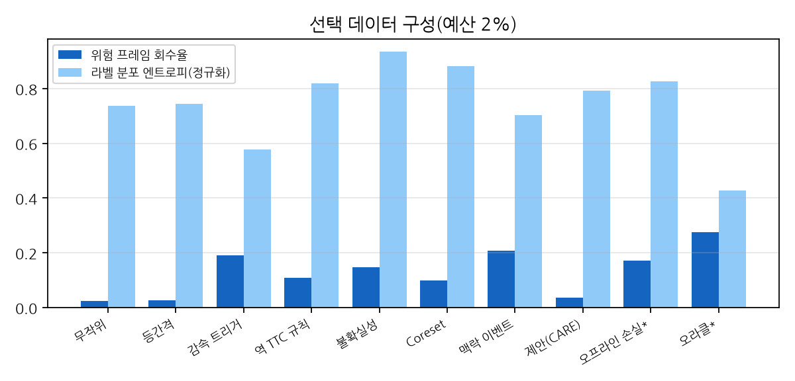
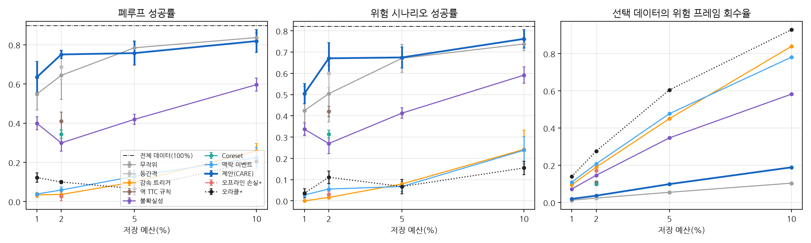
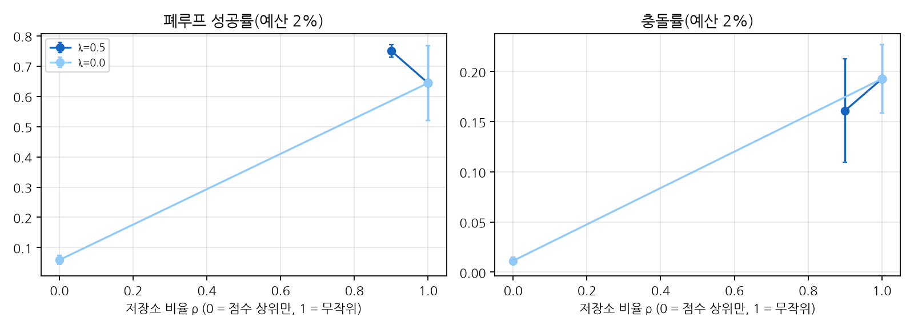
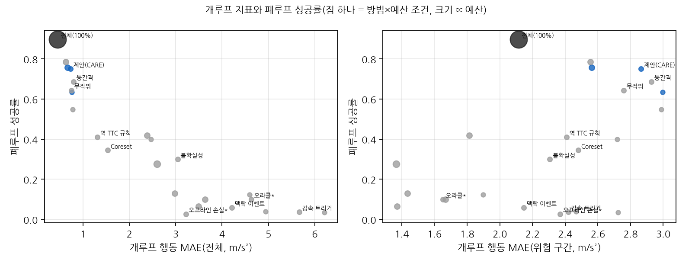

# 수집 시점 맥락 인지 큐레이션이 소형 언어 조건 정책(VLA-lite)의 종방향 제어에 미치는 효과: 경량 CNN-GRU 점수기와 폐루프 시뮬레이터 검증

**Collection-Time Context-Aware Data Curation for a Small Language-Conditioned Policy (VLA-lite) in Longitudinal Control: A Lightweight CNN-GRU Scorer Validated in Closed-Loop Simulation**

<!-- 생성기 안내: 이 원고는 `scripts/build_vla_paper.py`가 실험 결과(`experiments/exp_110_vla_curation/summary/`)로 자동 생성한다. 수치를 손으로 고치지 말고 템플릿(`paper/manuscript_vla_ko.template.md`, `paper/sections_vla/`)을 수정한다. -->

## 국문 초록

비전-언어-행동(VLA) 정책은 대규모 시연 데이터로 일반화 능력을 얻지만, 현장 수집 데이터는 정상 상황이 대부분이어서 드물지만 결정적인 위험 상황에서 실패하기 쉽다. 차량·이동로봇은 저장·전송 예산 때문에 데이터를 골라 남겨야 한다. 그런데 기존 로봇 데이터 큐레이션은 수집이 끝난 데이터와 학습된 정책을 전제하고, 수집 측 선별을 하위 정책 성능으로 검증한 사례는 본 조사 범위에서 확인되지 않았다.

본 논문은 수집 시점·정책 비의존 큐레이션 방법인 CARE를 제안한다.

- 경량 검출 특징과 역 충돌시간 단서를 멀티채널 CNN-GRU로 해석해 프레임마다 위험 확률과 불확실성을 계산한다.
- 점수 상위 클립과 무작위 저장소를 혼합해 예산 안에서 클립을 고른다.
- 지시문·물리량 서술·행동 청크를 자동으로 정렬해 LeRobot 형식으로 내보낸다.

효과는 선별 데이터로 학습한 하위 정책이 시뮬레이터에서 자차를 직접 제어하는 폐루프 성공률로 측정했다. 하위 정책은 약 52만 파라미터의 소형 언어 조건 정책(VLA-lite)이다. 이 정책은 GT 박스를 렌더링한 64×64 영상, 지시문, 속도를 입력받아 1차원 종방향 가속도만 출력한다. 학습 계산량, 선택량, 평가 시드는 통제했다.

주요 결과는 다음과 같다.

- 자차 감속 트리거, 위험 라벨 오라클, 정책 손실 기반 오프라인 선별처럼 위험 표본을 최대화하는 방법은 정책이 항상 감속하는 '위험 편향 붕괴'를 일으켰다. 예산 2%에서 이들의 성공률은 0.10 이하였고, 무작위 선택과의 차이는 시드·에피소드 계층 부트스트랩 신뢰구간이 0을 포함하지 않았다.
- 시드 3개 탐색 실험에서 예산 2% CARE의 평균 성공률(0.751)은 무작위 선택(0.644)보다 높은 경향을 보였다. 그러나 정책 학습 시드 변동을 포함한 계층 부트스트랩에서 차이의 95% 신뢰구간은 0을 포함했다(+0.107 [95% CI −0.043, +0.249]). 언어 입력을 뺀 반복 학습에서는 무작위가 오히려 높았다(0.755 대 0.778).
- 새 학습 시드 7개와 새 평가 세트로 수행한 사전 등록 확증 실험에서 1차 가설이 지지되었다. 예산 2%에서 CARE가 무작위보다 성공률이 +0.146 높았다(계층 부트스트랩 95% CI [+0.071, +0.223]). 반면 예산 1%의 우위와, 같은 비율의 무작위 저장소에 다른 점수(감속 트리거·오라클·불확실성)를 섞은 통제군 대비 우위는 유의하지 않았다(Holm 보정 $p$ ≥ 0.17). 따라서 이 이득이 맥락 점수기 고유의 효과인지, '큰 무작위 저장소 + 소량의 위험 지향 강화'라는 혼합 구조의 효과인지는 판별되지 않았다.
- 전체 구간의 개루프 행동 오차는 폐루프 성공률과 강하게 상관했다($r_s$=−0.95). 반면 위험 구간의 개루프 오차는 유의한 상관을 보이지 않았고 부호도 기대와 반대였다($r_s$=0.35, $p$=0.06). 예산 2% 안에서는 위험 구간 오차가 작을수록 성공률이 오히려 낮았다($r_s$=0.72, $p$=0.025).
- 실내 자율 이동로봇(AMR) 도메인에서는 CARE(0.343)와 무작위(0.375)의 차이가 유의하지 않았다. 실주행 영상 개루프 평가는 방법 간 차이를 가릴 분해능이 없었다. 위험 편향 붕괴는 두 폐루프 환경에서, 그에 대응하는 개루프 트레이드오프는 실영상에서 관찰되었다.
- 본 벤치마크에서는 지시문 정보가 에피소드 초기 속도로 누출되어 언어 조건화의 효과를 측정하지 못했다.

점수기는 파라미터 57512개, 1회 추론 0.09 ms로 YOLOv8n(640 입력) 검출기 비용의 약 0.2%이다(x86 CPU, ONNX Runtime 기준). PyTorch 추론과 320 입력 검출기를 기준으로 하면 약 5.5%이다. 결과는 위험 구간만 남기는 수집이 정책을 망칠 수 있음을 일관되게 보여 준다. 정상 분포를 보존한 위에 위험 지향 구간을 소량 더하는 전략은 주행 도메인의 예산 2%에서 사전 등록 확증 실험으로 이득이 확인되었으나, 예산 1%·AMR·실영상·더 큰 예산에서는 확인되지 않았고, 그 이득이 맥락 점수기에서 오는지도 확증되지 않았다.

## Abstract

Vision-language-action (VLA) policies generalize through large-scale demonstrations. Yet field data are dominated by nominal operation, so policies remain fragile in rare but safety-critical situations. Vehicles and mobile robots must decide what to keep under storage and bandwidth budgets. Existing robot-data curation, however, assumes a fully collected dataset and a trained policy, and within our survey we found no collection-side selection method validated by downstream policy performance.

We propose CARE, a collection-time, policy-agnostic curation method. CARE has three parts:

- A lightweight multichannel CNN-GRU interprets detector-based semantic features and inverse time-to-collision cues, and outputs a per-frame risk probability and uncertainty.
- A budgeted selector mixes top-scoring clips with a random reservoir.
- Instructions, physics-grounded narrations, and action chunks are aligned automatically and exported in the LeRobot format.

We measure data value by the closed-loop success of a downstream policy trained on the selected data; the policy drives the ego agent in simulation. The policy is a small (about 0.5M-parameter) language-conditioned policy (VLA-lite) that maps rendered 64×64 images of ground-truth boxes, an instruction, and speed to a longitudinal acceleration only. Training compute, selection size, and evaluation seeds are held fixed.

Methods that maximize hazardous samples suffer a "risk-bias collapse", in which the policy brakes everywhere. These methods include ego-deceleration triggers, a hazard-label oracle, and policy-loss-based offline selection. At the 2% budget their success rates stay at or below 0.10, and their seed-and-episode hierarchical bootstrap intervals against random selection exclude zero. In an exploratory study with three training seeds, CARE tended to outperform random selection at the 2% budget (0.751 vs. 0.644). With seed variation included, however, the 95% CI of the difference included zero (+0.107 [95% CI −0.043, +0.249]), and a replicate trained without language input favored random selection (0.755 vs. 0.778). A preregistered confirmatory experiment with seven new training seeds and a new evaluation set supported the primary hypothesis: at the 2% budget CARE exceeded random selection by +0.146 (hierarchical bootstrap 95% CI [+0.071, +0.223]). Its advantages at the 1% budget and over controls that fill a random reservoir of the same ratio with other scores (deceleration trigger, oracle, uncertainty) were not significant (Holm-adjusted $p$ ≥ 0.17), so whether the confirmed gain comes from the context scorer or from the "large random reservoir plus small risk-oriented enrichment" structure remains unresolved.

Overall open-loop action error is strongly correlated with closed-loop success (Spearman $r_s$ = −0.95), whereas open-loop error on hazardous segments is not significantly correlated and has the opposite sign ($r_s$ = 0.35, $p$ = 0.06); within the 2% budget, lower hazard-segment error even goes with lower success ($r_s$ = 0.72, $p$ = 0.025). In an indoor autonomous mobile robot (AMR) domain, CARE and random selection did not differ significantly (0.343 vs. 0.375), and open-loop evaluation on real driving video lacked the resolution to separate methods. The risk-bias collapse was observed in both closed-loop environments, and the corresponding open-loop trade-off on real video. Because instruction information leaks through the initial speed in our benchmark, the effect of language conditioning could not be measured.

The scorer has 57512 parameters and runs in 0.09 ms, about 0.2% of the cost of a YOLOv8n detector at 640 input (ONNX Runtime on an x86 CPU); with PyTorch inference and a 320-input detector the ratio is about 5.5%. Our results consistently show that keeping only hazardous segments can ruin the policy. Preserving the nominal distribution and adding a small share of risk-oriented clips improved closed-loop success over random selection at the 2% driving budget in a preregistered confirmatory experiment; this was not confirmed at the 1% budget, in the AMR domain, on real video, or at larger budgets, and the contribution of the context scorer itself remains unresolved.

**주제어**: 비전-언어-행동 모델, 데이터 큐레이션, 수집 시점 학습 데이터 선택, 폐루프 평가, 위험 편향 붕괴, 충돌시간, CNN-GRU, 피지컬 AI

## 1. 서론

### 1.1 문제 제기: VLA 정책은 왜 드문 위험 상황에서 실패하는가

비전-언어-행동(VLA) 모델은 영상과 자연어 지시를 입력받아 로봇 행동을 직접 출력하는 정책이다[1][2][4][5]. 대규모 시연 데이터 덕분에 일반화 능력이 크게 향상되었고, 주행 분야에서도 언어와 행동을 함께 다루는 종단간 모델이 빠르게 늘고 있다[50][53][54][57].

이러한 성공은 **학습 데이터가 정책이 실제로 마주칠 상황을 충분히 포괄해야 한다**는 전제 위에 있다. 그러나 현실의 수집 데이터는 이 전제를 충족하지 못한다. 주행·물류 이동 데이터의 대부분은 차선 유지나 일정 간격 추종 같은 정상 상황이다. 선행 차량 급제동, 끼어들기, 보행자 돌출처럼 안전에 결정적인 상황은 전체 프레임의 몇 퍼센트에 불과하다(본 논문 예비 연구의 큐레이션 풀에서 7.1%). 대규모 주행 데이터로 학습한 검출기도 코너 케이스에서는 성능이 급락한다[42]. 종단간 주행에서는 롱테일 데이터를 소폭 늘리는 것만으로 해당 시나리오의 성능이 크게 오른다는 보고도 있다[47].

본 논문은 이 현상을 다음 질문으로 정리한다.

> **질문.** 차량·이동로봇 같은 현장 장치가 저장·전송 예산 때문에 수집 데이터의 일부만 남길 수 있을 때, **무엇을 남겨야** 그 데이터로 학습한 VLA 정책이 드물지만 결정적인 위험 상황에서 실패하지 않는가?

본 논문이 제시하는 답은 다음과 같다.

> **답(가설).** 저장 여부는 **수집 시점에, 장치 위에서, 정책 없이** 결정해야 하며, 그 기준은 **물리적 위험 단서를 시간 맥락으로 해석한 점수**여야 한다. 다만 위험 구간만 모아서는 안 되고, 정상 분포를 무작위 저장소로 충분히 보존한 위에 희소 위험·불확실 구간을 소량 과표집해야 한다. 그러면 같은 저장량으로 학습한 VLA 정책의 폐루프 성공률이 무작위 선택이나 다른 점수로 고른 선별보다 높아진다.

이 가설을 검증하려면 먼저 **어떤 지표로 성공을 판단해야 하는가**를 정해야 한다. 데이터 선별 연구는 흔히 검출 정확도나 개루프 행동 오차 하나로 효과를 판단한다. 그러나 이 질문에 답하려면 적어도 다음 일곱 측면을 따로 보아야 한다.

1. **폐루프 성공률.** 정책이 실제로 장치를 제어할 때 과제를 마치는가. 개루프 행동 오차는 폐루프 주행 품질과의 상관이 약하므로[76][81][82] 대리 지표가 될 수 없다. 또한 멈춰 서는 정책은 충돌률 0을 얻으므로, 성공은 무충돌과 진행을 함께 요구해야 한다.
2. **데이터 효율.** 저장 예산의 의미는 '적게 남겨도 잃는 것이 적은가'이다. 같은 학습 계산량에서 전체 데이터로 학습한 정책의 성공률을 얼마나 보존하는지를 보아야 한다.
3. **위험 시나리오 성공률.** 질문의 핵심은 드문 위험 상황이다. 평균 성공률은 다수인 정상 시나리오에 가려지므로, 위험 시나리오만의 성공률을 따로 보아야 한다.
4. **점수기 고유 기여.** 위 가설의 선별은 예산의 대부분을 무작위 저장소에 쓴다. 따라서 이득이 맥락 점수기에서 오는지, '아무 점수로든 소량 강화 + 무작위 저장소'라는 혼합 구조에서 오는지를 같은 저장소 위에서 분리해야 한다.
5. **도메인 일반화.** 한 도메인(주행)에서 정한 설계가 다른 도메인(물류 이동로봇)에서 적어도 무작위 선택보다 나쁘지 않아야 한다.
6. **지시 준수.** 언어 조건 정책이라면 지시문이 행동을 실제로 바꾸어야 한다. 지시 정보가 초기 상태 같은 다른 경로로 새면 언어의 효과를 측정할 수 없으므로, 같은 장면에 지시문만 바꾼 반사실 평가가 필요하다.
7. **실영상.** 시뮬레이터 밖의 실주행 영상에서도 같은 파이프라인이 위험 단서(예: 제동 시작)를 학습해야 한다.

본 논문은 이 일곱 측면을 **핵심 지표(KPI) K1~K7**로 정의하고(3.7절), 각 지표의 목표와 판정 규칙을 테스트 실행 전에 사전 등록했다(4.6절).

이 지표 체계는 예비 연구에서 나왔다. 같은 파이프라인의 이전 버전(이하 v2, 4.2절)은 주 예산 2%에서 무작위 선택 대비 우위를 사전 등록 확증 실험으로 지지했다. 그러나 점수기 고유 기여, AMR 일반화, 언어의 효과, 실영상 분해능은 판단하지 못했다. 원인을 추적한 결과, 그 일부는 선별법이 아니라 벤치마크와 측정 설계의 결함(지시 정보의 초기 상태 누출, 충돌 시 자차 되밀림, 방법마다 다른 저장소 표집)에 있었다. 본 논문의 주 실험(이하 v3)은 이 결함을 고친 벤치마크에서 새 시드와 새 평가 세트로 수행했다.

본 논문의 목적은 위 가설의 타당성과 적용 범위를 K1~K7로 검증하는 것이다. 검증 대상은 대형 VLA가 아니라 약 54만 파라미터의 소형 언어 조건 정책(VLA-lite, 검출 특징 토큰 포함)이며, 과제는 종방향 가속도 제어(주행·이동로봇 시뮬레이터)와 실주행 영상의 개루프 예측으로 한정된다.

### 1.2 기존 해결 방법과 그 한계

데이터 구성이 정책 품질을 좌우한다는 인식은 널리 공유되어 있다[24][25][26]. 이 문제에 대한 기존 접근은 세 갈래로 나뉜다.

**(1) 오프라인 로봇 데이터 큐레이션.** 최근 연구는 학습된 정책이나 데이터셋 전체의 통계로 시연의 가치를 추정한다.

- DemInf[28]는 데이터셋 전체의 상태-행동 상호정보량에 대한 각 시연의 기여도를 계산한다.
- CUPID[32]는 학습된 정책과 평가 롤아웃으로 영향함수를 추정한다.
- DataMIL[30]은 목표 과제 시연에 대한 대리 손실로 데이터모델을 최적화한다.
- Re-Mix[27]는 참조 모델과 DRO로 도메인 가중치를 학습한다.
- Demo-SCORE[29]와 SCIZOR[31]는 롤아웃 분류기 또는 자기지도 진행도·중복 군집으로 시연이나 전이를 걸러낸다.

이들 방법은 품질이 낮은 시연을 걸러내는 데 효과적이지만, 공통적으로 **수집이 끝난 데이터 전체, 학습된 정책, 또는 롤아웃**을 전제한다. 따라서 장치가 프레임을 받는 순간 저장 여부를 결정해야 하는 상황(저장·전송 예산)에는 곧바로 적용할 수 없다. 또한 선택 단위가 대부분 시연이나 도메인이어서, 한 에피소드 안의 2초 길이 위험 구간을 골라내는 문제와는 거리가 있다.

**(2) 능동학습과 자율주행 데이터 엔진.** 불확실성[34][35]이나 커버리지[36]를 기준으로 표본을 고르는 능동학습은 주행 검출기 학습에 활용되어 왔다[44][45]. 이벤트 탐지로 주행 영상 저장의 우선순위를 정하는 연구도 있다[46]. 그러나 이들 연구의 평가는 검출·예측 정확도나 저장 비율에 머문다. **선별된 데이터로 학습한 주행 정책의 폐루프 성능으로 검증한 사례는 본 조사 범위에서 확인되지 않았다.** 데이터 선택 연구에서 무작위 선택이 의외로 강한 기준선이라는 보고[39]를 고려하면, 이 검증 공백은 실질적인 문제다.

**(3) 언어 주석과 경량 정책.** VLA 학습용 언어 주석을 자동화하는 연구[59][61][62]는 대형 VLM·LLM의 조합에 의존한다. ECoT는 Bridge v2 데이터 주석에 약 7일이 소요되었다고 보고했다[61]. 주석 내용 역시 과제 지시와 추론 체인 중심이어서 충돌시간 같은 물리량과 정렬되지 않는다. 경량 VLA[13][14][15]와 이중 시스템 구조[10][12][16]는 **정책 추론**의 효율에 집중하며, 데이터 **수집 측**의 경량 모듈은 다루지 않는다.

여기에 **평가 방법의 문제**가 더해진다. 오프라인(개루프) 행동 오차는 폐루프 주행 품질과의 상관이 약하다[76]. 인지 입력이 없는 모델도 개루프 지표에서 경쟁력을 보이며[81], 단순 외삽이 개루프 최고 성능을 기록한 사례도 있다[82]. 데이터 스케일링 경향 역시 개루프와 폐루프에서 다르게 나타났다[47]. 따라서 개루프 지표만으로 데이터 선별의 효과를 판단하면 결론이 뒤집힐 수 있다.

### 1.3 해결에 필요한 조건

위의 한계로부터 수집 시점 VLA 데이터 큐레이션이 갖춰야 할 다섯 가지 조건을 도출한다.

- **R1 수집 시점·온디바이스.** 점수는 과거 관측만으로 계산해야 하며(인과), 프레임당 상수 비용으로 단말에서 실시간으로 동작해야 한다.
- **R2 정책 비의존·위험 민감.** 하위 정책이나 롤아웃 없이도 희소 위험 사건에 민감한 신호가 필요하다.
- **R3 관측-언어-행동 정렬.** 선택된 데이터에는 대형 모델 없이도 지시문, 상황 서술, 행동이 정렬된 형태로 부착되어야 한다.
- **R4 표준 형식.** VLA 학습 생태계의 표준 형식(LeRobot[22]·RLDS[23])으로 곧바로 내보낼 수 있어야 한다.
- **R5 하위 정책 검증.** 선별의 가치는 해당 데이터로 학습한 정책의 성능, 특히 **폐루프** 성능으로 검증해야 한다.

표 2(2.10절)는 기존 연구의 조건 충족 여부를 정리한 것이다. 다섯 조건을 모두 다룬 연구는 확인되지 않았다.

R5의 '하위 정책 성능'은 단일 지표로 충분하지 않다. 1.1절의 일곱 측면(K1~K7)은 R5를 구체화한 것이며, K4는 R2의 신호가 하위 정책에 실제로 기여하는지를, K6은 R3의 정렬 주석이 정책 행동을 바꾸는지를 확인한다.

### 1.4 본 논문의 접근과 기여

본 논문은 **CARE**(Context-Aware, Risk-Enriched curation)를 제안하고, 그 효과를 하위 정책의 폐루프 성능을 중심으로 한 핵심 지표 K1~K7로 검증한다. 기여는 다음과 같다.

1. **경량 맥락 점수기(R1 부분, R2).**
   - 경량 검출기의 박스로부터 의미 특징과 물리 단서를 계산한다. 물리 단서는 박스 크기의 변화율로 얻는 역 충돌시간 $1/\mathrm{TTC}=d\ln w/dt$이다[70][71].
   - 멀티채널 CNN-GRU가 이를 시간 맥락으로 해석하여 프레임마다 위험 확률과 불확실성을 산출한다. 파라미터는 수만 개 수준이며 정책을 사용하지 않는다.
   - 점수기는 장치 위 실행을 목표로 인과·상수 비용으로 설계했다. 다만 본 논문은 x86 CPU에서의 계산 비용만 측정했고, 임베디드 장치 실측과 스트리밍 선택은 평가하지 않았다. 따라서 R1은 부분적으로만 뒷받침된다.
2. **위험 강화 클립 선별과 공유 저장소 비교 설계(R2).**
   - 예산의 일부($1-\rho$)는 위험·불확실성 점수 상위 클립에, 나머지($\rho$)는 무작위 저장소에 할당한다. 희소 위험의 과표집과 정상 분포의 커버리지를 함께 확보하기 위한 설계다.
   - 비교 실험에서는 무작위 저장소를 시드별로 먼저 고정하여 모든 혼합 방법이 공유하게 했다(3.4절). 이렇게 하면 방법 간 차이가 점수 몫으로만 한정되어, 저장소 표집 분산에 가리지 않고 점수기 고유의 기여(K4)를 잴 수 있다. 예비 연구에서는 저장소가 방법마다 달라 이 기여를 분리하지 못했다.
3. **물리량 정렬 언어 주석, 표준 내보내기, 반사실 언어 평가(R3 부분, R4).**
   - 지시문(주행 스타일·목표 속도), 맥락·속도·TTC 서술, 행동 청크를 템플릿으로 자동 정렬하여 LeRobot 형식으로 내보낸다. 주석 자체의 품질은 측정하지 않았다.
   - 지시문의 효과는 같은 시나리오·시드를 세 가지 스타일 지시문으로 각각 평가하는 반사실 평가로 측정한다(K6). 이를 위해 지시 정보가 초기 속도로 새던 벤치마크 결함을 제거했다(4.2절).
4. **검출 특징 토큰 정책과 하위 정책 기반 벤치마크(R5).**
   - 소형 언어 조건 정책(VLA-lite)에 검출 특징 토큰을 더해, 64×64 렌더 영상만으로는 읽기 어려운 근거리 간격·접근 단서를 정책에 직접 전달한다(3.6절). 정책은 영상·지시문·속도·특징 토큰을 입력받아 종방향 가속도 청크만 출력한다.
   - 이 정책이 시뮬레이터에서 차량과 물류 통로의 자율 이동로봇(AMR, autonomous mobile robot)을 **직접 제어하는 폐루프 평가**와 실주행 영상 기반 개루프 평가를 함께 수행한다.
   - 정책 구조, 경사 단계 수, 평가 시드, 선택량을 모두 통제한다. 예비 연구에서 드러난 벤치마크 결함(지시 정보 누출, 충돌 되밀림)은 수정하고, 수정 전후의 전문가 지표 변화를 함께 보고한다(4.2절).
5. **핵심 지표 중심의 사전 등록 평가.** 일곱 지표의 정의·목표·판정 규칙과 가설 검정 계획을 테스트 실행 전에 고정했다(4.6절). 하이퍼파라미터는 검증 세트에서만 정했고, 목표에 미달한 지표도 그대로 보고한다.

표 1은 각 핵심 지표가 검증하는 주장과, 그 주장이 기대는 기여·조건, 사전 등록한 목표, 정의와 결과를 다루는 절을 대응시킨 것이다.

| KPI | 지표 | 검증하는 주장 | 관련 기여(조건) | 목표(사전 등록) | 정의 | 결과 |
|---|---|---|---|---|---|---|
| K1 | 폐루프 성공률(예산 2%) | CARE로 고른 2% 데이터만으로 학습한 정책이 폐루프 과제를 해결한다 | 2, 4 (R2, R5) | ≥ 0.80 | 3.7절 | 5절 |
| K2 | 데이터 효율 | 2% 데이터가 전체 데이터 정책의 성공률을 대부분 보존한다 | 2 (R5) | ≥ 0.90 | 3.7절 | 5절 |
| K3 | 위험 시나리오 성공률(예산 2%) | 드문 위험 상황에서 정책이 실패하지 않는다(1.1절의 질문) | 1, 2 (R2) | ≥ 0.75 | 3.7절 | 5절 |
| K4 | 점수기 고유 기여 | 이득이 혼합 구조가 아니라 맥락 점수기에서 온다 | 1, 2 (R2) | 95% CI 하한 > 0, Holm 보정 단측 $p$ < 0.05 | 3.4, 3.7절 | 5절 |
| K5 | 도메인 일반화(AMR) | 주행에서 정한 설계가 AMR에서 무작위보다 나쁘지 않다 | 2, 4 (R5) | 95% CI 하한 > −0.03(비열등) | 3.7절 | 5절 |
| K6 | 언어 지시 준수 | 정렬된 지시문이 정책의 속도 추종을 실제로 조건화한다 | 3 (R3) | 속도 추종 오차 30% 이상 감소 | 3.6, 3.7절 | 5절 |
| K7 | 실영상 제동 시작 예측 | 같은 정책 구조가 실영상에서 제동 단서를 학습한다 | 4 (R5) | AUROC ≥ 0.65 | 3.7절 | 5절 |

표 1. 핵심 지표(K1~K7)와 본 논문의 주장·기여·검증 절의 대응. 기여 5(사전 등록 평가)는 모든 지표에 공통으로 적용된다. 각 지표의 달성 여부는 5절에서 사전 등록한 판정 규칙(4.6절)에 따라 보고하며, 목표에 미달한 지표도 미달로 보고한다.

**예비 연구와의 관계.** v2 예비 연구(4.2절)에서 확인한 사실은 다음 두 가지다. 첫째, 위험 표본을 최대화하는 선별(자차 감속 트리거, 맥락 이벤트, GT 위험 라벨 오라클, 정책 손실 기반 오프라인 선별)은 소예산 폐루프에서 정책을 '항상 감속'으로 붕괴시켰다(**위험 편향 붕괴**). 둘째, 주 예산 2%에서 CARE의 무작위 대비 우위는 사전 등록 확증 실험에서 지지되었다(+0.146 [95% CI +0.071, +0.223]). 반면 같은 비율의 저장소에 감속 트리거 점수를 섞은 통제군 대비 우위는 유의하지 않았고(Holm 보정 $p$ = 0.172), AMR과 실영상에서는 방법 간 차이를 가리지 못했으며, 언어의 효과는 측정할 수 없었다. 본 논문의 v3 실험은 이 미해결 지점을 K4~K7로 다시 측정하도록 설계했으며, 그 결과는 5절에서 지표별로 보고한다.

이후의 구성은 다음과 같다. 2절은 관련 연구를 정리하고, 3절은 CARE, 공유 저장소 선별, 특징 토큰 정책, 핵심 지표를 정식화한다. 4절은 KPI 기준의 변수 정의, 예비 연구의 진단과 벤치마크 수정, 실험 환경과 설계, 사전 등록을 기술하고, 5절은 결과를 지표별로 보고한다. 6절은 결과의 의미와 한계를 논의하며, 7절에서 결론을 맺는다.

## 2. 관련 연구

이 절에서는 본 연구와 관련된 열 갈래의 선행 연구를 정리한다. 각 갈래에서 본 연구의 요구사항(R1 수집 시점·온디바이스 실시간, R2 정책 학습 없는 희소 위험 신호, R3 관측-언어-행동 정렬 주석 자동화, R4 표준 형식 내보내기, R5 하위 VLA 정책의 개루프·폐루프 검증)에 비춰 무엇이 해결됐고 무엇이 남았는지 확인한다. 인용 번호는 참고문헌 목록과 같다.

### 2.1 VLA 모델과 이중 시스템

RT-1 [1]은 대규모 실로봇 시연으로 트랜스포머 정책을 학습했다. 데이터 크기·모델 크기·데이터 다양성에 따라 일반화가 커짐을 보였다. RT-2 [2]는 행동을 텍스트 토큰으로 표현했다. 그리고 웹 규모 비전-언어 데이터와 로봇 궤적을 함께 미세조정해 vision-language-action(VLA)이라는 범주를 정립했다. 이후 공개 모델이 이어졌다. Octo [3]는 Open X-Embodiment의 80만 에피소드로 학습한 트랜스포머 기반 확산 정책이다. OpenVLA [4]는 97만 개 실로봇 시연으로 학습한 7B 모델로, RT-2-X(55B)보다 높은 성공률을 보고했다.

행동 표현도 다양해졌다. π0 [5]는 사전학습 VLM에 흐름 정합(flow matching) 기반 "행동 전문가"를 붙여 연속 행동 청크를 생성한다. FAST [6]는 압축 기반 행동 토큰화로 자기회귀 VLA의 고빈도·정밀 과제 성능을 높였다. π0.5 [7]는 다중 로봇 데이터, 고수준 의미 예측, 웹 데이터, 물체 검출을 함께 학습해 새 가정 환경으로 일반화하는 것을 목표로 한다. RDT-1B [8]는 46개 데이터셋, 100만 에피소드 이상으로 사전학습한 1.2B 확산 트랜스포머다. CogACT [9]는 인지(VLM)와 행동(확산 트랜스포머 모듈)을 분리한 구조를 제안했다. Gemini Robotics [11]는 Gemini 2.0 위에 구현적 추론(ER) 모델과 VLA 모델을 구축했다.

VLM은 일반적이지만 느리고, 시각운동 정책은 빠르지만 일반적이지 않다. 이 절충을 풀기 위해 이중 시스템(System-1/System-2) 구조가 등장했다. GR00T N1 [10]은 VLM 모듈(System 2)이 환경과 지시를 해석하고, 확산 트랜스포머(System 1)가 실시간 행동을 생성한다. Helix [12]는 기술 보고에서 7~9Hz의 S2와 200Hz의 S1을 결합한 휴머노이드 제어를 설명했다. Hi Robot [16]은 고수준 VLM이 복잡한 지시와 실시간 수정을 해석하고, 저수준 VLA가 실행하는 계층 구조를 제시했다.

경량화 연구도 활발하다. SmolVLA [13]는 0.45B 파라미터로 단일 GPU 학습과 소비자 하드웨어 배포를 목표로 했다. 3만 개 미만의 커뮤니티 에피소드로 더 큰 VLA에 견줄 성능을 보고했다. TinyVLA [14]는 고속 다중모달 백본과 확산 정책 디코더로 사전학습 단계 없이 데이터 효율을 높였다. MiniVLA [15]는 OpenVLA를 약 1B로 줄이고 추론 속도를 2.5배 높였다.

이 연구들의 공통 관심은 **정책 쪽**의 일반화와 추론 효율이다. 이중 시스템의 "빠른 경량 모듈"도 행동 생성에만 쓰인다. 본 연구는 같은 발상을 데이터 수집 쪽에 적용한다. 장치에서 상시 동작하는 경량 시계열 모듈이 "무엇을 남길지"를 결정한다.

### 2.2 로봇 학습 데이터셋, 표준 형식, 데이터 스케일링

VLA의 성능은 대규모 로봇 데이터에 기대고 있다. RoboNet [20]은 7개 로봇 플랫폼의 1500만 프레임을 모아 다중 로봇 학습 가능성을 보였다. BridgeData V2 [19]는 24개 환경의 60,096개 궤적을 저가 로봇으로 수집했다. Open X-Embodiment [17]는 21개 기관, 22종 로봇의 100만 개 이상 궤적을 통합했고, RT-X 모델로 교차 구현체 양의 전이를 보고했다. DROID [18]는 564개 장면과 86개 과제에 걸친 350시간 규모의 "in-the-wild" 조작 데이터를 공개했다. AgiBot World [21]는 217개 과제, 100만 개 이상 궤적을 사람 검증이 포함된 표준 수집 파이프라인으로 구축했다.

데이터 교환 형식으로는 RLDS [23]가 강화학습·모방학습 데이터의 기록·재생·주석·공유 생태계를 제시했다. LeRobot [22]은 데이터 수집·저장·스트리밍과 정책 학습·비동기 추론을 하나의 오픈소스 스택으로 묶었다. 본 연구는 결과물을 LeRobot 구조로 내보낸다(R4).

스케일링 측면에서 Lin et al. [24]은 정책의 일반화 성능이 학습 환경·물체 수에 대해 대략 멱법칙을 따름을 보였다. 이 결과는 데이터의 **양보다 다양성과 구성**이 중요하다는 점을 시사한다. 그러나 이 데이터셋들은 대부분 원격조작 시연을 "모두 저장"하는 방식으로 만들어졌다. 차량·이동로봇처럼 상시 주행하는 장치가 제한된 저장·전송 예산 안에서 무엇을 남길지는 다루지 않는다.

### 2.3 로봇 데이터 큐레이션과 데이터 품질

데이터 품질에 대한 관심은 최근 빠르게 커졌다. robomimic [26]은 오프라인 인간 시연 학습에서 시연 품질과 정지 기준이 성능에 미치는 영향을 분석했다. 또한 학습 목표와 평가 목표가 달라 검증 손실로 고른 정책이 실제 최고 성능 정책과 어긋날 수 있음을 지적했다. Belkhale et al. [25]은 데이터 품질을 분포 이동 관점으로 정식화했다. 핵심 속성으로 action divergence와 transition diversity를 제시했고, 상태 다양성이 항상 이롭지는 않음을 보였다.

이를 바탕으로 자동 큐레이션 방법들이 제안됐다. 각 방법의 전제를 원문 기준으로 정리하면 다음과 같다.

- **Re-Mix** [27]: 분포 강건 최적화로 사전학습 혼합의 **도메인 가중치**를 학습한다. 정책이 참조 모델 대비 초과 행동 복제 손실을 최소화하는 min-max 문제로 정식화하므로 참조 모델 학습이 필요하다.
- **DemInf** [28]: 데이터셋 전체의 상태-행동 상호정보량에 대한 각 **궤적**의 평균 기여를 VAE 표현과 kNN 추정기로 계산한다. 정책 롤아웃은 필요 없지만, 수집이 끝난 데이터셋 전체를 전제로 한다.
- **Demo-SCORE** [29]: 전체 시연으로 초기 정책을 학습하고 **롤아웃**에서 성공/실패 분류기를 학습해 시연을 거른다.
- **DataMIL** [30]: datamodels 관점에서 정책 자체로 데이터를 고른다. 롤아웃 대신 목표 과제 시연의 held-out 검증 손실을 대리 손실로 쓴다.
- **SCIZOR** [31]: 자기지도 과제 진행도 예측기와 상태-행동 결합 표현 기반 중복 제거로 **전이 수준**에서 데이터를 거른다.
- **CUPID** [32]: 영향 함수로 각 **시연**이 정책 기대 수익에 미치는 영향을 평가 롤아웃에서 추정한다.

이 방법들은 모두 선별 데이터로 학습한 정책의 성공률로 효과를 검증했다는 강점이 있다. 그러나 전제가 공통적이다. 수집된 데이터셋 전체 [27][28][31], 학습된 정책과 롤아웃 [29][32], 목표 과제 시연과 반복적 정책 학습 [30] 중 하나 이상이 필요하다. 선택 단위도 시연·도메인이 많다. 따라서 장치가 데이터를 받는 순간 저장 여부를 정해야 하는 수집 시점 선별(R1)에 바로 쓰기 어렵다. 선별 기준도 과제 성공·진행·중복·상호정보이므로 드문 위험 구간의 보존을 직접 겨냥하지 않는다(R2).

### 2.4 능동학습과 데이터 선택

능동학습은 "학습자가 데이터를 고르면 더 적은 라벨로 같은 성능을 얻는다"는 생각에서 출발한다. Settles [33]는 질의 시나리오를 멤버십 질의 합성, 스트림 기반 선택적 샘플링, 풀 기반 샘플링으로 나누고 불확실성 기반 전략 등을 정리했다. 스트림 기반 시나리오는 수집 시점 선별과 형식이 닮았다. 그러나 목적은 라벨 비용 절감이다. BALD [34]는 정보이득을 예측 엔트로피로 표현했고, Gal et al. [35]은 이를 MC dropout 기반 딥 영상 분류로 확장했다. Sener와 Savarese [36]는 CNN 능동학습을 core-set(k-center 커버리지) 문제로 정식화했다.

데이터 선택 비용을 줄이려는 시도도 있다. Selection via Proxy [37]는 작은 프록시 모델로 선택해 비용을 크게 줄였다. Sorscher et al. [38]은 좋은 가지치기 지표가 있으면 멱법칙보다 나은 스케일링이 가능함을 보였다. 동시에 기존 지표 대부분이 ImageNet 규모에서는 잘 작동하지 않고, 잘 작동하는 지표는 계산량이 크다고 보고했다. DeepCore [39]는 여러 coreset 방법을 비교한 결과 무작위 선택이 여전히 강한 기준선임을 확인했다.

이 갈래의 평가는 주로 분류·검출 정확도다. 하위 순차 의사결정 정책의 폐루프 성능으로 선택 효과를 검증하지 않는다. 본 연구는 엔트로피 불확실성 [34][35], 특징 공간 k-center [36], 무작위 [39]를 비교 기준선으로 포함하고, 이를 정책 성능으로 평가한다.

### 2.5 자율주행 데이터 엔진과 롱테일

자율주행 분야는 대규모 데이터 [40]와 폐루프 계획 벤치마크 [41]를 갖췄다. 그러나 롱테일 문제는 여전히 크다. CODA [42]는 실도로 코너 케이스 1500장면에서 대규모 주행 데이터로 학습한 표준 검출기의 mAR이 12.8% 이하로 떨어짐을 보였다. Zheng et al. [47]은 400만 개 이상의 시연으로 데이터 분포가 스케일링의 핵심임을 확인했다. 또한 롱테일 데이터를 조금만 늘려도 해당 시나리오 성능이 크게 오른다고 보고했다. Ding et al. [43]은 안전-중요 시나리오 생성을 데이터 기반·적대적·지식 기반으로 분류했다. 다만 이는 시뮬레이션에서 시나리오를 **생성**하는 관점이다.

실데이터 **선별** 측면에서는 다음 연구들이 있다.

- Haussmann et al. [44]: 검출기 앙상블로 정보량을 계산하는 양산형 능동학습 시스템. 목표는 검출 성능이다.
- Segal et al. [45]: 부분 라벨 장면 단위의 비용 인지형 능동 선택으로 인지·예측·계획 지표를 개선했다.
- Smart Black Box 2.0 [46]: 이상 탐지·행동 탐지로 관심 사건을 찾아 실시간으로 주행 영상을 우선 저장한다. 수집 시점(R1)과 사건 민감성(R2)을 겨냥한 가장 가까운 선행 연구다. 그러나 평가는 저장된 이상/정상 비율이며, 저장된 데이터로 학습한 정책의 성능은 평가하지 않았다.

본 연구는 자차 감속도가 임계값을 넘는 구간을 저장하는 규칙 기반 트리거(action_trigger)를 기준선으로 둔다. 이는 차량 신호 기반 트리거 수집을 단순화한 것이며, 특정 기업 시스템의 재현을 주장하지 않는다.

### 2.6 주행 VLA와 언어 기반 주행

언어 모델을 주행에 접목한 연구는 크게 두 방향이다.

- **해석·질의응답**: DriveGPT4 [48]는 시각 지시 튜닝으로 행동 설명과 저수준 제어 예측을 함께 수행했다. DriveLM [49]은 인지-예측-계획을 그래프 VQA로 구조화했다.
- **폐루프 주행**: LMDrive [50]는 자연어 지시를 따르는 폐루프 주행과 LangAuto 벤치마크를 제시했다. DriveVLM [51]은 장면 서술·분석·계층 계획의 연쇄 사고 모듈을 기존 파이프라인과 결합한 Dual 시스템을 실차에 배치했다. CarLLaVA [52]와 SimLingo [54]는 카메라만 쓰는 VLM 기반 폐루프 주행을 보였다. 특히 SimLingo는 언어-행동 정렬(Action Dreaming)로 지시 준수 여부를 평가했다. EMMA [53]는 Gemini 기반으로 궤적·객체·도로 그래프를 모두 텍스트로 출력한다. OpenDriveVLA [55]는 2D·3D 구조적 시각 토큰을 언어 공간에 정렬했다. ORION [56]은 장기 맥락 집계, LLM 추론, 생성형 계획기를 결합해 Bench2Drive [83]에서 폐루프 성능을 보고했다. Alpamayo-R1 [57]은 인과 연쇄(Chain of Causation) 데이터셋을 자동 라벨링과 사람 검증을 섞은 파이프라인으로 만들고, 추론과 궤적 생성을 결합했다.

이 연구들은 롱테일 상황 이해를 동기로 든다 [51][57]. 그러나 데이터 측면에서는 이미 구축된 대규모 데이터셋이나 시뮬레이터 데이터를 쓴다. 장치에서 어떤 구간을 학습 데이터로 남길지는 다루지 않는다. 본 연구의 지시문(주행 스타일·목표 속도)과 맥락·TTC 서술은 이러한 언어 조건 주행 정책의 학습 데이터 형식을 따르되, 데이터 선별과 정렬 주석을 경량으로 수행한다.

### 2.7 자동 언어 주석

Lynch와 Sermanet [58]은 비정형 데이터에서 언어 조건 모방학습을 수행하고, 사전학습 언어 모델로 지시문 강건성을 높였다. DIAL [59]은 80,000개 시연 중 3.5%에만 있던 크라우드 라벨로 CLIP을 미세조정해 나머지 데이터를 재라벨링했다. Scaling Up and Distilling Down [60]은 LLM이 계획과 성공 조건 코드를 만들어 시뮬레이션에서 언어 라벨 데이터를 대량 생성했다. ECoT [61]는 Prismatic-7B, Grounding DINO, OWLv2/SAM, Gemini를 조합해 추론 체인 주석을 생성했다. Bridge v2 전체를 처리하는 데 7일이 걸렸다고 보고했다. NILS [62]는 여러 비전-언어 기반 모델로 물체 탐지·변화 탐지·과제 분할을 수행해 430시간 이상의 데이터에 제로샷 라벨을 붙였다. RoboAnnotatorX [63]는 MLLM을 강화해 장기 시연에 맥락이 풍부한 주석을 생성했다.

이 방법들은 사람 주석 비용을 크게 줄였다. 그러나 대부분 대형 VLM·LLM에 기대므로 서버측 사후 처리를 전제로 한다. 주석 내용도 과제 지시와 추론 체인이다. 본 연구는 검출 기반 맥락 상태와 역 TTC 같은 물리량에서 템플릿 서술을 만든다. 이렇게 해서 온디바이스에서 관측-언어-행동을 시간 정렬한다(R3). 다만 표현력은 대형 모델 기반 주석보다 제한적이며, 이는 한계로 논의한다.

### 2.8 시계열 위험 예측과 물리 단서

순환 구조로는 GRU [64]가 있고, CNN과 LSTM을 결합한 LRCN [65]이 영상 시계열 인식의 표준 형태를 제시했다. TCN [66]은 단순 합성곱 구조가 여러 과제에서 LSTM보다 좋고 유효 기억이 길다고 보고했다.

주행 위험 예측 연구로는 다음이 있다. Brain4Cars [67]는 차량 내외부 카메라 융합으로 기동을 미리 예측했다. DSA-RNN [68]은 후보 물체에 대한 동적 공간 주의와 RNN으로 블랙박스 영상의 사고를 예측했다. DADA [69]는 사고 시나리오의 운전자 주의 예측 벤치마크를 구축했다.

물리 단서로는 Lee [70]의 τ 이론이 있다. 망막상 확장률만으로 충돌까지 남은 시간(TTC)을 얻을 수 있다는 이론이다. Dagan et al. [71]은 단일 카메라에서 영상 크기 변화와 위치만으로 TTC와 충돌 경로를 계산하는 전방 충돌 경고 시스템을 구현했다. 거리·속도를 따로 계산할 필요가 없다. 객체 검출기로는 YOLO [72] 계열, 그중 Ultralytics YOLOv8 [73]을 쓴다.

기존 사고 예측 연구의 목적은 경고·예측 정확도다. 같은 신호를 학습 데이터 선별의 점수로 쓰고 하위 정책 성능으로 검증한 사례는 이번 조사에서 확인하지 못했다. 본 연구는 검출 기반 의미 특징과 bbox 크기 변화에서 얻은 역 TTC를 멀티채널 CNN-GRU에 입력해 프레임 단위 위험·불확실성 점수를 만든다(R2). 희소 클래스 학습에는 focal loss [86]와 class-balanced loss [87]를 참고하고, 점수의 신뢰도는 보정(calibration) 관점 [85]에서 점검한다.

### 2.9 모방학습 평가: 개루프와 폐루프

행동 복제는 ALVINN [74]까지 거슬러 올라간다. DAgger [75]는 학습자 분포에서 생기는 누적 오차 문제를 무후회 온라인 학습으로 다뤘다. Codevilla et al. [77]은 행동 복제를 모든 주행 행동으로 확장하는 것이 여전히 미해결임을 보였다. 정책 구조로는 행동 청크를 생성하는 ACT [78], 확산 과정으로 행동을 생성하는 Diffusion Policy [79], 언어 조건을 특징 단위 선형 변조로 주입하는 FiLM [80]이 널리 쓰인다. 본 연구의 하위 정책(VLA-lite)은 FiLM 조건화와 행동 청크 출력을 채택한다.

평가 방식은 결론을 크게 바꿀 수 있다. Codevilla et al. [76]은 CARLA에서 오프라인 예측 오차가 주행 품질과 상관이 없음을 보였다. Zhai et al. [81]은 인지 입력 없이 자차 상태만 쓰는 MLP가 nuScenes 개루프 L2에서 인지 기반 방법과 맞먹음을 보였다. 다만 충돌률은 인지 기반 방법이 유리했다. Dauner et al. [82]은 단순 외삽이 개루프 최고 성능을 내며, 단기 계획과 장기 ego-forecasting이 어긋남을 지적했다. Zheng et al. [47]도 데이터 스케일링이 개루프와 폐루프에서 다르게 나타난다고 보고했다. nuPlan [41]과 Bench2Drive [83]는 이런 이유로 폐루프 평가를 표준화했다.

따라서 본 연구는 개루프 행동 MAE를 위험 구간과 전체로 나눠 보고한다. 동시에 IDM [84] 기반 전문가 운전과 주변 차량이 있는 시뮬레이터에서 폐루프 지표(충돌률, 최소 TTC, 지시 준수, 승차감)로 선별 효과를 검증한다(R5). 실주행 영상(comma.ai speedchallenge [90])은 행동 레이블 제약 때문에 개루프 평가로만 쓴다.

### 2.10 엣지 필터링과 본 연구의 위치

영상 분석 시스템 분야에도 엣지에서 데이터를 거르는 연구가 있다. Reducto [89]는 카메라 내부 연산 제약 때문에 저수준 특징의 프레임 차분으로 필터링해야 함을 보이고, 질의 정확도를 유지하면서 대역폭을 줄였다. FilterForward [88]는 엣지 노드의 경량 microclassifier로 관련 프레임만 전송해 대역폭을 한 자릿수 줄였다. 이들은 R1을 충족한다. 그러나 목표가 **분석 질의의 정확도**이며, 학습 데이터로서의 가치와 하위 정책 성능은 다루지 않는다.

표 2는 대표 선행 연구와 본 연구를 요구사항 R1~R5 기준으로 비교한다. 판정은 각 원문이 해당 요구를 **직접 다루고 실험으로 보였는지**를 기준으로 했다.

- ○: 충족
- △: 부분 충족 또는 다른 목적으로 충족
- ×: 다루지 않음
- —: 범위 밖이라 해당 없음

| 연구 | 분류 | R1 수집 시점·온디바이스 | R2 정책 학습 없는 희소 위험 신호 | R3 자동 정렬 주석 | R4 표준 형식 | R5 하위 정책 검증(개루프/폐루프) |
|---|---|---|---|---|---|---|
| Re-Mix [27] | 로봇 큐레이션 | × | × (참조 모델 학습) | × | — | ○ |
| DemInf [28] | 로봇 큐레이션 | × (데이터셋 전체) | △ (정책 불필요, 위험 비대상) | × | — | ○ |
| Demo-SCORE [29] | 로봇 큐레이션 | × | × (정책·롤아웃) | × | — | ○ |
| DataMIL [30] | 로봇 큐레이션 | × | × (정책 학습·목표 시연) | × | — | ○ |
| SCIZOR [31] | 로봇 큐레이션 | × (사후 처리) | △ (자기지도, 위험 비대상) | × | — | ○ |
| CUPID [32] | 로봇 큐레이션 | × | × (정책·롤아웃) | × | — | ○ |
| Core-set [36] / BALD [34][35] | 능동학습 | × (풀 기반) | △ (불확실성, 위험 비대상) | × | — | × (분류 정확도) |
| Haussmann et al. [44] | 주행 능동학습 | × | △ (검출 불확실성) | × | — | × (검출 성능) |
| Segal et al. [45] | 주행 능동학습 | × | △ (비용 인지 선택) | × | — | △ (인지·예측·계획 지표) |
| SBB 2.0 [46] | 엣지 수집 | ○ | ○ (이상·사건 탐지) | × | × | × (저장 비율) |
| Reducto [89] / FilterForward [88] | 엣지 필터링 | ○ | × / △ (프레임 차분 / 사건 분류기) | × | — | × (질의 정확도·대역폭) |
| DIAL [59] / NILS [62] / ECoT [61] | 자동 언어 주석 | × (대형 모델) | — | ○ | — | ○ (주석 데이터로 정책 학습) |
| SmolVLA [13] / TinyVLA [14] / GR00T N1 [10] | 경량·이중 시스템 VLA | — (정책 추론 효율) | — | — | — | ○ |
| **본 연구** | 수집 시점 맥락 큐레이션 | △ᵃ (프레임 단위 경량 점수, x86 CPU 계산 시간만 보고) | ○ (의미·역 TTC 특징 + CNN-GRU, 불확실성) | △ᵇ (지시문 + 맥락·TTC 템플릿) | ○ (LeRobot) | ○ (VLA-lite 개루프·폐루프, 실주행 개루프) |

표 2. 선행 연구와 본 연구의 요구사항 충족 비교.

ᵃ 프레임당 점수 비용은 x86 CPU에서만 측정했다. 임베디드 장치 실측과 스트리밍 선택은 구현·평가하지 않았으며, 모든 실험은 풀 전체에서 오프라인으로 상위 $K$개를 골랐다(3.4절).

ᵇ 템플릿 기반 주석이며, 주석의 품질과 하위 정책에 대한 효과는 측정하지 않았다(5.7절).

표 2에서 보듯 기존 연구의 공백은 세 가지다.

1. 하위 정책으로 검증하는 로봇 큐레이션 [27]–[32]은 수집 시점·온디바이스 조건(R1)을 만족하지 않는다.
2. 수집 시점에 동작하는 엣지 방법 [46][88][89]은 하위 정책 성능(R5)으로 검증하지 않는다.
3. 자동 언어 주석 [59][61][62]은 대형 모델에 의존한다.

본 연구는 이 다섯 요구를 하나의 파이프라인에서 함께 다루고, 그 효과를 하위 정책의 폐루프 성능으로 검증한다. 다만 R1과 R3는 부분 충족(△)으로 판정했다. R1은 x86 CPU에서 잰 프레임당 점수 계산 시간에만 근거하며, 실제 임베디드 장치(예: Jetson) 측정과 스트리밍 선택의 구현·평가는 이번 논문의 범위 밖이다. R3는 템플릿 기반이며 주석의 하위 효과를 측정하지 않았다. 또한 하위 정책은 사전학습 가중치 없이 처음부터 학습한 약 54만 파라미터(검출 특징 토큰 포함)의 소형 언어 조건 정책(VLA-lite)이고 종방향 가속도만 출력하므로, 대형 VLA에서 같은 결과가 나오는지는 별도 검증이 필요하다.

## 3. 제안 방법: 수집 시점 맥락 인지 큐레이션(CARE)

이 절에서는 문제를 정식화하고(3.1), 제안 시스템 CARE(Context-Aware, Risk-Enriched curation)의 구성 요소를 설명한다(3.2~3.5). 3.4절에는 방법 간 비교를 위한 공유 저장소 선별도 정의한다. 이어서 CARE가 선택한 데이터의 가치를 하위 정책(VLA-lite)으로 측정하는 벤치마크를 정의하고(3.6), 결과를 판단하는 핵심 지표 K1~K7을 정식화한다(3.7). 그림 1은 전체 흐름을 나타낸다.

그림 1. CARE 개요. 현장 장치(차량·이동로봇)는 카메라 스트림을 경량 검출기와 시계열 맥락 점수기로 처리해 클립마다 위험·불확실성 점수를 매기고, 저장 예산 안에서 클립을 고른다. 고른 클립에는 지시문·프레임 서술·행동이 정렬되어 LeRobot 형식으로 내보내지며, 서버는 이를 VLA 정책 학습에 쓴다. 본 논문의 평가는 이 정책을 폐루프로 운용해 데이터 선택의 질을 측정한다.

### 3.1 문제 정식화

현장 장치는 길이 $N$의 스트림 $\mathcal{D}=\{(o_t, a_t, v_t)\}_{t=1}^{N}$을 수집한다. 여기서 $o_t$는 카메라 관측, $a_t$는 시연자(운전자·원격조작자·전문가 제어기)의 행동, $v_t$는 자차 속도이며, 에피소드마다 자연어 지시문 $\ell$이 주어진다. 저장·전송은 고정 길이 $L$ 프레임 클립 $c_k=\{t_k,\dots,t_k+L-1\}$ 단위로 이루어진다. 저장 예산 $\beta\in(0,1]$이 주어질 때 장치가 남길 수 있는 클립 수는

$$K_\beta = \operatorname{round}(\beta N / L)$$

이다. 선택 집합 $S$($|S|=K_\beta$)로 학습한 정책을 $\pi_{\theta(S)}$라 하면, 목표는 하위 과제의 폐루프 기대 성공률을 최대화하는 것이다.

$$S^\star=\arg\max_{|S|=K_\beta}\; \mathbb{E}_{\xi\sim\Xi_{\text{test}}}\big[\,\mathrm{Succ}(\pi_{\theta(S)};\xi)\,\big],\qquad \theta(S)=\mathcal{A}_T(S)$$

- $\xi$는 평가 시나리오이다.
- $\mathcal{A}_T$는 경사 단계 수 $T$를 고정한 학습 알고리즘이다. $T$를 고정하는 것은 데이터 양과 계산량의 효과를 분리하기 위함이다.
- $\mathrm{Succ}$는 충돌이 없고 전문가 대비 진행률이 일정 수준 이상일 때 1의 값을 갖는다(정의는 3.7절 식 (K0)).

이 최적화를 직접 풀려면 후보 $S$마다 정책을 학습하고 롤아웃해야 한다. 영향함수[32]나 데이터모델[30] 계열이 근사하고자 하는 대상이 바로 이것이다. **수집 시점 큐레이션**은 여기에 세 가지 제약을 추가한다.

- **(C1) 인과성**: 클립 점수 $s_k$는 $t\le t_k+L-1$까지의 관측만으로 계산한다.
- **(C2) 정책 비의존**: $s_k$는 하위 정책 $\pi_\theta$나 그 롤아웃을 사용하지 않는다.
- **(C3) 상수 비용**: 프레임당 계산량은 스트림 길이와 무관한 상수여야 하며, 단말 하드웨어에서 실시간으로 처리되어야 한다.

본 논문은 이러한 제약 아래에서 하위 정책 성능과 상관이 높은 대리 점수 $s_k$를 설계하는 문제를 다룬다.

### 3.2 의미·물리 특징

각 프레임에서 경량 검출기(YOLOv8n[73], 사람·차량·이륜차 3클래스)로 박스를 얻고, 두 종류의 16차원 특징을 계산한다.

- **v1(밀도·면적·클래스 비율, 16차원)**: 검출 수(정규화), 평균·최대 신뢰도, 평균 면적, 면적 분산, 클래스별(차량·사람·이륜차) 비율과 평균 신뢰도, 관심 영역 위험도, 프레임 간 움직임 변화, 화면 중앙 근접도, looming 점수, 가림 점수이다.
- **v2(추적·물리 단서, 16차원)**: 전역 5개(검출 수, 평균 신뢰도, 평균 면적, 면적 분산, 검출률), 선행 차량 6개(차량 비율, 선행 객체 존재, 크기, 화면 하단 위치, 크기 변화율, 역 TTC), 취약 도로 사용자 5개(사람 비율, 이륜차 비율, 존재, 크기, 접근 지표)이다. 진행 경로상의 선행 객체는 IoU로 추적하고, 변화율은 프레임 간격 $\Delta t$로 정규화한다.

검출기를 실제로 거친 실험은 실주행 영상(comma.ai) 실험뿐이다. **시뮬레이터 실험에서는 검출기 대신 GT 투영 박스에 검출 잡음 모델(누락·오검출·박스 흔들림·클래스 혼동, 4.3절)을 적용한 박스를 사용했다.**

v2의 핵심은 단안 영상의 looming 단서[70][71]로부터 얻는 역 충돌시간이다. 핀홀 투영에서 물체 폭은 $w\propto 1/Z$이므로

$$\frac{d\ln w}{dt}=-\frac{\dot Z}{Z}=\frac{1}{\mathrm{TTC}}$$

가 성립한다. 이 값은 시간 상수 $\tau$의 지수이동평균으로 평활한다.

$$r_t = r_{t-1} + \alpha_t\Big(\frac{\ln w_t-\ln w_{t-1}}{\Delta t}-r_{t-1}\Big),\qquad \alpha_t = 1-e^{-\Delta t/\tau}$$

$\alpha_t$를 $\Delta t$로부터 계산하므로 특징 값은 프레임률에 의존하지 않는다. 보행자·이륜차에 대해서는 화면 중앙 방향 횡속도와 크기 증가율을 결합한 접근 지표를 사용한다. 두 특징을 연결한 32차원 벡터 $x_t=[x_t^{v1};x_t^{v2}]$가 점수기의 입력이다.

### 3.3 시계열 맥락 점수기

점수기의 구조와 학습 설정은 표 3과 같다. 점수기는 과거 $W=16$프레임 창 $X_t=(x_{t-W+1},\dots,x_t)$를 입력받아 $C=6$개 맥락 상태의 확률을 출력한다. 주행의 6개 상태는 정상, 추종, 제동 경고, 강한 제동 위험, 제동 후 회복, 밀집이다. AMR은 같은 구조로 정상 이동, 추종, 감속, 안전 정지, 재출발, 밀집의 6개 상태를 쓴다.

- **특징 그룹 $g$**: 32차원 입력을 의미에 따라 세 그룹으로 나눈다. 전역(v1·v2의 장면 통계, 10차원), 차량·선행 객체(10차원), 취약 도로 사용자(보행자·이륜차, 12차원)이다.
- 멀티채널 1D CNN이 그룹마다 국소 시간 패턴을 추출한다: $h^{(g)}_t=\mathrm{Conv1D}_g(X_t^{(g)})$.
- 세 그룹의 출력을 연결하여 GRU[64]에 입력하고, GRU 출력의 시간 평균으로부터 로짓 $z_t$를 출력한다.
- **맥락 경계 보조 손실**: 맥락 라벨이 바뀌는 프레임을 경계로 두고, 경계 라벨을 앞뒤 2프레임까지 넓힌 뒤 경계 로짓에 이진 교차 엔트로피를 건다. 학습 손실은 맥락 교차 엔트로피에 이 보조 손실을 가중치 0.5로 더한 것이다.
- 확률은 검증셋에서 맞춘 온도 $T_c$로 보정한다[85]: $p_t=\mathrm{softmax}(z_t/T_c)$.

| 항목 | 값 |
|---|---|
| 입력 | 32차원($x^{v1}$ 16 + $x^{v2}$ 16), 창 $W$=16프레임 |
| 그룹별 CNN | 그룹마다 Conv1d(커널 3) → BatchNorm → ReLU → Conv1d(커널 3) → ReLU, 출력 24채널 |
| 시간 모델 | 세 그룹 출력(72차원) 연결 → 1층 GRU(은닉 96) → 시간 평균 → 드롭아웃 0.1 |
| 출력 헤드 | 맥락 로짓 6개, 경계 로짓 1개(각각 선형층). 구현에는 학습에 쓰지 않는 보조 헤드 1개가 더 있다 |
| 손실 | 교차 엔트로피 + 0.5 × 경계 이진 교차 엔트로피(경계 ±2프레임 확장, 양성 가중 최대 20) |
| 최적화 | Adam(학습률 $10^{-3}$), 배치 512, 최대 14 에포크, 검증 macro-F1 기준 조기 종료(인내 4), 경사 노름 5로 자름 |
| 보정 | 검증셋 온도 스케일링 |
| 파라미터 | 57512개 |
| 학습 데이터 | 초기 라벨 셋. 주행은 595 에피소드로 학습하고 에피소드 단위 15%로 검증, AMR은 425 에피소드로 학습 |

표 3. 맥락 점수기의 구조와 학습 설정(주행·AMR 공통). v3 실험은 예비 연구(v2)와 같은 초기 라벨 셋·시드로 학습한 이 점수기를 재학습 없이 그대로 쓴다.

점수기는 수집 풀과 겹치지 않는 소규모 **초기 라벨 셋**(seed label set)으로 사전에 학습하여 장치에 배포한다. 파라미터는 수만 개 수준이며, 프레임당 비용은 검출기에 비해 작다(5.10절).

### 3.4 위험 강화 클립 선별

프레임 점수는 다음 두 가지이다.

$$e_t = p_t(\text{경고})+p_t(\text{강한 제동}),\qquad u_t = -\frac{1}{\log C}\sum_{c} p_t(c)\log p_t(c)$$

$e_t$는 위험 사건의 사후확률이고, $u_t$는 정규화 엔트로피(점수기 불확실성)이다. $\lambda$는 불확실성 가중치이며, 3.2절의 시간 상수 $\tau$·평활 계수 $\alpha_t$와는 무관하다. 클립 점수는 클립 내 최대 위험과 평균 불확실성의 합으로 정의한다.

$$s_k=\max_{t\in c_k} e_t+\lambda\,\frac{1}{L}\sum_{t\in c_k}u_t$$

예산 $K_\beta$ 가운데 $(1-\rho)K_\beta$개는 $s_k$ 상위 클립으로 채우고, 나머지 $\rho K_\beta$개는 선택되지 않은 클립 중에서 균일 무작위로 추출한다(**저장소**, reservoir).

저장소를 두는 이유는 다음과 같다. 위험 클립만 수집하면 정책이 정상 주행(목표 속도 유지, 추종 간격)을 학습할 표본이 사라지고, 그 결과 학습 분포와 배치 분포가 어긋나는 공변량 이동[75]이 오히려 커진다. 저장소는 희소 위험의 **과표집**과 정상 분포의 **커버리지**를 단일 파라미터 $\rho$로 절충한다. $\lambda$와 $\rho$는 테스트와 겹치지 않는 검증 시나리오에서만 선택한다(주행은 4.2절, AMR은 AMR 검증 세트에서 같은 격자로 따로 선택, 4.5절). 주행 검증에서 선택된 $\rho$=0.9에서는 예산의 10%만 점수 상위 클립에 쓰이고 나머지는 무작위 저장소다.

이 규칙은 수집 시점 제약을 모두 만족한다.

- **(C1)** $e_t$와 $u_t$는 인과 창으로 계산한다.
- **(C2)** 정책을 사용하지 않는다.
- **(C3)** 프레임당 비용은 점수기 1회 추론이다.

실험에서는 정확한 비교를 위해 풀 전체에서 상위 $K_\beta$개를 선택한다. 실제 장치에서는 $s_k$ 분포의 분위수를 스트리밍으로 추정한 임계값이나 크기 $K_\beta$의 최소 힙으로 같은 선택을 근사할 수 있다. 다만 $K_\beta$는 스트림 길이 $N$을 미리 알아야 정해지며, **본 논문의 모든 결과는 오프라인 전역 상위 $K$ 선택으로 얻었다. 스트리밍 근사는 구현·평가하지 않았으므로**, 근사가 고르는 클립과 그 성능 차이는 알 수 없다.

**공유 저장소 선별(M1).** 위 규칙을 방법마다 따로 적용하면, 저장소 클립이 방법마다 달라진다. 예비 연구(v2)의 혼합 방법들은 각자 점수 몫을 고른 뒤 나머지 클립에서 저장소를 따로 뽑았다. $\rho$=0.9이면 예산의 90%가 저장소이므로, 두 혼합 방법의 차이에는 '점수 몫의 차이'와 '저장소 표집의 차이'가 섞인다. 소예산에서는 저장소 표집에 따른 시드 간 분산이 커서, 점수 몫(예산의 10%)이 만드는 차이를 가릴 수 있다. 실제로 예비 연구의 확증 실험은 CARE와 '저장소 + 감속 트리거 점수' 혼합의 차이를 판별하지 못했다(4.2절). 이 문제를 없애기 위해 v3의 모든 혼합 방법은 시드별로 같은 저장소를 공유하고, 점수 몫만 방법마다 다르게 고른다.

유효 클립 집합을 $\mathcal{C}$라 하자. 클립은 한 에피소드 안의 연속 구간에서만 만든다. 학습 시드 $s$의 난수 생성기로 $\mathcal{C}$ 전체의 무작위 순열 $\pi_s=(\pi_s(1),\dots,\pi_s(|\mathcal{C}|))$를 만든다. 이 순열은 생성기의 첫 난수 소비이므로 방법의 점수와 무관하다. 예산 클립 수를 $K=K_\beta$($1\le K\le|\mathcal{C}|$), 저장소 크기를 $K_r=\operatorname{round}(\rho K)$라 하면, 시드 $s$의 공유 저장소는

$$\mathcal{R}_s=\{\pi_s(1),\dots,\pi_s(K_r)\}$$

이다. 방법 $m$의 프레임 점수를 $m_t$라 할 때 클립 점수와 점수 몫은 다음과 같다.

$$S_m(c_k)=\max_{t\in c_k} m_t+\lambda_m\frac{1}{L}\sum_{t\in c_k}u_t,\qquad \mathcal{F}_s^{m}=\operatorname*{top}_{K-K_r}\big\{\,S_m(c)\;:\;c\in\mathcal{C}\setminus\mathcal{R}_s\,\big\}$$

즉 점수 몫은 **저장소에 들지 않은 클립 가운데 점수 상위 $K-K_r$개**이고, 방법 $m$의 선택 집합은 $S_s^{m}=\mathcal{R}_s\cup\mathcal{F}_s^{m}$이다. 점수가 같은 클립의 순서는 순열 생성 **이후**의 난수로 정하므로 저장소에 영향을 주지 않으며, 값이 없는(NaN) 점수는 최하위로 둔다. 무작위 기준선은 순열의 앞 $K$개이다.

$$S_s^{\text{rand}}=\{\pi_s(1),\dots,\pi_s(K)\}=\mathcal{R}_s\cup\{\pi_s(K_r+1),\dots,\pi_s(K)\}$$

이는 공유 저장소에 무작위 몫을 더한 것이며, 균일 무작위 $K$개 선택과 분포가 같고 $\rho$와 무관하다. 비교하는 혼합 방법의 프레임 점수는 다음과 같다.

- **CARE**: $m_t=e_t$, $\lambda_m=\lambda$(검증에서 선택)
- **저장소 + 감속 트리거**: $m_t=-a_t$(자차 감속 크기), $\lambda_m=0$. 점수기 없이 자차 신호만으로 만들 수 있는 혼합이다.
- **저장소 + 오라클**: $m_t=o_t$(GT 위험 라벨 지시 함수), $\lambda_m=0$. 특권 정보를 쓰는 참고 조건이다.

이 정의에서 같은 시드의 모든 방법은 $|S_s^m|=K$이고 저장소 $\mathcal{R}_s$를 공유한다. 따라서 두 혼합 방법의 선택 집합은 점수 몫 $\mathcal{F}_s^m$에서만 다르고, CARE와 무작위 기준선도 $K-K_r$개 클립에서만 다르다. 주행 풀(1,200 에피소드 × 450프레임)의 주 예산 2%에서 $K=360$이고, $\rho$=0.9이면 $K_r=324$, 점수 몫은 36개 클립이다. 같은 시드 번호끼리 대응시킨 성공률 차이

$$\Delta_{A,B}=\frac{1}{|\mathcal{S}|}\sum_{s\in\mathcal{S}}\big[\mathrm{SR}(S_s^{A})-\mathrm{SR}(S_s^{B})\big]$$

는 저장소 표집의 영향을 상쇄하고 점수 몫의 차이만을 반영한다($\mathrm{SR}$은 3.7절의 성공률). CARE와 '저장소 + 감속 트리거'의 차이 $\Delta_{\text{CARE},\text{trig}}$가 점수기 고유 기여 K4이다. 맥락 점수기를 쓰지 않는 가장 단순한 위험 점수를 같은 저장소 위에 올린 것이 비교 대상이므로, 이 차이가 양수이면 이득을 혼합 구조가 아니라 점수기에 돌릴 수 있다.

예비 연구의 규칙(점수 몫을 먼저 고른 뒤 나머지에서 저장소를 추출)과 v3 규칙은 기대 구성은 같지만 실제로 뽑히는 클립 집합은 다르다. v3의 모든 혼합 방법은 CARE를 포함해 공유 저장소 규칙을 쓴다. 감속 트리거 단독(저장소 없음, $\rho$=0)은 위험 편향 붕괴의 재현을 위한 조건으로, 점수 상위 $K$개를 그대로 고른다. 공유 저장소는 비교 실험을 위한 설계이며, 장치 위에서는 저장소 몫을 시드 고정 저장소 표집으로, 점수 몫을 저장소에 들지 않은 클립에 대한 점수 임계값으로 근사할 수 있다. 이 근사 역시 구현·평가하지 않았다.

### 3.5 언어·행동 정렬과 내보내기

선택된 클립마다 다음 세 가지 언어·행동 정보를 부착한다.

1. **에피소드 지시문** $\ell$: 주행 스타일(신중·보통·민첩)과 목표 속도를 담는다. 예: "Drive at 50 km/h and keep a long gap to the vehicle ahead, cautiously." 표현은 4개의 패러프레이즈로 다양화한다.
2. **프레임 서술** $n_t$: 점수기의 맥락 판정 $\hat c_t$, 속도, 추정 TTC를 템플릿에 채워 생성한다(한국어·영어). 대형 VLM 없이 물리량과 정렬된 서술을 얻는다는 점에서 자동 주석 연구[59][61][62]와 구별된다.
3. **행동**: 미래 $H$스텝의 가속도 청크 $a_{t:t+H}$이다.

이를 LeRobot[22] v2 구조(parquet 프레임 테이블 + 에피소드·과제 메타)로 내보낸다. 과거 프레임($t-2$)과 행동 청크 타깃은 클립 내부에서만 구성한다. 저장되지 않은 프레임은 서버에 존재하지 않기 때문이다.

### 3.6 하위 VLA 정책과 벤치마크

**VLA-lite 정책.** 큐레이션의 효과를 하위 성능으로 측정하기 위해, 시각·언어·행동을 모두 사용하는 소형 언어 조건 정책 $\pi_\theta(a_{t:t+H}\mid o_t,o_{t-2},\ell,v_t,x_t,x_{t-2})$를 정의한다. 이 정책은 대형 VLA의 축소 모형이며, 행동은 1차원 종방향 가속도뿐이다(조향 없음).

- **시각**: 64×64 영상 두 장을 채널 방향으로 쌓아(6채널) 패치 줄기(4×4, stride 4)와 두 개의 stride-2 합성곱 블록에 입력한다. 이후 4×4 격자를 1차원으로 펼쳐 위치 정보를 보존한다.
- **언어**: 토큰 임베딩의 마스크 평균 $\bar e(\ell)$을 사용하며, FiLM[80]으로 두 합성곱 블록의 특징 맵을 조건화한다.

$$F'=(1+\gamma(\bar e))\odot F+\beta(\bar e)$$

  이는 RT-1의 FiLM 조건화 방식[1]을 축소한 것이다.
- **검출 특징 토큰(v3, P1)**: 4.2절의 진단(AMR의 근거리 정지·추종 실패, 실영상의 낮은 제동 시작 판별력)에 따라, 64×64 영상만으로는 읽기 어려운 간격·접근 단서를 검출 특징으로 직접 넣는다. 입력은 3.2절의 32차원 특징 $x_t=[x_t^{v1};x_t^{v2}]$를 프레임 $t$와 $t-2$에서 취한 것이다($t-2$가 같은 연속 구간의 시작보다 앞이면 구간 첫 프레임을 쓰며, 영상과 같은 규칙이다). 특징은 대부분 $[-1,1]$ 근처의 값이므로 별도 정규화 없이 결측과 이상치만 처리한다.

$$\tilde x_t=\operatorname{clip}_{[-3,\,3]}\big(\operatorname{nan2zero}(x_t)\big),\qquad z^{\text{feat}}_t=\mathrm{MLP}_{64\to64\to64}\big([\tilde x_t;\tilde x_{t-2}]\big)$$

  여기서 $\operatorname{nan2zero}$는 결측값을 0으로 바꾸고, MLP는 ReLU 두 번을 쓴다. 특징 토큰은 FiLM 이후 헤드 입력에서 영상·언어·속도 임베딩과 결합한다. 특징으로 FiLM을 조건화하지는 않는다.

$$h_t=\big[\,z^{\text{vis}}_t\,(128);\;z^{\text{lang}}\,(64);\;z^{\text{prop}}_t\,(32);\;z^{\text{feat}}_t\,(64)\,\big]\in\mathbb{R}^{288}$$

  학습 시에는 영상 증강과 별도의 난수로 특징에 $\mathcal{N}(0,0.02^2)$ 잡음을 더한다.
- **출력**: MLP 헤드(288→256→256→$H$)가 $H=8$스텝 가속도 청크를 출력한다[78]. 실행 시에는 매 스텝 청크의 첫 행동을 사용한다.
- **학습**: 위치 가중 Huber 손실(청크 앞쪽 가중치 1.5배)을 사용하고, AdamW와 cosine 스케줄로 정확히 $T$단계 학습한다.
- **크기**: 파라미터는 특징 토큰을 쓰면 544,040개, 쓰지 않으면 519,336개(예비 연구의 정책과 같음)이며, 차이 24,704개는 특징 MLP와 헤드 첫 층의 입력 확장분이다. 언어 입력을 뺀 정책(K6 비교용, 특징 토큰 사용)은 509,224개다. 모두 사전학습 가중치 없이 처음부터 학습한다. 특징 토큰을 쓰지 않으면 모델 구조·초기 가중치·학습 결과가 예비 연구의 정책과 같도록 구현했다.
- **특징 계산 경로**: 시뮬레이터 폐루프에서는 에피소드마다 온라인 특징 추적기(OnlineFeatureTracker)를 두고, 매 프레임의 잡음 검출 박스(점수기 입력과 같은 검출 잡음 모델)로 v1·v2 특징을 갱신한다. 학습 풀의 특징도 같은 추적기로 계산하므로, 학습과 평가의 특징 계산 경로가 같다(같은 프레임 시퀀스에서 두 값이 일치함을 테스트로 확인했다). 실영상 실험에서는 실제 YOLOv8n 검출 박스로 같은 특징을 계산한다. 시뮬레이터의 특징은 GT 투영 박스에 잡음을 더한 것이어서 실제 검출기의 특징보다 기하 정보가 정확할 수 있다. 따라서 시뮬레이터에서 측정한 특징 토큰의 효과가 실제 검출기에서도 같은 크기로 나타난다고 가정하지 않으며, 실검출 특징의 효과는 K7에서 따로 본다.
- **실주행(comma) 실험의 예외**: 같은 구조를 쓰지만 모든 표본에 고정 지시문("drive safely along the road")을 넣는다. 따라서 이 실험의 정책은 언어 조건 정책이 아니다.

**폐루프 벤치마크.** 1차원 다차로 도로(주행)와 물류 통로(AMR) 시뮬레이터를 사용한다.

- 주변 객체는 시나리오별 이벤트에 따라 움직인다. 주행 시나리오는 정상, 추종, 선행차 급제동, 끼어들기, 보행자 횡단, 밀집, 정체이고, AMR 시나리오는 6종이다.
- 전문가는 지시문의 스타일 파라미터를 사용하는 IDM[84] 제어기이며, 데이터 수집 시에는 사람과 유사한 반응 지연을 넣는다.
- 평가 시에는 정책이 자차 가속도를 직접 명령하며, 이 명령은 전문가와 같은 액추에이터 1차 지연을 거쳐 적용된다.
- 관측은 GT 투영 박스를 렌더링한 64×64 영상이다(그림 2). 점수기 입력과 특징 토큰은 같은 장면의 GT 투영 박스에 검출 잡음(누락·오검출·박스 흔들림·클래스 혼동)을 더한 박스로 계산하며, 실제 검출기는 쓰지 않는다.
- **v3 벤치마크 수정**(근거는 4.2절).
  - **(B1) 초기 속도 분리**: 지시문이 있을 때도 에피소드 초기 속도를 시나리오 기본 속도 × $U(0.85, 1)$로 정한다. 예비 연구에서는 지시 목표 속도 × $U(0.85, 1)$이어서 지시 정보가 초기 상태로 새었다. 난수 호출의 위치와 횟수는 그대로 두어, 같은 시드의 주변 객체 배치는 바뀌지 않는다.
  - **(B3) 충돌 되밀림 제거**: 충돌 시 자차 위치를 뒤로 되돌리지 않는다. 자차 속도를 경로 객체 속도 이하로 제한하는 처리와 충돌 집계 규칙은 그대로다.
  - **(B2) 반사실 언어 평가 세트**: 시나리오마다 시드를 정하고, (시나리오, 시드)마다 세 스타일(신중·보통·민첩)의 지시문을 각각 붙인다. 패러프레이즈 번호도 세 스타일이 공유한다. 주변 객체와 초기 속도가 같으므로(B1) 세 에피소드는 지시문만 다르다.

에피소드 지표는 다음과 같다.

- **성공**: 충돌이 없고 이동 거리가 같은 평가 에피소드의 전문가 이동 거리의 80% 이상인 경우이다(식 (K0), 3.7절). 멈춰 서는 정책이 충돌률 0을 얻는 것을 막기 위한 정의로, 진행률과 위반을 함께 고려하는 CARLA 기반 폐루프 벤치마크의 주행 점수[83]와 같은 취지이다. AMR은 주행 중 충돌만 실패로 센다(4.5절).
- **위험 시나리오 성공률**: 위험 시나리오 에피소드만의 성공률이다. 주행의 위험 시나리오는 선행차 급제동(lead_brake), 끼어들기(cut_in), 보행자 횡단(vru_crossing), 정체(stop_and_go)이고, 나머지(정상·추종·밀집)는 비위험 시나리오다.
- **지시 준수**: 자유주행 구간의 속도 오차 $|v-v^\star|$와 추종 구간의 시간 간격 오차(headway 오차)이다. 자유주행 구간은 경로 객체가 없거나, 간격이 스타일 시간 간격으로 정한 거리보다 충분히 멀고 접근 중이 아닌 프레임이다. headway 오차는 추종 프레임에서 $|\text{간격}/v - T_{\text{style}}|$의 평균(초)이며, $T_{\text{style}}$은 지시문 스타일의 목표 시간 간격이다.
- **승차감**: RMS jerk이다.

**실주행 개루프 벤치마크.** comma.ai speedchallenge[90] 영상 17분(원본 20fps, 20,400프레임)을 10fps(10,200프레임)로 내려 사용하고, 5개 시간 블록 교차검증을 수행한다.

- fold마다 블록 하나는 테스트, 하나는 점수기용 초기 라벨 블록, 나머지 셋은 큐레이션 풀로 쓴다.
- 점수기 입력과 정책의 특징 토큰은 실제 YOLOv8n 검출 박스로 계산한다.
- 정책은 실영상 64×64 두 장, 속도, 특징 토큰으로부터 미래 1초의 가속도를 예측한다.
- 지표는 전체·제동 구간 MAE와 제동 시작 예측 AUROC(3.7절 K7)이다.

**비교 선별법.** v3 실험의 비교 선별법은 표 4와 같다. 혼합 방법은 모두 3.4절의 공유 저장소 규칙을 따른다.

| 방법(v3) | 선택 집합 | 점수 몫의 프레임 점수 | 필요 정보 | 수집 시점 계산 | 사용 실험 |
|---|---|---|---|---|---|
| 무작위(공유 저장소) | $S_s^{\text{rand}}$: 순열 앞 $K$개 | — | 없음 | 가능 | 주행·AMR·실영상 |
| **CARE(제안)** | $\mathcal{R}_s\cup\mathcal{F}_s^{\text{CARE}}$ | $e_t$ + $\lambda$ × 클립 평균 $u_t$ | 점수기 | 가능 | 주행·AMR·실영상 |
| 저장소 + 감속 트리거 | $\mathcal{R}_s\cup\mathcal{F}_s^{\text{trig}}$ | $-a_t$ | 자차 가속도(CAN/IMU) | 가능 | 주행·AMR·실영상 |
| 저장소 + 오라클* | $\mathcal{R}_s\cup\mathcal{F}_s^{\text{orc}}$ | GT 위험 라벨 $o_t$ | 특권 GT 라벨 | 해당 없음 | 주행 |
| 감속 트리거 단독 | 점수 상위 $K$개(저장소 없음) | $-a_t$ | 자차 가속도 | 가능 | 주행·실영상 |
| 전체(100%) | 풀 전체 | — | — | 참고 조건 | 주행·AMR·실영상 |

표 4. v3 비교 선별법. 클립 점수는 3.4절의 $S_m(c_k)$이며, 공유 저장소 $\mathcal{R}_s$는 같은 학습 시드의 모든 혼합 방법에서 같다. 오라클은 GT 위험 라벨을 쓰는 특권 정보 조건으로, 폐루프 성공률의 상한을 뜻하지 않는다. 실영상에는 GT 위험 라벨이 없어 오라클 조건을 두지 않았다.

예비 연구(v2)는 표 5의 10개 선별법을 비교했다. 이 가운데 등간격, 역 TTC 규칙, 불확실성, Coreset, 맥락 이벤트, 오프라인 손실은 v3 주 실험에 포함하지 않았다.

| 방법 | 클립 점수 | 필요 정보 | (C1) 인과 | (C2) 정책 비의존 | (C3) 상수 비용 | 엣지 가능 |
|---|---|---|---|---|---|---|
| 무작위 | 균일 난수 | 없음 | O | O | O | O |
| 등간격 | 에피소드별 등간격 | 없음 | O | O | O | O |
| 감속 트리거 | $\max_{t\in c}(-a_t)$ | 자차 가속도(CAN/IMU) | O | O | O | O |
| 역 TTC 규칙 | $\max_{t\in c}\widehat{\mathrm{TTC}}^{-1}_t$ | 검출 + 추적 특징 | O | O | O | O |
| 불확실성 | $\frac{1}{L}\sum_{t\in c}u_t$ | 점수기 | O | O | O | O |
| 맥락 이벤트 | $\max_{t\in c}e_t$ | 점수기 | O | O | O | O |
| **CARE(제안)** | $\max e_t+\lambda\,\overline{u}_t$ + 저장소 $\rho$ | 점수기 | O | O | O | O |
| Coreset[36] | 특징 k-center 탐욕 | 풀 전체 특징 | X | O | X(풀 크기에 비례) | X |
| 오프라인 손실* | $\frac{1}{L}\sum_{t\in c}\ell_\theta(t)$ | 전체 풀로 학습한 정책 | X | X | X | X |
| 오라클* | GT 위험 프레임 비율 | 특권 GT 라벨 | 해당 없음 | O | 해당 없음 | X |

표 5. 예비 연구(v2)의 비교 선별법. 'X'는 수집 시점(엣지)에서 계산할 수 없음을 뜻한다. 오프라인 손실은 전체 풀로 학습한 정책의 프레임별 손실 상위 표본을 고르는 방법으로, 정책 의존 오프라인 큐레이션[30][32]의 단순 대리이다. 오라클은 GT 위험 라벨을 사용하는 특권 정보 기준이며, 폐루프 성공률의 상한을 뜻하지는 않는다. 오라클의 (C1)·(C3) 칸은 특권 정보라 수집 시점 제약의 판정 대상이 아니므로 '해당 없음'으로 적었다. v2의 CARE는 점수 몫을 먼저 고른 뒤 나머지에서 저장소를 뽑았다(3.4절).

### 3.7 핵심 지표 정의

이 절은 1.1절의 일곱 측면을 핵심 지표 K1~K7로 정식화한다. 정의·목표·판정 규칙은 v3 테스트 실행 전에 사전 등록했다(4.6절).

**성공.** 학습 시드 $s$로 방법 $m$, 예산 $\beta$의 데이터를 학습한 정책이 평가 에피소드 $e$를 주행한 결과를 $y^{m,\beta}_{s,e}\in\{0,1\}$라 한다.

$$y^{m,\beta}_{s,e}=\mathbb{1}\big[\neg\,\mathrm{coll}^{m,\beta}_{s,e}\big]\cdot\mathbb{1}\big[\,d^{m,\beta}_{s,e}\ge 0.8\,d^{\text{exp}}_{e}\;\lor\;d^{\text{exp}}_{e}<1\,\text{m}\,\big]\tag{K0}$$

- $\mathrm{coll}$은 경로 객체와의 거리가 0.3 m 미만이 된 적이 있는지를 뜻한다. AMR에서는 자차가 움직이는 동안(> 0.1 m/s)의 충돌만 센다.
- $d$는 에피소드 이동 거리이고, $d^{\text{exp}}_{e}$는 같은 평가 에피소드(시나리오·시드·지시문)를 전문가가 주행한 이동 거리다. 전문가 거리가 1 m 미만이면 진행 기준이 성립하지 않으므로 무충돌만으로 판정한다.

평가 에피소드 집합 $\mathcal{E}$와 학습 시드 집합 $\mathcal{S}$에 대한 성공률은 시드별 성공률의 평균이다.

$$\mathrm{SR}(m,\beta;\mathcal{E})=\frac{1}{|\mathcal{S}|}\sum_{s\in\mathcal{S}}\frac{1}{|\mathcal{E}|}\sum_{e\in\mathcal{E}}y^{m,\beta}_{s,e}$$

**지표 정의.** $\mathcal{E}_{\text{test}}$는 주행 테스트 세트, $\mathcal{E}_{\text{haz}}\subset\mathcal{E}_{\text{test}}$는 그 가운데 위험 시나리오(선행차 급제동·끼어들기·보행자 횡단·정체) 에피소드, $\Delta$는 3.4절의 시드 대응 성공률 차이다.

$$\mathrm{K1}=\mathrm{SR}(\text{CARE},2\%;\mathcal{E}_{\text{test}}),\qquad \mathrm{K2}=\frac{\mathrm{SR}(\text{CARE},2\%;\mathcal{E}_{\text{test}})}{\mathrm{SR}(\text{전체},100\%;\mathcal{E}_{\text{test}})},\qquad \mathrm{K3}=\mathrm{SR}(\text{CARE},2\%;\mathcal{E}_{\text{haz}})$$

$$\mathrm{K4}=\Delta_{\text{CARE},\,\text{저장소+감속 트리거}}(2\%),\qquad \mathrm{K5}=\Delta^{\text{AMR}}_{\text{CARE},\,\text{무작위}}(2\%)$$

K6은 반사실 평가 세트 $\mathcal{E}_{\text{cf}}$(B2)에서 언어 입력이 있는 정책과 없는 정책(같은 데이터·시드)의 속도 추종 오차를 비교한다. $\varepsilon_{s,e}$를 에피소드 $e$의 자유주행 프레임에서 잰 $|v_t-v^\star|$의 평균이라 하면,

$$\bar\varepsilon(m,\beta,\text{lang})=\frac{1}{|\mathcal{S}|}\sum_{s}\frac{1}{|\mathcal{E}_{\text{cf}}|}\sum_{e\in\mathcal{E}_{\text{cf}}}\varepsilon_{s,e},\qquad \mathrm{K6}=1-\frac{\bar\varepsilon(\text{CARE},2\%,\text{언어 있음})}{\bar\varepsilon(\text{CARE},2\%,\text{언어 없음})}$$

이다. 같은 (시나리오, 시드)의 세 에피소드는 장면과 초기 속도가 같고 지시문만 다르므로, 언어 입력이 없는 정책은 스타일에 따라 다른 목표 속도와 간격을 구분할 근거가 없다. 따라서 K6은 언어가 정책 행동을 조건화하는 정도를 잰다. 다만 보통·민첩 스타일은 목표 속도가 같고 목표 시간 간격만 다르므로, 속도 오차로 드러나는 차이는 주로 신중 스타일(목표 속도 = 시나리오 속도 × 0.85)에서 생긴다. 스타일별 추종 간격의 분리도는 보조로 보고한다. 전체 데이터(100%) 정책의 같은 값은 보조로 보고한다.

K7은 실주행 영상의 제동 시작 예측 AUROC이다. 현재 제동 중이 아닌 테스트 프레임마다 '1초 안에 제동이 시작되는가'를 양성 라벨로, 예측 가속도 청크 평균의 음수를 점수로 하여 AUROC를 구하고, 전체 데이터(100%)로 학습한 특징 토큰 정책의 5개 fold × 시드 2개 평균을 K7로 한다.

| ID | 지표 | 비교·집계 | 목표 | 판정 규칙(사전 등록) |
|---|---|---|---|---|
| K1 | 폐루프 성공률(주 예산 2%) | CARE 2%, 시드 10개 평균 | ≥ 0.80 | 점추정이 목표 이상이면 달성 |
| K2 | 데이터 효율 | CARE 2%(시드 10개) / 전체 100%(시드 5개) | ≥ 0.90 | 점추정 기준 |
| K3 | 위험 시나리오 성공률(2%) | CARE 2%, 위험 시나리오 에피소드만 | ≥ 0.75 | 점추정 기준 |
| K4 | 점수기 고유 기여(주 확증 가설) | CARE − 저장소+감속 트리거, 2%, 같은 시드 번호 대응 | > 0 | 계층 부트스트랩(10,000회)의 Holm 보정 단측 $p$ < 0.05이고 95% CI 하한 > 0 |
| K5 | 도메인 일반화(AMR) | AMR CARE − 무작위(공유 저장소), 2%, 시드 5개 | ≥ −0.03(비열등 한계) | 계층 부트스트랩 95% CI 하한 > −0.03 |
| K6 | 언어 지시 준수 | 반사실 세트, CARE 2%, 언어 있음/없음 같은 시드 5개 | 오차 감소율 ≥ 0.30 | 점추정 기준 |
| K7 | 실영상 제동 시작 예측 | 전체 데이터 특징 토큰 정책, 5-fold × 시드 2 평균 | AUROC ≥ 0.65 | 점추정 기준. 특징 토큰 없는 정책과 비교 보고 |

표 6. 핵심 지표의 정의·목표·판정 규칙. K4의 Holm 보정 군에는 CARE − 무작위(공유 저장소)와 CARE − 저장소+오라클(방향 예측 없음)이 함께 포함된다(4.6절). 점추정 기준 지표(K1~K3, K6, K7)는 시드 간 표준편차를 함께 보고하되, 판정은 사전 등록대로 점추정으로 한다.

목표값은 예비 연구의 값(K1 0.751, K2 0.84, K3 0.671, K7 0.523)과 실용적 의미를 고려해 v3 실행 전에 정했다. 목표는 '달성하면 해당 주장을 지지한다'는 판단 기준이며, 이론적으로 도출한 값은 아니다. 미달한 지표는 미달로 보고하고, 미달의 원인은 6절에서 논의한다.

## 4. 실험 설계

본 실험의 질문은 1.1절의 질문을 핵심 지표로 나눈 것이다. **같은 저장 예산에서 CARE가 고른 데이터로 학습한 정책이 폐루프 과제와 위험 시나리오를 해결하는가(K1~K3), 그 이득이 맥락 점수기에서 오는가(K4), 그리고 그 효과가 다른 도메인·지시 준수·실영상으로 이어지는가(K5~K7)?**

이 질문에 공정하게 답하려면 선별법 이외의 요인이 결과를 바꾸지 않아야 한다. 이를 위해 변수를 핵심 지표 기준으로 정의하고(4.1), 예비 연구(v2)에서 드러난 벤치마크·측정 설계의 결함을 진단해 고친 뒤 검증 세트에서 남은 설정을 정했다(4.2). 나머지 변수는 통제했다(4.3). 4.4절은 실험 환경을, 4.5절은 세부 설정과 본 실험 설계를 기술한다. 4.6절은 테스트 실행 전에 고정한 사전 등록 내용이다.

### 4.1 변수 정의

실험의 종속·독립·조건·매개·통제 변수는 표 7과 같고, 보조 지표의 정의는 표 8에 적었다. 핵심 지표 K1~K7의 정의는 3.7절(표 6)에 있다.

| 구분 | 변수 | 수준·정의 |
|---|---|---|
| 종속 변수(핵심 지표) | K1 폐루프 성공률(예산 2%), K2 데이터 효율, K3 위험 시나리오 성공률, K4 점수기 고유 기여, K5 도메인 일반화(AMR), K6 언어 지시 준수, K7 실영상 제동 시작 예측 | 3.7절 표 6 |
| 종속 변수(보조) | 충돌률, 속도 오차, headway 오차, 스타일별 추종 간격 분리도, RMS jerk, 개루프 행동 MAE(전체·위험 구간), 실영상 MAE(전체·제동 구간) | 표 8 |
| 독립 변수 | 선별 방법 | 무작위(공유 저장소), CARE, 저장소 + 감속 트리거, 저장소 + 오라클*, 감속 트리거 단독, 전체(100%, 참고)(표 4. * 수집 시점 계산 불가) |
| 독립 변수 | 저장 예산 β | 주행: 1, 2, 5%(주 예산 2%)와 100%. AMR: 2%와 100%. 실영상: 10, 20%와 100% |
| 독립 변수 | 언어 입력 | 있음 / 없음(K6, 반사실 평가 세트) |
| 독립 변수 | 검출 특징 토큰 | 있음 / 없음. 본 실험의 모든 정책은 '있음'이며, '없음'은 파일럿(검증)과 실영상 전체 데이터 비교(K7)에서만 쓴다 |
| 조건 변수 | 도메인·평가 세트 | 주행 테스트, 주행 반사실, AMR 테스트, 실영상 블록 교차검증 |
| 매개 변수(진단) | 선택 데이터의 위험 프레임 회수율, 선택 데이터 내 위험 비중, 라벨 분포 엔트로피 | 표 8 |
| 통제 변수 | 정책 구조, 경사 단계 수 $T$, 배치, 최적화·스케줄, 증강, 클립 길이 $L$, 선별 하이퍼파라미터($\lambda$, $\rho$), 점수기(예비 연구와 같음, 재학습 없음), 공유 저장소(같은 학습 시드), 벤치마크 수정(B1·B3), 평가 세트·시드, 검출 잡음 수준 | 4.3절 |

표 7. 변수 정의.

| 지표 | 정의 |
|---|---|
| 성공률 | 식 (K0)에 따른 성공 에피소드의 비율(3.7절). 시드별 성공률의 평균 |
| 위험 시나리오 성공률 | 위험 시나리오(선행차 급제동·끼어들기·보행자 횡단·정체) 에피소드만의 성공률 |
| 충돌률 | 경로 객체와의 거리가 0.3 m 미만이 된 적이 있는 에피소드의 비율 |
| 속도 오차 | 자유주행 프레임에서 $\lvert v-v^\star\rvert$의 평균(m/s). K6의 기본량 |
| headway 오차 | 추종 프레임에서 $\lvert \text{간격}/v-T_{\text{style}}\rvert$의 평균(s) |
| 스타일별 추종 간격 분리도 | 반사실 세트의 같은 (시나리오, 시드)에서 신중 지시와 민첩 지시의 평균 추종 간격 차(s). 전문가 값과 비교한다 |
| RMS jerk | 액추에이터 지연을 반영한 실제 가속도의 프레임 차분(m/s³)의 RMS |
| 개루프 MAE | 별도 개루프 테스트 풀(주행 150 에피소드, 3프레임 간격 표본)에서 전문가 행동 청크에 대한 평균 절대 오차(m/s²). 위험 MAE는 GT 위험 프레임만으로 계산 |
| 실영상 MAE·AUROC | 테스트 블록의 전체·제동 프레임 청크 MAE와 제동 시작 예측 AUROC(K7, 3.7절) |
| **위험 프레임 회수율** | (선택된 GT 위험 프레임 수) / (풀 전체 GT 위험 프레임 수) |
| **선택 데이터 내 위험 비중** | (선택된 GT 위험 프레임 수) / (선택된 전체 프레임 수) |
| 라벨 분포 엔트로피 | 선택 데이터의 맥락 라벨 분포의 정규화 엔트로피 |

표 8. 보조 지표와 진단 지표의 정의. 예산이 같으면 선택 프레임 수가 같으므로 회수율과 비중은 비례하지만, 예산이 바뀌면 두 지표는 반대 방향으로 움직일 수 있다. 무작위 선택의 회수율은 대략 예산 β와 같고, 비중은 풀의 위험 비율(예비 연구 풀 기준 7.1%)과 같다.

### 4.2 예비 연구의 진단과 벤치마크 수정

v3 실험은 같은 파이프라인의 이전 버전(v2)으로 수행한 예비 연구 위에 설계했다. 이 절은 예비 연구를 요약하고(4.2.1), 그 원자료에서 찾은 결함과 수정을 정리한 뒤(4.2.2), v3의 파일럿과 하이퍼파라미터 선택을 보고한다(4.2.3). 4.2.3의 모든 값은 테스트와 시드가 겹치지 않는 **검증 세트**에서 얻었다.

#### 4.2.1 예비 연구(v2)

예비 연구는 본 실험과 같은 점수기와 같은 정책 구조(특징 토큰 없음, 519,336 파라미터)를 썼다. 주행 큐레이션 풀은 1200 에피소드(540000 프레임)였고, GT 위험 프레임은 전체의 7.1%였다. 주 예산 2%에서는 표 5의 10개 선별법 전부를, 예산 1·5·10%에서는 핵심 6개 방법(무작위, 감속 트리거, 불확실성, 맥락 이벤트, 오라클, CARE)을 비교했다. 시드는 3개, 테스트는 147 에피소드(시드 200000번대)였다.

설계의 일부는 파일럿 결과를 본 뒤 정해졌다. 모두 검증 세트로 결정했으므로 테스트 누출은 아니지만, 이후의 1~2% 예산 비교를 확증적 결과로 볼 수 없게 만든 요인이다.

- **학습 단계 수**: 전체 데이터의 검증 성공률이 $T$=3000에서 0.873, 6000에서 1.000여서, 데이터가 많은 조건만 불리해지는 교란을 피하려고 $T$=6000으로 정했다.
- **성공 정의**: 멈춰 서는 정책이 충돌률 0을 얻는 것을 보고, 성공을 '무충돌'에서 '무충돌 ∧ 진행 ≥ 0.8×전문가'로 바꾸었다.
- **예산 범위**: 무작위 선택의 검증 성공률이 10%에서 이미 0.929에 이르러(천장 효과 우려), 예산을 1·2%까지 낮추었다.
- **CARE 하이퍼파라미터**: 처음 설정한 $\rho$=0.3은 정상 주행을 무너뜨렸다(2% 검증 성공률 0.500). $\lambda\in\{0,0.5\}$, $\rho\in\{0.25,0.5,0.75,0.9\}$ 격자에서 $\lambda$=0.5, $\rho$=0.9를 골랐는데, 최적점이 격자 경계에 있었다.
- **시드 수**: 파일럿의 시드 표준편차로 시드 3개를 정했으나, 주 실험(예산 2%)에서 관찰한 무작위 선택의 시드 표준편차(0.123)는 파일럿보다 3배 이상 컸다. 시드 3개의 최소 검출 효과는 약 28.2%p로, 관찰된 2% 차이(+0.107)보다 컸다.
- **AMR**: 주행 설정을 그대로 옮긴 CARE가 AMR 테스트에서 무작위보다 낮은 것을 본 뒤 AMR 검증 세트로 재탐색했다(같은 설정이 다시 선택됨). v3에서는 AMR 튜닝을 테스트 전에 하도록 사전 등록했다(4.6절).

예비 연구의 결과는 다음과 같다. 위험 표본을 최대화하는 선별(감속 트리거, 맥락 이벤트, 오라클, 오프라인 손실)은 정책을 '항상 감속'으로 붕괴시켰다(위험 편향 붕괴). 시드 3개 탐색 실험에서 CARE의 2% 우위는 신뢰구간이 0을 포함했으나(+0.107 [95% CI −0.043, +0.249]), 새 시드 7개와 새 평가 세트로 사전 등록한 확증 실험에서는 지지되었다(+0.146 [95% CI +0.071, +0.223]). 그러나 점수기 고유 기여, AMR 일반화, 언어 효과, 실영상 판별력은 판단하지 못했다. 다음 절은 그 원인을 원자료에서 추적한 결과다.

#### 4.2.2 진단과 수정

표 9는 예비 연구 원자료에서 찾은 결함, 영향받는 핵심 지표, v3의 수정, 수정 후 측정값을 정리한 것이다.

| 진단(예비 연구) | 원자료 | 영향 KPI | v3 수정 | 수정 후 측정 |
|---|---|---|---|---|
| (a) 지시 정보의 초기 상태 누출 | 초기 속도 = 지시 목표 속도 × $U(0.85, 1)$. 언어를 뺀 정책도 스타일별 추종 간격이 갈림(전체 데이터 신중/보통/민첩 3.01 / 2.27 / 1.70 s) | K6 | B1 초기 속도 분리, B2 반사실 평가 세트 | 같은 시드의 세 스타일이 같은 초기 속도로 출발(테스트로 확인). 전문가 속도 오차 0.484 → 0.532 m/s |
| (b) AMR 충돌 되밀림으로 인한 음수 기준 거리 | 전문가 이동 거리 음수 9/72 에피소드(모두 robot_crowded, 최소 −23.8 m) | K5 | B3 되밀림 제거 | 음수 이동 거리 9 → 0건, 전문가 주행 중 충돌률 0.056 → 0.097 |
| (c) 저장소 표집 분산 | 혼합 방법마다 저장소를 따로 추출. CARE − 저장소+감속 트리거 +0.066 [95% CI −0.010, +0.140] | K4 | M1 공유 저장소(3.4절) | 같은 시드의 모든 혼합 방법이 같은 저장소를 공유(테스트로 확인) |
| (d) AMR 근거리 지각 부족 | 전체 데이터 정책 성공률 0.468. 주행 중 충돌이 robot_follow_agent 6/12, robot_agent_stop 9/12, robot_crowded 10/12에 집중 | K5 (K1, K3) | P1 검출 특징 토큰(3.6절) | 4.2.3절 파일럿(주행 검증) |
| (e) 실영상 판별력 부족 | 전체 데이터 정책의 제동 시작 AUROC 0.523 | K7 | P1(YOLO 검출 특징) | 5절 |

표 9. 예비 연구의 진단과 v3 수정. 수정 후 측정은 전문가 제어기로 잰 값이며(A10 측정, 저장소 `experiments/exp_200_vla_sim/v3/`), (a)의 속도 오차와 (b)는 예비 연구의 평가 시드에서 수정 전후를 비교한 것이다.

**(a) 언어 누출.** 예비 연구의 벤치마크는 에피소드 초기 속도를 지시 목표 속도에 비례해 정했다. 따라서 지시문 정보의 상당 부분이 초기 상태에 담겼고, 언어 입력이 없는 정책도 초기 속도로부터 스타일을 추론할 수 있었다. 이 상태에서는 '언어가 정책을 조건화하는가'를 측정할 수 없다. v3는 초기 속도를 시나리오 기본 속도 × $U(0.85, 1)$로 정하고(B1), 같은 시나리오·시드를 세 스타일 지시문으로 평가하는 반사실 세트를 두었다(B2). 난수 호출의 위치와 횟수는 그대로이므로 주변 객체 배치는 바뀌지 않는다. 대신 신중 스타일(목표 = 시나리오 속도 × 0.85)은 목표보다 빠르게 출발해 초반 감속 구간이 생기므로, 전문가의 속도 오차가 커졌다(스타일별 신중 0.426 → 0.531, 보통 0.655 → 0.686, 민첩 0.372 → 0.380 m/s).

**(b) AMR 되밀림.** 시뮬레이터는 충돌이 일어나면 자차를 뒤로 밀어냈다. 작업자가 정지한 로봇 쪽으로 걸어오는 robot_crowded 시나리오에서는 이 처리가 반복되어 전문가의 이동 거리가 음수가 되었고, 진행 조건 '이동 거리 ≥ 0.8×전문가'가 성립하지 않았다. 예비 연구는 전문가 기준 거리가 1 m 미만이면 진행 조건을 면제하는 사후 수정으로 대응했다. v3는 원인인 되밀림 자체를 제거했다(B3). 수정 후 음수 이동 거리와 1 m 미만 기준 거리는 모두 사라졌다(9 → 0건). 그 대신 전문가의 주행 중 충돌률은 0.056에서 0.097로 올랐으며(B1을 함께 적용하면 0.083), 늘어난 3건은 모두 robot_crowded였다. 로봇이 뒤로 밀리지 않아 다른 위치에서 작업자를 만나며, 옆에서 횡이동을 시작한 작업자를 경로 예측 기반 충돌 판정이 충돌로 세는 경우다. 이는 실제 접촉이라기보다 충돌 판정 규칙의 성질이지만, v3에서는 규칙을 바꾸지 않고 그대로 보고한다.

**(c) 저장소 표집 분산.** 예비 연구의 확증 실험은 CARE와 '같은 비율의 저장소 + 감속 트리거 점수' 혼합의 차이를 판별하지 못했다(Holm 보정 $p$ = 0.172). 두 방법은 저장소 클립을 각자 뽑았으므로, 예산의 90%를 차지하는 저장소의 표집 차이가 10%인 점수 몫의 차이를 가렸을 수 있다. v3는 저장소를 시드별로 고정해 모든 혼합 방법이 공유하게 했다(M1, 3.4절).

**(d) AMR 근거리 지각.** AMR에서는 전체 데이터로 학습한 정책도 성공률이 낮았고, 실패는 정밀한 거리 판단이 필요한 정지·추종 시나리오의 주행 중 충돌에 몰려 있었다. 64×64 렌더 영상만으로는 근거리 간격을 읽기 어렵다고 보고, 검출 특징 토큰(역 TTC·선행 객체 크기와 하단 위치 등)을 정책 입력에 더했다(P1, 3.6절).

**(e) 실영상.** 사전학습 없는 CNN이 64×64 실영상 17분으로 제동 단서를 학습하지 못했다고 보고, 실영상에서도 YOLO 검출 특징 토큰을 정책에 넣었다(P1).

**v3 테스트 세트의 전문가 기준.** 수정한 벤치마크의 v3 주행 테스트 세트(147 에피소드)에서 전문가 충돌은 3건이었다(끼어들기 2, 보행자 횡단 1; 충돌률 0.020). 같은 시드로 B1·B3의 네 조합을 모두 돌려도 똑같이 충돌하므로, 수정 때문이 아니라 해당 시드에서 전문가 제어기가 회피하지 못하는 경우다. 성공 정의는 사전 등록대로 유지하며, 이때 전문가 자신의 성공률은 0.980이다. 정책 성공률을 해석할 때 이 값을 참고 상한으로 둔다.

#### 4.2.3 v3 파일럿과 하이퍼파라미터 선택(검증 세트)

**파일럿.** 정책 v3(특징 토큰)의 학습 단계 수를 확인하고 특징 토큰의 효과를 점검하기 위해, 주행 검증 세트(7 시나리오 × 3 스타일 × 2 = 42 에피소드, 시드 150000번대)에서 시드 0으로 표 10의 조건을 실행했다. 이 단계의 CARE 설정은 예비 연구의 선택값($\lambda$=0.5, $\rho$=0.9)이다.

| 조건 | 특징 토큰 | $T$=3000 | $T$=6000 |
|---|---|---|---|
| 전체(100%) | 있음 | 1.000 | 1.000 |
| 전체(100%) | 없음 | — | 0.952 |
| CARE 2% | 있음 | 0.762 | 0.762 |
| CARE 2% | 없음 | — | 0.714 |
| 무작위(공유 저장소) 2% | 있음 | 0.714 | 0.667 |

표 10. v3 파일럿의 검증 성공률(시드 0, 42 에피소드. 에피소드 1개 = 0.024). 출처: `experiments/exp_120_vla_v3/logs/pilot.log`.

- 전체 데이터의 검증 성공률은 $T$=3000과 6000에서 같았다. 사전 등록대로 $T$=6000으로 고정했다(4.6절).
- 특징 토큰을 끄면 전체 데이터와 CARE 2%의 검증 성공률이 각각 에피소드 2개만큼 낮았다. 시드 1개·42 에피소드의 차이이므로 특징 토큰의 효과로 결론짓지 않는다.

**하이퍼파라미터 선택.** 사전 등록한 규칙(4.6절)에 따라 주행 검증 세트, 예산 2%, 시드 0·1에서 $\lambda\in\{0, 0.5\}$ × $\rho\in\{0.8, 0.9, 0.95\}$의 6개 조합을 비교했다. 기준은 검증 성공률의 시드 평균이다(표 11).

| $\lambda$ \ $\rho$ | 0.8 | 0.9 | 0.95 |
|---|---|---|---|
| 0 | 0.774 | 0.798 | 0.702 |
| 0.5 | 0.762 | **0.821** | 0.679 |

표 11. CARE 하이퍼파라미터 격자(공유 저장소, 주행 검증, 예산 2%, 시드 0·1 평균). 같은 조건의 무작위(공유 저장소)는 0.714였다.

- 선택값은 $\lambda$=0.5, $\rho$=0.9(0.821)로, 예비 연구의 선택값과 같다. 이 값을 주행의 모든 예산과 실영상 실험에 적용한다. AMR은 AMR 검증 세트에서 같은 격자로 따로 선택한다(4.5절).
- 예비 연구에서 문제였던 경계 최적은 이번 격자에서는 나타나지 않았다. $\rho$=0.95는 두 $\lambda$ 모두에서 가장 낮았다.
- 다만 선택값과 차순위($\lambda$=0, $\rho$=0.9; 0.798)의 차이는 시드 2개 × 42 에피소드 = 84회 평가에서 에피소드 2개 수준이다. 따라서 선택값이 테스트에서도 최적이라고 주장하지 않는다.

### 4.3 통제와 통계 분석

- **학습 계산량**
  - 모든 조건에서 정책 구조, $T$=6000, 배치(128), AdamW(학습률 $10^{-3}$, cosine), 증강(±2px 평행이동, 밝기·대비 지터, 특징 잡음 $\mathcal{N}(0,0.02^2)$)을 고정했다.
  - 따라서 데이터가 적은 조건은 같은 표본을 더 여러 번 보게 된다. 본 실험이 비교하는 것은 '같은 계산 예산에서 어떤 데이터가 더 유익한가'이다.
- **선택량**: 모든 방법이 정확히 $K_\beta$개 클립($L$=30프레임=2초)을 선택하므로 학습 프레임 수가 같다.
- **학습 데이터 경계**: 과거 프레임($t-2$)·특징 토큰과 행동 청크 타깃은 클립 내부에서만 구성한다. 전체 데이터(100%) 조건에도 같은 클립 분할을 적용하여 경계 효과를 동일하게 맞췄다.
- **평가 세트 분리**: 풀·검증·테스트·반사실·개루프 테스트 풀의 시드 기준을 서로 다르게 두었고(4.5절 표 13), v3 테스트 시드(주행 800000번대, AMR 900000번대)는 예비 연구의 테스트(200000번대)·확증(700000번대) 세트와 겹치지 않는다.
- **점수기 분리**: 점수기는 큐레이션 풀과 시드가 다른 초기 라벨 셋으로 학습한 예비 연구의 것을 재학습 없이 썼으며, 정책 학습이나 테스트 정보를 참조하지 않는다.
- **난수**
  - 선택 난수(공유 저장소 순열·동률 처리)는 학습 시드별로 고정했다. 공유 저장소 덕분에 같은 시드에서 CARE의 저장소는 무작위 기준선의 부분집합이고, 두 혼합 방법은 점수 몫만 다르다(3.4절). 이 점이 예비 연구와 다르다.
  - 정책 초기화와 미니배치 난수도 시드로 고정했다. 다만 데이터 집합이 다르면 미니배치 구성이 달라지므로, 학습 경로는 데이터에 따라 달라진다.
- **벤치마크 수정**: 풀·검증·테스트·반사실 세트 모두 B1(초기 속도 분리)과 B3(되밀림 제거)를 적용해 생성·평가했다.
- **검출 잡음**: 점수기 입력과 특징 토큰에는 같은 잡음 모델을 적용했다(누락 5%, 오검출 15%, 박스 흔들림 4%, 보행자·이륜차 혼동 5%).

**통계 분석.**

- **주 분석: 시드·에피소드 계층 부트스트랩.** 두 조건의 [시드 × 에피소드] 성공 행렬에서 1단계로 시드를, 2단계로 에피소드를 복원 추출한다(10,000회). 같은 시드 번호와 같은 평가 에피소드를 두 조건에서 대응시킨다. 공유 저장소 설계에서는 같은 시드 번호가 같은 저장소를 뜻하므로, 이 대응이 저장소 표집의 영향을 상쇄한다. 차이의 95% 백분위 신뢰구간과 단측 $p$(차이 ≤ 0인 재표집의 비율)를 보고한다.
- **가설 검정.** K4(CARE − 저장소+감속 트리거)는 주 확증 가설이다. 같은 2% 비교인 H-a(CARE − 무작위)와 H-b(CARE − 저장소+오라클)를 한 군으로 묶어 Holm 보정한다. K5는 비열등 한계 −0.03에 대한 신뢰구간 하한으로 판정한다(4.6절).
- **점추정 지표.** K1~K3, K6, K7은 사전 등록대로 점추정을 목표와 비교하고, 시드 간 표준편차를 함께 보고한다.
- **보조 분석: 시드 수준 대응 $t$.** 시드별 성공률 차이에 대한 대응 $t$ 구간을 함께 보고한다.
- **탐색적 비교.** 사전 등록한 가설 이외의 비교(1·5% 예산의 CARE − 무작위, 감속 트리거 단독, 저장소+감속 트리거 − 무작위, 스타일별 간격 분리도, 실영상 10·20%의 방법 간 비교)는 보정하지 않으며 탐색적으로만 해석한다. 이런 비교에서 '유의'라는 표현은 계층 부트스트랩 95% 신뢰구간이 0을 포함하지 않을 때만 쓴다.

### 4.4 실험 환경

실험 환경은 표 12와 같다.

| 항목 | 값 |
|---|---|
| 하드웨어 | Intel Xeon 2.10 GHz, 4 논리 코어, RAM 15 GB, GPU 없음(클라우드 컨테이너). 예비 연구는 Intel(R) Xeon(R) Processor @ 2.80GHz, 4 논리 코어 인스턴스에서 실행 |
| 소프트웨어 | Python 3.11, PyTorch 2.14.1+cu130(CPU), NumPy, OpenCV, ONNX Runtime |
| 병렬화 | 정책 학습·평가 작업 4개를 1스레드씩 동시 실행(작업자 4개) |
| 실행 시간 | 실행 기록(`experiments/exp_120_vla_v3/runs/`)으로 집계하여 5절에서 보고 |
| 재현 | `bash scripts/run_vla_v3.sh`(단계: prepare → pilot → tune → main → lang → robot → comma → report. 단계별 캐시가 있어 중단 후 재실행하면 이어서 진행) |

표 12. 실험 환경.

폐루프 평가에서 특징 토큰을 온라인으로 계산하는 비용은 같은 CPU 컨테이너의 단일 프로세스에서 에피소드·프레임당 약 0.038 ms였다(주행 147 에피소드 × 449 프레임, 가짜 정책). 이 측정에서 평가 전체의 벽시계 시간은 특징 계산이 없을 때보다 약 10~19% 늘었다.

### 4.5 세부 설정

도메인별 설정은 표 13에 정리했다.

| 항목 | 주행 | AMR(로봇) |
|---|---|---|
| 큐레이션 풀 | 1,200 에피소드 × 30초 × 15fps(시드 100000번대) | 600 에피소드(시드 400000번대) |
| 검증 세트 | 42 에피소드(7 시나리오 × 3 스타일 × 2, 시드 150000번대) | 36 에피소드(6 × 3 × 2, 시드 450000번대) |
| 폐루프 테스트 | 147 에피소드(7 × 3 × 7, 시드 800000번대) | 72 에피소드(6 × 3 × 4, 시드 900000번대) |
| 반사실 세트 | 63 에피소드(7 시나리오 × 시드 3 × 스타일 3, 시드 850000번대) | — |
| 개루프 테스트 풀 | 150 에피소드(시드 300000번대) | 90 에피소드(시드 600000번대) |
| 점수기 | 예비 연구와 같음(합성 700 에피소드 중 595 에피소드로 학습) | 예비 연구와 같음(합성 AMR 500 에피소드 중 425 에피소드로 학습) |
| 클립 길이 $L$ | 30프레임(2초) | 30프레임 |
| 예산 β | 1 / 2 / 5%(주 예산 2%), 100% | 2%, 100% |
| 정책 | VLA-lite + 특징 토큰(544,040 파라미터), $H$=8, 64×64 | 같음 |
| 학습 | $T$=6000, 배치 128 | 같음 |
| CARE $\lambda$, $\rho$ | 0.5, 0.9(주행 검증, 4.2.3절) | AMR 검증 세트에서 같은 격자로 선택(시드 0) |
| 벤치마크 | B1·B3 적용 | B1·B3 적용 |
| 성공 기준 | 식 (K0) | 식 (K0), 주행 중 충돌(자차 > 0.1 m/s)만 실패 |

표 13. 도메인별 세부 설정. 큐레이션 풀과 개루프 테스트 풀은 예비 연구와 같은 시드 기준으로, B1·B3를 적용해 다시 생성했다. 검증·테스트·반사실 세트의 크기는 셀(시나리오 × 스타일)당 에피소드 수로 정했다.

**본 실험 설계.** 핵심 지표별 실행 구성은 표 14와 같다. 학습 시드는 모든 실험에서 0부터 연속으로 쓰며, 같은 시드 번호는 같은 공유 저장소를 뜻한다.

| 실험 | 평가 세트 | 방법 | 예산 | 학습 시드 | 정책 수 | 대상 지표 |
|---|---|---|---|---|---|---|
| 주행 주 실험 | 주행 테스트 | 무작위(공유 저장소), CARE, 저장소+감속 트리거, 저장소+오라클*, 감속 트리거 단독 | 2% | 0~9(10개) | 50 | K1, K3, K4, H-a, H-b |
| 주행 전체 데이터 | 주행 테스트 | 전체 | 100% | 0~4(5개) | 5 | K2(분모) |
| 주행 예산 변화 | 주행 테스트 | 무작위(공유 저장소), CARE | 1%, 5% | 0~4(5개) | 20 | 보조 |
| 언어 | 주행 반사실 | 전체 100%, CARE 2% × 언어 있음/없음 | 2%, 100% | 0~4(5개) | 20 | K6 |
| AMR 튜닝 | AMR 검증 | CARE 6개 조합, 무작위(공유 저장소) | 2% | 0 | 7 | (선택) |
| AMR | AMR 테스트 | 무작위(공유 저장소), CARE, 저장소+감속 트리거 | 2% | 0~4(5개) | 15 | K5 |
| AMR 전체 데이터 | AMR 테스트 | 전체 | 100% | 0~2(3개) | 3 | 참고 |
| 실영상 | 블록 교차검증 | 무작위(공유 저장소), CARE, 저장소+감속 트리거, 감속 트리거 단독 | 10%, 20% | fold 5 × 시드 2 | 80 | 보조 |
| 실영상 전체 데이터 | 블록 교차검증 | 전체(특징 토큰 있음/없음) | 100% | fold 5 × 시드 2 | 20 | K7 |

표 14. v3 본 실험 설계(사전 등록 docs/34, 실행 스크립트 `src/vcp/experiments/vla_v3_suite.py`·`comma_v3.py`). 파일럿(8개 정책)과 주행 튜닝(14개 정책)은 4.2.3절에 보고했다. 실영상에는 GT 위험 라벨이 없어 오라클 조건을 두지 않았다.

**AMR 성공 기준.** AMR에서는 정지한 로봇에 작업자가 다가와 부딪히는 경우가 전문가 제어에서도 발생하므로, 자차가 움직이는 동안(> 0.1 m/s)의 충돌만 실패로 센다. 전문가 기준 거리가 1 m 미만이면 진행 조건을 면제하는 규칙은 사전 등록대로 유지했다. 다만 B3로 되밀림을 제거한 뒤 전문가 측정(4.2.2절)에서는 이 규칙이 적용되는 에피소드가 없었다. v3 AMR 테스트 세트에서 전문가 자신의 성공률은 95.8%이다.

**실주행(comma) 실험 설정.**

- 10fps 프레임 10,200장, 5개 시간 블록, 블록 경계 ±10프레임 제외. 점수기·fold 분할은 예비 연구와 같다.
- 클립 20프레임(2초), 예산 10 / 20%(큐레이션 풀 기준), 행동 청크 10스텝(1초)
- 정책: VLA-lite + YOLOv8n 검출 특징 토큰, 경사 단계 $T$=1500(예비 연구의 실영상 설정과 같음), 배치 128. 전체 데이터 조건만 특징 토큰 없는 정책을 함께 학습한다.
- CARE의 $\lambda$, $\rho$는 주행 검증에서 고른 값을 쓴다.
- 시드 2개 × fold 5개. 고정 지시문을 쓰므로 언어 조건 정책이 아니다(3.6절).

### 4.6 사전 등록

v3 실험의 설정·가설·판정 규칙은 `docs/34_v3_사전등록.md`에 사전 등록했다. 이 문서는 외부 등록소가 아니라 저자 저장소의 커밋 `bee8b95`(2026-10-04 11:52 UTC)로 고정했으며, 이는 v3의 모든 정책 실행(파일럿 시작 12:10 UTC, 튜닝, 테스트·반사실·AMR·실영상) 이전이다. 등록 후 변경은 없다(문서의 4절 "등록 후 변경"). 변경이 생기면 그 내용과 이유를 해당 절에 남기고 원고에서 탐색적 분석으로 표시하기로 정했다.

**고정 설정.** 정책(VLA-lite + 특징 토큰, 언어 FiLM, 속도 입력), 학습($T$=6000, 배치 128. 파일럿에서 전체 데이터 검증 성공률이 $T$=3000에서 더 높더라도 $T$를 바꾸지 않고 그 사실을 보고), 벤치마크(B1·B3 적용), 점수기(예비 연구와 같음, 재학습 없음), 클립 길이·예산 클립 수, 성공 정의(식 (K0)), 평가 세트의 시드 기준(표 13)을 고정했다. $\lambda$, $\rho$의 선택 규칙은 '격자 $\lambda\in\{0, 0.5\}$ × $\rho\in\{0.8, 0.9, 0.95\}$, 예산 2%, 검증 세트 성공률(주행: 시드 0·1 평균, AMR: 시드 0) 최대, 동률이면 격자 순서상 앞의 값'이다.

**가설과 판정.** 사전 등록한 가설은 표 15와 같다. 핵심 지표의 정의는 3.7절(표 6)과 같다.

| ID | 가설 | 분석 | 판정 규칙 |
|---|---|---|---|
| K1 | CARE 2% 테스트 성공률 ≥ 0.80 | 시드 10개 평균 | 점추정이 목표 이상이면 달성 |
| K2 | CARE 2% / 전체 100% ≥ 0.90 | 시드 평균 비율 | 점추정 기준 |
| K3 | CARE 2% 위험 시나리오 성공률 ≥ 0.75 | 위험 시나리오 에피소드만 | 점추정 기준 |
| K4(주 확증 가설) | CARE − 저장소+감속 트리거(공유 저장소, 2%) > 0 | 시드·에피소드 계층 부트스트랩(10,000회), 같은 시드 번호 대응 | Holm 보정 단측 $p$ < 0.05이고 95% CI 하한 > 0 |
| H-a | CARE − 무작위(공유 저장소, 2%) > 0 | 같음 | 같음(Holm 군에 포함) |
| H-b | CARE − 저장소+오라클(2%) | 같음 | Holm 군에 포함. 방향 예측 없음, 결과 그대로 보고 |
| K5 | AMR CARE − 무작위(공유 저장소, 2%) ≥ −0.03(비열등) | 계층 부트스트랩, 시드 5개 | 95% CI 하한 > −0.03 |
| K6 | 반사실 평가에서 언어 입력이 속도 추종 오차를 30% 이상 줄임(CARE 2%) | 시드 5개 평균 오차 비교, 언어 있음/없음 같은 시드 | 감소율 ≥ 0.30. 전체 데이터 결과는 보조 보고 |
| K7 | 실영상 전체 데이터 정책(특징 토큰) 제동 시작 AUROC ≥ 0.65 | 블록 5-fold × 시드 2 평균 | 점추정 기준. 특징 토큰 없는 정책과 비교 보고 |

표 15. v3 사전 등록 가설과 판정 규칙(docs/34 3절).

- **보조(탐색적) 분석**: 1%·5% 예산의 CARE − 무작위, 감속 트리거 단독(위험 편향 붕괴 재현), 저장소+감속 트리거 − 무작위, 스타일별 추종 간격 분리도, 실영상 10·20%의 방법 간 비교.
- **보고 원칙**: 목표에 미달한 지표도 그대로 보고한다. 실험 일부가 컨테이너 재시작 등으로 중단되면 같은 설정으로 재개하고, 끝내 완료하지 못한 조건은 '미측정'으로 보고한다.

**예비 연구의 확증 실험.** 예비 연구에서도 확증 실험을 `docs/32_확증실험_사전등록.md`(커밋 `fcd7f3f`, 2026-10-02 04:56 UTC)로 사전 등록했다. 새 학습 시드 7개(3~9)와 새 평가 세트(시드 700000번대, 147 에피소드)로 예산 2%의 CARE − 무작위(H1, 1차), 예산 1%의 같은 비교(H2), 같은 비율의 저장소에 다른 점수를 섞은 혼합 통제(H3a 감속 트리거, H3b 오라클, H3c 불확실성 단독)를 검정했다. H1은 지지되었고(+0.146 [95% CI +0.071, +0.223]), H2와 H3a~c는 Holm 보정 후 유의하지 않았다. 이 실험의 혼합 통제는 저장소 클립을 공유하지 않는 비중첩 설계였으며, 그 한계가 v3의 공유 저장소 설계(M1)와 K4로 이어졌다.

## 5. 실험 결과

5.1~5.10절은 사전 등록 이전에 수행한 본 실험의 결과이며(폐루프는 시드 3개, 실영상은 fold 5개 × 시드 2개), 4.3절에 따라 모두 탐색적 결과로 보고한다. 5.1절의 점수기 진단과 5.10절의 비용 측정은 정책 학습 시드와 무관하다. 사전 등록 확증 실험의 결과는 5.11절에 따로 보고한다.

### 5.1 점수기와 선택 데이터의 구성

초기 라벨 셋으로 학습한 점수기를 새 큐레이션 풀(지시문 스타일 추가, 시드 분리)에 적용했다. 위험 프레임 판별 AUROC(0.961)는 같은 프레임에서 역 TTC 특징 단독(0.682)과 자차 감속도(0.904)보다 높았다. 점수기는 물리 단서 하나보다 시간 맥락을 통합한 쪽이 위험 프레임을 더 잘 가려냈다.

**점수기는 자차 감속보다 먼저 반응하는가.** 1차 원고는 단일 사례 그림을 근거로 점수기가 자차 감속 전에 위험 확률을 높인다고 주장했다. 이를 풀 전체에서 확인했다. 풀의 위험 사건 1381개마다 사건 시작 3초 전부터 사건 끝까지의 창을 잡았다. 그 안에서 '위험 확률 $e_t$가 처음 0.5를 넘은 시각'과 '자차 가속도가 처음 −1 m/s² 아래로 내려간 시각'을 찾고, 선행 시간을 (감속 시각 − 점수 시각)으로 정의했다. 양수이면 점수기가 먼저 반응한 것이다.

- 두 신호가 모두 나타난 사건은 1228개였다. 선행 시간의 중앙값은 0.00 s, 사분위 범위는 −0.60 ~ 0.47 s였다.
- 점수기가 먼저 반응한 사건의 비율은 44%로 절반에 못 미쳤다.
- 점수만 반응한 사건은 30개, 감속만 나타난 사건은 107개였다.

따라서 **점수기는 자차 감속보다 앞서지 않았고, 대체로 동시 수준으로 반응했다.** 1차 원고의 '예측적 성질' 주장은 철회한다. 풀의 자차 가속도는 반응 지연을 넣은 전문가 제어기의 것이므로, 사람 운전 자료에서 같은 결과가 나오는지는 확인하지 않았다.

그림 2. 큐레이션 풀의 선행차 급제동 에피소드 사례. 사례는 급제동 시나리오 에피소드 가운데 고정 시드로 무작위 추출했으며, 대표성을 주장하지 않는다. 위: 정책 관측(64×64 렌더 영상). 가운데: 점수기의 위험 확률 $e_t$, 불확실성 $u_t$, 역 TTC 특징, GT 위험 구간(붉은 영역), 자차 가속도(감속 트리거의 입력)와 전문가 명령(행동 라벨). 아래: 예산 2%에서 CARE($\rho$=0.9)의 실제 선택, 감속 트리거, 무작위가 이 에피소드에서 고른 클립(본 실험 시드 0의 선택을 재현). CARE의 선택은 점수 몫과 저장소 몫을 구분하지 않고 표시했다. 점수기와 자차 감속의 선후 관계는 이 한 사례가 아니라 풀 전체 위험 사건의 선행 시간 분포(본문)로 판단한다.

선택 데이터의 구성은 방법마다 크게 달랐다(그림 3). 아래에는 회수율과 선택 데이터 내 위험 비중(표 5)을 함께 적었다.

- 주 예산 2%의 GT 위험 프레임 회수율 / 위험 비중
  - 오라클: 0.276 / 0.99
  - 맥락 이벤트: 0.208 / 0.74
  - 감속 트리거: 0.190 / 0.68
  - CARE: 0.037 / 0.13
  - 무작위: 0.024 / 0.09
- 무작위의 회수율은 예산 비율 수준이고, 위험 비중은 풀의 위험 비율 수준이다.
- 위험 지향 방법의 선택 데이터는 위험 프레임이 다수를 차지했다. 위험 비중은 무작위의 약 7~12배였다(감속 트리거·맥락 이벤트·오라클·오프라인 손실).
- CARE는 예산의 90%를 무작위 저장소로 쓰므로, 선택 데이터의 위험 비중이 무작위보다 조금 높은 수준에 그친다. 즉 CARE의 선택 데이터는 '무작위 + 약간의 위험 강화'다.

5.2~5.5절은 위험 프레임을 최대한 모으는 전략이 정책을 망치는 양상과, 약간의 위험 강화가 보인 효과를 차례로 살핀다.

그림 3. 예산 2%에서 각 방법이 고른 데이터의 GT 위험 프레임 회수율과 맥락 라벨 분포 엔트로피(정규화). 회수율은 풀 전체 위험 프레임 가운데 선택된 비율이며, 선택 데이터 내 위험 비중은 본문에 함께 적었다.

### 5.2 주 결과: 예산 2%의 폐루프 성능

표 13은 예산 2%(풀의 10800 프레임)에서 학습한 VLA-lite 정책의 테스트 결과다(147 에피소드, 시드 3개).

| 방법 | 엣지 가능 | 예산 | 성공률 | 위험 시나리오 성공률 | 충돌률 | 속도 오차(m/s) | headway 오차(s) | RMS jerk | 개루프 MAE | 위험 MAE | 위험 프레임 회수율 |
|---|---|---|---|---|---|---|---|---|---|---|---|
| 무작위 | O | 2% | 0.644 ± 0.123 | 0.504 ± 0.133 | 0.193 ± 0.034 | 4.56 ± 1.93 | 1.07 ± 0.01 | 1.38 ± 0.13 | 0.745 ± 0.036 | 2.758 ± 0.250 | 0.024 ± 0.002 |
| 등간격 | O | 2% | 0.687 ± 0.065 | 0.599 ± 0.066 | 0.238 ± 0.065 | 2.65 ± 0.16 | 1.05 ± 0.03 | 1.14 ± 0.14 | 0.794 ± 0.074 | 2.927 ± 0.283 | 0.025 ± 0.003 |
| 감속 트리거 | O | 2% | 0.036 ± 0.004 | 0.016 ± 0.007 | 0.002 ± 0.004 | 14.18 ± 0.08 | 0.99 ± 0.01 | 5.98 ± 0.47 | 5.665 ± 0.044 | 2.418 ± 0.023 | 0.190 ± 0.000 |
| 역 TTC 규칙 | O | 2% | 0.410 ± 0.046 | 0.421 ± 0.025 | 0.093 ± 0.008 | 9.25 ± 0.59 | 0.96 ± 0.05 | 3.08 ± 0.11 | 1.308 ± 0.028 | 2.408 ± 0.065 | 0.109 ± 0.000 |
| 불확실성 | O | 2% | 0.299 ± 0.041 | 0.270 ± 0.048 | 0.045 ± 0.004 | 8.85 ± 0.35 | 1.12 ± 0.04 | 1.61 ± 0.12 | 3.042 ± 0.256 | 2.306 ± 0.028 | 0.146 ± 0.000 |
| Coreset | X | 2% | 0.345 ± 0.022 | 0.313 ± 0.018 | 0.147 ± 0.051 | 8.71 ± 1.32 | 1.02 ± 0.02 | 2.92 ± 0.18 | 1.534 ± 0.074 | 2.480 ± 0.029 | 0.099 ± 0.001 |
| 맥락 이벤트 | O | 2% | 0.059 ± 0.016 | 0.056 ± 0.027 | 0.011 ± 0.004 | 13.77 ± 0.33 | 1.00 ± 0.02 | 3.37 ± 0.11 | 4.213 ± 0.155 | 2.147 ± 0.025 | 0.208 ± 0.000 |
| 제안(CARE) | O | 2% | 0.751 ± 0.021 | 0.671 ± 0.073 | 0.161 ± 0.052 | 2.99 ± 0.46 | 1.05 ± 0.01 | 1.35 ± 0.03 | 0.728 ± 0.105 | 2.864 ± 0.068 | 0.037 ± 0.001 |
| 오프라인 손실* | X | 2% | 0.027 ± 0.024 | 0.032 ± 0.014 | 0.039 ± 0.010 | 13.12 ± 0.67 | 0.98 ± 0.04 | 3.87 ± 0.44 | 3.218 ± 0.069 | 2.369 ± 0.079 | 0.170 ± 0.000 |
| 오라클* | X | 2% | 0.100 ± 0.008 | 0.111 ± 0.030 | 0.000 ± 0.000 | 10.68 ± 0.54 | 1.00 ± 0.04 | 1.84 ± 0.02 | 4.628 ± 0.122 | 1.651 ± 0.050 | 0.276 ± 0.000 |
| 전체(100%) | - | 100% | 0.898 ± 0.018 | 0.821 ± 0.031 | 0.100 ± 0.021 | 1.93 ± 0.32 | 1.02 ± 0.03 | 1.23 ± 0.17 | 0.455 ± 0.016 | 2.116 ± 0.136 | 1.000 |

표 13. 예산 2% 폐루프·개루프 결과(평균 ± 시드 표준편차). '엣지 가능'은 수집 시점·정책 비의존·상수 비용(C1~C3)을 모두 만족하는지 나타낸다. *는 수집 시점에 계산할 수 없는 참고 기준이다. 개루프 MAE는 별도 개루프 테스트 풀(150 에피소드, 3프레임 간격 표본 22500프레임, 그중 GT 위험 프레임 1543개)의 전문가 시연에 대한 행동 청크 오차(m/s²)이고, 위험 MAE는 그중 GT 위험 프레임만의 오차다. 지표 정의는 표 5에 있다. 전체 데이터(100%) 행의 엣지 가능 열 '-'는 선별이 아니므로 해당 없음을 뜻한다.

**(1) CARE의 평균 성공률이 수집 시점 방법 가운데 가장 높았으나, 무작위와의 차이는 시드 수준에서 결정적이지 않았다.**

- CARE의 성공률(0.751 ± 0.021)은 무작위(0.644 ± 0.123)보다 높았다.
- 시드·에피소드 계층 부트스트랩으로 구한 차이의 신뢰구간은 0을 포함한다(+0.107 [95% CI −0.043, +0.249], 단측 $p$=0.083). 시드 대응 $t$ 구간([−0.252, +0.465])은 더 넓다.
- 참고로 에피소드만 재표집한 구간(+0.107 [95% CI +0.057, +0.154])은 0을 포함하지 않는다. 그러나 이 구간은 평가 분산만 반영한다(4.3절).
- 시드별 차이(시드 0 / 1 / 2: +0.129 / −0.048 / +0.238)를 보면, 한 시드에서는 CARE가 무작위보다 낮았다. 시드 간 편차가 큰 무작위의 평균이 성공률이 낮은 시드에 끌려 내려간 영향도 있다.
- 이 차이는 사전 등록 확증 실험(새 시드 7개, 새 평가 세트)에서 다시 검정했으며, 예산 2%의 우위가 지지되었다(+0.146 [95% CI +0.071, +0.223], 5.11절).
- 같은 선별법·예산·시드 번호로 언어 입력만 빼고 다시 학습한 사실상의 반복 실험(5.7절)에서는 무작위가 오히려 높았다(0.755 대 0.778).
- 평균으로는 충돌률(0.161 대 0.193), 속도 오차(2.99 대 4.56 m/s), 위험 시나리오 성공률(0.671 대 0.504)이 모두 CARE 쪽이 나았다.
- 예산 2%에서 관찰된 시드 3개 표준편차는 CARE가 무작위보다 작았다. 그러나 1·5·10% 예산에서는 비슷하거나 CARE가 더 컸고(표 15), 시드 3개의 표준편차 비교는 검정력이 거의 없다. 따라서 이를 CARE의 일반적 성질로 해석하지 않는다.

**(2) 위험 표본만 늘리는 방법은 모두 실패했다.**

- 성공률
  - 감속 트리거: 0.036
  - 맥락 이벤트: 0.059
  - 오라클: 0.100
  - 오프라인 손실: 0.027
  - 불확실성: 0.299
- 무작위 대비 차이는 계층 부트스트랩에서도 모두 0을 포함하지 않았다(예: 감속 트리거 −0.608 [−0.737, −0.476], 오라클 −0.544 [−0.685, −0.408], 오프라인 손실 −0.617 [−0.735, −0.501]).
- 이들은 충돌이 거의 없었다(충돌률: 오라클 0.000, 감속 트리거 0.002).
- 대신 속도 오차가 9~14 m/s에 달해 전문가 진행 거리의 80%를 넘지 못했다.
- 즉, 위험 상황 위주로 학습한 정책은 "항상 감속한다"는 단순한 해로 수렴했다. 본 논문은 이를 **위험 편향 붕괴**(risk-bias collapse)라 부른다(5.3절).
- 정책 의존 오프라인 기준선(오프라인 손실)도 이 붕괴를 피하지 못했다. 손실 상위 프레임은 대부분 행동 변화가 큰 제동 구간이라(위험 비중 0.61), 결국 위험 지향 선택과 같은 문제를 겪는다.

**(3) 커버리지 지향 방법도 무작위보다 낮았다.**

- Coreset(0.345)과 역 TTC 규칙(0.410)은 무작위보다 낮았고, 계층 신뢰구간도 0을 포함하지 않았다(Coreset −0.299 [−0.460, −0.145]).
- Coreset은 특징 공간의 외곽(드문 장면)을 우선해, 결과적으로 정상 주행 표본을 줄인다(위험 비중 0.35).
- 등간격 선택(0.687)은 무작위와 유의한 차이를 보이지 않았다(+0.043 [−0.150, +0.206]).
- 데이터 선택 연구에서 무작위가 강한 기준선이라는 보고[39]와 일치한다.

**(4) 시나리오 가중 민감도.** 테스트 세트는 7개 시나리오를 같은 수로 담으므로 위험 시나리오가 4/7로 과대표집되어 있다. 풀의 시나리오 빈도로 가중해 성공률을 다시 계산했다. 가중 성공률(CARE 0.737, 무작위 0.619, 등간격 0.688, 전체 데이터 0.881)의 순서는 균등 가중과 같았다. 위험 지향 방법(감속 트리거 0.024, 오라클 0.070)은 여전히 최하위였다. 다만 이 가중치는 시뮬레이터 풀의 생성 빈도이며, 실제 도로의 시나리오 빈도를 대표하지 않는다. 가중 성공률의 신뢰구간은 계산하지 않았다.

### 5.3 위험 편향 붕괴의 분석

| 방법 | cut_in | dense_traffic | follow | free_drive | lead_brake | stop_and_go | vru_crossing |
|---|---|---|---|---|---|---|---|
| 무작위 | 0.81 | 0.87 | 0.78 | 0.84 | 0.37 | 0.46 | 0.38 |
| 등간격 | 0.90 | 0.81 | 0.78 | 0.83 | 0.59 | 0.44 | 0.46 |
| 감속 트리거 | 0.00 | 0.17 | 0.00 | 0.02 | 0.00 | 0.06 | 0.00 |
| 역 TTC 규칙 | 0.48 | 0.05 | 0.51 | 0.63 | 0.32 | 0.65 | 0.24 |
| 불확실성 | 0.13 | 0.89 | 0.08 | 0.05 | 0.22 | 0.60 | 0.13 |
| Coreset | 0.37 | 0.24 | 0.40 | 0.52 | 0.21 | 0.37 | 0.32 |
| 맥락 이벤트 | 0.03 | 0.16 | 0.00 | 0.03 | 0.03 | 0.16 | 0.00 |
| 제안(CARE) | 0.90 | 0.92 | 0.90 | 0.75 | 0.60 | 0.63 | 0.54 |
| 오프라인 손실* | 0.00 | 0.06 | 0.00 | 0.00 | 0.00 | 0.13 | 0.00 |
| 오라클* | 0.05 | 0.22 | 0.03 | 0.00 | 0.00 | 0.35 | 0.05 |
| 전체(100%) | 0.97 | 1.00 | 1.00 | 1.00 | 0.83 | 0.94 | 0.56 |

표 14. 시나리오별 폐루프 성공률(예산 2%, 시드 평균; 전체 데이터는 100%). 칸마다 에피소드 21개 × 시드 3개이며, 칸별 신뢰구간은 계산하지 않았다. 위험 시나리오는 cut_in, lead_brake, stop_and_go, vru_crossing이다.

시나리오별 결과(표 14)는 붕괴의 성격을 보여 준다.

- **위험 지향 방법**(감속 트리거·맥락 이벤트·오라클)은 모든 시나리오에서 성공률이 0.35 이하였다. 위험 시나리오에서는 충돌을 피했지만, 비위험 시나리오인 정상 주행(free_drive)과 추종(follow)에서도 서행해 진행 기준을 넘지 못했다.
- **무작위**는 비위험 시나리오(정상·추종·밀집)에서 0.78~0.87로 높았고, 위험 시나리오 가운데 끼어들기(0.81)에서도 높았다. 반면 선행차 급제동(0.37), 보행자 횡단(0.38), 정체(0.46)에서는 충돌로 실패가 잦았다.
- **CARE**
  - 같은 세 위험 시나리오에서 성공률(각각 0.60, 0.54, 0.63)이 무작위보다 높았다.
  - 위험 시나리오인 끼어들기(0.90)와 비위험 시나리오인 추종·밀집에서도 무작위보다 같거나 높았다.
  - 자유주행에서만 성공률이 다소 낮았다(0.75 대 0.84).
  - CARE의 위험 시나리오 성공률(0.671)은 끼어들기를 포함한 네 위험 시나리오의 평균이다.
  - 평균으로 보면 CARE의 차이는 정상 주행을 거의 희생하지 않으면서 위험 시나리오 대응이 나아진 데서 나온다. 다만 칸마다 표본이 작으므로(시드 3개) 시나리오별 차이는 기술 통계로만 읽어야 한다.
- 보행자 횡단은 전체 데이터(100%)로 학습한 정책도 성공률이 0.56에 그쳤다. 이 시나리오의 상한은 데이터 선택보다 64×64 관측에서 작은 보행자를 식별하는 정책의 시각 해상도에 묶여 있을 가능성이 있다.

이 결과는 데이터 품질을 분포 이동으로 설명한 선행 연구[25]의 관점과 맞닿아 있다. 위험 과표집은 위험 상태의 행동 오차를 줄이지만, 학습 상태 분포를 배치 분포에서 멀어지게 해 정상 상태에서의 공변량 이동[75]을 키운다.

### 5.4 예산 규모에 따른 변화

그림 4. 저장 예산에 따른 폐루프 성공률(왼쪽), 위험 시나리오 성공률(가운데), 선택 데이터의 위험 프레임 회수율(오른쪽). 오차 막대는 시드 표준편차, 점선은 수집 시점 계산 불가 방법, 일점쇄선은 전체 데이터(100%). 회수율은 예산과 함께 커지지만, 위험 지향 방법의 선택 데이터 내 위험 비중은 예산이 커질수록 줄어든다(본문).

| 방법 | 1% | 2% | 5% | 10% |
|---|---|---|---|---|
| 무작위 | 0.549 ± 0.082 | 0.644 ± 0.123 | 0.785 ± 0.035 | 0.837 ± 0.025 |
| 등간격 | 미실행 | 0.687 ± 0.065 | 미실행 | 미실행 |
| 감속 트리거 | 0.034 ± 0.014 | 0.036 ± 0.004 | 0.100 ± 0.014 | 0.259 ± 0.038 |
| 역 TTC 규칙 | 미실행 | 0.410 ± 0.046 | 미실행 | 미실행 |
| 불확실성 | 0.399 ± 0.034 | 0.299 ± 0.041 | 0.420 ± 0.026 | 0.596 ± 0.034 |
| Coreset | 미실행 | 0.345 ± 0.022 | 미실행 | 미실행 |
| 맥락 이벤트 | 0.039 ± 0.004 | 0.059 ± 0.016 | 0.129 ± 0.030 | 0.224 ± 0.053 |
| 제안(CARE) | 0.635 ± 0.079 | 0.751 ± 0.021 | 0.757 ± 0.061 | 0.819 ± 0.058 |
| 오프라인 손실* | 미실행 | 0.027 ± 0.024 | 미실행 | 미실행 |
| 오라클* | 0.122 ± 0.025 | 0.100 ± 0.008 | 0.066 ± 0.032 | 0.206 ± 0.010 |
| 전체(100%) | (100%: 0.898 ± 0.018) |  |  |  |

표 15. 예산별 폐루프 성공률(평균 ± 시드 표준편차). 1·5·10% 예산에서는 핵심 6개 방법만 실행했으며, '-'는 미실행 칸이다. 마지막 행의 전체 데이터(100%)는 예산 열과 무관한 참고값(0.898 ± 0.018)이며, 1% 열에 놓인 것은 표 형식 때문이다.

위험 지향 방법의 붕괴는 모든 예산에서 나타났다(그림 4, 표 15). 감속 트리거, 맥락 이벤트, 오라클은 1%에서 10%까지 모든 예산에서 성공률 0.26 이하였고, 무작위 대비 차이의 계층 신뢰구간은 모든 예산에서 0을 포함하지 않았다.

그러나 이 방법들의 학습 분포가 예산과 무관하게 고정된 것은 아니다. 예산이 커지면 회수율은 커지지만, 선택 데이터 내 위험 비중은 오히려 줄었다. 위험 프레임의 총량이 한정되어 있어, 예산이 커질수록 위험 구간 주변의 비위험 프레임이 함께 들어오기 때문으로 보인다(오라클의 회수율은 10%에서 0.93에 이른다). 이에 따라 성공률도 부분적으로 회복되었다.

- 감속 트리거: 위험 비중 0.68(1%) → 0.60(10%), 성공률 0.03 → 0.26
- 맥락 이벤트: 위험 비중 0.78 → 0.56, 성공률 0.04 → 0.22
- 오라클: 위험 비중 1.00 → 0.66, 성공률 0.12 → 0.21
- 그래도 10%에서 무작위(0.84)에 크게 못 미쳤다.

같은 예산 범위(1~10%)에서 CARE(0.14~0.13)와 무작위(0.07~0.09)의 위험 비중은 예산에 거의 무관했다.

무작위 대비 CARE의 차이는 다음과 같다(표 16).

| 예산 | 평균 차이 | 계층 부트스트랩 95% CI(주 분석) | 단측 $p$ | 시드 대응 $t$ 95% CI | 에피소드 재표집 차이와 CI(참고) |
|---|---|---|---|---|---|
| 1% | +0.086 | [−0.034, +0.200] | 0.076 | [−0.151, +0.324] | +0.086 [95% CI +0.029, +0.145] |
| 2% | +0.107 | [−0.043, +0.249] | 0.083 | [−0.252, +0.465] | +0.107 [95% CI +0.057, +0.154] |
| 5% | −0.027 | [−0.136, +0.077] | 0.698 | [−0.264, +0.209] | −0.027 [95% CI −0.079, +0.025] |
| 10% | −0.018 | [−0.093, +0.052] | 0.707 | [−0.156, +0.120] | −0.018 [95% CI −0.061, +0.023] |

표 16. 예산별 CARE − 무작위 성공률 차이(시드 3개). 단측 $p$는 계층 부트스트랩에서 차이 ≤ 0인 재표집의 비율이다. 다중 비교 보정은 하지 않았다.

- 1%와 2%에서는 평균 차이가 양(+)이었으나, 계층 신뢰구간은 모두 0을 포함했다. 에피소드 재표집 기준으로만 0을 벗어났다.
- 5%와 10%에서는 차이가 0에 가깝거나 음(−)이었다.
- 1~2% 예산은 파일럿을 본 뒤 추가되었으므로(표 6), 이 패턴 자체도 탐색적이다.

예산이 5% 이상이면 무작위 선택도 위험 프레임을 수천 개 담게 되어, 위험 강화의 추가 이득이 없어진다는 해석이 가능하다. 이 해석이 맞다면 CARE는 **위험 표본이 절대적으로 부족한 영역**(소예산, 또는 위험이 더 희소한 도메인)에서만 의미가 있다. 그러나 본 실험은 이 해석을 직접 검정하지 않았다. 또한 $\rho$를 2% 검증에서 한 번 고른 값으로 고정했으므로, 예산이 클 때 $\rho$를 1에 더 가깝게 조정하면 결과가 달라질 수 있다.

주 예산 2%에서 CARE는 등간격 선택보다 평균이 높았지만, 계층 신뢰구간은 0을 포함했다(+0.063 [−0.014, +0.150]). 전체 데이터(100%)보다는 낮았다(에피소드 재표집 기준 −0.147 [95% CI −0.193, −0.102]). 2%의 데이터로 전체 데이터 성공률의 약 84%를 얻은 셈이다.

### 5.5 혼합 비율과 불확실성 항의 절제

그림 5. 예산 2%에서 저장소 비율 ρ에 따른 폐루프 성공률과 충돌률(테스트, 시드 3개). ρ=0은 점수 상위만, ρ=1은 무작위다. ρ와 λ는 검증 시나리오에서 이미 선택했으며(4.2절), 이 그림은 분석 목적의 사후 보고다.

| 구성 | 성공률 | 위험 시나리오 성공률 | 충돌률 | 속도 오차(m/s) | 위험 프레임 회수율 |
|---|---|---|---|---|---|
| 무작위(ρ=1) | 0.644 ± 0.123 | 0.504 ± 0.133 | 0.193 ± 0.034 | 4.56 ± 1.93 | 0.024 ± 0.002 |
| 맥락 이벤트(λ=0, ρ=0) | 0.059 ± 0.016 | 0.056 ± 0.027 | 0.011 ± 0.004 | 13.77 ± 0.33 | 0.208 ± 0.000 |
| CARE λ=0.0, ρ=0.50 | 0.449 ± 0.024 | 0.448 ± 0.027 | 0.095 ± 0.030 | 8.68 ± 0.57 | 0.118 ± 0.001 |
| CARE λ=0.0, ρ=0.90 | 0.630 ± 0.032 | 0.496 ± 0.077 | 0.184 ± 0.038 | 4.42 ± 0.58 | 0.041 ± 0.002 |
| CARE λ=0.5, ρ=0.25 | 0.499 ± 0.101 | 0.520 ± 0.100 | 0.052 ± 0.014 | 6.94 ± 1.22 | 0.166 ± 0.003 |
| CARE λ=0.5, ρ=0.50 | 0.492 ± 0.063 | 0.476 ± 0.082 | 0.054 ± 0.012 | 7.60 ± 0.42 | 0.116 ± 0.001 |
| CARE λ=0.5, ρ=0.75 | 0.721 ± 0.038 | 0.687 ± 0.034 | 0.095 ± 0.007 | 4.01 ± 0.29 | 0.069 ± 0.003 |
| CARE λ=0.5, ρ=0.90 | 0.751 ± 0.021 | 0.671 ± 0.073 | 0.161 ± 0.052 | 2.99 ± 0.46 | 0.037 ± 0.001 |

표 17. CARE 구성 요소 절제(예산 2%, 테스트, 시드 3개). 사후 분석이며, 다중 비교 보정은 하지 않았다.

표 17과 그림 5는 두 구성 요소의 기여를 보여 준다.

- **저장소 비율 $\rho$**: $\lambda$=0.5에서 $\rho$를 0.25 → 0.5 → 0.75 → 0.9로 높였을 때의 성공률(차례로 0.499, 0.492, 0.721, 0.751)은 0.25와 0.5에서 비슷했고, 0.75 이상에서 크게 올랐다. $\rho$=1(무작위)의 성공률은 표 17의 무작위 행(0.644)과 같다.
  - $\rho$가 작을수록 충돌률은 낮아지고(0.05 수준) 속도 오차는 커져, 5.3절의 위험 편향 붕괴가 연속적으로 나타났다.
  - 최고점은 '대부분 무작위 + 소량의 위험 강화'였다.
- **위험 확률만으로는 이득이 관찰되지 않았다.** $\lambda$=0, $\rho$=0.9(위험 확률 상위 + 저장소)의 성공률(0.630)은 무작위(0.644)보다 높지 않았다.
- **불확실성 항 $\lambda$**: 같은 $\rho$에서 $\lambda$=0.5가 $\lambda$=0보다 높았다.
  - $\rho$=0.9: 0.751 대 0.630. 계층 부트스트랩 차이의 95% 신뢰구간은 0을 포함하지 않았다(+0.120 [95% CI +0.036, +0.197], 사후 비교이며 다중 비교 보정은 하지 않음).
  - $\rho$=0.5: 0.492 대 0.449
- 반면 불확실성만으로 고른 방법(저장소 없음)은 크게 실패했다(0.299, 5.2절).

즉 이 절제에서 관찰된 이득은 **위험 확률·불확실성·무작위 저장소가 결합된 경우에만** 나타났다. 위험 강화만으로는 이득이 관찰되지 않았고, 불확실성 단독(저장소 없음)은 실패했다. 엔트로피 항이 왜 저장소와 결합할 때만 도움이 되는지는 본 실험으로 설명할 수 없다. 1차 원고의 '점수기가 확신하지 못하는 경계 상황을 추가해 정책이 결정 경계를 배우도록 돕는다'는 설명은 근거 없는 추측이므로 철회한다. 또한 저장소 혼합을 CARE 점수에만 적용했으므로, 이 결합의 효과가 CNN-GRU 맥락 점수 고유의 것인지, '아무 점수로든 소량 강화 + 무작위 저장소' 구조의 것인지는 본 실험으로 분리되지 않는다. 이 질문을 검정하기 위해 확증 실험에 혼합 통제(4.6절 H3)를 두었으나, CARE의 통제군 대비 우위는 유의하지 않아 분리하지 못했다(5.11절 (3)).

테스트에서도 $\rho$=0.9가 탐색 범위 안에서 가장 높았다. 그러나 $\rho$=0.75와의 차이는 시드 변동 범위 안이며(+0.029 [계층 부트스트랩 95% CI −0.043, +0.104]), 최적점이 격자 경계에 있었다. 확증 실험에서 탐색한 $\rho$=0.95와 $\rho$=0.9의 차이는 판별되지 않았고(5.11절 (4)), $\rho\in(0.95, 1)$은 평가하지 않았다.

### 5.6 개루프 지표는 폐루프 성능을 대신할 수 있는가

방법 × 예산 29개 조건에서 개루프 지표와 폐루프 성공률의 스피어만 순위상관 $r_s$를 구했다(표 18, 그림 6). $p$는 순열 검정(10,000회, 양측)으로 구했다.

| 범위 | 지표 | $r_s$ | $p$ |
|---|---|---|---|
| 전체 29개 조건 | 전체 행동 MAE | −0.95 | < $10^{-4}$ |
| 전체 29개 조건 | 위험 구간 MAE | 0.35 | 0.064 |
| 예산 2% 안(10개 방법) | 전체 행동 MAE | −0.90 | 0.0008 |
| 예산 2% 안(10개 방법) | 위험 구간 MAE | 0.72 | 0.025 |

표 18. 개루프 지표와 폐루프 성공률의 스피어만 순위상관. 조건별 값은 시드 평균이다. 전체 조건의 첫 행은 순열 10,000회 가운데 관찰값보다 극단적인 값이 없었다.

- **전체 행동 MAE**는 폐루프 성공률과 강한 음의 상관을 보였다. 전체 조건과 예산 2% 안 모두 그랬다. 본 벤치마크에서는 전체 구간 개루프 오차가 폐루프 순위를 잘 따랐다.
- **위험 구간 MAE**는 전체 조건에서 유의한 상관을 보이지 않았고, 부호는 기대와 반대(양)였다. 이는 '상관이 없다'(효과 크기 0)가 아니라 '유의 수준에 이르지 못했다'는 뜻이다.
- **예산 2% 안**에서는 위험 구간 MAE가 성공률과 유의한 **양(+)의 상관**을 보였다. 위험 구간 오차가 작은 방법일수록 폐루프 성공률이 오히려 낮았다는 뜻이다. 예를 들어 오라클은 위험 구간 MAE가 가장 낮았지만(1.651), 폐루프 성공률은 최하위권이었다.

이 상관에는 해석상 제약이 있다. 첫째, 29개 조건은 독립 표본이 아니다. 같은 방법이 여러 예산에 반복되고, 예산 자체가 두 지표를 함께 움직이므로 전체 조건의 순위상관에는 방법 효과와 예산 효과가 섞여 있다. 둘째, 예산 내 상관은 예산 효과를 제거하지만 조건이 10개뿐이고, 방법들이 같은 풀과 같은 테스트 세트를 공유하므로 역시 독립이 아니다. 순열 검정의 $p$는 조건을 교환 가능한 단위로 가정한 참고치다.

이 제약을 감안하면, 결론은 다음과 같이 한정된다. **희소 구간만의 개루프 오차로 선별 효과를 판단하면 오도될 수 있다.** 위험 대응을 개선하려고 데이터를 고르면서 위험 구간 개루프 오차를 기준으로 삼으면, 본 실험에서는 폐루프 성능을 떨어뜨리는 선택을 우대하게 되었다. 이는 개루프 평가의 한계를 지적한 주행 연구[76][81][82]의 결론을 데이터 큐레이션 문제로 확장한 결과다.

그림 6. 조건별 개루프 행동 MAE(왼쪽: 전체, 오른쪽: 위험 구간)와 폐루프 성공률. 점 하나가 방법×예산 조건(시드 평균)이며, 크기는 예산에 비례한다.

### 5.7 언어 조건화의 효과

| 데이터 | 언어 입력 | 성공률 | 속도 오차(m/s) | headway 오차(s) | 평균 headway 신중/보통/민첩(s) |
|---|---|---|---|---|---|
| 전체(100%) | 있음 | 0.898 ± 0.018 | 1.93 ± 0.32 | 1.02 ± 0.03 | 2.99 / 2.41 / 1.76 |
| 전체(100%) | 없음(절제) | 0.891 ± 0.007 | 2.88 ± 0.31 | 1.03 ± 0.01 | 3.01 / 2.27 / 1.70 |
| 제안(CARE) | 있음 | 0.751 ± 0.021 | 2.99 ± 0.46 | 1.05 ± 0.01 | 3.00 / 2.18 / 1.62 |
| 제안(CARE) | 없음(절제) | 0.755 ± 0.053 | 2.76 ± 0.22 | 1.05 ± 0.03 | 2.83 / 2.12 / 1.64 |
| 무작위 | 있음 | 0.644 ± 0.123 | 4.56 ± 1.93 | 1.07 ± 0.01 | 2.93 / 2.16 / 1.65 |
| 무작위 | 없음(절제) | 0.778 ± 0.134 | 2.99 ± 0.43 | 1.00 ± 0.03 | 2.88 / 2.14 / 1.48 |
| 전문가 | - | 1.000 | 0.48 | 0.90 | 3.14 / 2.26 / 1.69 |

표 19. 언어 입력 절제(테스트, 시드 3개). 평균 headway는 추종 구간의 평균 시간 간격이며, 지시문의 신중/보통/민첩 스타일별로 표시했다. 전문가 행의 언어 입력 열 '-'는 해당 없음(규칙 제어기)을 뜻한다.

언어 입력의 효과는 측정되지 않았다(표 19).

- **전체 데이터(100%)**: 언어 입력이 있는 정책은 자유주행 속도 오차가 1.93 m/s로, 언어를 뺀 정책(2.88 m/s)보다 작았다. 정책이 지시문의 목표 속도를 일부 사용한다는 뜻이다. 그러나 성공률(0.898 대 0.891)과 추종 간격의 스타일 구분에는 차이가 없었다.
- **예산 2%**: CARE와 무작위 모두 언어 유무에 따른 차이가 시드 편차 범위 안이었다.
  - 무작위 2%는 언어 없는 정책이 오히려 높았다(0.778 대 0.644).
  - 무작위 조건은 시드 편차가 ±0.12 이상이어서 이 차이를 해석하기 어렵다.
  - 이 절제는 같은 선별법·예산·시드 번호로 정책을 다시 학습한 것이므로 5.2절 주 비교의 반복 실험 역할도 한다. 언어 없는 조건에서는 CARE(0.755)가 무작위(0.778)보다 높지 않았다.

언어를 뺀 정책도 스타일별 평균 추종 간격이 신중 > 보통 > 민첩 순으로 갈렸다(전체 데이터 3.01 / 2.27 / 1.70 s). 원인을 추적한 결과, 본 벤치마크에서 에피소드 초기 속도가 목표 속도에 비례해 정해지므로(목표 속도 × U(0.85, 1.0)) **지시문 정보의 상당 부분이 초기 상태로 누출**된다는 것을 확인했다.

따라서 본 벤치마크는 언어 조건화의 효과를 측정하지 못하며, 표 19는 '언어가 성능을 높인다'는 근거로 쓰지 않는다. 본 논문의 결과는 '언어를 입력으로 받는 소형 시각운동 정책'에 대한 것이며, 언어 이해가 핵심인 VLA에 대한 결론으로 일반화하지 않는다. 언어 축의 기여는 정책 성능 향상이 아니라, 수집 데이터에 지시문·물리량 서술·행동을 자동 정렬해 VLA 학습 형식으로 제공하는 것(R3, R4)에 한정한다. 언어 의존성을 엄밀히 측정하려면 같은 초기 상태에서 지시문만 바꾸는 대조 설계가 필요하다(6.3절).

### 5.8 실내 이동로봇(AMR) 도메인

| 방법 | 성공률 | 위험 시나리오 성공률 | 주행 중 충돌률 | 속도 오차(m/s) | 개루프 MAE | 위험 프레임 회수율 |
|---|---|---|---|---|---|---|
| 무작위 | 0.375 ± 0.083 | 0.296 ± 0.153 | 0.356 ± 0.035 | 0.473 ± 0.107 | 0.193 ± 0.018 | 0.020 ± 0.010 |
| 등간격 | 0.306 ± 0.050 | 0.250 ± 0.028 | 0.324 ± 0.053 | 0.527 ± 0.081 | 0.204 ± 0.012 | 0.019 ± 0.002 |
| 감속 트리거 | 0.120 ± 0.016 | 0.083 ± 0.028 | 0.144 ± 0.021 | 0.747 ± 0.028 | 1.267 ± 0.047 | 0.189 ± 0.000 |
| 불확실성 | 0.144 ± 0.021 | 0.102 ± 0.032 | 0.310 ± 0.069 | 0.733 ± 0.042 | 0.196 ± 0.007 | 0.061 ± 0.000 |
| 맥락 이벤트 | 0.139 ± 0.014 | 0.074 ± 0.016 | 0.102 ± 0.021 | 0.903 ± 0.031 | 0.483 ± 0.043 | 0.359 ± 0.000 |
| 제안(CARE) | 0.343 ± 0.045 | 0.250 ± 0.048 | 0.296 ± 0.035 | 0.581 ± 0.084 | 0.188 ± 0.008 | 0.047 ± 0.005 |
| 오라클* | 0.116 ± 0.016 | 0.019 ± 0.016 | 0.042 ± 0.000 | 0.964 ± 0.018 | 0.488 ± 0.020 | 0.503 ± 0.000 |
| 전체(100%) | 0.468 ± 0.016 | 0.417 ± 0.083 | 0.375 ± 0.037 | 0.336 ± 0.018 | 0.124 ± 0.004 | 1.000 ± 0.000 |

표 20. AMR 도메인 결과(예산 2%, 테스트 72 에피소드, 시드 3개). AMR 성공은 주행 중 충돌(자차 > 0.1 m/s)이 없고 진행이 전문가의 80% 이상인 경우이며, 전문가 기준 거리가 1 m 미만인 에피소드는 진행 조건을 면제했다(수정 기준, 4.5절). 점수기 구조, $\lambda$, $\rho$는 주행 도메인에서 정한 값을 그대로 썼다.

AMR 도메인의 결과는 다음과 같다(표 20). 모든 수치는 수정된 성공 기준(4.5절)으로 저장된 에피소드를 다시 판정한 값이다.

**(1) 위험 편향 붕괴는 그대로 재현되었다.** 성공률은 다음과 같다.

- 감속 트리거: 0.120
- 맥락 이벤트: 0.139
- 오라클: 0.116
- 비교: 무작위 0.375

이 방법들은 모두 서행으로 진행 기준을 넘지 못했다.

**(2) CARE와 무작위의 차이는 유의하지 않았다.**

- 성공률: CARE 0.343, 무작위 0.375
- 계층 부트스트랩: −0.032 [95% CI −0.194, +0.125]
- 참고(에피소드 재표집): −0.032 [95% CI −0.116, +0.056]

1차 원고의 성공 기준에서는 CARE가 무작위보다 낮았고, 에피소드 재표집 신뢰구간도 0을 포함하지 않았다. 그러나 그 기준은 robot_crowded 시나리오에서 성립하지 않는 결함이 있었다(4.5절). 결함을 고친 기준에서는 두 구간 모두 0을 포함하며, CARE가 평균적으로 조금 낮은 경향만 남았다. 즉 AMR에서는 CARE의 이득이 나타나지 않았고, 역전도 확인되지 않았다.

주행에서 고른 $\lambda$, $\rho$를 그대로 옮긴 것이 원인일 수 있어 AMR 검증 시나리오에서 같은 격자로 다시 탐색했다. AMR 검증 재탐색에서도 같은 설정이 선택되었고, 재실행 결과가 원 실행과 비트 단위로 일치했다. 다만 AMR 검증에서도 격자의 최고 설정(성공률 0.278)은 무작위(0.306)보다 높지 않았고, 최고점은 다시 격자 경계($\rho$=0.9)였다. 이 검증 성공률은 재탐색 당시의 기준, 즉 1차 원고의 성공 기준(주행 중 무충돌 ∧ 진행 ≥ 0.8×전문가, 1 m 면제 없음)으로 판정한 값이며, 수정 기준(4.5절)으로 다시 판정하지 않았다. 이 재탐색은 테스트 결과를 본 뒤에 시작했다(표 6).

AMR 점수기의 검증 macro-F1(0.567)은 주행(0.682)보다 낮았다. 위험 판별 AUROC는 검증과 AMR 풀에서 각각 0.934, 0.903에 해당했다.

**(3) AMR 과제는 이 정책에게 데이터 선택 이전에 어려웠다.**

- 전체 데이터(100%)로 학습한 정책의 성공률(0.468)은 전문가(94.4%)의 절반 수준이었다.
- 같은 정책의 주행 중 충돌률은 0.375에 달했다. 수정 기준에서 전문가의 남은 실패는 모두 주행 중 충돌이므로 전문가의 주행 중 충돌률은 1 − 94.4%에 해당하며, 정책의 충돌률은 이보다 크게 높았다.

AMR 시나리오는 작업자가 측면에서 경로로 걸어 들어오는 상황이 많다. 이런 상황에서는 화면 가장자리의 작은 사람 박스를 64×64 관측에서 식별해야 하고, 반응 거리도 주행보다 짧다. 하위 정책의 표현력이 부족한 영역에서는 소량의 위험 강화로 얻는 이득보다 정상 표본을 10% 줄이는 손해가 더 클 수 있다. 다만 이 설명은 검증하지 않은 가설이다.

따라서 CARE의 이득 징후는 **하위 정책이 충분한 데이터에서 과제를 대체로 해결할 수 있을 때**(주행: 전체 데이터 성공률 0.898) 소예산 영역에서만 관찰되었다고 한정하는 것이 정확하다.

### 5.9 실주행 영상 개루프 검증

| 방법 | 엣지 가능 | 예산 | MAE(m/s²) | 제동 구간 MAE | 제동 시작 예측 AUROC | 제동 프레임 회수율 | 실행 수(fold×시드) |
|---|---|---|---|---|---|---|---|
| 무작위 | O | 10% | 0.573 ± 0.149 | 0.849 ± 0.259 | 0.497 ± 0.110 | 0.041 ± 0.020 | 10 |
| 등간격 | O | 10% | 0.596 ± 0.117 | 0.807 ± 0.281 | 0.543 ± 0.133 | 0.079 ± 0.015 | 10 |
| 감속 트리거 | O | 10% | 1.062 ± 0.097 | 0.460 ± 0.133 | 0.572 ± 0.105 | 0.298 ± 0.016 | 10 |
| 불확실성 | O | 10% | 0.680 ± 0.096 | 0.669 ± 0.247 | 0.469 ± 0.111 | 0.082 ± 0.025 | 10 |
| 맥락 이벤트 | O | 10% | 0.663 ± 0.102 | 0.639 ± 0.258 | 0.474 ± 0.090 | 0.079 ± 0.022 | 10 |
| 맥락 이벤트(시뮬 점수기) | O | 10% | 0.651 ± 0.111 | 0.564 ± 0.147 | 0.521 ± 0.165 | 0.133 ± 0.028 | 10 |
| 제안(CARE) | O | 10% | 0.592 ± 0.178 | 0.913 ± 0.301 | 0.523 ± 0.163 | 0.045 ± 0.015 | 10 |
| 오라클* | X | 10% | 1.045 ± 0.134 | 0.372 ± 0.053 | 0.563 ± 0.061 | 0.334 ± 0.012 | 10 |
| 무작위 | O | 20% | 0.587 ± 0.170 | 0.817 ± 0.247 | 0.538 ± 0.055 | 0.103 ± 0.025 | 10 |
| 등간격 | O | 20% | 0.629 ± 0.154 | 0.911 ± 0.339 | 0.479 ± 0.119 | 0.127 ± 0.020 | 10 |
| 감속 트리거 | O | 20% | 0.847 ± 0.114 | 0.432 ± 0.101 | 0.567 ± 0.063 | 0.491 ± 0.054 | 10 |
| 불확실성 | O | 20% | 0.662 ± 0.143 | 0.576 ± 0.219 | 0.528 ± 0.091 | 0.224 ± 0.056 | 10 |
| 맥락 이벤트 | O | 20% | 0.681 ± 0.117 | 0.593 ± 0.202 | 0.494 ± 0.067 | 0.197 ± 0.044 | 10 |
| 맥락 이벤트(시뮬 점수기) | O | 20% | 0.625 ± 0.152 | 0.622 ± 0.157 | 0.473 ± 0.130 | 0.230 ± 0.050 | 10 |
| 제안(CARE) | O | 20% | 0.578 ± 0.173 | 0.779 ± 0.196 | 0.517 ± 0.110 | 0.126 ± 0.030 | 10 |
| 오라클* | X | 20% | 0.824 ± 0.092 | 0.408 ± 0.104 | 0.534 ± 0.050 | 0.527 ± 0.068 | 10 |
| 전체(100%) | - | 100% | 0.602 ± 0.177 | 0.884 ± 0.298 | 0.523 ± 0.102 | 1.000 | 10 |

표 21. comma.ai 실주행 영상 개루프 결과(5-fold 블록 교차검증 × 시드 2개). ±는 10개 실행(fold×시드)의 표준편차다. 정책은 실영상 64×64 두 장과 속도로 미래 1초 가속도를 예측하며, 지시문은 고정 문장이어서 언어 조건 정책이 아니다. 제동 시작 예측 AUROC는 현재 제동 중이 아닌 프레임에서 1초 안의 제동 시작을 예측 청크 평균으로 판별한 값이다. 제동 프레임 회수율은 풀 전체 제동 프레임 가운데 선택된 비율이다. '맥락 이벤트(시뮬 점수기)'는 실라벨 없이 합성 데이터로만 학습한 점수기를 쓴 경우다. 전체 데이터(100%) 행의 엣지 가능 열 '-'는 해당 없음을 뜻한다.

실영상 개루프 결과(표 21)는 시뮬레이터 결과의 **한 부분만** 재현했다. 이 실험은 개루프이므로 정책이 실제로 서행하는 붕괴 자체는 관찰할 수 없다. 또한 이 실험의 정책은 모든 표본에 같은 고정 지시문을 넣으므로 언어 조건 정책이 아니며, 언어에 관한 결론은 이 실험에서 끌어내지 않는다.

**(1) 위험 지향 선택의 개루프 트레이드오프는 실영상에서도 나타났다.**

- 감속 트리거와 오라클은 풀 전체 제동 프레임 가운데 많은 몫을 골랐다(제동 프레임 회수율: 감속 트리거 30%·49%, 오라클 33%·53%, 각각 예산 10%·20%).
- 그 결과 제동 구간 MAE는 가장 낮았다.
  - 감속 트리거: 0.460(10%), 0.432(20%)
  - 오라클: 0.372(10%), 0.408(20%)
- 그러나 전체 MAE는 다른 방법보다 크게 나빴다.
  - 감속 트리거: 1.062(10%)
  - 오라클: 1.045(10%)
  - 비교: 무작위 0.573
- 위험 구간 위주로 학습한 정책이 정상 주행 구간에서도 감속을 예측하는 경향으로, 시뮬레이터의 위험 편향 붕괴에 대응하는 개루프 트레이드오프다.

**(2) CARE와 무작위의 차이는 이 데이터에서 측정되지 않았다.**

- 전체 MAE: 0.592 대 0.573(10%), 0.578 대 0.587(20%)
- 같은 fold·시드끼리 짝지은 차이(10쌍)는 전체 MAE 기준 +0.019 [95% CI −0.018, +0.056](10%), −0.009 [−0.050, +0.029](20%)로, 두 예산 모두 0을 포함한다.

**(3) 제동 시작 예측은 모든 조건에서 우연 수준(AUROC 0.5 부근)이었다.**

- 예산 10%의 AUROC(무작위 0.50, CARE 0.52, 감속 트리거 0.57, 오라클 0.56)를 비롯해 모든 조건이 비슷한 범위에 있었다(표 21).
- 전체 데이터(100%)로 학습한 정책의 AUROC도 0.523에 그쳤다.
- 17분(학습 풀 약 6천 프레임)의 실영상과 64×64 관측으로는 사전학습 없는 소형 정책이 제동 시작을 예측하도록 학습되지 않았다.
- 따라서 이 실험은 선별법 간 하위 성능 차이를 가릴 만큼의 분해능이 없다. 실영상에서의 CARE 효과 검증은 더 큰 데이터와 사전학습 시각 인코더가 필요한 과제로 남긴다.

**(4) 합성 데이터 점수기는 회수율만 높았다.**

- 합성 데이터로만 학습한 점수기('시뮬 점수기')는 예산 10%에서 제동 프레임 회수율(0.133)이 실라벨 초기 라벨 블록(fold당 영상의 1/5)으로 학습한 점수기(0.079)보다 높았다.
- 그러나 하위 지표에는 뚜렷한 차이가 없었다. 전체 MAE(0.651 대 0.663)와 제동 시작 AUROC(0.521 대 0.474)는 실행 간 표준편차 범위 안이었다. 20%에서는 회수율 차이도 작았다(0.230 대 0.197).
- 회수율이 데이터 가치를 보장하지 않는다는 본 논문의 결과(5.2~5.6절)에 비추면, 이 결과는 합성 데이터로 학습한 점수기가 실영상에서도 제동 구간을 어느 정도 가려낸다는 것까지만 보여 준다. 실차 수집 장치에 바로 배치할 수 있다는 근거로는 부족하다.

### 5.10 계산 비용

표 22는 각 선별법을 수집 시점에 적용하는 데 드는 비용이다.

| 항목 | 값 | 비고 |
|---|---|---|
| 맥락 점수기 파라미터 | 57512 | 멀티채널 CNN-GRU, 창 16 |
| 점수기 1회 추론(창 1개, 배치 1) | 0.085 ms(ONNX Runtime) / 0.99 ms(PyTorch) | x86 CPU 1스레드 |
| 검출기 YOLOv8n | 41.8 ms(640) / 18.0 ms(320) | x86 CPU 4스레드. 수집 장치는 검출기를 인지용으로 이미 실행한다고 가정한다 |
| CARE 선택(54만 프레임 풀, 예산 2%) | 0.04 s | 오프라인 전역 상위 $K$ 선택. 스트리밍 선택은 구현하지 않았다 |
| Coreset 선택(같은 풀) | 0.3 s | 풀 전체 특징이 필요해 수집 시점에 적용할 수 없다 |
| 오프라인 손실 기준선 | 정책 학습 10.2분 + 풀 전체 추론 | 전체 데이터 저장과 정책 학습이 선행되어야 한다 |

표 22. 선별 비용(x86 클라우드 CPU 측정, 4.4절).

맥락 점수기 비용은 YOLOv8n(640 입력)의 약 0.2%이다(x86 CPU, ONNX Runtime 기준). PyTorch 추론과 320 입력 검출기를 비교하면 약 5.5%이다. 어느 기준에서도 검출기보다 한 자릿수 이상 작지만, 이 수치는 x86 CPU에서 잰 값이다. 배포 대상 임베디드 장치에서의 지연·전력 측정과 스트리밍 선택의 구현은 남은 과제다(6.3절).

### 5.11 확증 실험 결과

확증 실험은 실행 전에 설계·가설·분석 계획을 고정했다(4.6절, `docs/32_확증실험_사전등록.md`, 커밋 `fcd7f3f`). 조건은 다음과 같다.

- 학습 시드: 3~9의 7개(본 실험과 겹치지 않음)
- 평가 세트: 새로 뽑은 147 에피소드(시드 700000번대)
- CARE 설정: 본 실험과 같은 $\lambda$=0.5, $\rho$=0.9(다시 튜닝하지 않음)

조건별 결과는 표 23, 가설 검정은 표 24에 정리했다.

| 조건 | 시드 수 | 성공률 | 위험 시나리오 성공률 | 충돌률 | 속도 오차(m/s) | 선택 데이터 내 위험 비중 |
|---|---|---|---|---|---|---|
| CARE 2% | 7 | 0.736 ± 0.090 | 0.636 ± 0.099 | 0.162 ± 0.032 | 3.35 ± 1.03 | 0.134 ± 0.007 |
| 무작위 2% | 7 | 0.590 ± 0.136 | 0.483 ± 0.129 | 0.314 ± 0.118 | 3.39 ± 0.96 | 0.065 ± 0.010 |
| CARE 1% | 7 | 0.643 ± 0.085 | 0.573 ± 0.103 | 0.228 ± 0.059 | 3.55 ± 1.00 | 0.129 ± 0.017 |
| 무작위 1% | 7 | 0.563 ± 0.074 | 0.444 ± 0.082 | 0.330 ± 0.046 | 3.40 ± 0.94 | 0.061 ± 0.020 |
| 저장소 ρ=0.9 + 감속 트리거 점수 2% | 7 | 0.670 ± 0.075 | 0.573 ± 0.083 | 0.137 ± 0.024 | 5.22 ± 1.07 | 0.132 ± 0.012 |
| 저장소 ρ=0.9 + 오라클 점수 2% | 7 | 0.693 ± 0.072 | 0.597 ± 0.091 | 0.190 ± 0.039 | 3.31 ± 0.83 | 0.114 ± 0.011 |
| 저장소 ρ=0.9 + 불확실성만 2% | 7 | 0.656 ± 0.080 | 0.502 ± 0.107 | 0.230 ± 0.067 | 3.46 ± 1.08 | 0.110 ± 0.005 |
| CARE ρ=0.95 2%(탐색) | 7 | 0.714 ± 0.050 | 0.599 ± 0.057 | 0.181 ± 0.030 | 3.45 ± 1.25 | 0.097 ± 0.016 |

표 23. 확증 실험 조건별 결과(새 평가 세트, 평균 ± 시드 표준편차, 시드 7개). '선택 데이터 내 위험 비중'은 선택된 프레임 가운데 GT 위험 프레임의 비율이다. 혼합 통제군('저장소 ρ=0.9 + … 점수')은 저장소 비율과 혼합 규칙만 CARE와 같고, 저장소 클립은 방법마다 다르다(4.6절).

| 비교 | 차이 | 계층 부트스트랩 95% CI | 단측 p | Holm 보정 p | 시드 대응 t 95% CI | 검출 가능 차이(근사) |
|---|---|---|---|---|---|---|
| H1: CARE − 무작위(2%) | +0.146 | [+0.071, +0.223] | <0.001 | 해당 없음 | [+0.072, +0.219] | 0.084 |
| H2: CARE − 무작위(1%) | +0.081 | [−0.029, +0.184] | 0.073 | 0.219 | [−0.042, +0.203] | 0.140 |
| H3a: CARE − 감속 트리거 혼합 | +0.066 | [−0.010, +0.140] | 0.043 | 0.172 | [−0.008, +0.140] | 0.085 |
| H3b: CARE − 오라클 혼합 | +0.043 | [−0.021, +0.105] | 0.091 | 0.219 | [−0.016, +0.102] | 0.067 |
| H3c: CARE − 불확실성 혼합 | +0.080 | [−0.028, +0.178] | 0.073 | 0.219 | [−0.047, +0.207] | 0.145 |
| (탐색) 감속 트리거 혼합 − 무작위 | +0.080 | [−0.009, +0.184] | 0.040 | 해당 없음 | [−0.024, +0.183] | 0.118 |
| (탐색) ρ=0.95 − ρ=0.9 | −0.021 | [−0.106, +0.074] | 0.692 | 해당 없음 | [−0.129, +0.086] | 0.123 |
| (탐색) 오라클 혼합 − 무작위 | +0.103 | [+0.027, +0.195] | 0.003 | 해당 없음 | [+0.007, +0.199] | 0.110 |
| (탐색) 불확실성 혼합 − 무작위 | +0.066 | [−0.049, +0.201] | 0.155 | 해당 없음 | [−0.092, +0.224] | 0.181 |

표 24. 사전 등록 가설 검정. 차이는 성공률 차이이고, 신뢰구간은 시드·에피소드 2단계 계층 부트스트랩(10,000회)이다. 단측 p는 차이 ≤ 0인 재표집의 비율이다(H1은 0.0001, 10,000회 중 1회). Holm 보정은 H2·H3a~c에만 적용했으며, H1과 '(탐색)' 행의 보정 p 열은 해당 없음이다. '검출 가능 차이(근사)'는 시드 대응 차이의 표준오차로 근사한 최소 검출 효과(양측 α=0.05, 검정력 0.8, 2.8×표준오차)다. '(탐색)' 행은 사전 등록에서 검정 대상이 아니라고 정한 기술 통계다.

**(1) 1차 가설 H1은 지지되었다(표 24).**

- 예산 2%에서 CARE의 성공률(0.736)은 무작위(0.590)보다 +0.146 높았다.
- 계층 부트스트랩 95% CI([+0.071, +0.223])와 시드 대응 t의 95% CI([+0.072, +0.219])는 모두 0을 포함하지 않았다.
- 탐색 실험(시드 3개)에서 시드 변동 때문에 결론을 내리지 못했던 2% 우위가, 새 시드·새 평가 세트에서 재현되었다.
- 표 23에서 CARE의 충돌률은 무작위의 약 절반이었고, 위험 시나리오 성공률은 높았으며, 속도 오차는 비슷했다.

**(2) 2차 가설 H2(예산 1%)는 지지되지 않았다.** 차이(+0.081)의 방향은 같았지만, 보정 전 단측 $p$(0.073)부터 0.05를 넘었고 신뢰구간도 0을 포함했다([−0.029, +0.184], Holm 보정 $p$=0.219).

**(3) 맥락 점수기 고유의 기여(H3a~c)는 확증되지 않았다.**

- 저장소 비율($\rho$=0.9)과 혼합 규칙은 같게 두고 점수 몫만 다른 신호로 채운 통제군과 비교했다. 저장소 클립 자체는 방법마다 다르다(4.6절). CARE는 세 통제군 모두보다 점추정이 높았다.
  - 감속 트리거 점수: +0.066
  - 오라클 점수: +0.043
  - 불확실성만: +0.080
- 그러나 어느 비교도 유의하지 않았다(Holm 보정 $p$ ≥ 0.17, 세 신뢰구간 모두 0을 포함). 보정 전 단측 $p$가 0.05 아래였던 것은 감속 트리거 혼합 대비 비교(H3a, 0.043)뿐이었다.
- 관찰된 차이는 각 비교의 검출 가능 차이(근사, 표 24: H3a 0.085, H3b 0.067, H3c 0.145)보다 작았다. 따라서 이 결과는 차이가 없다는 증거가 아니라, 이 표본 크기로 차이를 판별하지 못했다는 뜻이다.
- 탐색적으로, 감속 트리거 점수를 저장소와 섞은 통제군도 무작위보다 +0.080 높았으나 신뢰구간은 0을 포함했다([−0.009, +0.184], 사전 등록 외 비교). 같은 방식의 탐색 비교에서 오라클 점수 혼합은 무작위보다 +0.103 높았고(CI [+0.027, +0.195]), 불확실성 혼합은 +0.066(CI [−0.049, +0.201])였다(표 24, 사전 등록 외). 위험 지향 점수(CARE·오라클·감속 트리거) 혼합이 모두 무작위보다 높은 점추정을 보인 것은, 이득이 특정 점수기보다 '큰 저장소 위의 소량 위험 강화'와 관련 있을 가능성을 시사한다. 다만 이는 탐색 비교이며 판별을 위해서는 더 많은 시드가 필요하다.
- 따라서 확증 실험은 CARE의 무작위 대비 우위(H1)를 보였지만, 그 이득이 CNN-GRU 점수기에서 오는지, '정상 분포를 보존하는 큰 무작위 저장소 + 소량의 위험 지향 강화'라는 구조에서 오는지는 판별하지 못했다. 점추정으로는 세 통제군도 무작위보다 높아(표 23) 구조가 이득의 일부를 설명할 가능성이 있으나, 이는 검정되지 않은 관찰이다.

**(4) 저장소 비율의 경계 확인(탐색).** $\rho$=0.95와 $\rho$=0.9의 차이는 신뢰구간이 0을 포함했다(−0.021 [95% CI −0.106, +0.074]). 이 구간은 약 0.1 크기의 차이를 배제하지 못하므로, 0.9~0.95 구간의 성능이 같다고 결론 내릴 수는 없다. 기술 통계로는 $\rho$=0.95의 성공률(0.714)도 무작위(0.590)보다 높았다.

새 평가 세트에서 예산 2% 조건의 성공률은 본 실험 테스트 세트보다 다소 낮았고(무작위 0.590 대 0.644, CARE 0.736 대 0.751), 예산 1% 조건은 오히려 다소 높았다(무작위 0.563 대 0.549, CARE 0.643 대 0.635). 학습 시드와 평가 세트가 함께 바뀌었으므로 차이의 원인은 구분할 수 없으며, 조건 간 비교는 같은 세트 안에서만 해석한다.

## 6. 논의

### 6.1 무엇을 남겨야 하는가: 위험만 남기면 실패한다

서론의 질문에 대한 실험적 답은 확실성이 다른 두 부분으로 이루어진다.

첫째, **위험 단서만으로 고른 데이터는 하위 정책을 망친다.** 다음 방법들은 모두 같은 실패를 보였다(5.2~5.4절).

- 자차 감속 트리거
- 맥락 이벤트 점수
- GT 위험 라벨을 쓰는 오라클
- 정책 손실을 쓰는 오프라인 기준선

이들의 선택 데이터는 위험 프레임 비중이 무작위의 7~12배였다(예산 2%). 충돌은 거의 없앴지만, 정책이 정상 상황에서도 감속하는 위험 편향 붕괴를 일으켰다. 이 결과는 주행 도메인에서 실행한 모든 예산에서 시드 변동을 포함한 계층 부트스트랩으로도 유지되었고, AMR 폐루프에서도 재현되었다. 예산이 커져 선택 데이터의 위험 비중이 줄면 성공률이 부분적으로 회복되었다는 점(5.4절)도, 실패가 학습 분포의 위험 비중과 관련된다는 해석과 부합한다. "희소 사건을 더 많이 담을수록 좋다"는 직관은 데이터 **선택**에서는 성립하지 않았다. 저장된 데이터가 정책이 배치될 상태 분포 전체를 대표하지 못하면, 희소 사건의 표본 수를 늘린 효과보다 분포 이동의 손해가 더 컸다. Belkhale et al.[25]은 상태 다양성이 항상 이롭지는 않다고 지적했고, Re-Mix[27]는 데이터 혼합 비율을 최적화 대상으로 다뤘다. 본 결과는 이 논의를 **수집 시점 선택**으로 확장하고, 그 실패 양상(서행 붕괴)을 폐루프 성능으로 정량화했다.

둘째, **정상 분포를 보존한 위에 작은 몫만 위험·불확실성 점수로 고르는 전략은, 시드 3개 탐색 실험에서 무작위보다 나은 경향을 보였고, 이 경향은 사전 등록 확증 실험에서 예산 2%에 한해 지지되었다.** CARE는 예산의 10%만 점수 상위 클립에 썼다.

- 주 예산 2%에서 평균 성공률이 무작위보다 높았으나, 시드 변동을 포함한 계층 신뢰구간은 0을 포함했다(+0.107 [−0.043, +0.249]).
- 1% 예산에서는 같은 방향(+0.086)이었으나, 5%와 10%에서는 차이가 0에 가깝거나 음수였다(−0.027, −0.018).
- 언어 입력을 뺀 반복 학습에서는 차이가 재현되지 않았고, AMR에서도 이득이 나타나지 않았다.

이 경향은 사전 등록 확증 실험(5.11절)에서 예산 2%에 한해 지지되었다(새 시드 7개, +0.146 [+0.071, +0.223]). 그러나 같은 비율의 저장소에 감속 트리거·오라클·불확실성 점수를 섞은 통제군과의 차이는 유의하지 않았다(Holm 보정 $p$ ≥ 0.17). 따라서 확증된 이득이 맥락 점수기에서 오는지 혼합 구조에서 오는지는 이 표본 크기로 판별되지 않았다. 확증되지 않은 것을 '효과 없음'으로 읽어서도, '구조의 효과'로 읽어서도 안 된다.

절제 결과(5.5절)는 이득이 **위험 확률·불확실성·무작위 저장소의 결합**에서만 나타났음을 보였다. 위험 확률만 쓴 혼합($\lambda$=0, $\rho$=0.9)은 무작위보다 높지 않았고, 불확실성만으로 고른 방법(저장소 없음)은 크게 실패했다. 따라서 방법 이름이 강조하는 '위험 강화'만으로는 이득을 설명할 수 없다. 불확실성 항이 왜 저장소와 결합할 때만 도움이 되는지도 본 실험으로는 설명할 수 없다. 능동학습[34][35]에서 불확실성을 정보량의 대리로 보는 관점과 연결할 수는 있으나, 이는 검증하지 않은 가설이다. 또한 본 실험은 저장소 혼합을 CARE 점수에만 적용했으므로, 관찰된 차이가 CNN-GRU 맥락 점수 고유의 효과인지 '소량 강화 + 무작위 저장소' 구조의 효과인지는 분리되지 않았다. 확증 실험의 H3(감속 트리거·오라클·불확실성 점수 혼합과의 비교)에서 CARE는 세 통제군보다 점추정이 높았으나(+0.043~+0.080) 유의하지 않아, 이 질문은 여전히 열려 있다(5.11절).

### 6.2 개루프 지표의 함정과 폐루프 검증의 필요성

전체 구간 행동 MAE는 폐루프 성공률과 강하게 상관했다(5.6절). 본 벤치마크에서 전체 개루프 오차는 쓸모없는 지표가 아니었다. 문제는 **희소 구간만의 개루프 오차**다. 위험 구간 MAE는 전체 조건에서 유의한 상관이 없었고 부호도 기대와 반대였으며, 예산 2% 안에서는 위험 구간 오차가 작은 방법일수록 폐루프 성공률이 유의하게 낮았다. 위험 구간 MAE가 가장 낮은 오라클 데이터는 폐루프에서 최하위권이었다. 희소 위험 대응을 목표로 데이터를 고르는 연구가 위험 구간 개루프 오차로 효과를 보고하면, 실제로는 해로운 선택을 우대할 수 있다는 뜻이다.

다만 이 상관은 서로 독립이 아닌 조건(같은 방법의 여러 예산, 같은 풀과 테스트를 공유하는 방법들)에서 구한 것이므로, $p$ 값은 참고치로 읽어야 한다. 이 결과는 개루프 평가의 한계를 지적한 주행 연구[76][81][82], 데이터 스케일링이 개루프·폐루프에서 다르게 나타난다는 보고[47]를 데이터 큐레이션 문제에서 재확인한 것이며, 요구사항 R5(하위 정책의 폐루프 검증)의 근거가 된다.

### 6.3 한계

1. **통계적 검정력과 탐색적 성격.**
   - 주 비교는 정책 학습 시드 3개로 수행했다.
   - 에피소드 재표집 신뢰구간은 시드 변동을 포함하지 않는다. 시드와 에피소드를 함께 재표집하면 2% 예산 차이(+0.107)의 95% 신뢰구간이 0을 포함한다([−0.043, +0.249]).
   - 무작위 선택의 시드 표준편차(0.123)를 기준으로 하면 시드 3개의 최소 검출 효과는 약 28.2%p로, 관찰된 차이보다 크다.
   - 따라서 본 실험에서 CARE의 소예산 이득은 탐색적 결과로 해석해야 한다. 확증 실험(5.11절)은 새 시드 7개와 새 평가 세트로 2% 우위를 지지했지만, 1% 우위와 점수기 고유 기여는 이 표본 크기로는 확인하지 못했다.
   - 확증 실험의 시드 대응 차이 표준오차로 근사하면, H3 비교에서 검정력 0.8로 검출할 수 있는 차이는 약 0.07~0.15(양측 $\alpha$=0.05 기준, 표 24)이며 Holm 보정 수준에서는 이보다 크다. 관찰된 CARE의 통제군 대비 차이(+0.043~+0.080)는 각 비교의 검출 가능 차이보다 작았다.
   - 확증 실험은 학습 시드와 평가 세트만 새로 뽑았고 큐레이션 풀·점수기·시뮬레이터는 본 실험과 같다. 따라서 풀이나 점수기 학습 데이터가 바뀔 때의 변동은 신뢰구간에 포함되지 않는다.
   - 사전 등록은 외부 등록소가 아니라 저자 저장소의 커밋(`fcd7f3f`)으로 고정했고, 등록과 실행이 같은 날 이루어졌다. 등록 시점과 이후 무수정 여부는 git 이력으로만 확인할 수 있다.
2. **하이퍼파라미터 선택과 설계 변경.**
   - $\lambda$와 $\rho$는 검증 42개 에피소드·시드 1개로 선택했다. 선택된 설정과 차순위의 검증 차이는 에피소드 1개였다.
   - 최적 $\rho$가 탐색 격자의 경계(0.9)에 있었다. 확증 실험에서 $\rho$=0.95는 $\rho$=0.9와 차이를 판별할 수 없었으며(−0.021 [−0.106, +0.074]), $\rho\in(0.95, 1)$은 평가하지 않았다.
   - 예산 범위(1~10%)와 $\rho$ 격자는 파일럿 결과를 본 뒤 정했다(표 6).
   - 같은 $\rho$를 모든 예산·도메인에 썼으므로, 예산과 위험 희소도에 따라 최적 $\rho$가 달라질 가능성은 검토하지 못했다.
3. **점수기 기여의 분리.** 본 실험은 저장소 혼합을 CARE 점수에만 적용했다. 따라서 관찰된 차이가 CNN-GRU 맥락 점수 고유의 효과인지, 소량 강화와 무작위 저장소를 결합한 구조의 효과인지 분리하지 못했다. 또한 위험 확률만 쓴 혼합($\lambda$=0, $\rho$=0.9)은 무작위보다 높지 않았다. 확증 실험의 H3(혼합 통제)에서 CARE는 세 통제군보다 점추정이 높았지만 유의하지 않아, 점수기 고유의 기여는 여전히 분리되지 않았다. 또한 혼합 통제는 저장소 비율과 혼합 규칙만 같고 저장소 클립은 방법마다 다른 비중첩 설계였다(4.6절). 점수 몫만 바꾸고 저장소 클립을 공유하는 중첩 설계를 쓰면 H3 비교의 분산을 줄일 수 있다.
4. **시뮬레이터와 렌더링 관측.**
   - 폐루프 결과는 1차원 다차로 도로와 물류 통로 시뮬레이터에서 얻었다. 과제는 종방향 제어뿐이며 조향은 없다.
   - 정책 관측은 실제 카메라 영상이 아니라 GT 투영 박스를 렌더링한 64×64 영상이다.
   - 점수기 입력은 실제 검출기가 아니라 GT 박스에 검출 잡음 모델을 적용한 것이다. 실제 검출기·영상과의 분포 차이는 남아 있다.
   - 실영상 검증은 개루프(comma.ai 17분)에 한정된다.
5. **소형 정책.** 하위 정책은 사전학습 없는 약 52만 파라미터 모델이며 1차원 종방향 가속도만 출력한다. 위험 편향 붕괴와 CARE의 이득이 사전학습 대형 VLA[4][5][13]의 미세조정, 조향을 포함한 주행 과제에서도 나타나는지는 검증하지 않았다. 대형 사전학습 정책은 사전학습 지식 덕분에 위험 편향 붕괴에 덜 민감할 수도 있다.
6. **언어 조건화의 측정.**
   - 본 벤치마크에서는 에피소드 초기 속도가 목표 속도에 비례해 지시 정보가 관측으로 누출된다. 따라서 언어 입력의 기여를 측정할 수 없었다(5.7절).
   - 본 논문의 결과는 '언어를 입력으로 받는 소형 시각운동 정책'에 대한 것이며, 언어 이해가 핵심인 VLA에 대한 결론으로 일반화하지 않는다.
   - 지시문은 4개 패러프레이즈 템플릿이고 프레임 서술도 템플릿 기반이며, 그 품질과 하위 효과는 측정하지 않았다.
   - 같은 초기 상태·같은 장면에서 지시문만 바꾸는 대조 시나리오가 있어야 VLA의 'L' 축을 제대로 평가할 수 있다.
7. **장치 측정과 스트리밍 선택.** 모든 선택은 풀 전체를 본 오프라인 상위 $K$로 수행했으며 스트리밍 근사는 구현·평가하지 않았다. 계산 비용은 x86 CPU에서만 측정했고, 배포 대상 임베디드 장치에서의 지연·전력은 측정하지 않았다.
8. **AMR 벤치마크.** AMR 시뮬레이터에서는 충돌 처리가 자차 위치를 뒤로 밀어, robot_crowded 시나리오의 전문가 기준 이동 거리가 음수가 되는 경우가 있었다(72개 중 9개). 성공 기준은 수정했으나(4.5절) 충돌 처리 자체는 고치지 않았고, 물리를 바꾼 재평가는 하지 않았다. 참고로 이 시나리오를 제외하고 다시 계산해도 CARE의 성공률(0.317)은 무작위(0.422)보다 낮았다(전체 데이터 0.528). 이 시나리오를 빼면 전문가 기준 거리가 1 m 미만인 경우가 남지 않으므로, 이 값은 1차 원고 기준과 수정 기준에서 같다.
9. **실영상 분해능.** 실영상 개루프 실험에서는 전체 데이터로 학습한 정책도 제동 시작 예측이 우연 수준(AUROC 0.52)이어서, 선별법 간 차이를 가릴 분해능이 없었다. 실영상에서 확인된 것은 위험 구간 위주 학습의 개루프 트레이드오프뿐이다.
10. **오프라인 기준선의 단순화.** 오프라인 손실 기준선은 정책 의존 큐레이션[30][32]의 단순한 대리일 뿐, 원 방법의 재현이 아니다. 영향함수나 데이터모델을 직접 구현하면 결과가 달라질 수 있다.
11. **세부 불확실성의 미보고.** 시나리오별 성공률(표 14)에는 칸별 신뢰구간을 계산하지 않았다(실영상 결과는 fold 대응 차이의 신뢰구간만 5.9절에 보고). 시나리오 가중 민감도(5.2절)도 점추정만 보고했다.

### 6.4 피지컬 AI 데이터 엔진에 주는 시사점

본 결과는 차량·로봇 군단의 데이터 엔진 설계에 다음 지침을 준다. 지침 1의 앞부분(트리거 단독 저장의 실패)과 지침 3은 본 실험에서 견고하게 관찰된 결과에, 지침 2의 CARE 우위는 사전 등록 확증 실험(주행 예산 2%)에 근거한다. 지침 1의 뒷부분(트리거 + 저장소)과 지침 2의 점수 간 비교는 탐색적 관찰이다.

1. **트리거 기반 저장은 단독으로 쓰지 않는다.** 급제동 같은 자차 신호 트리거는 데이터 엔진에서 직관적인 선택이지만, 본 실험에서는 단독으로 쓰면 가장 나쁜 결과를 냈다. 반면 같은 트리거 점수를 큰 무작위 저장소와 섞으면 무작위보다 점추정이 높았다(확증 실험의 사전 등록 외 탐색 비교 +0.080 [−0.009, +0.184], 신뢰구간이 0을 포함). 트리거 자체보다 트리거만으로 저장을 채우는 것이 문제일 가능성이 있으나, 이 뒷부분은 확증되지 않았다.
2. **소예산에서는 정상 분포 보존이 먼저이고, 그 위의 소량 위험 강화가 이득을 줄 수 있다(주행 예산 2%에서 확증).**
   - 무작위 저장소는 강한 기준선이었다. 그 위에 위험 지향 클립을 소량 더한 CARE는 주행 예산 2%에서 사전 등록 확증 실험으로 무작위보다 나음이 확인되었다.
   - 다만 강화에 쓰는 점수를 감속 트리거·오라클·불확실성으로 바꾼 통제군과 CARE의 차이는 유의하지 않았다. 이는 두 방법이 같다는 뜻이 아니라, 이 표본 크기로 경량 맥락 점수기의 추가 이득을 판별하지 못했다는 뜻이다. CAN 신호 트리거와 저장소의 혼합만으로 충분한지는 별도 검증이 필요하다.
   - 탐색 실험은 저장소 혼합을 CARE 점수에만 적용했고, 확증 실험의 혼합 통제(H3)로 분리를 시도했다. 그러나 관찰된 차이(+0.043~+0.080)가 시드 대응 기준 검출 가능 차이(약 0.07~0.15, 6.3절 1)보다 작아 판별하지 못했다.
   - 점수기의 장점은 정책 없이 수만 개 파라미터로 동작하고, 같은 출력으로 물리량과 정렬된 언어 서술을 함께 만든다는 점이다.
3. **큐레이션 효과는 폐루프로 검증한다.** 희소 구간**만**의 개루프 오차로 선별 효과를 판단하면 오도될 수 있다. 전체 구간 개루프 오차는 본 벤치마크에서 폐루프 순위를 잘 따랐지만, 이 관계가 다른 과제에서도 성립하는지는 별도로 확인해야 한다.

## 7. 결론

본 논문은 차량·이동로봇 같은 현장 장치가 저장·전송 예산 안에서 무엇을 남겨야, 그 데이터로 학습한 정책이 드물지만 결정적인 위험 상황에서 실패하지 않는지를 물었다. 기존 로봇 데이터 큐레이션은 수집이 끝난 데이터와 학습된 정책을 전제하고, 수집 측 선별을 하위 정책 성능으로 검증한 사례는 본 조사 범위에서 확인되지 않았다. 이 공백을 메우기 위해 수집 시점·온디바이스, 정책 비의존, 언어 정렬, 표준 형식, 폐루프 검증이라는 다섯 요구사항을 세웠다.

제안한 CARE는 다음 세 가지로 구성된다.

- 경량 검출 특징과 역 충돌시간 단서를 멀티채널 CNN-GRU로 해석하는 맥락 점수기
- 위험·불확실성 점수 상위 클립과 무작위 저장소를 혼합하는 예산 선별
- 지시문·물리량 서술·행동 청크의 자동 정렬과 LeRobot 내보내기

효과는 선별 데이터로 학습한 하위 정책을 시뮬레이터에서 직접 운용하는 폐루프 벤치마크로 측정했다. 하위 정책은 약 52만 파라미터의 소형 언어 조건 정책(VLA-lite)으로, GT 박스를 렌더링한 영상을 보고 1차원 종방향 가속도만 출력한다. 학습 계산량, 선택량, 평가 시드를 통제했고, 파일럿으로 학습 단계 수, 예산 규모, 시드 분산을 측정해 설정을 정했다. 설계 변경 이력은 연표로 공개했다.

실험 결과는 다음과 같다.

1. 자차 감속 트리거, 맥락 이벤트, GT 위험 라벨(오라클), 정책 손실 기반 오프라인 선별처럼 위험 표본을 최대화하는 방법은 모두 위험 편향 붕괴를 일으켰다. 주행 예산 2%에서 성공률은 0.10 이하였고, 이 결론은 시드 변동을 포함한 계층 부트스트랩에서도 유지되었다.
2. 시드 3개 탐색 실험에서 CARE는 저장 예산 1~2%에서 무작위 선택보다 평균 성공률이 높은 경향을 보였다. 그러나 시드 변동을 포함하면 신뢰구간이 0을 포함했고(2%: +0.107 [95% CI −0.043, +0.249]), 언어 입력을 뺀 반복 학습에서는 재현되지 않았다. 5% 이상에서는 차이가 0에 가깝거나 음수였다.
3. 사전 등록 확증 실험(새 시드 7개, 새 평가 세트)에서 1차 가설이 지지되었다. 예산 2%에서 CARE는 무작위보다 성공률이 +0.146 높았다(계층 부트스트랩 95% CI [+0.071, +0.223]). 그러나 예산 1%의 우위와, 감속 트리거·오라클·불확실성 점수를 같은 비율의 저장소에 섞은 통제군 대비 우위는 유의하지 않았다(Holm 보정 $p$ ≥ 0.17). 따라서 그 이득이 맥락 점수기에서 오는지 혼합 구조에서 오는지는 판별되지 않았다.
4. 전체 구간의 개루프 오차는 폐루프 성공률과 강하게 상관했지만, 위험 구간 개루프 오차는 유의한 상관이 없었고 예산 2% 안에서는 오히려 역방향이었다. 따라서 희소 구간만의 개루프 오차로 큐레이션 효과를 판단해서는 안 된다.
5. AMR 도메인에서는 CARE와 무작위의 차이가 유의하지 않았고(수정된 성공 기준), 실영상 개루프에서는 정책 자체가 제동 예측을 학습하지 못해 방법 간 차이를 가릴 분해능이 없었다. 반면 위험 편향 붕괴(실영상에서는 그 개루프 트레이드오프)는 세 환경 모두에서 일관되게 나타났다.
6. 언어 입력 절제는 지시 정보 누출 때문에 결론을 내릴 수 없었다.

즉 본 논문의 가장 견고한 결론은 "위험만 남기면 실패한다"이다. CARE의 양(+)의 효과는 주행 예산 2%에서 확증되었지만, 그 원천(점수기 대 혼합 구조)은 판별되지 않았고, 다른 도메인·예산으로의 일반화는 확인되지 않았다.

따라서 서론의 질문에 대한 답은 두 층으로 정리된다. 먼저, 실험한 세 환경 모두에서 **위험 구간만 남겨서는 안 된다**. 이 층은 해결되었다고 본다. 다음으로, 하위 정책이 과제를 대체로 해결할 수 있는 도메인에서 저장 예산이 매우 작다면, **정상 분포를 큰 무작위 저장소로 보존한 위에 위험 지향 구간을 소량 더하는 것**이 무작위 저장보다 낫다. 이 층은 주행 예산 2%에서 사전 등록 확증 실험으로 지지되었다. 그러나 서론 가설의 다른 요소, 즉 '저장 기준이 물리적 위험 단서를 시간 맥락으로 해석한 점수여야 한다'는 주장은 확증되지 않았다. 같은 비율의 저장소에 감속 트리거·오라클·불확실성 점수를 섞은 통제군과 CARE의 차이를 판별하지 못했기 때문이다. 이 요소는 해결되지 않은 질문으로 남긴다.

서론 가설(1.1절)의 요소별 판정은 표 25와 같다.

| 가설 요소 | 판정 | 근거 |
|---|---|---|
| 수집 시점·정책 비의존으로 결정한다 | 부분 지지 | 점수기는 인과·정책 비의존으로 설계되었고 x86 CPU 비용은 검출기보다 작았다(5.10절). 그러나 임베디드 장치 실측과 스트리밍 선택은 평가하지 않았고(표 1의 R1 △), 모든 결과는 오프라인 전역 상위 $K$ 선택으로 얻었다(3.4절). |
| 위험 구간만 모아서는 안 된다 | 지지 | 위험 지향 선택은 주행 예산 1~10%와 AMR 예산 2%의 폐루프에서 모두 위험 편향 붕괴를 일으켰고, 계층 부트스트랩에서도 유지되었다(5.2~5.4절, 5.8절). 실영상에서는 대응하는 개루프 트레이드오프가 나타났다(5.9절). |
| 정상 분포를 저장소로 보존하고 희소 위험을 소량 강화한다 | 주행 예산 2%에서만 지지 | 사전 등록 확증 실험의 H1이 지지되었다(5.11절 (1)). 예산 1%(H2), AMR, 실영상, 예산 5% 이상에서는 확인되지 않았다(5.4절, 5.8절, 5.9절, 5.11절 (2)). |
| 저장 기준은 물리적 위험 단서를 시간 맥락으로 해석한 점수여야 한다 | 판별되지 않음 | 같은 비율의 저장소에 다른 점수를 섞은 통제군과의 차이가 유의하지 않았다(H3a~c, 5.11절 (3)). 주행 풀의 위험 프레임 판별 AUROC는 점수기가 단일 단서(역 TTC, 자차 감속도)보다 높았으나(5.1절), 이것이 하위 정책의 이득으로 이어지는지는 확증되지 않았다. |
| 지시문·물리량 서술·행동을 정렬해 언어 조건 정책 학습에 쓴다 | 부분 지지 | 정렬된 주석의 자동 생성과 LeRobot 내보내기는 구현했다(3.5절, 표 1의 R3 △). 그러나 벤치마크의 지시 정보 누출로 언어 조건화의 효과를 측정하지 못했고(5.7절), 주석의 품질과 하위 효과도 측정하지 않았다. |

표 25. 서론 가설의 요소별 판정. '지지'는 시드 변동을 포함한 계층 부트스트랩 또는 사전 등록 검정으로 뒷받침된 경우, '부분 지지'는 일부 조건만 평가하거나 구현만 확인한 경우, '판별되지 않음'은 검정했으나 결론을 내리지 못한 경우다.

**한계**는 다음과 같다.

- 폐루프 검증은 종방향 제어만 하는 시뮬레이터와 GT 박스 렌더 관측, 사전학습 없는 소형 정책에서 수행했다.
- 본 실험의 시드 3개는 소예산 CARE–무작위 비교를 검출하기에 검정력이 부족했고, 1~2% 예산과 $\rho$ 격자는 파일럿을 본 뒤 정했다.
- 확증 실험의 혼합 통제(H3)는 관찰된 차이보다 큰 차이만 검출할 수 있었고, 저장소 클립을 공유하지 않는 비중첩 설계였다. 큐레이션 풀·점수기·시뮬레이터는 본 실험과 같아, 이들의 변동은 신뢰구간에 들어 있지 않다.
- 벤치마크의 지시 정보 누출로 언어 조건화의 효과를 측정하지 못했다.
- 계산 비용은 x86 CPU에서만 측정했고, 임베디드 장치 실측과 스트리밍 선택은 평가하지 않았다.

**남은 과제**는 다음과 같다.

- 실제 차량·로봇 장치에서 스트리밍 선별을 구현하고 지연·전력을 측정한다.
- 지시문만 바꾸는 대조 시나리오로 언어 조건화의 효과를 측정한다.
- 실영상 기반 폐루프 평가(고충실도 시뮬레이터나 실차·실로봇)와 조향을 포함한 과제로 검증을 확장한다.
- 사전학습 대형 VLA의 미세조정 데이터 선택에 적용한다.
- 저장소 클립을 공유하는 중첩 설계와 더 많은 시드로 맥락 점수기의 고유 기여를 다시 확인한다.
- 예산·위험 희소도에 맞춰 저장소 비율을 자동으로 조정한다.
- 템플릿을 넘어서는 언어 서술을 경량 언어 모델로 생성한다.

## 데이터·코드 가용성

- 코드·설정·결과 요약은 공개 저장소에 있으며, 게재 확정 시 고정 태그와 영구 식별자(DOI)를 부여한다.
- 실험은 `bash scripts/run_vla_curation.sh`, 원고는 `python scripts/build_vla_paper.py`로 재현한다.
- 실주행 데이터는 comma.ai speedchallenge 공개 데이터(`scripts/download_comma_speedchallenge.sh`)이다.
- 확증 실험의 사전 등록 문서는 `docs/32_확증실험_사전등록.md`이며, 확증 실험 실행 전에 작성했다. 이 문서는 저장소 커밋 `fcd7f3f`(2026-10-02 04:56 UTC)로 고정했으며, 확증 결과는 이후 커밋에서 문서의 4절에만 추가했다(1~3절의 무수정 여부는 `git diff fcd7f3f -- docs/32_확증실험_사전등록.md`로 확인할 수 있다).

## 감사의 글

계층 부트스트랩 재분석과 AMR 성공 기준 점검을 제안해 준 심사위원들께 감사한다. 본문의 해당 수치는 모두 저자 구현(`src/vcp/experiments/vla_report.py`)으로 다시 계산했다.

## 참고문헌

[1] A. Brohan et al., "RT-1: Robotics Transformer for Real-World Control at Scale," Robotics: Science and Systems (RSS), 2023. arXiv:2212.06817. https://arxiv.org/abs/2212.06817

[2] B. Zitkovich et al. (arXiv판 제1저자 A. Brohan), "RT-2: Vision-Language-Action Models Transfer Web Knowledge to Robotic Control," Conference on Robot Learning (CoRL), PMLR 229, 2023. arXiv:2307.15818. https://proceedings.mlr.press/v229/zitkovich23a.html

[3] Octo Model Team et al., "Octo: An Open-Source Generalist Robot Policy," Robotics: Science and Systems (RSS), 2024. arXiv:2405.12213. https://www.roboticsproceedings.org/rss20/p090.pdf

[4] M. J. Kim et al., "OpenVLA: An Open-Source Vision-Language-Action Model," Conference on Robot Learning (CoRL), PMLR 270, 2024. arXiv:2406.09246. https://proceedings.mlr.press/v270/kim25c.html

[5] K. Black et al., "π0: A Vision-Language-Action Flow Model for General Robot Control," arXiv 프리프린트, 2024. arXiv:2410.24164. https://arxiv.org/abs/2410.24164

[6] K. Pertsch et al., "FAST: Efficient Action Tokenization for Vision-Language-Action Models," arXiv 프리프린트, 2025. arXiv:2501.09747. https://arxiv.org/abs/2501.09747

[7] Physical Intelligence, K. Black et al., "π0.5: a Vision-Language-Action Model with Open-World Generalization," arXiv 프리프린트, 2025. arXiv:2504.16054. https://arxiv.org/abs/2504.16054

[8] S. Liu et al., "RDT-1B: a Diffusion Foundation Model for Bimanual Manipulation," arXiv 프리프린트, 2024. arXiv:2410.07864. https://arxiv.org/abs/2410.07864

[9] Li et al., "CogACT: A Foundational Vision-Language-Action Model for Synergizing Cognition and Action in Robotic Manipulation," arXiv 프리프린트, 2024. arXiv:2411.19650. https://arxiv.org/abs/2411.19650

[10] NVIDIA, J. Bjorck et al., "GR00T N1: An Open Foundation Model for Generalist Humanoid Robots," arXiv 프리프린트, 2025. arXiv:2503.14734. https://arxiv.org/abs/2503.14734

[11] Gemini Robotics Team, S. Abeyruwan et al., "Gemini Robotics: Bringing AI into the Physical World," arXiv 프리프린트, 2025. arXiv:2503.20020. https://arxiv.org/abs/2503.20020

[12] Figure AI, "Helix: A Vision-Language-Action Model for Generalist Humanoid Control," 기술 보고(공식 블로그), 2025. https://www.figure.ai/news/helix

[13] M. Shukor et al., "SmolVLA: A Vision-Language-Action Model for Affordable and Efficient Robotics," arXiv 프리프린트, 2025. arXiv:2506.01844. https://arxiv.org/abs/2506.01844

[14] J. Wen et al., "TinyVLA: Towards Fast, Data-Efficient Vision-Language-Action Models for Robotic Manipulation," arXiv 프리프린트, 2024. arXiv:2409.12514. https://arxiv.org/abs/2409.12514

[15] S. Belkhale and D. Sadigh, "MiniVLA: A Better VLA with a Smaller Footprint," 기술 보고(Stanford AI Lab 블로그), 2024-12-12. https://ai.stanford.edu/blog/minivla/

[16] L. X. Shi et al., "Hi Robot: Open-Ended Instruction Following with Hierarchical Vision-Language-Action Models," International Conference on Machine Learning (ICML), PMLR 267, 2025. arXiv:2502.19417. https://proceedings.mlr.press/v267/shi25d.html

[17] Open X-Embodiment Collaboration et al., "Open X-Embodiment: Robotic Learning Datasets and RT-X Models," IEEE International Conference on Robotics and Automation (ICRA), 2024. arXiv:2310.08864. https://arxiv.org/abs/2310.08864

[18] A. Khazatsky et al., "DROID: A Large-Scale In-The-Wild Robot Manipulation Dataset," Robotics: Science and Systems (RSS), 2024. arXiv:2403.12945. https://www.roboticsproceedings.org/rss20/p120.html

[19] H. Walke et al., "BridgeData V2: A Dataset for Robot Learning at Scale," Conference on Robot Learning (CoRL), 2023. arXiv:2308.12952. https://arxiv.org/abs/2308.12952

[20] S. Dasari et al., "RoboNet: Large-Scale Multi-Robot Learning," Conference on Robot Learning (CoRL), 2019. arXiv:1910.11215. https://arxiv.org/abs/1910.11215

[21] AgiBot World Colosseo Contributors (Q. Bu et al.), "AgiBot World Colosseo: A Large-scale Manipulation Platform for Scalable and Intelligent Embodied Systems," arXiv 프리프린트, 2025. arXiv:2503.06669. https://arxiv.org/abs/2503.06669

[22] R. Cadene et al., "LeRobot: An Open-Source Library for End-to-End Robot Learning," International Conference on Learning Representations (ICLR), 2026. arXiv:2602.22818. https://arxiv.org/abs/2602.22818 (소프트웨어: R. Cadene et al., "LeRobot: State-of-the-art Machine Learning for Real-World Robotics in Pytorch," 2024. https://github.com/huggingface/lerobot)

[23] S. Ramos et al., "RLDS: an Ecosystem to Generate, Share and Use Datasets in Reinforcement Learning," arXiv 프리프린트, 2021. arXiv:2111.02767. https://arxiv.org/abs/2111.02767

[24] F. Lin et al., "Data Scaling Laws in Imitation Learning for Robotic Manipulation," International Conference on Learning Representations (ICLR), 2025. arXiv:2410.18647. https://arxiv.org/abs/2410.18647

[25] S. Belkhale, Y. Cui, and D. Sadigh, "Data Quality in Imitation Learning," Advances in Neural Information Processing Systems (NeurIPS) 36, 2023. arXiv:2306.02437. https://arxiv.org/abs/2306.02437

[26] A. Mandlekar et al., "What Matters in Learning from Offline Human Demonstrations for Robot Manipulation," Conference on Robot Learning (CoRL), PMLR 164, 2021(PMLR 발행 2022). arXiv:2108.03298. https://proceedings.mlr.press/v164/mandlekar22a.html

[27] J. Hejna et al., "Re-Mix: Optimizing Data Mixtures for Large Scale Imitation Learning," Conference on Robot Learning (CoRL), PMLR 270, 2024. arXiv:2408.14037. https://arxiv.org/abs/2408.14037

[28] J. Hejna et al., "Robot Data Curation with Mutual Information Estimators (DemInf)," Robotics: Science and Systems (RSS), 2025. arXiv:2502.08623. https://www.roboticsproceedings.org/rss21/p023.html

[29] A. S. Chen et al., "Curating Demonstrations using Online Experience (Demo-SCORE)," arXiv 프리프린트, 2025. arXiv:2503.03707. https://arxiv.org/abs/2503.03707

[30] S. Dass et al., "DataMIL: Selecting Data for Robot Imitation Learning with Datamodels," International Conference on Learning Representations (ICLR), 2026. arXiv:2505.09603. https://arxiv.org/abs/2505.09603

[31] Y. Zhang et al., "SCIZOR: A Self-Supervised Approach to Data Curation for Large-Scale Imitation Learning," arXiv 프리프린트, 2025. arXiv:2505.22626. https://arxiv.org/abs/2505.22626

[32] C. Agia et al., "CUPID: Curating Data your Robot Loves with Influence Functions," Conference on Robot Learning (CoRL), PMLR 305, 2025. arXiv:2506.19121. https://proceedings.mlr.press/v305/agia25a.html

[33] B. Settles, "Active Learning Literature Survey," Computer Sciences Technical Report 1648, University of Wisconsin–Madison, 2009. https://minds.wisconsin.edu/handle/1793/60660

[34] N. Houlsby et al., "Bayesian Active Learning for Classification and Preference Learning," arXiv 프리프린트, 2011. arXiv:1112.5745. https://arxiv.org/abs/1112.5745

[35] Y. Gal, R. Islam, and Z. Ghahramani, "Deep Bayesian Active Learning with Image Data," International Conference on Machine Learning (ICML), PMLR 70, 2017. arXiv:1703.02910. https://proceedings.mlr.press/v70/gal17a.html

[36] O. Sener and S. Savarese, "Active Learning for Convolutional Neural Networks: A Core-Set Approach," International Conference on Learning Representations (ICLR), 2018. arXiv:1708.00489. https://arxiv.org/abs/1708.00489

[37] C. Coleman et al., "Selection via Proxy: Efficient Data Selection for Deep Learning," International Conference on Learning Representations (ICLR), 2020. arXiv:1906.11829. https://arxiv.org/abs/1906.11829

[38] B. Sorscher et al., "Beyond neural scaling laws: beating power law scaling via data pruning," Advances in Neural Information Processing Systems (NeurIPS), 2022. arXiv:2206.14486. https://proceedings.neurips.cc/paper_files/paper/2022/hash/7b75da9b61eda40fa35453ee5d077df6-Abstract-Conference.html

[39] Guo et al., "DeepCore: A Comprehensive Library for Coreset Selection in Deep Learning," arXiv 프리프린트, 2022. arXiv:2204.08499. https://arxiv.org/abs/2204.08499

[40] P. Sun et al., "Scalability in Perception for Autonomous Driving: Waymo Open Dataset," IEEE/CVF Conference on Computer Vision and Pattern Recognition (CVPR), 2020. arXiv:1912.04838. https://arxiv.org/abs/1912.04838

[41] H. Caesar et al., "nuPlan: A closed-loop ML-based planning benchmark for autonomous vehicles," arXiv 프리프린트, 2021. arXiv:2106.11810. https://arxiv.org/abs/2106.11810

[42] Li et al., "CODA: A Real-World Road Corner Case Dataset for Object Detection in Autonomous Driving," European Conference on Computer Vision (ECCV), 2022. arXiv:2203.07724. DOI:10.1007/978-3-031-19839-7_24. https://arxiv.org/abs/2203.07724

[43] W. Ding et al., "A Survey on Safety-Critical Driving Scenario Generation—A Methodological Perspective," IEEE Transactions on Intelligent Transportation Systems, 2023. arXiv:2202.02215. https://arxiv.org/abs/2202.02215

[44] E. Haussmann et al., "Scalable Active Learning for Object Detection," IEEE Intelligent Vehicles Symposium (IV), pp. 1430–1435, 2020. arXiv:2004.04699. https://arxiv.org/abs/2004.04699

[45] S. Segal et al., "Just Label What You Need: Fine-Grained Active Selection for Perception and Prediction through Partially Labeled Scenes," Conference on Robot Learning (CoRL), 2021. arXiv:2104.03956. https://arxiv.org/abs/2104.03956

[46] R. Feng, Y. Yao, and E. Atkins, "Smart Black Box 2.0: Efficient High-Bandwidth Driving Data Collection Based on Video Anomalies," Algorithms, vol. 14, no. 2, 57, 2021. arXiv:2101.00706. https://www.mdpi.com/1999-4893/14/2/57

[47] Y. Zheng et al., "Preliminary Investigation into Data Scaling Laws for Imitation Learning-Based End-to-End Autonomous Driving," arXiv 프리프린트, 2024. arXiv:2412.02689. https://arxiv.org/abs/2412.02689

[48] Z. Xu et al., "DriveGPT4: Interpretable End-to-end Autonomous Driving via Large Language Model," IEEE Robotics and Automation Letters, 2024. arXiv:2310.01412. https://arxiv.org/abs/2310.01412

[49] C. Sima et al., "DriveLM: Driving with Graph Visual Question Answering," European Conference on Computer Vision (ECCV), 2024. arXiv:2312.14150. https://arxiv.org/abs/2312.14150

[50] H. Shao et al., "LMDrive: Closed-Loop End-to-End Driving with Large Language Models," IEEE/CVF Conference on Computer Vision and Pattern Recognition (CVPR), 2024. arXiv:2312.07488. https://arxiv.org/abs/2312.07488

[51] X. Tian et al., "DriveVLM: The Convergence of Autonomous Driving and Large Vision-Language Models," Conference on Robot Learning (CoRL), 2024. arXiv:2402.12289. https://arxiv.org/abs/2402.12289

[52] K. Renz et al., "CarLLaVA: Vision language models for camera-only closed-loop driving," arXiv 프리프린트, 2024. arXiv:2406.10165. https://arxiv.org/abs/2406.10165

[53] J.-J. Hwang et al., "EMMA: End-to-End Multimodal Model for Autonomous Driving," Transactions on Machine Learning Research (TMLR), 2025. arXiv:2410.23262. https://arxiv.org/abs/2410.23262

[54] K. Renz et al., "SimLingo: Vision-Only Closed-Loop Autonomous Driving with Language-Action Alignment," IEEE/CVF Conference on Computer Vision and Pattern Recognition (CVPR), 2025. arXiv:2503.09594. https://openaccess.thecvf.com/content/CVPR2025/papers/Renz_SimLingo_Vision-Only_Closed-Loop_Autonomous_Driving_with_Language-Action_Alignment_CVPR_2025_paper.pdf

[55] X. Zhou et al., "OpenDriveVLA: Towards End-to-end Autonomous Driving with Large Vision Language Action Model," arXiv 프리프린트, 2025. arXiv:2503.23463. https://arxiv.org/abs/2503.23463

[56] H. Fu et al., "ORION: A Holistic End-to-End Autonomous Driving Framework by Vision-Language Instructed Action Generation," arXiv 프리프린트, 2025. arXiv:2503.19755. https://arxiv.org/abs/2503.19755

[57] NVIDIA et al., "Alpamayo-R1: Bridging Reasoning and Action Prediction for Generalizable Autonomous Driving in the Long Tail," arXiv 프리프린트, 2025. arXiv:2511.00088. https://arxiv.org/abs/2511.00088

[58] C. Lynch and P. Sermanet, "Language Conditioned Imitation Learning over Unstructured Data," Robotics: Science and Systems (RSS), 2021. arXiv:2005.07648. https://arxiv.org/abs/2005.07648

[59] T. Xiao et al., "Robotic Skill Acquisition via Instruction Augmentation with Vision-Language Models (DIAL)," Robotics: Science and Systems (RSS), 2023. arXiv:2211.11736. https://www.roboticsproceedings.org/rss19/p029.pdf

[60] Ha et al., "Scaling Up and Distilling Down: Language-Guided Robot Skill Acquisition," arXiv 프리프린트, 2023. arXiv:2307.14535. https://arxiv.org/abs/2307.14535

[61] M. Zawalski et al., "Robotic Control via Embodied Chain-of-Thought Reasoning (ECoT)," Conference on Robot Learning (CoRL), 2024. arXiv:2407.08693. https://arxiv.org/abs/2407.08693

[62] N. Blank et al., "Scaling Robot Policy Learning via Zero-Shot Labeling with Foundation Models (NILS)," Conference on Robot Learning (CoRL), 2024. arXiv:2410.17772. https://arxiv.org/abs/2410.17772

[63] L. Kou et al., "RoboAnnotatorX: A Comprehensive and Universal Annotation Framework for Accurate Understanding of Long-Horizon Robot Demonstration," IEEE/CVF International Conference on Computer Vision (ICCV), 2025. https://openaccess.thecvf.com/content/ICCV2025/html/Kou_RoboAnnotatorX_A_Comprehensive_and_Universal_Annotation_Framework_for_Accurate_Understanding_ICCV_2025_paper.html

[64] K. Cho et al., "Learning Phrase Representations using RNN Encoder–Decoder for Statistical Machine Translation," Conference on Empirical Methods in Natural Language Processing (EMNLP), 2014. arXiv:1406.1078. https://aclanthology.org/D14-1179.pdf

[65] J. Donahue et al., "Long-term Recurrent Convolutional Networks for Visual Recognition and Description," IEEE Conference on Computer Vision and Pattern Recognition (CVPR), pp. 2625–2634, 2015. DOI:10.1109/CVPR.2015.7298878. https://openaccess.thecvf.com/content_cvpr_2015/html/Donahue_Long-Term_Recurrent_Convolutional_2015_CVPR_paper.html

[66] S. Bai, J. Z. Kolter, and V. Koltun, "An Empirical Evaluation of Generic Convolutional and Recurrent Networks for Sequence Modeling," arXiv 프리프린트, 2018. arXiv:1803.01271. https://arxiv.org/abs/1803.01271

[67] A. Jain et al., "Car That Knows Before You Do: Anticipating Maneuvers via Learning Temporal Driving Models (Brain4Cars)," IEEE International Conference on Computer Vision (ICCV), pp. 3182–3190, 2015. https://openaccess.thecvf.com/content_iccv_2015/html/Jain_Car_That_Knows_ICCV_2015_paper.html

[68] F.-H. Chan et al., "Anticipating Accidents in Dashcam Videos," Asian Conference on Computer Vision (ACCV), 2016. DOI:10.1007/978-3-319-54190-7_9. https://link.springer.com/chapter/10.1007/978-3-319-54190-7_9

[69] J. Fang et al., "DADA: Driver Attention Prediction in Driving Accident Scenarios," IEEE Transactions on Intelligent Transportation Systems, arXiv:1912.12148. https://arxiv.org/abs/1912.12148

[70] D. N. Lee, "A theory of visual control of braking based on information about time-to-collision," Perception, vol. 5, no. 4, pp. 437–459, 1976. DOI:10.1068/p050437. https://pubmed.ncbi.nlm.nih.gov/1005020/

[71] E. Dagan et al., "Forward collision warning with a single camera," IEEE Intelligent Vehicles Symposium (IV), pp. 37–42, 2004. DOI:10.1109/IVS.2004.1336352. https://ieeexplore.ieee.org/document/1336352/

[72] J. Redmon et al., "You Only Look Once: Unified, Real-Time Object Detection," IEEE Conference on Computer Vision and Pattern Recognition (CVPR), 2016. arXiv:1506.02640. https://arxiv.org/abs/1506.02640

[73] G. Jocher, A. Chaurasia, and J. Qiu, "Ultralytics YOLOv8," 소프트웨어(v8.0.0), 2023. https://github.com/ultralytics/ultralytics

[74] D. A. Pomerleau, "ALVINN: An Autonomous Land Vehicle in a Neural Network," Advances in Neural Information Processing Systems (NIPS), 1988. https://proceedings.neurips.cc/paper/1988/file/812b4ba287f5ee0bc9d43bbf5bbe87fb-Paper.pdf

[75] S. Ross, G. J. Gordon, and J. A. Bagnell, "A Reduction of Imitation Learning and Structured Prediction to No-Regret Online Learning (DAgger)," International Conference on Artificial Intelligence and Statistics (AISTATS), JMLR W&CP 15, pp. 627–635, 2011. arXiv:1011.0686. https://arxiv.org/abs/1011.0686

[76] F. Codevilla et al., "On Offline Evaluation of Vision-based Driving Models," European Conference on Computer Vision (ECCV), 2018. arXiv:1809.04843. DOI:10.1007/978-3-030-01267-0_15. https://arxiv.org/abs/1809.04843

[77] F. Codevilla et al., "Exploring the Limitations of Behavior Cloning for Autonomous Driving," IEEE/CVF International Conference on Computer Vision (ICCV), pp. 9328–9337, 2019. DOI:10.1109/ICCV.2019.00942. https://openaccess.thecvf.com/content_ICCV_2019/html/Codevilla_Exploring_the_Limitations_of_Behavior_Cloning_for_Autonomous_Driving_ICCV_2019_paper.html

[78] T. Z. Zhao et al., "Learning Fine-Grained Bimanual Manipulation with Low-Cost Hardware (ACT)," Robotics: Science and Systems (RSS), 2023. arXiv:2304.13705. https://arxiv.org/abs/2304.13705

[79] C. Chi et al., "Diffusion Policy: Visuomotor Policy Learning via Action Diffusion," Robotics: Science and Systems (RSS), 2023; 확장판 The International Journal of Robotics Research, vol. 44, no. 10–11, 2025. arXiv:2303.04137. DOI:10.1177/02783649241273668. https://arxiv.org/abs/2303.04137

[80] E. Perez et al., "FiLM: Visual Reasoning with a General Conditioning Layer," AAAI Conference on Artificial Intelligence, vol. 32, no. 1, 2018. arXiv:1709.07871. https://ojs.aaai.org/index.php/AAAI/article/view/11671

[81] J.-T. Zhai et al., "Rethinking the Open-Loop Evaluation of End-to-End Autonomous Driving in nuScenes (AD-MLP)," arXiv 프리프린트, 2023. arXiv:2305.10430. https://arxiv.org/abs/2305.10430

[82] D. Dauner et al., "Parting with Misconceptions about Learning-based Vehicle Motion Planning," Conference on Robot Learning (CoRL), 2023. arXiv:2306.07962. https://arxiv.org/abs/2306.07962

[83] X. Jia et al., "Bench2Drive: Towards Multi-Ability Benchmarking of Closed-Loop End-To-End Autonomous Driving," NeurIPS Datasets and Benchmarks Track, 2024. arXiv:2406.03877. https://arxiv.org/abs/2406.03877

[84] M. Treiber, A. Hennecke, and D. Helbing, "Congested traffic states in empirical observations and microscopic simulations (IDM)," Physical Review E, vol. 62, no. 2, pp. 1805–1824, 2000. DOI:10.1103/PhysRevE.62.1805. arXiv:cond-mat/0002177. https://arxiv.org/abs/cond-mat/0002177

[85] C. Guo et al., "On Calibration of Modern Neural Networks," International Conference on Machine Learning (ICML), PMLR 70, 2017. arXiv:1706.04599. https://arxiv.org/abs/1706.04599

[86] T.-Y. Lin et al., "Focal Loss for Dense Object Detection," IEEE International Conference on Computer Vision (ICCV), 2017. arXiv:1708.02002. https://arxiv.org/abs/1708.02002

[87] Y. Cui et al., "Class-Balanced Loss Based on Effective Number of Samples," IEEE/CVF Conference on Computer Vision and Pattern Recognition (CVPR), pp. 9260–9269, 2019. https://openaccess.thecvf.com/content_CVPR_2019/html/Cui_Class-Balanced_Loss_Based_on_Effective_Number_of_Samples_CVPR_2019_paper.html

[88] C. Canel et al., "Scaling Video Analytics on Constrained Edge Nodes (FilterForward)," Proceedings of Machine Learning and Systems (MLSys), vol. 1, 2019. arXiv:1905.13536. https://arxiv.org/abs/1905.13536

[89] Y. Li et al., "Reducto: On-Camera Filtering for Resource-Efficient Real-Time Video Analytics," ACM SIGCOMM, pp. 359–376, 2020. DOI:10.1145/3387514.3405874. https://dl.acm.org/doi/10.1145/3387514.3405874

[90] comma.ai, "The comma.ai Speed Prediction Challenge (speedchallenge)," 데이터셋·GitHub 저장소(현재 deprecated 표기), 2017. https://github.com/commaai/speedchallenge

