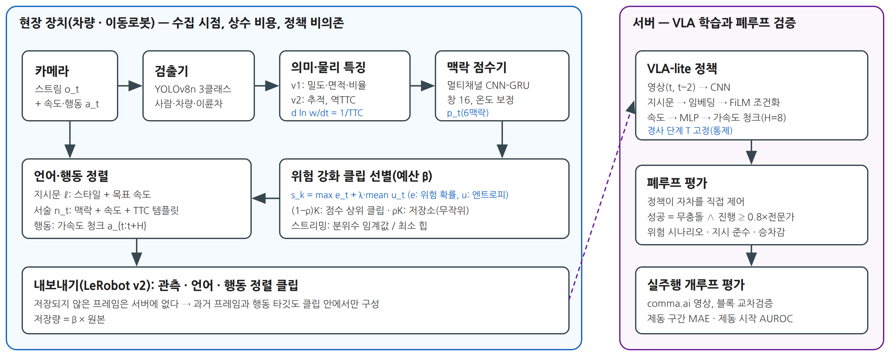
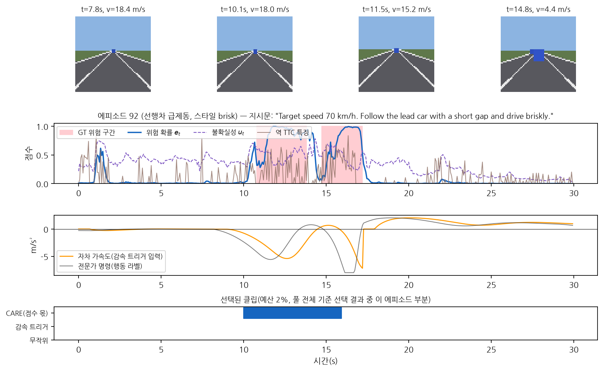
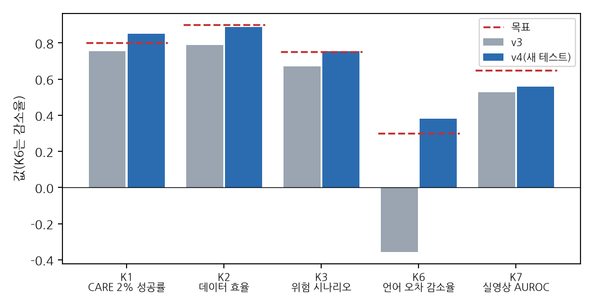
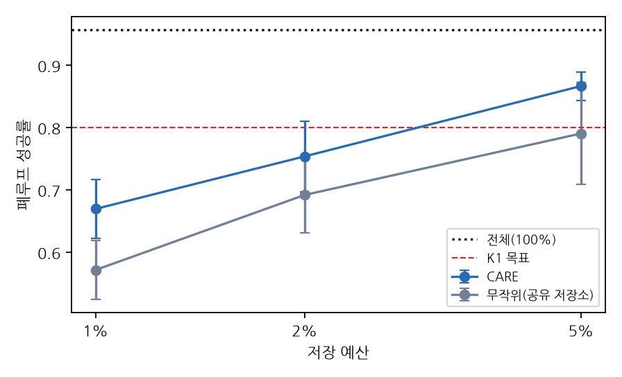

# 수집 시점 맥락 인지 큐레이션과 소형 언어 조건 정책(VLA-lite)의 핵심 지표 기반 검증: 경량 CNN-GRU 점수기, 정책 블록 개선, 2단계 사전 등록 폐루프 실험

**Collection-Time Context-Aware Curation for a Small Language-Conditioned Policy (VLA-lite): KPI-Driven Validation with a Lightweight CNN-GRU Scorer, Policy-Block Improvements, and Two-Stage Preregistered Closed-Loop Experiments**

<!-- 생성기 안내: 이 원고는 `scripts/build_vla_paper.py`가 실험 결과(예비 연구 `experiments/exp_110_vla_curation/summary/`, 1차 확증 `experiments/exp_120_vla_v3/summary/`, 2차 확증 `experiments/exp_130_vla_v4/summary/`)로 자동 생성한다. 수치를 손으로 고치지 말고 템플릿(`paper/manuscript_vla_ko.template.md`, `paper/sections_vla/`)을 수정한다. -->

## 국문 초록

비전-언어-행동(VLA) 정책은 대규모 시연 데이터로 일반화 능력을 얻지만, 현장 수집 데이터는 정상 상황이 대부분이어서 드물지만 결정적인 위험 상황에서 실패하기 쉽다. 차량·이동로봇은 저장·전송 예산 때문에 데이터를 골라 남겨야 하는데, 수집 측 선별을 하위 정책의 폐루프 성능으로 검증한 사례는 본 조사 범위에서 확인되지 않았다.

본 논문은 수집 시점·정책 비의존 큐레이션 방법 CARE를 제안하고, 그 효과를 실행 전에 정한 일곱 개의 핵심 지표(KPI)로 검증한다. CARE는 경량 검출 특징과 역 충돌시간 단서를 멀티채널 CNN-GRU로 해석해 위험 확률과 불확실성을 계산하고, 같은 학습 시드에서 공유하는 무작위 저장소 위에 점수 상위 클립을 소량 더해 예산 안에서 고르며, 지시문·물리량 서술·행동 청크를 LeRobot 형식으로 정렬해 내보낸다. 효과는 선별 데이터로 학습한 소형 언어 조건 정책(VLA-lite)이 시뮬레이터에서 종방향 제어를 직접 수행하는 폐루프 성공률로 측정했다. KPI와 목표는 폐루프 성공률(K1 ≥ 0.80), 데이터 효율(K2 ≥ 0.90), 위험 시나리오 성공률(K3 ≥ 0.75), 점수기 고유 기여(K4, 감속 트리거 혼합 대비 CI 하한 > 0), 실내 이동로봇(AMR) 비열등(K5, CI 하한 > −0.03), 언어 지시 준수(K6, 속도 추종 오차 30% 이상 감소), 실영상 제동 시작 예측(K7, AUROC ≥ 0.65)이다.

검증은 두 단계의 사전 등록 확증으로 수행했다.

- **1차 확증(v3)**: 일곱 지표가 모두 미달했다(K1 0.754, K4 +0.046 [95% CI −0.003, +0.093]). 원자료 진단에서 AMR의 정지 작업자 충돌과 저속 편향, 2프레임 특징의 추세 부족, 지시문 목표 속도의 미반영이 드러났다.
- **개선(v4)**: 큐레이션은 그대로 두고 정책·학습 블록(시간 특징 GRU 인코더, 위험 맥락 보조 헤드, 위험 가중 손실, 지시문 드롭아웃, 지시문 수치 목표 인코딩, 목표 속도 잔차 헤드)을 개발 세트에서 골랐다.
- **2차 확증(v4, 처음 보는 새 테스트 세트)**: K1(0.851), K3(0.755), K6(38.0%)을 달성했다. K2(0.888), K4(+0.002 [95% CI −0.024, +0.029]), K5(−0.008 [95% CI −0.069, +0.053]), K7(0.558)은 미달했다.

같은 새 테스트에서 v4 설정은 v3 설정보다 CARE 2% 성공률이 +0.148 [95% CI +0.105, +0.190] 높았다. 이는 같은 정책 안에서 CARE가 공유 저장소의 무작위 선택보다 높았던 폭(+0.038, Holm 보정 후 유의)의 약 네 배다. 즉 KPI를 가장 크게 움직인 것은 데이터 선별보다 하위 정책의 표현과 목표 인코딩이었다. 확증된 큐레이션 효과는 '큰 공유 저장소 + 소량의 위험 지향 클립'이라는 혼합 구조이며, v4 정책에서 그 몫을 맥락 점수기로 채우는 것과 감속 트리거로 채우는 것 사이에는 유의한 차이가 없었다. K6의 달성에는 해석적 목표 속도 제어기의 기여가 크고, 실영상에서는 정책 없이 현재 자차 가속도만 쓴 기준선(AUROC 0.802)에도 크게 못 미쳤다. 위험 구간만 남기는 저장은 예비 연구와 1차 확증 모두에서 정책을 '항상 감속'으로 무너뜨렸다. 결과는 GT 박스 렌더 관측과 종방향 제어만 하는 시뮬레이터, 사전학습 없는 약 57만 파라미터 정책에 한정된다.

## Abstract

Vision-language-action (VLA) policies generalize through large-scale demonstrations, yet field data are dominated by nominal operation, so policies remain fragile in rare but safety-critical situations. Vehicles and mobile robots must decide what to keep under storage and bandwidth budgets, and within our survey we found no collection-side selection method validated by the closed-loop performance of a downstream policy.

We propose CARE, a collection-time, policy-agnostic curation method, and evaluate it against seven key performance indicators (KPIs) fixed before the experiments. CARE uses a lightweight multichannel CNN-GRU over detector-based features and inverse time-to-collision cues to estimate per-frame risk probability and uncertainty, adds a small share of top-scoring clips on top of a random reservoir shared across methods for the same training seed, and exports instructions, physics-grounded narrations, and action chunks in the LeRobot format. Data value is measured by the closed-loop success of a small language-conditioned policy (VLA-lite) trained on the selected data and driving the ego agent in simulation (longitudinal control only). The KPIs and targets are closed-loop success (K1 ≥ 0.80), data efficiency (K2 ≥ 0.90), hazard-scenario success (K3 ≥ 0.75), scorer-specific contribution over a deceleration-trigger mix (K4, CI lower bound > 0), non-inferiority in an indoor autonomous mobile robot (AMR) domain (K5, CI lower bound > −0.03), instruction following (K6, ≥ 30% reduction in speed-tracking error), and braking-onset prediction on real driving video (K7, AUROC ≥ 0.65).

Validation proceeded in two preregistered confirmatory stages.

- **First confirmation (v3)**: all seven KPIs were missed (K1 0.754; K4 +0.046 [95% CI −0.003, +0.093]). Post hoc diagnosis revealed collisions with stopped workers and a low-speed bias in the AMR domain, insufficient temporal trend information in two-frame features, and failure to follow the target speed stated in the instruction.
- **Improvement (v4)**: keeping curation unchanged, we selected policy and training blocks on a development set: a temporal GRU feature encoder, a risk-context auxiliary head, a hazard-weighted loss, instruction dropout, numeric goal encoding of the instruction, and a goal-speed residual head.
- **Second confirmation (v4, unseen test set)**: K1 (0.851), K3 (0.755), and K6 (38.0%) were met; K2 (0.888), K4 (+0.002 [95% CI −0.024, +0.029]), K5 (−0.008 [95% CI −0.069, +0.053]), and K7 (0.558) were not.

On the same new test set, the v4 configuration exceeded the v3 configuration by +0.148 [95% CI +0.105, +0.190] in CARE 2% success, about four times the margin of CARE over random selection with the shared reservoir under the same policy (+0.038, significant after Holm correction). The KPIs were thus moved mainly by the downstream policy's representation and goal encoding rather than by data selection. The confirmed curation effect is the mixing structure—a large shared reservoir plus a small risk-oriented share—whereas, with the v4 policy, filling that share with the context scorer did not differ significantly from filling it with a deceleration trigger. The K6 gain owes much to an analytic goal-speed controller, and on real video the policy fell far short of a policy-free baseline using only the current ego acceleration (AUROC 0.802). Storing only hazardous segments collapsed the policy into braking everywhere in both the preliminary study and the first confirmation. All results are limited to rendered ground-truth-box observations, a longitudinal-only simulator, and a non-pretrained policy of about 0.57M parameters.

**주제어**: 비전-언어-행동 모델, 데이터 큐레이션, 수집 시점 학습 데이터 선택, 핵심 지표, 사전 등록, 폐루프 평가, 위험 편향 붕괴, CNN-GRU, 피지컬 AI

## 1. 서론

### 1.1 문제 제기: VLA 정책은 왜 드문 위험 상황에서 실패하는가

비전-언어-행동(VLA) 모델은 영상과 자연어 지시를 입력받아 로봇 행동을 직접 출력하는 정책이다[1][2][4][5]. 대규모 시연 데이터 덕분에 일반화 능력이 크게 향상되었고, 주행 분야에서도 언어와 행동을 함께 다루는 종단간 모델이 빠르게 늘고 있다[50][53][54][57].

이러한 성공은 **학습 데이터가 정책이 실제로 마주칠 상황을 충분히 포괄해야 한다**는 전제 위에 있다. 그러나 현실의 수집 데이터는 이 전제를 충족하지 못한다. 주행·물류 이동 데이터의 대부분은 차선 유지나 일정 간격 추종 같은 정상 상황이다. 선행 차량 급제동, 끼어들기, 보행자 돌출처럼 안전에 결정적인 상황은 전체 프레임의 몇 퍼센트에 불과하다(본 논문 예비 연구의 큐레이션 풀에서 7.1%). 대규모 주행 데이터로 학습한 검출기도 코너 케이스에서는 성능이 급락한다[42]. 종단간 주행에서는 롱테일 데이터를 소폭 늘리는 것만으로 해당 시나리오의 성능이 크게 오른다는 보고도 있다[47].

본 논문은 이 현상을 다음 질문으로 정리한다.

> **질문.** 차량·이동로봇 같은 현장 장치가 저장·전송 예산 때문에 수집 데이터의 일부만 남길 수 있을 때, **무엇을 남겨야** 그 데이터로 학습한 VLA 정책이 드물지만 결정적인 위험 상황에서 실패하지 않는가?

본 논문이 제시하는 답은 다음과 같다.

> **답(가설).** 저장 여부는 **수집 시점에, 장치 위에서, 정책 없이** 결정해야 하며, 그 기준은 **물리적 위험 단서를 시간 맥락으로 해석한 점수**여야 한다. 다만 위험 구간만 모아서는 안 되고, 정상 분포를 무작위 저장소로 충분히 보존한 위에 희소 위험·불확실 구간을 소량 과표집해야 한다. 그러면 같은 저장량으로 학습한 VLA 정책의 폐루프 성공률이 무작위 선택이나 다른 점수로 고른 선별보다 높아진다.

이 가설을 검증하려면 먼저 **어떤 지표로 성공을 판단해야 하는가**를 정해야 한다. 데이터 선별 연구는 흔히 검출 정확도나 개루프 행동 오차 하나로 효과를 판단한다. 그러나 이 질문에 답하려면 적어도 다음 일곱 측면을 따로 보아야 한다.

1. **폐루프 성공률.** 정책이 실제로 장치를 제어할 때 과제를 마치는가. 개루프 행동 오차는 폐루프 주행 품질과의 상관이 약하므로[76][81][82] 대리 지표가 될 수 없다. 또한 멈춰 서는 정책은 충돌률 0을 얻으므로, 성공은 무충돌과 진행을 함께 요구해야 한다.
2. **데이터 효율.** 저장 예산의 의미는 '적게 남겨도 잃는 것이 적은가'이다. 같은 학습 계산량에서 전체 데이터로 학습한 정책의 성공률을 얼마나 보존하는지를 보아야 한다.
3. **위험 시나리오 성공률.** 질문의 핵심은 드문 위험 상황이다. 평균 성공률은 다수인 정상 시나리오에 가려지므로, 위험 시나리오만의 성공률을 따로 보아야 한다.
4. **점수기 고유 기여.** 위 가설의 선별은 예산의 대부분을 무작위 저장소에 쓴다. 따라서 이득이 맥락 점수기에서 오는지, '아무 점수로든 소량 강화 + 무작위 저장소'라는 혼합 구조에서 오는지를 같은 저장소 위에서 분리해야 한다.
5. **도메인 일반화.** 한 도메인(주행)에서 정한 설계가 다른 도메인(물류 이동로봇)에서 적어도 무작위 선택보다 나쁘지 않아야 한다.
6. **지시 준수.** 언어 조건 정책이라면 지시문이 행동을 실제로 바꾸어야 한다. 지시 정보가 초기 상태 같은 다른 경로로 새면 언어의 효과를 측정할 수 없으므로, 같은 장면에 지시문만 바꾼 반사실 평가가 필요하다.
7. **실영상.** 시뮬레이터 밖의 실주행 영상에서도 같은 파이프라인이 위험 단서(예: 제동 시작)를 학습해야 한다.

본 논문은 이 일곱 측면을 **핵심 지표(KPI) K1~K7**로 정의하고(3.7절), 각 지표의 목표와 판정 규칙을 테스트 실행 전에 사전 등록했다(4.6·4.8절).

이 지표 체계는 예비 연구에서 나왔다. 같은 파이프라인의 이전 버전(이하 v2, 4.2절)은 주 예산 2%에서 무작위 선택 대비 우위를 사전 등록 확증 실험으로 지지했다. 그러나 점수기 고유 기여, AMR 일반화, 언어의 효과, 실영상 분해능은 판단하지 못했다. 원인을 추적한 결과, 그 일부는 선별법이 아니라 벤치마크와 측정 설계의 결함(지시 정보의 초기 상태 누출, 충돌 시 자차 되밀림, 방법마다 다른 저장소 표집)에 있었다.

본 논문은 이 결함을 고친 벤치마크에서 **두 단계의 사전 등록 연구**를 수행했다(4절 표 8).

- **1단계(v3, 1차 확증).** 고친 벤치마크에서 새 학습 시드와 새 평가 세트로 K1~K7을 사전 등록 판정 규칙에 따라 측정했다(4.6절).
- **2단계(v4, 원인 진단과 2차 확증).** 1단계에서 목표에 미달한 지표의 원인을 1단계 원자료에서 진단하고, 원인마다 정책 블록이나 학습 규칙을 더했다(3.6.2절). 조합은 테스트와 겹치지 않는 개발 세트에서만 정했고(4.7절), 확정한 조합을 다시 사전 등록한 뒤 처음 보는 새 테스트 세트에서 확증했다(4.8절). 1단계 테스트 세트는 이미 결과를 보았으므로 2단계 평가에 쓰지 않았다.

두 단계의 결과는 목표 미달을 포함해 모두 보고한다(5절).

본 논문의 목적은 위 가설의 타당성과 적용 범위를 K1~K7로 검증하는 것이다. 검증 대상은 대형 VLA가 아니라 약 54만~57만 파라미터의 소형 언어 조건 정책(VLA-lite, 검출 특징 토큰 포함)이며, 과제는 종방향 가속도 제어(주행·이동로봇 시뮬레이터)와 실주행 영상의 개루프 예측으로 한정된다.

### 1.2 기존 해결 방법과 그 한계

데이터 구성이 정책 품질을 좌우한다는 인식은 널리 공유되어 있다[24][25][26]. 이 문제에 대한 기존 접근은 세 갈래로 나뉜다.

**(1) 오프라인 로봇 데이터 큐레이션.** 최근 연구는 학습된 정책이나 데이터셋 전체의 통계로 시연의 가치를 추정한다.

- DemInf[28]는 데이터셋 전체의 상태-행동 상호정보량에 대한 각 시연의 기여도를 계산한다.
- CUPID[32]는 학습된 정책과 평가 롤아웃으로 영향함수를 추정한다.
- DataMIL[30]은 목표 과제 시연에 대한 대리 손실로 데이터모델을 최적화한다.
- Re-Mix[27]는 참조 모델과 DRO로 도메인 가중치를 학습한다.
- Demo-SCORE[29]와 SCIZOR[31]는 롤아웃 분류기 또는 자기지도 진행도·중복 군집으로 시연이나 전이를 걸러낸다.

이들 방법은 품질이 낮은 시연을 걸러내는 데 효과적이지만, 공통적으로 **수집이 끝난 데이터 전체, 학습된 정책, 또는 롤아웃**을 전제한다. 따라서 장치가 프레임을 받는 순간 저장 여부를 결정해야 하는 상황(저장·전송 예산)에는 곧바로 적용할 수 없다. 또한 선택 단위가 대부분 시연이나 도메인이어서, 한 에피소드 안의 2초 길이 위험 구간을 골라내는 문제와는 거리가 있다.

**(2) 능동학습과 자율주행 데이터 엔진.** 불확실성[34][35]이나 커버리지[36]를 기준으로 표본을 고르는 능동학습은 주행 검출기 학습에 활용되어 왔다[44][45]. 이벤트 탐지로 주행 영상 저장의 우선순위를 정하는 연구도 있다[46]. 그러나 이들 연구의 평가는 검출·예측 정확도나 저장 비율에 머문다. **선별된 데이터로 학습한 주행 정책의 폐루프 성능으로 검증한 사례는 본 조사 범위에서 확인되지 않았다.** 데이터 선택 연구에서 무작위 선택이 의외로 강한 기준선이라는 보고[39]를 고려하면, 이 검증 공백은 실질적인 문제다.

**(3) 언어 주석과 경량 정책.** VLA 학습용 언어 주석을 자동화하는 연구[59][61][62]는 대형 VLM·LLM의 조합에 의존한다. ECoT는 Bridge v2 데이터 주석에 약 7일이 소요되었다고 보고했다[61]. 주석 내용 역시 과제 지시와 추론 체인 중심이어서 충돌시간 같은 물리량과 정렬되지 않는다. 경량 VLA[13][14][15]와 이중 시스템 구조[10][12][16]는 **정책 추론**의 효율에 집중하며, 데이터 **수집 측**의 경량 모듈은 다루지 않는다.

여기에 **평가 방법의 문제**가 더해진다. 오프라인(개루프) 행동 오차는 폐루프 주행 품질과의 상관이 약하다[76]. 인지 입력이 없는 모델도 개루프 지표에서 경쟁력을 보이며[81], 단순 외삽이 개루프 최고 성능을 기록한 사례도 있다[82]. 데이터 스케일링 경향 역시 개루프와 폐루프에서 다르게 나타났다[47]. 따라서 개루프 지표만으로 데이터 선별의 효과를 판단하면 결론이 뒤집힐 수 있다.

### 1.3 해결에 필요한 조건

위의 한계로부터 수집 시점 VLA 데이터 큐레이션이 갖춰야 할 다섯 가지 조건을 도출한다.

- **R1 수집 시점·온디바이스.** 점수는 과거 관측만으로 계산해야 하며(인과), 프레임당 상수 비용으로 단말에서 실시간으로 동작해야 한다.
- **R2 정책 비의존·위험 민감.** 하위 정책이나 롤아웃 없이도 희소 위험 사건에 민감한 신호가 필요하다.
- **R3 관측-언어-행동 정렬.** 선택된 데이터에는 대형 모델 없이도 지시문, 상황 서술, 행동이 정렬된 형태로 부착되어야 한다.
- **R4 표준 형식.** VLA 학습 생태계의 표준 형식(LeRobot[22]·RLDS[23])으로 곧바로 내보낼 수 있어야 한다.
- **R5 하위 정책 검증.** 선별의 가치는 해당 데이터로 학습한 정책의 성능, 특히 **폐루프** 성능으로 검증해야 한다.

표 2(2.10절)는 기존 연구의 조건 충족 여부를 정리한 것이다. 다섯 조건을 모두 다룬 연구는 확인되지 않았다.

R5의 '하위 정책 성능'은 단일 지표로 충분하지 않다. 1.1절의 일곱 측면(K1~K7)은 R5를 구체화한 것이며, K4는 R2의 신호가 하위 정책에 실제로 기여하는지를, K6은 R3의 정렬 주석이 정책 행동을 바꾸는지를 확인한다.

### 1.4 본 논문의 접근과 기여

본 논문은 **CARE**(Context-Aware, Risk-Enriched curation)를 제안하고, 그 효과를 하위 정책의 폐루프 성능을 중심으로 한 핵심 지표 K1~K7로 두 단계에 걸쳐 검증한다. 기여는 다음과 같다.

1. **수집 시점 맥락 인지 큐레이션 CARE(R1 부분, R2, R3 부분, R4).**
   - 경량 검출기의 박스로부터 의미 특징과 물리 단서를 계산한다. 물리 단서는 박스 크기의 변화율로 얻는 역 충돌시간 $1/\mathrm{TTC}=d\ln w/dt$이다[70][71].
   - 멀티채널 CNN-GRU가 이를 시간 맥락으로 해석하여 프레임마다 위험 확률과 불확실성을 산출한다. 파라미터는 수만 개 수준이며 정책을 사용하지 않는다.
   - 예산의 일부($1-\rho$)는 위험·불확실성 점수 상위 클립에, 나머지($\rho$)는 무작위 저장소에 할당한다. 희소 위험의 과표집과 정상 분포의 커버리지를 함께 확보하기 위한 설계다.
   - 고른 클립에는 지시문(주행 스타일·목표 속도), 맥락·속도·TTC 서술, 행동 청크를 템플릿으로 자동 정렬하여 LeRobot 형식으로 내보낸다. 주석 자체의 품질은 측정하지 않았다.
   - 점수기는 장치 위 실행을 목표로 인과·상수 비용으로 설계했다. 다만 본 논문은 x86 CPU에서의 계산 비용만 측정했고, 임베디드 장치 실측과 스트리밍 선택은 평가하지 않았다. 따라서 R1은 부분적으로만 뒷받침된다.
2. **공유 저장소 기준의 비교 설계(R2, K4).**
   - 비교 실험에서는 무작위 저장소를 학습 시드별로 먼저 고정하여 모든 혼합 방법이 공유하게 했다(3.4절). 이렇게 하면 방법 간 차이가 점수 몫으로만 한정되어, 저장소 표집 분산에 가리지 않고 점수기 고유의 기여(K4)를 잴 수 있다.
   - 예비 연구에서는 저장소가 방법마다 달라 이 기여를 분리하지 못했다. 같은 설계를 두 단계 모두에 쓴다.
3. **KPI 중심 폐루프 벤치마크와 그 수정(R5).**
   - 소형 언어 조건 정책(VLA-lite)이 시뮬레이터에서 차량과 물류 통로의 자율 이동로봇(AMR, autonomous mobile robot)을 **직접 제어하는 폐루프 평가**와 실주행 영상 기반 개루프 평가를 함께 수행한다. 정책 구조, 경사 단계 수, 평가 시드, 선택량을 모두 통제한다.
   - 예비 연구 원자료에서 찾은 벤치마크 결함을 고쳤다. 지시 정보가 초기 속도로 새던 문제는 초기 속도 분리(B1)로, 충돌 시 자차가 뒤로 밀리던 문제는 되밀림 제거(B3)로 바로잡았다. 또 같은 장면에 지시문만 바꾼 반사실 언어 평가 세트(B2)를 두어 K6을 측정할 수 있게 했다(3.6.3절). 수정 전후의 전문가 지표 변화도 함께 보고한다(4.2절).
   - 일곱 지표의 정의·목표·판정 규칙을 테스트 실행 전에 사전 등록하고(3.7절), 목표에 미달한 지표도 그대로 보고한다.
4. **미달 원인 진단에 근거한 정책 블록과, 개발 세트 선택과 새 테스트 확증을 분리한 절차(R5).**
   - 1단계에서는 예비 연구의 진단(AMR 근거리 지각 부족, 실영상 판별력 부족)에 따라 검출 특징 토큰(P1)을 정책에 더했다(3.6.1절).
   - 2단계에서는 1단계에서 미달한 지표마다 원인을 원자료에서 진단하고 블록을 더했다(3.6.2절). 시간 특징 인코더(P2), 위험 맥락 보조 헤드(P3), 위험 가중 손실(P4), 지시문 드롭아웃(T1), 지시문 수치 목표 인코딩(P6), 목표 속도 잔차 헤드(P7)다. 점수 몫 에피소드 상한(S1)은 측정 후, 자차 운동 이력(P5)은 개발 세트에서 기각했다.
   - 블록의 채택은 테스트와 겹치지 않는 개발 세트에서 결과 전에 정한 규칙으로만 결정했다. 확정한 조합은 다시 사전 등록한 뒤 처음 보는 새 테스트 세트에서 1단계 설정과 함께 평가했다(4.7·4.8절). 개발 과정에서 후보를 순차적으로 더한 경위도 시각과 함께 공개한다(4.7절).
5. **실영상 진단(K7).**
   - 실주행 영상의 제동 시작 예측에서 정책의 판별력을 정책 없는 단순 기준선(현재 자차 가속도 $-a_t$)과 함께 보고한다. 실영상에서는 아무것도 튜닝하지 않고 시뮬레이터 개발 세트에서 정한 설정을 그대로 적용한다.
   - 이를 통해 실영상 개루프 지표가 요구하는 설계(예: 자차 운동 이력)가 시뮬레이터 폐루프 지표가 요구하는 설계와 어긋날 수 있는지를 점검한다(4.7절, 5절).

표 1은 각 핵심 지표가 검증하는 주장과, 그 주장이 기대는 기여·조건, 2단계에서 그 지표를 겨냥한 블록, 사전 등록한 목표, 정의와 결과를 다루는 절을 대응시킨 것이다.

| KPI | 지표 | 검증하는 주장 | 관련 기여(조건) | 2단계 대상 블록 | 목표(사전 등록) | 정의 | 결과 |
|---|---|---|---|---|---|---|---|
| K1 | 폐루프 성공률(예산 2%) | CARE로 고른 2% 데이터만으로 학습한 정책이 폐루프 과제를 해결한다 | 1, 3, 4 (R2, R5) | P2 | ≥ 0.80 | 3.7절 | 5절 |
| K2 | 데이터 효율 | 2% 데이터가 전체 데이터 정책의 성공률을 대부분 보존한다 | 1, 4 (R5) | P3 | ≥ 0.90 | 3.7절 | 5절 |
| K3 | 위험 시나리오 성공률(예산 2%) | 드문 위험 상황에서 정책이 실패하지 않는다(1.1절의 질문) | 1, 4 (R2) | P2, P3, P4 | ≥ 0.75 | 3.7절 | 5절 |
| K4 | 점수기 고유 기여 | 이득이 혼합 구조가 아니라 맥락 점수기에서 온다 | 1, 2 (R2) | (S1, 측정 후 기각) | 95% CI 하한 > 0, Holm 보정 단측 $p$ < 0.05 | 3.4, 3.7절 | 5절 |
| K5 | 도메인 일반화(AMR) | 주행에서 정한 설계가 AMR에서 무작위보다 나쁘지 않다 | 1, 3, 4 (R5) | P2, P4 | 95% CI 하한 > −0.03(비열등) | 3.7절 | 5절 |
| K6 | 언어 지시 준수 | 정렬된 지시문이 정책의 속도 추종을 실제로 조건화한다 | 1, 3 (R3) | T1, P6, P7 | 속도 추종 오차 30% 이상 감소 | 3.6, 3.7절 | 5절 |
| K7 | 실영상 제동 시작 예측 | 같은 정책 구조가 실영상에서 제동 단서를 학습한다 | 4, 5 (R5) | (P5, 개발에서 기각) | AUROC ≥ 0.65 | 3.7절 | 5절 |

표 1. 핵심 지표(K1~K7)와 본 논문의 주장·기여·검증 절의 대응. '2단계 대상 블록'은 1단계 미달 원인 진단(4.7절)에서 각 블록이 겨냥한 지표이며(docs/36 2절), 블록은 지표별로 따로 채택하지 않고 개발 세트에서 조합 단위로 채택했다(4.7절). 각 지표의 정의·목표·판정 규칙은 두 단계에서 같고(3.7절), 달성 여부는 5절에서 두 단계 모두 보고한다. 목표에 미달한 지표도 미달로 보고한다.

**예비 연구와의 관계.** v2 예비 연구(4.2절)에서 확인한 사실은 다음 두 가지다. 첫째, 위험 표본을 최대화하는 선별(자차 감속 트리거, 맥락 이벤트, GT 위험 라벨 오라클, 정책 손실 기반 오프라인 선별)은 소예산 폐루프에서 정책을 '항상 감속'으로 붕괴시켰다(**위험 편향 붕괴**). 둘째, 주 예산 2%에서 CARE의 무작위 대비 우위는 사전 등록 확증 실험에서 지지되었다(+0.146 [95% CI +0.071, +0.223]). 반면 같은 비율의 저장소에 감속 트리거 점수를 섞은 통제군 대비 우위는 유의하지 않았고(Holm 보정 $p$ = 0.172), AMR과 실영상에서는 방법 간 차이를 가리지 못했으며, 언어의 효과는 측정할 수 없었다. 본 논문의 1단계(v3)는 이 미해결 지점을 K4~K7로 다시 측정하도록 설계했고, 2단계(v4)는 1단계에서 남은 미달의 원인을 겨냥했다.

**결과 요약.** 처음 보는 새 테스트 세트에서 2단계(v4) 설정은 K1(0.851), K3(0.755), K6(속도 추종 오차 38.0% 감소)의 목표를 넘었고, 같은 테스트에서 1단계(v3) 설정보다 CARE 2% 성공률이 +0.148 [95% CI +0.105, +0.190] 높았다. 반면 점수기 고유 기여 K4(+0.002 [95% CI −0.024, +0.029])와 K2·K5·K7은 목표에 미달했다. 같은 테스트에서 무작위 선택의 성공률도 비슷한 폭(+0.153)으로 올라, 2단계의 향상은 선별법보다 정책 쪽 변경과 함께 나타났다. 또 K6 달성의 일부는 지시문의 목표 속도를 쓰는 해석적 제어기(P7)에 기인한다. 지표별 결과와 해석은 5·6절에서 다룬다.

이후의 구성은 다음과 같다. 2절은 관련 연구를 정리하고, 3절은 CARE, 공유 저장소 선별, 정책과 2단계 정책 블록, 핵심 지표를 정식화한다. 4절은 연구 단계 개요, KPI 기준의 변수 정의, 예비 연구의 진단과 벤치마크 수정, 1단계의 실험 설계와 사전 등록, 2단계의 개발 세트 선택과 새 테스트 확증 설계를 기술한다. 5절은 결과를 지표별로 보고하고, 6절은 결과의 의미와 한계를 논의하며, 7절에서 결론을 맺는다.

## 2. 관련 연구

이 절에서는 본 연구와 관련된 열 갈래의 선행 연구를 정리한다. 각 갈래에서 본 연구의 요구사항(R1 수집 시점·온디바이스 실시간, R2 정책 학습 없는 희소 위험 신호, R3 관측-언어-행동 정렬 주석 자동화, R4 표준 형식 내보내기, R5 하위 VLA 정책의 개루프·폐루프 검증)에 비춰 무엇이 해결됐고 무엇이 남았는지 확인한다. 인용 번호는 참고문헌 목록과 같다.

### 2.1 VLA 모델과 이중 시스템

RT-1 [1]은 대규모 실로봇 시연으로 트랜스포머 정책을 학습했다. 데이터 크기·모델 크기·데이터 다양성에 따라 일반화가 커짐을 보였다. RT-2 [2]는 행동을 텍스트 토큰으로 표현했다. 그리고 웹 규모 비전-언어 데이터와 로봇 궤적을 함께 미세조정해 vision-language-action(VLA)이라는 범주를 정립했다. 이후 공개 모델이 이어졌다. Octo [3]는 Open X-Embodiment의 80만 에피소드로 학습한 트랜스포머 기반 확산 정책이다. OpenVLA [4]는 97만 개 실로봇 시연으로 학습한 7B 모델로, RT-2-X(55B)보다 높은 성공률을 보고했다.

행동 표현도 다양해졌다. π0 [5]는 사전학습 VLM에 흐름 정합(flow matching) 기반 "행동 전문가"를 붙여 연속 행동 청크를 생성한다. FAST [6]는 압축 기반 행동 토큰화로 자기회귀 VLA의 고빈도·정밀 과제 성능을 높였다. π0.5 [7]는 다중 로봇 데이터, 고수준 의미 예측, 웹 데이터, 물체 검출을 함께 학습해 새 가정 환경으로 일반화하는 것을 목표로 한다. RDT-1B [8]는 46개 데이터셋, 100만 에피소드 이상으로 사전학습한 1.2B 확산 트랜스포머다. CogACT [9]는 인지(VLM)와 행동(확산 트랜스포머 모듈)을 분리한 구조를 제안했다. Gemini Robotics [11]는 Gemini 2.0 위에 구현적 추론(ER) 모델과 VLA 모델을 구축했다.

VLM은 일반적이지만 느리고, 시각운동 정책은 빠르지만 일반적이지 않다. 이 절충을 풀기 위해 이중 시스템(System-1/System-2) 구조가 등장했다. GR00T N1 [10]은 VLM 모듈(System 2)이 환경과 지시를 해석하고, 확산 트랜스포머(System 1)가 실시간 행동을 생성한다. Helix [12]는 기술 보고에서 7~9Hz의 S2와 200Hz의 S1을 결합한 휴머노이드 제어를 설명했다. Hi Robot [16]은 고수준 VLM이 복잡한 지시와 실시간 수정을 해석하고, 저수준 VLA가 실행하는 계층 구조를 제시했다.

경량화 연구도 활발하다. SmolVLA [13]는 0.45B 파라미터로 단일 GPU 학습과 소비자 하드웨어 배포를 목표로 했다. 3만 개 미만의 커뮤니티 에피소드로 더 큰 VLA에 견줄 성능을 보고했다. TinyVLA [14]는 고속 다중모달 백본과 확산 정책 디코더로 사전학습 단계 없이 데이터 효율을 높였다. MiniVLA [15]는 OpenVLA를 약 1B로 줄이고 추론 속도를 2.5배 높였다.

이 연구들의 공통 관심은 **정책 쪽**의 일반화와 추론 효율이다. 이중 시스템의 "빠른 경량 모듈"도 행동 생성에만 쓰인다. 본 연구는 같은 발상을 데이터 수집 쪽에 적용한다. 장치에서 상시 동작하는 경량 시계열 모듈이 "무엇을 남길지"를 결정한다.

### 2.2 로봇 학습 데이터셋, 표준 형식, 데이터 스케일링

VLA의 성능은 대규모 로봇 데이터에 기대고 있다. RoboNet [20]은 7개 로봇 플랫폼의 1500만 프레임을 모아 다중 로봇 학습 가능성을 보였다. BridgeData V2 [19]는 24개 환경의 60,096개 궤적을 저가 로봇으로 수집했다. Open X-Embodiment [17]는 21개 기관, 22종 로봇의 100만 개 이상 궤적을 통합했고, RT-X 모델로 교차 구현체 양의 전이를 보고했다. DROID [18]는 564개 장면과 86개 과제에 걸친 350시간 규모의 "in-the-wild" 조작 데이터를 공개했다. AgiBot World [21]는 217개 과제, 100만 개 이상 궤적을 사람 검증이 포함된 표준 수집 파이프라인으로 구축했다.

데이터 교환 형식으로는 RLDS [23]가 강화학습·모방학습 데이터의 기록·재생·주석·공유 생태계를 제시했다. LeRobot [22]은 데이터 수집·저장·스트리밍과 정책 학습·비동기 추론을 하나의 오픈소스 스택으로 묶었다. 본 연구는 결과물을 LeRobot 구조로 내보낸다(R4).

스케일링 측면에서 Lin et al. [24]은 정책의 일반화 성능이 학습 환경·물체 수에 대해 대략 멱법칙을 따름을 보였다. 이 결과는 데이터의 **양보다 다양성과 구성**이 중요하다는 점을 시사한다. 그러나 이 데이터셋들은 대부분 원격조작 시연을 "모두 저장"하는 방식으로 만들어졌다. 차량·이동로봇처럼 상시 주행하는 장치가 제한된 저장·전송 예산 안에서 무엇을 남길지는 다루지 않는다.

### 2.3 로봇 데이터 큐레이션과 데이터 품질

데이터 품질에 대한 관심은 최근 빠르게 커졌다. robomimic [26]은 오프라인 인간 시연 학습에서 시연 품질과 정지 기준이 성능에 미치는 영향을 분석했다. 또한 학습 목표와 평가 목표가 달라 검증 손실로 고른 정책이 실제 최고 성능 정책과 어긋날 수 있음을 지적했다. Belkhale et al. [25]은 데이터 품질을 분포 이동 관점으로 정식화했다. 핵심 속성으로 action divergence와 transition diversity를 제시했고, 상태 다양성이 항상 이롭지는 않음을 보였다.

이를 바탕으로 자동 큐레이션 방법들이 제안됐다. 각 방법의 전제를 원문 기준으로 정리하면 다음과 같다.

- **Re-Mix** [27]: 분포 강건 최적화로 사전학습 혼합의 **도메인 가중치**를 학습한다. 정책이 참조 모델 대비 초과 행동 복제 손실을 최소화하는 min-max 문제로 정식화하므로 참조 모델 학습이 필요하다.
- **DemInf** [28]: 데이터셋 전체의 상태-행동 상호정보량에 대한 각 **궤적**의 평균 기여를 VAE 표현과 kNN 추정기로 계산한다. 정책 롤아웃은 필요 없지만, 수집이 끝난 데이터셋 전체를 전제로 한다.
- **Demo-SCORE** [29]: 전체 시연으로 초기 정책을 학습하고 **롤아웃**에서 성공/실패 분류기를 학습해 시연을 거른다.
- **DataMIL** [30]: datamodels 관점에서 정책 자체로 데이터를 고른다. 롤아웃 대신 목표 과제 시연의 held-out 검증 손실을 대리 손실로 쓴다.
- **SCIZOR** [31]: 자기지도 과제 진행도 예측기와 상태-행동 결합 표현 기반 중복 제거로 **전이 수준**에서 데이터를 거른다.
- **CUPID** [32]: 영향 함수로 각 **시연**이 정책 기대 수익에 미치는 영향을 평가 롤아웃에서 추정한다.

이 방법들은 모두 선별 데이터로 학습한 정책의 성공률로 효과를 검증했다는 강점이 있다. 그러나 전제가 공통적이다. 수집된 데이터셋 전체 [27][28][31], 학습된 정책과 롤아웃 [29][32], 목표 과제 시연과 반복적 정책 학습 [30] 중 하나 이상이 필요하다. 선택 단위도 시연·도메인이 많다. 따라서 장치가 데이터를 받는 순간 저장 여부를 정해야 하는 수집 시점 선별(R1)에 바로 쓰기 어렵다. 선별 기준도 과제 성공·진행·중복·상호정보이므로 드문 위험 구간의 보존을 직접 겨냥하지 않는다(R2).

### 2.4 능동학습과 데이터 선택

능동학습은 "학습자가 데이터를 고르면 더 적은 라벨로 같은 성능을 얻는다"는 생각에서 출발한다. Settles [33]는 질의 시나리오를 멤버십 질의 합성, 스트림 기반 선택적 샘플링, 풀 기반 샘플링으로 나누고 불확실성 기반 전략 등을 정리했다. 스트림 기반 시나리오는 수집 시점 선별과 형식이 닮았다. 그러나 목적은 라벨 비용 절감이다. BALD [34]는 정보이득을 예측 엔트로피로 표현했고, Gal et al. [35]은 이를 MC dropout 기반 딥 영상 분류로 확장했다. Sener와 Savarese [36]는 CNN 능동학습을 core-set(k-center 커버리지) 문제로 정식화했다.

데이터 선택 비용을 줄이려는 시도도 있다. Selection via Proxy [37]는 작은 프록시 모델로 선택해 비용을 크게 줄였다. Sorscher et al. [38]은 좋은 가지치기 지표가 있으면 멱법칙보다 나은 스케일링이 가능함을 보였다. 동시에 기존 지표 대부분이 ImageNet 규모에서는 잘 작동하지 않고, 잘 작동하는 지표는 계산량이 크다고 보고했다. DeepCore [39]는 여러 coreset 방법을 비교한 결과 무작위 선택이 여전히 강한 기준선임을 확인했다.

이 갈래의 평가는 주로 분류·검출 정확도다. 하위 순차 의사결정 정책의 폐루프 성능으로 선택 효과를 검증하지 않는다. 본 연구는 엔트로피 불확실성 [34][35], 특징 공간 k-center [36], 무작위 [39]를 비교 기준선으로 포함하고, 이를 정책 성능으로 평가한다.

### 2.5 자율주행 데이터 엔진과 롱테일

자율주행 분야는 대규모 데이터 [40]와 폐루프 계획 벤치마크 [41]를 갖췄다. 그러나 롱테일 문제는 여전히 크다. CODA [42]는 실도로 코너 케이스 1500장면에서 대규모 주행 데이터로 학습한 표준 검출기의 mAR이 12.8% 이하로 떨어짐을 보였다. Zheng et al. [47]은 400만 개 이상의 시연으로 데이터 분포가 스케일링의 핵심임을 확인했다. 또한 롱테일 데이터를 조금만 늘려도 해당 시나리오 성능이 크게 오른다고 보고했다. Ding et al. [43]은 안전-중요 시나리오 생성을 데이터 기반·적대적·지식 기반으로 분류했다. 다만 이는 시뮬레이션에서 시나리오를 **생성**하는 관점이다.

실데이터 **선별** 측면에서는 다음 연구들이 있다.

- Haussmann et al. [44]: 검출기 앙상블로 정보량을 계산하는 양산형 능동학습 시스템. 목표는 검출 성능이다.
- Segal et al. [45]: 부분 라벨 장면 단위의 비용 인지형 능동 선택으로 인지·예측·계획 지표를 개선했다.
- Smart Black Box 2.0 [46]: 이상 탐지·행동 탐지로 관심 사건을 찾아 실시간으로 주행 영상을 우선 저장한다. 수집 시점(R1)과 사건 민감성(R2)을 겨냥한 가장 가까운 선행 연구다. 그러나 평가는 저장된 이상/정상 비율이며, 저장된 데이터로 학습한 정책의 성능은 평가하지 않았다.

본 연구는 자차 감속도가 임계값을 넘는 구간을 저장하는 규칙 기반 트리거(action_trigger)를 기준선으로 둔다. 이는 차량 신호 기반 트리거 수집을 단순화한 것이며, 특정 기업 시스템의 재현을 주장하지 않는다.

### 2.6 주행 VLA와 언어 기반 주행

언어 모델을 주행에 접목한 연구는 크게 두 방향이다.

- **해석·질의응답**: DriveGPT4 [48]는 시각 지시 튜닝으로 행동 설명과 저수준 제어 예측을 함께 수행했다. DriveLM [49]은 인지-예측-계획을 그래프 VQA로 구조화했다.
- **폐루프 주행**: LMDrive [50]는 자연어 지시를 따르는 폐루프 주행과 LangAuto 벤치마크를 제시했다. DriveVLM [51]은 장면 서술·분석·계층 계획의 연쇄 사고 모듈을 기존 파이프라인과 결합한 Dual 시스템을 실차에 배치했다. CarLLaVA [52]와 SimLingo [54]는 카메라만 쓰는 VLM 기반 폐루프 주행을 보였다. 특히 SimLingo는 언어-행동 정렬(Action Dreaming)로 지시 준수 여부를 평가했다. EMMA [53]는 Gemini 기반으로 궤적·객체·도로 그래프를 모두 텍스트로 출력한다. OpenDriveVLA [55]는 2D·3D 구조적 시각 토큰을 언어 공간에 정렬했다. ORION [56]은 장기 맥락 집계, LLM 추론, 생성형 계획기를 결합해 Bench2Drive [83]에서 폐루프 성능을 보고했다. Alpamayo-R1 [57]은 인과 연쇄(Chain of Causation) 데이터셋을 자동 라벨링과 사람 검증을 섞은 파이프라인으로 만들고, 추론과 궤적 생성을 결합했다.

이 연구들은 롱테일 상황 이해를 동기로 든다 [51][57]. 그러나 데이터 측면에서는 이미 구축된 대규모 데이터셋이나 시뮬레이터 데이터를 쓴다. 장치에서 어떤 구간을 학습 데이터로 남길지는 다루지 않는다. 본 연구의 지시문(주행 스타일·목표 속도)과 맥락·TTC 서술은 이러한 언어 조건 주행 정책의 학습 데이터 형식을 따르되, 데이터 선별과 정렬 주석을 경량으로 수행한다.

### 2.7 자동 언어 주석

Lynch와 Sermanet [58]은 비정형 데이터에서 언어 조건 모방학습을 수행하고, 사전학습 언어 모델로 지시문 강건성을 높였다. DIAL [59]은 80,000개 시연 중 3.5%에만 있던 크라우드 라벨로 CLIP을 미세조정해 나머지 데이터를 재라벨링했다. Scaling Up and Distilling Down [60]은 LLM이 계획과 성공 조건 코드를 만들어 시뮬레이션에서 언어 라벨 데이터를 대량 생성했다. ECoT [61]는 Prismatic-7B, Grounding DINO, OWLv2/SAM, Gemini를 조합해 추론 체인 주석을 생성했다. Bridge v2 전체를 처리하는 데 7일이 걸렸다고 보고했다. NILS [62]는 여러 비전-언어 기반 모델로 물체 탐지·변화 탐지·과제 분할을 수행해 430시간 이상의 데이터에 제로샷 라벨을 붙였다. RoboAnnotatorX [63]는 MLLM을 강화해 장기 시연에 맥락이 풍부한 주석을 생성했다.

이 방법들은 사람 주석 비용을 크게 줄였다. 그러나 대부분 대형 VLM·LLM에 기대므로 서버측 사후 처리를 전제로 한다. 주석 내용도 과제 지시와 추론 체인이다. 본 연구는 검출 기반 맥락 상태와 역 TTC 같은 물리량에서 템플릿 서술을 만든다. 이렇게 해서 온디바이스에서 관측-언어-행동을 시간 정렬한다(R3). 다만 표현력은 대형 모델 기반 주석보다 제한적이며, 이는 한계로 논의한다.

### 2.8 시계열 위험 예측과 물리 단서

순환 구조로는 GRU [64]가 있고, CNN과 LSTM을 결합한 LRCN [65]이 영상 시계열 인식의 표준 형태를 제시했다. TCN [66]은 단순 합성곱 구조가 여러 과제에서 LSTM보다 좋고 유효 기억이 길다고 보고했다.

주행 위험 예측 연구로는 다음이 있다. Brain4Cars [67]는 차량 내외부 카메라 융합으로 기동을 미리 예측했다. DSA-RNN [68]은 후보 물체에 대한 동적 공간 주의와 RNN으로 블랙박스 영상의 사고를 예측했다. DADA [69]는 사고 시나리오의 운전자 주의 예측 벤치마크를 구축했다.

물리 단서로는 Lee [70]의 τ 이론이 있다. 망막상 확장률만으로 충돌까지 남은 시간(TTC)을 얻을 수 있다는 이론이다. Dagan et al. [71]은 단일 카메라에서 영상 크기 변화와 위치만으로 TTC와 충돌 경로를 계산하는 전방 충돌 경고 시스템을 구현했다. 거리·속도를 따로 계산할 필요가 없다. 객체 검출기로는 YOLO [72] 계열, 그중 Ultralytics YOLOv8 [73]을 쓴다.

기존 사고 예측 연구의 목적은 경고·예측 정확도다. 같은 신호를 학습 데이터 선별의 점수로 쓰고 하위 정책 성능으로 검증한 사례는 이번 조사에서 확인하지 못했다. 본 연구는 검출 기반 의미 특징과 bbox 크기 변화에서 얻은 역 TTC를 멀티채널 CNN-GRU에 입력해 프레임 단위 위험·불확실성 점수를 만든다(R2). 희소 클래스 학습에는 focal loss [86]와 class-balanced loss [87]를 참고하고, 점수의 신뢰도는 보정(calibration) 관점 [85]에서 점검한다.

### 2.9 모방학습 평가: 개루프와 폐루프

행동 복제는 ALVINN [74]까지 거슬러 올라간다. DAgger [75]는 학습자 분포에서 생기는 누적 오차 문제를 무후회 온라인 학습으로 다뤘다. Codevilla et al. [77]은 행동 복제를 모든 주행 행동으로 확장하는 것이 여전히 미해결임을 보였다. 정책 구조로는 행동 청크를 생성하는 ACT [78], 확산 과정으로 행동을 생성하는 Diffusion Policy [79], 언어 조건을 특징 단위 선형 변조로 주입하는 FiLM [80]이 널리 쓰인다. 본 연구의 하위 정책(VLA-lite)은 FiLM 조건화와 행동 청크 출력을 채택한다.

평가 방식은 결론을 크게 바꿀 수 있다. Codevilla et al. [76]은 CARLA에서 오프라인 예측 오차가 주행 품질과 상관이 없음을 보였다. Zhai et al. [81]은 인지 입력 없이 자차 상태만 쓰는 MLP가 nuScenes 개루프 L2에서 인지 기반 방법과 맞먹음을 보였다. 다만 충돌률은 인지 기반 방법이 유리했다. Dauner et al. [82]은 단순 외삽이 개루프 최고 성능을 내며, 단기 계획과 장기 ego-forecasting이 어긋남을 지적했다. Zheng et al. [47]도 데이터 스케일링이 개루프와 폐루프에서 다르게 나타난다고 보고했다. nuPlan [41]과 Bench2Drive [83]는 이런 이유로 폐루프 평가를 표준화했다.

따라서 본 연구는 개루프 행동 MAE를 위험 구간과 전체로 나눠 보고한다. 동시에 IDM [84] 기반 전문가 운전과 주변 차량이 있는 시뮬레이터에서 폐루프 지표(충돌률, 최소 TTC, 지시 준수, 승차감)로 선별 효과를 검증한다(R5). 실주행 영상(comma.ai speedchallenge [90])은 행동 레이블 제약 때문에 개루프 평가로만 쓴다.

### 2.10 엣지 필터링과 본 연구의 위치

영상 분석 시스템 분야에도 엣지에서 데이터를 거르는 연구가 있다. Reducto [89]는 카메라 내부 연산 제약 때문에 저수준 특징의 프레임 차분으로 필터링해야 함을 보이고, 질의 정확도를 유지하면서 대역폭을 줄였다. FilterForward [88]는 엣지 노드의 경량 microclassifier로 관련 프레임만 전송해 대역폭을 한 자릿수 줄였다. 이들은 R1을 충족한다. 그러나 목표가 **분석 질의의 정확도**이며, 학습 데이터로서의 가치와 하위 정책 성능은 다루지 않는다.

표 2는 대표 선행 연구와 본 연구를 요구사항 R1~R5 기준으로 비교한다. 판정은 각 원문이 해당 요구를 **직접 다루고 실험으로 보였는지**를 기준으로 했다.

- ○: 충족
- △: 부분 충족 또는 다른 목적으로 충족
- ×: 다루지 않음
- —: 범위 밖이라 해당 없음

| 연구 | 분류 | R1 수집 시점·온디바이스 | R2 정책 학습 없는 희소 위험 신호 | R3 자동 정렬 주석 | R4 표준 형식 | R5 하위 정책 검증(개루프/폐루프) |
|---|---|---|---|---|---|---|
| Re-Mix [27] | 로봇 큐레이션 | × | × (참조 모델 학습) | × | — | ○ |
| DemInf [28] | 로봇 큐레이션 | × (데이터셋 전체) | △ (정책 불필요, 위험 비대상) | × | — | ○ |
| Demo-SCORE [29] | 로봇 큐레이션 | × | × (정책·롤아웃) | × | — | ○ |
| DataMIL [30] | 로봇 큐레이션 | × | × (정책 학습·목표 시연) | × | — | ○ |
| SCIZOR [31] | 로봇 큐레이션 | × (사후 처리) | △ (자기지도, 위험 비대상) | × | — | ○ |
| CUPID [32] | 로봇 큐레이션 | × | × (정책·롤아웃) | × | — | ○ |
| Core-set [36] / BALD [34][35] | 능동학습 | × (풀 기반) | △ (불확실성, 위험 비대상) | × | — | × (분류 정확도) |
| Haussmann et al. [44] | 주행 능동학습 | × | △ (검출 불확실성) | × | — | × (검출 성능) |
| Segal et al. [45] | 주행 능동학습 | × | △ (비용 인지 선택) | × | — | △ (인지·예측·계획 지표) |
| SBB 2.0 [46] | 엣지 수집 | ○ | ○ (이상·사건 탐지) | × | × | × (저장 비율) |
| Reducto [89] / FilterForward [88] | 엣지 필터링 | ○ | × / △ (프레임 차분 / 사건 분류기) | × | — | × (질의 정확도·대역폭) |
| DIAL [59] / NILS [62] / ECoT [61] | 자동 언어 주석 | × (대형 모델) | — | ○ | — | ○ (주석 데이터로 정책 학습) |
| SmolVLA [13] / TinyVLA [14] / GR00T N1 [10] | 경량·이중 시스템 VLA | — (정책 추론 효율) | — | — | — | ○ |
| **본 연구** | 수집 시점 맥락 큐레이션 | △ᵃ (프레임 단위 경량 점수, x86 CPU 계산 시간만 보고) | ○ (의미·역 TTC 특징 + CNN-GRU, 불확실성) | △ᵇ (지시문 + 맥락·TTC 템플릿) | ○ (LeRobot) | ○ (VLA-lite 개루프·폐루프, 실주행 개루프) |

표 2. 선행 연구와 본 연구의 요구사항 충족 비교.

ᵃ 프레임당 점수 비용은 x86 CPU에서만 측정했다. 임베디드 장치 실측과 스트리밍 선택은 구현·평가하지 않았으며, 모든 실험은 풀 전체에서 오프라인으로 상위 $K$개를 골랐다(3.4절).

ᵇ 템플릿 기반 주석이며, 주석의 품질과 하위 정책에 대한 효과는 측정하지 않았다(5.7절).

표 2에서 보듯 기존 연구의 공백은 세 가지다.

1. 하위 정책으로 검증하는 로봇 큐레이션 [27]–[32]은 수집 시점·온디바이스 조건(R1)을 만족하지 않는다.
2. 수집 시점에 동작하는 엣지 방법 [46][88][89]은 하위 정책 성능(R5)으로 검증하지 않는다.
3. 자동 언어 주석 [59][61][62]은 대형 모델에 의존한다.

본 연구는 이 다섯 요구를 하나의 파이프라인에서 함께 다루고, 그 효과를 하위 정책의 폐루프 성능으로 검증한다. 다만 R1과 R3는 부분 충족(△)으로 판정했다. R1은 x86 CPU에서 잰 프레임당 점수 계산 시간에만 근거하며, 실제 임베디드 장치(예: Jetson) 측정과 스트리밍 선택의 구현·평가는 이번 논문의 범위 밖이다. R3는 템플릿 기반이며 주석의 하위 효과를 측정하지 않았다. 또한 하위 정책은 사전학습 가중치 없이 처음부터 학습한 약 54만 파라미터(검출 특징 토큰 포함)의 소형 언어 조건 정책(VLA-lite)이고 종방향 가속도만 출력하므로, 대형 VLA에서 같은 결과가 나오는지는 별도 검증이 필요하다.

## 3. 제안 방법: 수집 시점 맥락 인지 큐레이션(CARE)

이 절에서는 문제를 정식화하고(3.1), 제안 시스템 CARE(Context-Aware, Risk-Enriched curation)의 구성 요소를 설명한다(3.2~3.5). 3.4절에는 방법 간 비교를 위한 공유 저장소 선별도 정의한다. 이어서 CARE가 선택한 데이터의 가치를 측정하는 하위 정책(VLA-lite)과 벤치마크를 정의한다(3.6). 3.6.2절에는 1단계(v3)의 미달 원인 진단에 따라 2단계(v4)에서 더한 정책 블록을 정식화한다. 마지막으로 결과를 판단하는 핵심 지표 K1~K7을 정식화한다(3.7). 그림 1은 전체 흐름을 나타낸다.

그림 1. CARE 개요. 현장 장치(차량·이동로봇)는 카메라 스트림을 경량 검출기와 시계열 맥락 점수기로 처리해 클립마다 위험·불확실성 점수를 매기고, 저장 예산 안에서 클립을 고른다. 고른 클립에는 지시문·프레임 서술·행동이 정렬되어 LeRobot 형식으로 내보내지며, 서버는 이를 VLA 정책 학습에 쓴다. 본 논문의 평가는 이 정책을 폐루프로 운용해 데이터 선택의 질을 측정한다.

### 3.1 문제 정식화

현장 장치는 길이 $N$의 스트림 $\mathcal{D}=\{(o_t, a_t, v_t)\}_{t=1}^{N}$을 수집한다. 여기서 $o_t$는 카메라 관측, $a_t$는 시연자(운전자·원격조작자·전문가 제어기)의 행동, $v_t$는 자차 속도이며, 에피소드마다 자연어 지시문 $\ell$이 주어진다. 저장·전송은 고정 길이 $L$ 프레임 클립 $c_k=\{t_k,\dots,t_k+L-1\}$ 단위로 이루어진다. 저장 예산 $\beta\in(0,1]$이 주어질 때 장치가 남길 수 있는 클립 수는

$$K_\beta = \operatorname{round}(\beta N / L)$$

이다. 선택 집합 $S$($|S|=K_\beta$)로 학습한 정책을 $\pi_{\theta(S)}$라 하면, 목표는 하위 과제의 폐루프 기대 성공률을 최대화하는 것이다.

$$S^\star=\arg\max_{|S|=K_\beta}\; \mathbb{E}_{\xi\sim\Xi_{\text{test}}}\big[\,\mathrm{Succ}(\pi_{\theta(S)};\xi)\,\big],\qquad \theta(S)=\mathcal{A}_T(S)$$

- $\xi$는 평가 시나리오이다.
- $\mathcal{A}_T$는 경사 단계 수 $T$를 고정한 학습 알고리즘이다. $T$를 고정하는 것은 데이터 양과 계산량의 효과를 분리하기 위함이다.
- $\mathrm{Succ}$는 충돌이 없고 전문가 대비 진행률이 일정 수준 이상일 때 1의 값을 갖는다(정의는 3.7절 식 (K0)).

이 최적화를 직접 풀려면 후보 $S$마다 정책을 학습하고 롤아웃해야 한다. 영향함수[32]나 데이터모델[30] 계열이 근사하고자 하는 대상이 바로 이것이다. **수집 시점 큐레이션**은 여기에 세 가지 제약을 추가한다.

- **(C1) 인과성**: 클립 점수 $s_k$는 $t\le t_k+L-1$까지의 관측만으로 계산한다.
- **(C2) 정책 비의존**: $s_k$는 하위 정책 $\pi_\theta$나 그 롤아웃을 사용하지 않는다.
- **(C3) 상수 비용**: 프레임당 계산량은 스트림 길이와 무관한 상수여야 하며, 단말 하드웨어에서 실시간으로 처리되어야 한다.

본 논문은 이러한 제약 아래에서 하위 정책 성능과 상관이 높은 대리 점수 $s_k$를 설계하는 문제를 다룬다.

### 3.2 의미·물리 특징

각 프레임에서 경량 검출기(YOLOv8n[73], 사람·차량·이륜차 3클래스)로 박스를 얻고, 두 종류의 16차원 특징을 계산한다.

- **v1(밀도·면적·클래스 비율, 16차원)**: 검출 수(정규화), 평균·최대 신뢰도, 평균 면적, 면적 분산, 클래스별(차량·사람·이륜차) 비율과 평균 신뢰도, 관심 영역 위험도, 프레임 간 움직임 변화, 화면 중앙 근접도, looming 점수, 가림 점수이다.
- **v2(추적·물리 단서, 16차원)**: 전역 5개(검출 수, 평균 신뢰도, 평균 면적, 면적 분산, 검출률), 선행 차량 6개(차량 비율, 선행 객체 존재, 크기, 화면 하단 위치, 크기 변화율, 역 TTC), 취약 도로 사용자 5개(사람 비율, 이륜차 비율, 존재, 크기, 접근 지표)이다. 진행 경로상의 선행 객체는 IoU로 추적하고, 변화율은 프레임 간격 $\Delta t$로 정규화한다.

검출기를 실제로 거친 실험은 실주행 영상(comma.ai) 실험뿐이다. **시뮬레이터 실험에서는 검출기 대신 GT 투영 박스에 검출 잡음 모델(누락·오검출·박스 흔들림·클래스 혼동, 4.3절)을 적용한 박스를 사용했다.**

v2의 핵심은 단안 영상의 looming 단서[70][71]로부터 얻는 역 충돌시간이다. 핀홀 투영에서 물체 폭은 $w\propto 1/Z$이므로

$$\frac{d\ln w}{dt}=-\frac{\dot Z}{Z}=\frac{1}{\mathrm{TTC}}$$

가 성립한다. 이 값은 시간 상수 $\tau$의 지수이동평균으로 평활한다.

$$r_t = r_{t-1} + \alpha_t\Big(\frac{\ln w_t-\ln w_{t-1}}{\Delta t}-r_{t-1}\Big),\qquad \alpha_t = 1-e^{-\Delta t/\tau}$$

$\alpha_t$를 $\Delta t$로부터 계산하므로 특징 값은 프레임률에 의존하지 않는다. 보행자·이륜차에 대해서는 화면 중앙 방향 횡속도와 크기 증가율을 결합한 접근 지표를 사용한다. 두 특징을 연결한 32차원 벡터 $x_t=[x_t^{v1};x_t^{v2}]$가 점수기의 입력이다.

### 3.3 시계열 맥락 점수기

점수기의 구조와 학습 설정은 표 3과 같다. 점수기는 과거 $W=16$프레임 창 $X_t=(x_{t-W+1},\dots,x_t)$를 입력받아 $C=6$개 맥락 상태의 확률을 출력한다. 주행의 6개 상태는 정상, 추종, 제동 경고, 강한 제동 위험, 제동 후 회복, 밀집이다. AMR은 같은 구조로 정상 이동, 추종, 감속, 안전 정지, 재출발, 밀집의 6개 상태를 쓴다.

- **특징 그룹 $g$**: 32차원 입력을 의미에 따라 세 그룹으로 나눈다. 전역(v1·v2의 장면 통계, 10차원), 차량·선행 객체(10차원), 취약 도로 사용자(보행자·이륜차, 12차원)이다.
- 멀티채널 1D CNN이 그룹마다 국소 시간 패턴을 추출한다: $h^{(g)}_t=\mathrm{Conv1D}_g(X_t^{(g)})$.
- 세 그룹의 출력을 연결하여 GRU[64]에 입력하고, GRU 출력의 시간 평균으로부터 로짓 $z_t$를 출력한다.
- **맥락 경계 보조 손실**: 맥락 라벨이 바뀌는 프레임을 경계로 두고, 경계 라벨을 앞뒤 2프레임까지 넓힌 뒤 경계 로짓에 이진 교차 엔트로피를 건다. 학습 손실은 맥락 교차 엔트로피에 이 보조 손실을 가중치 0.5로 더한 것이다.
- 확률은 검증셋에서 맞춘 온도 $T_c$로 보정한다[85]: $p_t=\mathrm{softmax}(z_t/T_c)$.

| 항목 | 값 |
|---|---|
| 입력 | 32차원($x^{v1}$ 16 + $x^{v2}$ 16), 창 $W$=16프레임 |
| 그룹별 CNN | 그룹마다 Conv1d(커널 3) → BatchNorm → ReLU → Conv1d(커널 3) → ReLU, 출력 24채널 |
| 시간 모델 | 세 그룹 출력(72차원) 연결 → 1층 GRU(은닉 96) → 시간 평균 → 드롭아웃 0.1 |
| 출력 헤드 | 맥락 로짓 6개, 경계 로짓 1개(각각 선형층). 구현에는 학습에 쓰지 않는 보조 헤드 1개가 더 있다 |
| 손실 | 교차 엔트로피 + 0.5 × 경계 이진 교차 엔트로피(경계 ±2프레임 확장, 양성 가중 최대 20) |
| 최적화 | Adam(학습률 $10^{-3}$), 배치 512, 최대 14 에포크, 검증 macro-F1 기준 조기 종료(인내 4), 경사 노름 5로 자름 |
| 보정 | 검증셋 온도 스케일링 |
| 파라미터 | 57512개 |
| 학습 데이터 | 초기 라벨 셋. 주행은 595 에피소드로 학습하고 에피소드 단위 15%로 검증, AMR은 425 에피소드로 학습 |

표 3. 맥락 점수기의 구조와 학습 설정(주행·AMR 공통). v3·v4 실험은 예비 연구(v2)와 같은 초기 라벨 셋·시드로 학습한 이 점수기를 재학습 없이 그대로 쓴다.

점수기는 수집 풀과 겹치지 않는 소규모 **초기 라벨 셋**(seed label set)으로 사전에 학습하여 장치에 배포한다. 파라미터는 수만 개 수준이며, 프레임당 비용은 검출기에 비해 작다(5절).

### 3.4 위험 강화 클립 선별

프레임 점수는 다음 두 가지이다.

$$e_t = p_t(\text{경고})+p_t(\text{강한 제동}),\qquad u_t = -\frac{1}{\log C}\sum_{c} p_t(c)\log p_t(c)$$

$e_t$는 위험 사건의 사후확률이고, $u_t$는 정규화 엔트로피(점수기 불확실성)이다. $\lambda$는 불확실성 가중치이며, 3.2절의 시간 상수 $\tau$·평활 계수 $\alpha_t$와는 무관하다. 클립 점수는 클립 내 최대 위험과 평균 불확실성의 합으로 정의한다.

$$s_k=\max_{t\in c_k} e_t+\lambda\,\frac{1}{L}\sum_{t\in c_k}u_t$$

예산 $K_\beta$ 가운데 $(1-\rho)K_\beta$개는 $s_k$ 상위 클립으로 채우고, 나머지 $\rho K_\beta$개는 선택되지 않은 클립 중에서 균일 무작위로 추출한다(**저장소**, reservoir).

저장소를 두는 이유는 다음과 같다. 위험 클립만 수집하면 정책이 정상 주행(목표 속도 유지, 추종 간격)을 학습할 표본이 사라지고, 그 결과 학습 분포와 배치 분포가 어긋나는 공변량 이동[75]이 오히려 커진다. 저장소는 희소 위험의 **과표집**과 정상 분포의 **커버리지**를 단일 파라미터 $\rho$로 절충한다. $\lambda$와 $\rho$는 테스트와 겹치지 않는 검증 시나리오에서만 선택한다(주행은 4.2절, AMR은 AMR 검증 세트에서 같은 격자로 따로 선택, 4.5절). 주행 검증에서 선택된 $\rho$=0.9에서는 예산의 10%만 점수 상위 클립에 쓰이고 나머지는 무작위 저장소다.

이 규칙은 수집 시점 제약을 모두 만족한다.

- **(C1)** $e_t$와 $u_t$는 인과 창으로 계산한다.
- **(C2)** 정책을 사용하지 않는다.
- **(C3)** 프레임당 비용은 점수기 1회 추론이다.

실험에서는 정확한 비교를 위해 풀 전체에서 상위 $K_\beta$개를 선택한다. 실제 장치에서는 $s_k$ 분포의 분위수를 스트리밍으로 추정한 임계값이나 크기 $K_\beta$의 최소 힙으로 같은 선택을 근사할 수 있다. 다만 $K_\beta$는 스트림 길이 $N$을 미리 알아야 정해지며, **본 논문의 모든 결과는 오프라인 전역 상위 $K$ 선택으로 얻었다. 스트리밍 근사는 구현·평가하지 않았으므로**, 근사가 고르는 클립과 그 성능 차이는 알 수 없다.

**공유 저장소 선별(M1).** 위 규칙을 방법마다 따로 적용하면, 저장소 클립이 방법마다 달라진다. 예비 연구(v2)의 혼합 방법들은 각자 점수 몫을 고른 뒤 나머지 클립에서 저장소를 따로 뽑았다. $\rho$=0.9이면 예산의 90%가 저장소이므로, 두 혼합 방법의 차이에는 '점수 몫의 차이'와 '저장소 표집의 차이'가 섞인다. 소예산에서는 저장소 표집에 따른 시드 간 분산이 커서, 점수 몫(예산의 10%)이 만드는 차이를 가릴 수 있다. 실제로 예비 연구의 확증 실험은 CARE와 '저장소 + 감속 트리거 점수' 혼합의 차이를 판별하지 못했다(4.2절). 이 문제를 없애기 위해 v3·v4의 모든 혼합 방법은 시드별로 같은 저장소를 공유하고, 점수 몫만 방법마다 다르게 고른다.

유효 클립 집합을 $\mathcal{C}$라 하자. 클립은 한 에피소드 안의 연속 구간에서만 만든다. 학습 시드 $s$의 난수 생성기로 $\mathcal{C}$ 전체의 무작위 순열 $\pi_s=(\pi_s(1),\dots,\pi_s(|\mathcal{C}|))$를 만든다. 이 순열은 생성기의 첫 난수 소비이므로 방법의 점수와 무관하다. 예산 클립 수를 $K=K_\beta$($1\le K\le|\mathcal{C}|$), 저장소 크기를 $K_r=\operatorname{round}(\rho K)$라 하면, 시드 $s$의 공유 저장소는

$$\mathcal{R}_s=\{\pi_s(1),\dots,\pi_s(K_r)\}$$

이다. 방법 $m$의 프레임 점수를 $m_t$라 할 때 클립 점수와 점수 몫은 다음과 같다.

$$S_m(c_k)=\max_{t\in c_k} m_t+\lambda_m\frac{1}{L}\sum_{t\in c_k}u_t,\qquad \mathcal{F}_s^{m}=\operatorname*{top}_{K-K_r}\big\{\,S_m(c)\;:\;c\in\mathcal{C}\setminus\mathcal{R}_s\,\big\}$$

즉 점수 몫은 **저장소에 들지 않은 클립 가운데 점수 상위 $K-K_r$개**이고, 방법 $m$의 선택 집합은 $S_s^{m}=\mathcal{R}_s\cup\mathcal{F}_s^{m}$이다. 점수가 같은 클립의 순서는 순열 생성 **이후**의 난수로 정하므로 저장소에 영향을 주지 않으며, 값이 없는(NaN) 점수는 최하위로 둔다. 무작위 기준선은 순열의 앞 $K$개이다.

$$S_s^{\text{rand}}=\{\pi_s(1),\dots,\pi_s(K)\}=\mathcal{R}_s\cup\{\pi_s(K_r+1),\dots,\pi_s(K)\}$$

이는 공유 저장소에 무작위 몫을 더한 것이며, 균일 무작위 $K$개 선택과 분포가 같고 $\rho$와 무관하다. 비교하는 혼합 방법의 프레임 점수는 다음과 같다.

- **CARE**: $m_t=e_t$, $\lambda_m=\lambda$(검증에서 선택)
- **저장소 + 감속 트리거**: $m_t=-a_t$(자차 감속 크기), $\lambda_m=0$. 점수기 없이 자차 신호만으로 만들 수 있는 혼합이다.
- **저장소 + 오라클**: $m_t=o_t$(GT 위험 라벨 지시 함수), $\lambda_m=0$. 특권 정보를 쓰는 참고 조건이다.

이 정의에서 같은 시드의 모든 방법은 $|S_s^m|=K$이고 저장소 $\mathcal{R}_s$를 공유한다. 따라서 두 혼합 방법의 선택 집합은 점수 몫 $\mathcal{F}_s^m$에서만 다르고, CARE와 무작위 기준선도 $K-K_r$개 클립에서만 다르다. 주행 풀(1,200 에피소드 × 450프레임)의 주 예산 2%에서 $K=360$이고, $\rho$=0.9이면 $K_r=324$, 점수 몫은 36개 클립이다. 같은 시드 번호끼리 대응시킨 성공률 차이

$$\Delta_{A,B}=\frac{1}{|\mathcal{S}|}\sum_{s\in\mathcal{S}}\big[\mathrm{SR}(S_s^{A})-\mathrm{SR}(S_s^{B})\big]$$

는 저장소 표집의 영향을 상쇄하고 점수 몫의 차이만을 반영한다($\mathrm{SR}$은 3.7절의 성공률). CARE와 '저장소 + 감속 트리거'의 차이 $\Delta_{\text{CARE},\text{trig}}$가 점수기 고유 기여 K4이다. 맥락 점수기를 쓰지 않는 가장 단순한 위험 점수를 같은 저장소 위에 올린 것이 비교 대상이므로, 이 차이가 양수이면 이득을 혼합 구조가 아니라 점수기에 돌릴 수 있다.

예비 연구의 규칙(점수 몫을 먼저 고른 뒤 나머지에서 저장소를 추출)과 v3 규칙은 기대 구성은 같지만 실제로 뽑히는 클립 집합은 다르다. v3·v4의 모든 혼합 방법은 CARE를 포함해 공유 저장소 규칙을 쓴다. 감속 트리거 단독(저장소 없음, $\rho$=0)은 위험 편향 붕괴의 재현을 위한 조건으로, 점수 상위 $K$개를 그대로 고른다. 공유 저장소는 비교 실험을 위한 설계이며, 장치 위에서는 저장소 몫을 시드 고정 저장소 표집으로, 점수 몫을 저장소에 들지 않은 클립에 대한 점수 임계값으로 근사할 수 있다. 이 근사 역시 구현·평가하지 않았다.

### 3.5 언어·행동 정렬과 내보내기

선택된 클립마다 다음 세 가지 언어·행동 정보를 부착한다.

1. **에피소드 지시문** $\ell$: 주행 스타일(신중·보통·민첩)과 목표 속도를 담는다. 예: "Drive at 50 km/h and keep a long gap to the vehicle ahead, cautiously." 표현은 4개의 패러프레이즈로 다양화한다.
2. **프레임 서술** $n_t$: 점수기의 맥락 판정 $\hat c_t$, 속도, 추정 TTC를 템플릿에 채워 생성한다(한국어·영어). 대형 VLM 없이 물리량과 정렬된 서술을 얻는다는 점에서 자동 주석 연구[59][61][62]와 구별된다.
3. **행동**: 미래 $H$스텝의 가속도 청크 $a_{t:t+H}$이다.

이를 LeRobot[22] v2 구조(parquet 프레임 테이블 + 에피소드·과제 메타)로 내보낸다. 과거 프레임($t-2$)과 행동 청크 타깃은 클립 내부에서만 구성한다. 저장되지 않은 프레임은 서버에 존재하지 않기 때문이다.

### 3.6 하위 VLA 정책과 벤치마크

이 절은 1단계(v3)의 하위 정책(3.6.1), 2단계(v4)에서 더한 정책 블록(3.6.2), 폐루프 벤치마크(3.6.3), 실주행 개루프 벤치마크(3.6.4), 비교 선별법(3.6.5)을 정의한다.

#### 3.6.1 VLA-lite 정책(1단계, v3)

큐레이션의 효과를 하위 성능으로 측정하기 위해, 시각·언어·행동을 모두 사용하는 소형 언어 조건 정책 $\pi_\theta(a_{t:t+H}\mid o_t,o_{t-2},\ell,v_t,x_t,x_{t-2})$를 정의한다. 이 정책은 대형 VLA의 축소 모형이며, 행동은 1차원 종방향 가속도뿐이다(조향 없음).

- **시각**: 64×64 영상 두 장을 채널 방향으로 쌓아(6채널) 패치 줄기(4×4, stride 4)와 두 개의 stride-2 합성곱 블록에 입력한다. 이후 4×4 격자를 1차원으로 펼쳐 위치 정보를 보존한다.
- **언어**: 토큰 임베딩의 마스크 평균 $\bar e(\ell)$을 사용하며, FiLM[80]으로 두 합성곱 블록의 특징 맵을 조건화한다.

$$F'=(1+\gamma(\bar e))\odot F+\beta(\bar e)$$

  이는 RT-1의 FiLM 조건화 방식[1]을 축소한 것이다.
- **검출 특징 토큰(v3, P1)**: 4.2절의 진단(AMR의 근거리 정지·추종 실패, 실영상의 낮은 제동 시작 판별력)에 따라, 64×64 영상만으로는 읽기 어려운 간격·접근 단서를 검출 특징으로 직접 넣는다. 입력은 3.2절의 32차원 특징 $x_t=[x_t^{v1};x_t^{v2}]$를 프레임 $t$와 $t-2$에서 취한 것이다($t-2$가 같은 연속 구간의 시작보다 앞이면 구간 첫 프레임을 쓰며, 영상과 같은 규칙이다). 특징은 대부분 $[-1,1]$ 근처의 값이므로 별도 정규화 없이 결측과 이상치만 처리한다.

$$\tilde x_t=\operatorname{clip}_{[-3,\,3]}\big(\operatorname{nan2zero}(x_t)\big),\qquad z^{\text{feat}}_t=\mathrm{MLP}_{64\to64\to64}\big([\tilde x_t;\tilde x_{t-2}]\big)$$

  여기서 $\operatorname{nan2zero}$는 결측값을 0으로 바꾸고, MLP는 ReLU 두 번을 쓴다. 특징 토큰은 FiLM 이후 헤드 입력에서 영상·언어·속도 임베딩과 결합한다. 특징으로 FiLM을 조건화하지는 않는다.

$$h_t=\big[\,z^{\text{vis}}_t\,(128);\;z^{\text{lang}}\,(64);\;z^{\text{prop}}_t\,(32);\;z^{\text{feat}}_t\,(64)\,\big]\in\mathbb{R}^{288}$$

  학습 시에는 영상 증강과 별도의 난수로 특징에 $\mathcal{N}(0,0.02^2)$ 잡음을 더한다.
- **출력**: MLP 헤드(288→256→256→$H$)가 $H=8$스텝 가속도 청크를 출력한다[78]. 실행 시에는 매 스텝 청크의 첫 행동을 사용한다.
- **학습**: 위치 가중 Huber 손실(청크 앞쪽 가중치 1.5배)을 사용하고, AdamW와 cosine 스케줄로 정확히 $T$단계 학습한다.
- **크기**: 파라미터는 특징 토큰을 쓰면 544,040개, 쓰지 않으면 519,336개(예비 연구의 정책과 같음)이며, 차이 24,704개는 특징 MLP와 헤드 첫 층의 입력 확장분이다. 언어 입력을 뺀 정책(K6 비교용, 특징 토큰 사용)은 509,224개다. 모두 사전학습 가중치 없이 처음부터 학습한다. 특징 토큰을 쓰지 않으면 모델 구조·초기 가중치·학습 결과가 예비 연구의 정책과 같도록 구현했다.
- **특징 계산 경로**: 시뮬레이터 폐루프에서는 에피소드마다 온라인 특징 추적기(OnlineFeatureTracker)를 두고, 매 프레임의 잡음 검출 박스(점수기 입력과 같은 검출 잡음 모델)로 v1·v2 특징을 갱신한다. 학습 풀의 특징도 같은 추적기로 계산하므로, 학습과 평가의 특징 계산 경로가 같다(같은 프레임 시퀀스에서 두 값이 일치함을 테스트로 확인했다). 실영상 실험에서는 실제 YOLOv8n 검출 박스로 같은 특징을 계산한다. 시뮬레이터의 특징은 GT 투영 박스에 잡음을 더한 것이어서 실제 검출기의 특징보다 기하 정보가 정확할 수 있다. 따라서 시뮬레이터에서 측정한 특징 토큰의 효과가 실제 검출기에서도 같은 크기로 나타난다고 가정하지 않으며, 실검출 특징의 효과는 K7에서 따로 본다.
- **실주행(comma) 실험의 예외**: 같은 구조를 쓰지만 모든 표본에 고정 지시문("drive safely along the road")을 넣는다. 따라서 이 실험의 정책은 언어 조건 정책이 아니다.

#### 3.6.2 2단계 정책 블록(v4)

2단계에서는 1단계(v3)에서 목표에 미달한 지표의 원인을 1단계 원자료에서 진단하고(4.7절), 원인마다 정책 블록이나 학습 규칙을 하나씩 정의했다. 표 4는 그 요약이다.

- 모든 블록은 설정값으로 켜고 끈다. 모두 끈 기본값에서는 3.6.1절 정책과 초기 가중치·학습 결과가 비트 단위로 같도록 구현했고, 이를 테스트로 확인했다.
- 하이퍼파라미터($H_f$, $s$, $\alpha$, $p$, $\beta$, $H_p$, $k$)는 탐색하지 않고 개발 실험 전에 고정했다.
- 채택 여부는 블록마다 따로 정하지 않았다. 4.7절의 개발 세트 규칙에 따라 측정한 조합 가운데에서 골랐다.

아래에서 $\hat v_t=v_t/S_v$는 정규화 속도, $\hat a=a/S_a$는 정규화 가속도다. $S_v$는 주행 30 m/s, AMR 3 m/s이고, $S_a$는 주행 4 m/s², AMR 1 m/s²이다. $h_t$는 헤드 입력인 융합 표현(3.6.1절, 288차원)이고, $f_\theta$는 행동 헤드 MLP다.

**P2 시간 특징 인코더(대상 K1·K3·K5).**

- 동기: 1단계의 특징 토큰은 두 프레임($t$, $t-2$)만 본다. 그래서 횡단 보행자나 정지 차량처럼 접근 속도·횡이동 **추세**가 중요한 장면을 읽기 어렵다고 진단했다(4.7절).
- 정의: 특징 이력을 $H_f$프레임으로 늘리고, 이를 GRU로 요약해 3.6.1절의 2프레임 MLP를 대체한다.

$$\tilde x_{t-ks}=\operatorname{clip}_{[-3,\,3]}\big(\operatorname{nan2zero}(x_{\max(t-ks,\;t_0)})\big),\qquad k=0,\dots,H_f-1$$

$$u_j=\mathrm{ReLU}\big(W_u\,\tilde x_{t-(H_f-1-j)s}+b_u\big)\in\mathbb{R}^{64},\qquad g_j=\mathrm{GRU}(u_j,\,g_{j-1}),\;\; g_{-1}=0,\qquad z^{\text{feat}}_t=g_{H_f-1}$$

- $t_0$는 에피소드 시작 프레임이다. GRU에는 오래된 프레임부터 현재 프레임 순서로 넣는다($j=0$이 $t-(H_f-1)s$, $j=H_f-1$이 $t$).
- 고정값은 $H_f$=8, $s$=2(프레임 $t-14,\dots,t$, 15fps에서 약 1초), GRU 1층, 은닉 64다. 행동 청크 길이 $H$=8과는 별개의 기호다. 출력 차원이 3.6.1절 MLP와 같으므로 $h_t$의 차원은 바뀌지 않는다.
- **특징 프리롤 가정.** 학습 데이터는 클립 단위다. 특징 이력을 클립 시작에서 자르면, 에피소드 시작에서 자르는 폐루프와 클립 앞 $(H_f-1)s$=14프레임에서 관측 규칙이 달라진다.
  - 그래서 큐레이션 내보내기가 각 클립 앞 $(H_f-1)s$ 프레임의 특징을 함께 저장한다고 가정한다. 특징은 프레임당 32개 실수라 클립당 약 1.8 KB다.
  - 이 가정에 따라 학습 때도 특징 이력을 에피소드 시작에서 자른다. 영상($t-2$)과 행동 청크는 3.5절대로 클립 안에서만 구성한다.
  - 본 실험은 풀의 특징 배열로 이 가정을 흉내 냈을 뿐이다. LeRobot 내보내기에 프리롤을 넣는 구현과 그 비용은 평가하지 않았다.

**P3 위험 맥락 보조 헤드(대상 K2·K3).**

- 동기: 2% 데이터에서 위험 클립을 더 효율적으로 학습하도록, 위험 맥락에 대한 보조 신호를 준다.
- 정의: 융합 표현 $h_t$에서 6개 맥락 클래스를 예측하는 선형 헤드를 두고, 점수기 확률을 타깃으로 하는 soft 교차 엔트로피를 더한다.

$$\hat q_t=\operatorname{softmax}(W_q h_t+b_q),\qquad \mathcal{L}=\mathcal{L}_{\text{act}}+\alpha\,\mathcal{L}_{\text{aux}},\qquad \mathcal{L}_{\text{aux}}=-\frac{1}{B}\sum_{i=1}^{B}\sum_{c=1}^{6}p_{t_i}(c)\,\log\hat q_{t_i}(c)$$

- $p_t(c)$는 CARE 점수기의 맥락 확률(3.3절)이며, 수집 시점에 이미 계산하는 값이다. GT 라벨이 아니므로 특권 정보를 쓰지 않는다. 대신 점수기의 오류도 함께 증류된다.
- 고정값은 $\alpha$=0.2다. 보조 헤드는 학습 손실에만 쓰고 추론에서는 계산하지 않는다.

**T1 지시문 드롭아웃(대상 K6).**

- 동기: 적은 데이터에서 FiLM이 지시문에 과적합해, 언어가 오히려 속도 추종을 해친다고 진단했다(4.7절).
- 정의: 학습 미니배치의 표본마다 확률 $p$로 지시문 토큰 열 전체를 PAD(빈 지시 $\varnothing$)로 바꾼다. 언어가 없는 경로를 함께 배우게 하려는 것이다.
- 빈 지시의 언어 임베딩은 마스크 평균의 분모 하한 처리로 잘 정의된다($z^{\text{lang}}(\varnothing)=\mathrm{ReLU}(b_{\text{lang}})$). 배포 때 지시문이 없으면 같은 PAD 열을 넣는다. 빈 지시에서는 P6·P7의 목표 정보도 0이 된다.
- 고정값은 $p$=0.15다. 언어 입력이 없는 절제 모델에서는 효과가 없다.

**P4 위험 가중 손실(대상 K3·K5).**

- 동기: 1단계 AMR에서는 위험 프레임의 개루프 오차가 전체 평균보다 훨씬 컸고, 실패는 정지·추종 시나리오의 주행 중 충돌에 몰려 있었다(4.7절). 그래서 위험 프레임의 학습 비중을 높인다.
- 정의: 표본별 행동 손실에 점수기 위험 확률 $e_t$(3.4절)로 만든 가중치를 곱한다. 가중치는 배치 안에서 평균 1로 정규화한다.

$$w_i=1+\beta\,e_{t_i},\qquad \tilde w_i=\frac{w_i}{\frac{1}{B}\sum_{j=1}^{B}w_j},\qquad \mathcal{L}_{\text{act}}=\frac{1}{B}\sum_{i=1}^{B}\tilde w_i\,\frac{1}{H}\sum_{h=1}^{H}c_h\,\ell_\delta\big(\hat a_{i,h}-a_{i,h}\big)$$

- $c_h$는 청크 위치 가중치(앞쪽 1.5배), $\ell_\delta$는 Huber 손실이다. $\beta$=0이면 1단계 손실과 같다.
- 고정값은 $\beta$=2다. $e_t$는 수집 시점 점수이므로 특권 정보가 아니다. 배치 정규화로 손실의 전체 크기와 실효 학습률은 유지된다.

**P5 자차 운동 이력(대상 K7, 개발 세트에서 기각).**

- 동기: 1단계 실영상에서 정책의 제동 시작 판별력은 우연 수준에 가까웠다. 반면 정책 없이 현재 자차 가속도 $-a_t$만 쓴 기준선은 그보다 훨씬 높았다(4.7절). 정책의 고유 감각 입력은 현재 속도 하나뿐이었다.
- 정의: 속도 입력을 $H_p$프레임 이력의 차분 형태로 바꾼다.

$$\psi^{\text{prop}}_t=\big[\,\hat v_t,\;10(\hat v_t-\hat v_{t-s}),\;10(\hat v_{t-s}-\hat v_{t-2s}),\;\dots,\;10(\hat v_{t-(H_p-2)s}-\hat v_{t-(H_p-1)s})\,\big]\in\mathbb{R}^{H_p}$$

- 고정값은 $H_p$=8, $s$=2다. 정규화 속도의 차분은 값이 작아 10배로 키운다. 잘라 냄 규칙과 프리롤 가정은 P2와 같다.
- 자차 운동 이력은 모방학습에서 관성 추종(inertia, copycat) 문제를 일으킬 수 있다[77]. 그래서 채택은 다른 후보와 같은 개발 세트 폐루프 규칙에 맡겼다.
- 결과: 주행 개발 세트에서 v3 기준보다 낮아 기각했다(4.7절). 따라서 2단계 최종 정책에는 P5가 없으며, 실영상 정책에도 없다.

**P6 지시문 수치 목표 인코딩(대상 K6).**

- 동기: 주행 반사실 개발 세트에서 '전부'(P2+P3+T1+P4) 조합도 언어가 속도 오차를 줄이지 못했다(4.7절).
  - 지시문의 목표 속도("60 km/h")는 숫자 토큰마다 별개의 어휘다.
  - 2% 데이터에서는 숫자별 예시가 적어, 정책이 '숫자 → 목표 속도' 대응을 배우지 못한다고 진단했다.
- 정의: 어휘의 숫자 토큰 $n$을 정규화 목표 속도로 바꾸는 결정적 표 $G$를 둔다.
  - 주행 지시문의 정수 토큰(km/h)은 $G(n)=n/(3.6\,S_v^{\text{주행}})$이다.
  - AMR 지시문의 소수 토큰(m/s)은 $G(n)=n/S_v^{\text{AMR}}$이다. 따라서 $g$는 해당 도메인의 정규화 속도 $\hat v_t$와 같은 단위다.
  - 그 밖의 토큰은 정의하지 않는다. 두 도메인의 숫자 표기(정수 10~150, 소수 0.1~3.0)가 겹치지 않으므로 표에 도메인 정보가 필요 없다.

지시문 $\ell$의 숫자 토큰 집합을 $N(\ell)$이라 하면 목표 입력은 다음과 같다.

$$\chi=\mathbb{1}\big[\,|N(\ell)|>0\,\big],\qquad g=\frac{\chi}{\max(|N(\ell)|,1)}\sum_{n\in N(\ell)}G(n),\qquad z^{\text{goal}}_t=\mathrm{MLP}_{3\to16\to16}\big([\,g,\;\chi,\;\chi\,(g-\hat v_t)\,]\big)$$

융합 표현은 $h_t\leftarrow[h_t;\,z^{\text{goal}}_t]\in\mathbb{R}^{304}$로 늘어난다.

- 학습 파라미터는 MLP(ReLU 2회)뿐이다. 빈 지시(T1)와 숫자 없는 지시문에서는 입력이 0이고, 언어 입력이 없는 절제 모델에서는 블록 자체가 꺼진다.
- 이 표는 템플릿 지시문이 목표 속도를 숫자로 담는다는 사실을 이용한 **손으로 쓴 해석 규칙**이다. 일반적인 언어 이해를 학습한 것이 아니다.

**P7 목표 속도 잔차 헤드(대상 K6).**

- 동기: P6을 더해도 반사실 개발 세트의 언어 있음 속도 오차가 거의 줄지 않았다(4.7절). 목표 숫자를 받아도 정책이 그 속도까지 가속하지 못하는 저속 편향이 남았다.
- 정의: 정책 출력을 해석적 비례 제어기의 기준 행동과 학습 잔차의 합으로 둔다.

$$\hat a_{t:t+H}=a^{0}_t\,\mathbf{1}_H+f_\theta(h_t),\qquad a^{0}_t=\chi\cdot\operatorname{clip}_{[-0.5,\;0.5]}\big(k\,(g-\hat v_t)\big),\qquad k=k_{\text{phys}}\frac{S_v}{S_a},\;\;k_{\text{phys}}=0.5\ \text{s}^{-1}$$

- $k$는 주행 3.75, AMR 1.5다. 물리 단위로는 $a^0=0.5\,(v^\star-v)$ m/s²를 $\pm0.5\,S_a$(주행 ±2 m/s², AMR ±0.5 m/s²)로 자른 값이며, 청크의 모든 스텝에 같은 $a^0_t$를 더한다.
- 학습 손실은 최종 출력 $\hat a$에 대해 계산한다. 따라서 $f_\theta$는 전문가 행동과 기준 행동의 차이(잔차)를 배운다.
- P7에는 학습 파라미터가 없고, 목표 값 $g$를 얻기 위해 P6이 켜진 모델에서만 동작한다. 빈 지시, 숫자 없는 지시문, 언어 절제 모델에서는 $a^0=0$이다.

**P7의 성격과 K6 해석 주의.** P7은 지시문에서 읽은 목표 속도를 추종하는 해석적 제어기의 사전지식을 정책 출력에 직접 넣는 **잔차 정책**이다. 따라서 다음 세 가지를 밝혀 둔다.

- **K6은 학습된 언어 조건화만의 효과가 아니다.** K6은 언어 입력이 있는 정책과 없는 정책의 속도 추종 오차를 비교한다(3.7절). v4에서 언어를 빼면 P6·P7 경로도 함께 꺼지므로, v4의 K6은 학습된 언어 경로, 결정적 숫자 해석(P6), 해석적 제어기(P7)의 효과를 합친 값이다. K6을 달성하더라도 그 일부는 제어기 덕분이다.
- **제어기 없는 조합의 결과를 함께 보고한다.** 제어기 없이 언어가 얼마나 기여하는지는 '전부+P6'(P7 없음)의 반사실 개발 세트 결과로 보고한다(4.7절). 새 테스트 세트에서는 이 조합을 평가하지 않았다.
- **P7은 K6 밖의 지표에도 영향을 준다.** 목표 속도 추종은 자유주행 구간의 진행에도 영향을 주므로, P7은 K1·K5 같은 성공률 지표에도 작용할 수 있다. 이 경우의 향상도 큐레이션이 아니라 정책 쪽 사전지식의 효과로 해석해야 한다.

실주행(comma) 실험의 고정 지시문("drive safely along the road")에는 숫자가 없다. 따라서 실영상 정책에서는 P6·P7 경로가 0이 되고, 실제로 작동하는 2단계 블록은 P2·P3·P4·T1이다.

**크기.** 채택한 2단계 조합(P2+P3+T1+P4+P6+P7)의 시뮬레이터 정책은 학습 시 569,054 파라미터다. 여기에는 추론에 쓰지 않는 보조 헤드가 포함된다. 언어 입력을 뺀 절제 모델(K6 비교용)은 529,710개다. 1단계 정책은 544,040개다.

| ID | 종류 | 내용 | 고정값 | 대상 KPI | 후보에 넣은 시점 | 최종 |
|---|---|---|---|---|---|---|
| P2 | 모델 블록 | 특징 이력 GRU 인코더(2프레임 MLP 대체), 특징 프리롤 | $H_f$=8, $s$=2, 은닉 64 | K1, K3, K5 | 개발 전 | 채택 |
| P3 | 모델 블록·손실 | 융합 표현의 맥락 6클래스 보조 헤드, 점수기 확률 타깃 soft CE | $\alpha$=0.2 | K2, K3 | 개발 전 | 채택 |
| T1 | 학습 | 표본별 지시문 드롭아웃(빈 지시) | $p$=0.15 | K6 | 개발 전 | 채택 |
| P4 | 손실 | 점수기 위험 확률 가중 행동 손실(배치 평균 1) | $\beta$=2 | K3, K5 | 개발 전(1단계 AMR 결과 후) | 채택 |
| P5 | 입력 | 자차 속도 이력 $[\hat v_t, 10\Delta\hat v,\dots]$ | $H_p$=8, $s$=2 | K7 | 개발 중(1단계 실영상 결과 후) | 기각(개발 세트) |
| P6 | 입력 | 지시문 숫자의 결정적 목표 속도 인코딩 $[g,\chi,\chi(g-\hat v)]$ | MLP 3→16→16 | K6 | 개발 중(주행 반사실 개발 결과 후) | 채택 |
| P7 | 출력 | 목표 속도 비례 제어 기준 + 학습 잔차 | $k_{\text{phys}}$=0.5 s⁻¹(주행 $k$=3.75, AMR 1.5), 상한 0.5 | K6 | 개발 중(P6 개발 결과 후) | 채택 |
| S1 | 선별 | 점수 몫 에피소드당 클립 상한 | $c$=1 | K4, K3 | 개발 전 | 기각(개발 전 측정) |

표 4. 2단계(v4) 후보 블록. '최종'은 주행·AMR 모두에서 채택한 조합 '전부+P7'(P2+P3+T1+P4+P6+P7)에 포함되었는지를 뜻한다. 블록은 조합 단위로 채택했으며, 블록별 기여를 분리해 확증하지는 않았다(4.7절). 후보에 넣은 시점과 근거는 4.7절 표 18에 있다.

**S1 점수 몫 에피소드 상한(측정 후 기각).**

- 계획: 1단계 K4의 미달 원인을 '점수 상위 클립이 같은 에피소드의 인접 클립에 몰려 점수 몫의 다양성이 떨어진다'고 보았다. 그래서 공유 저장소 선별(3.4절)의 점수 몫 $\mathcal{F}_s^m$을 고를 때 에피소드당 최대 $c$개 클립만 허용하는 상한을 계획했다. 저장소는 그대로이고, 상한은 모든 점수 기반 혼합 방법에 똑같이 적용한다.
- 측정: 개발 실험 전에 1단계 주행 풀에서 선택만 다시 계산했다. 그 결과 CARE 2%의 점수 몫 36클립은 학습 시드 0·1·2 모두에서 이미 서로 다른 36개 에피소드에서 나왔다. 따라서 $c$=1은 CARE의 선택을 전혀 바꾸지 않았다.
  - 바뀌는 것은 비교 기준선인 '저장소 + 감속 트리거'뿐이었다. 점수 몫의 에피소드는 31개에서 36개로 늘고, 점수 몫의 위험 프레임 비중은 약 0.64~0.66에서 0.58~0.59로 낮아졌다.
  - 즉 S1은 K4의 비교 기준선만 바꾸고, CARE 자체는 바꾸지 않는다.
- 진단 오류: 계획 당시의 진단은 수치를 잘못 읽은 데 근거했다. 전체 선택의 위험 비중(CARE 약 0.15, 트리거 혼합 약 0.13)을 점수 몫의 값으로 오인했으며, 점수 몫만 보면 CARE의 위험 비중은 약 0.80이다.
- 결정: S1은 개발 비교에서 뺐다. 2단계에는 K4를 직접 겨냥한 개선이 없으며, P3·P4가 위험 클립 학습을 강화하는 간접 효과만 기대했다.

#### 3.6.3 폐루프 벤치마크

1차원 다차로 도로(주행)와 물류 통로(AMR) 시뮬레이터를 사용한다.

- 주변 객체는 시나리오별 이벤트에 따라 움직인다. 주행 시나리오는 정상, 추종, 선행차 급제동, 끼어들기, 보행자 횡단, 밀집, 정체이고, AMR 시나리오는 6종이다.
- 전문가는 지시문의 스타일 파라미터를 사용하는 IDM[84] 제어기이며, 데이터 수집 시에는 사람과 유사한 반응 지연을 넣는다.
- 평가 시에는 정책이 자차 가속도를 직접 명령하며, 이 명령은 전문가와 같은 액추에이터 1차 지연을 거쳐 적용된다.
- 관측은 GT 투영 박스를 렌더링한 64×64 영상이다(그림 2). 점수기 입력과 특징 토큰은 같은 장면의 GT 투영 박스에 검출 잡음(누락·오검출·박스 흔들림·클래스 혼동)을 더한 박스로 계산하며, 실제 검출기는 쓰지 않는다.
- **벤치마크 수정**(1단계부터 적용, 2단계도 같음. 근거는 4.2절).
  - **(B1) 초기 속도 분리**: 지시문이 있을 때도 에피소드 초기 속도를 시나리오 기본 속도 × $U(0.85, 1)$로 정한다. 예비 연구에서는 지시 목표 속도 × $U(0.85, 1)$이어서 지시 정보가 초기 상태로 새었다. 난수 호출의 위치와 횟수는 그대로 두어, 같은 시드의 주변 객체 배치는 바뀌지 않는다.
  - **(B3) 충돌 되밀림 제거**: 충돌 시 자차 위치를 뒤로 되돌리지 않는다. 자차 속도를 경로 객체 속도 이하로 제한하는 처리와 충돌 집계 규칙은 그대로다.
  - **(B2) 반사실 언어 평가 세트**: 시나리오마다 시드를 정하고, (시나리오, 시드)마다 세 스타일(신중·보통·민첩)의 지시문을 각각 붙인다. 패러프레이즈 번호도 세 스타일이 공유한다. 주변 객체와 초기 속도가 같으므로(B1) 세 에피소드는 지시문만 다르다.

그림 2. 예비 연구(v2) 큐레이션 풀의 선행차 급제동 에피소드 사례. 사례는 급제동 시나리오 에피소드 가운데 고정 시드로 무작위 추출했으며, 대표성을 주장하지 않는다. 위: 정책 관측(64×64 렌더 영상). 가운데: 점수기의 위험 확률 $e_t$, 불확실성 $u_t$, 역 TTC 특징, GT 위험 구간(붉은 영역), 자차 가속도(감속 트리거의 입력)와 전문가 명령(행동 라벨). 아래: 예산 2%에서 CARE($\rho$=0.9)의 실제 선택, 감속 트리거, 무작위가 이 에피소드에서 고른 클립(본 실험 시드 0의 선택을 재현). CARE의 선택은 점수 몫과 저장소 몫을 구분하지 않고 표시했다. 점수기와 자차 감속의 선후 관계는 이 한 사례가 아니라 풀 전체 위험 사건의 선행 시간 분포(본문)로 판단한다.

에피소드 지표는 다음과 같다.

- **성공**: 충돌이 없고 이동 거리가 같은 평가 에피소드의 전문가 이동 거리의 80% 이상인 경우이다(식 (K0), 3.7절). 멈춰 서는 정책이 충돌률 0을 얻는 것을 막기 위한 정의로, 진행률과 위반을 함께 고려하는 CARLA 기반 폐루프 벤치마크의 주행 점수[83]와 같은 취지이다. AMR은 주행 중 충돌만 실패로 센다(4.5절).
- **위험 시나리오 성공률**: 위험 시나리오 에피소드만의 성공률이다. 주행의 위험 시나리오는 선행차 급제동(lead_brake), 끼어들기(cut_in), 보행자 횡단(vru_crossing), 정체(stop_and_go)이고, 나머지(정상·추종·밀집)는 비위험 시나리오다.
- **지시 준수**: 자유주행 구간의 속도 오차 $|v-v^\star|$와 추종 구간의 시간 간격 오차(headway 오차)이다. 자유주행 구간은 경로 객체가 없거나, 간격이 스타일 시간 간격으로 정한 거리보다 충분히 멀고 접근 중이 아닌 프레임이다. headway 오차는 추종 프레임에서 $|\text{간격}/v - T_{\text{style}}|$의 평균(초)이며, $T_{\text{style}}$은 지시문 스타일의 목표 시간 간격이다.
- **승차감**: RMS jerk이다.

#### 3.6.4 실주행 개루프 벤치마크

comma.ai speedchallenge[90] 영상 17분(원본 20fps, 20,400프레임)을 10fps(10,200프레임)로 내려 사용하고, 5개 시간 블록 교차검증을 수행한다.

- fold마다 블록 하나는 테스트, 하나는 점수기용 초기 라벨 블록, 나머지 셋은 큐레이션 풀로 쓴다.
- 점수기 입력과 정책의 특징 토큰은 실제 YOLOv8n 검출 박스로 계산한다.
- 정책은 실영상 64×64 두 장, 속도, 특징 토큰으로부터 미래 1초의 가속도를 예측한다.
- 지표는 전체·제동 구간 MAE와 제동 시작 예측 AUROC(3.7절 K7)이다. 같은 시험 프레임에서 정책 없이 현재 자차 가속도의 음수($-a_t$)를 점수로 쓴 AUROC를 참고 기준선으로 함께 기록한다(K7 판정에는 쓰지 않음).
- 2단계(v4)는 1단계와 같은 fold·학습 시드·학습 단계 수로 실행하고, 정책 설정은 주행 개발 세트에서 정한 조합을 그대로 쓴다(실영상에서는 아무것도 튜닝하지 않음, 4.8절).

#### 3.6.5 비교 선별법

1단계(v3) 실험의 비교 선별법은 표 5와 같다. 혼합 방법은 모두 3.4절의 공유 저장소 규칙을 따른다. 2단계(v4)의 새 테스트 확증은 이 가운데 무작위(공유 저장소), CARE, 저장소 + 감속 트리거, 전체(100%)만 쓴다(4.8절). 선별 규칙과 $\lambda$·$\rho$는 1단계와 같고, 바뀌는 것은 정책 설정뿐이다.

| 방법(v3) | 선택 집합 | 점수 몫의 프레임 점수 | 필요 정보 | 수집 시점 계산 | 사용 실험 |
|---|---|---|---|---|---|
| 무작위(공유 저장소) | $S_s^{\text{rand}}$: 순열 앞 $K$개 | — | 없음 | 가능 | 주행·AMR·실영상 |
| **CARE(제안)** | $\mathcal{R}_s\cup\mathcal{F}_s^{\text{CARE}}$ | $e_t$ + $\lambda$ × 클립 평균 $u_t$ | 점수기 | 가능 | 주행·AMR·실영상 |
| 저장소 + 감속 트리거 | $\mathcal{R}_s\cup\mathcal{F}_s^{\text{trig}}$ | $-a_t$ | 자차 가속도(CAN/IMU) | 가능 | 주행·AMR·실영상 |
| 저장소 + 오라클* | $\mathcal{R}_s\cup\mathcal{F}_s^{\text{orc}}$ | GT 위험 라벨 $o_t$ | 특권 GT 라벨 | 해당 없음 | 주행 |
| 감속 트리거 단독 | 점수 상위 $K$개(저장소 없음) | $-a_t$ | 자차 가속도 | 가능 | 주행·실영상 |
| 전체(100%) | 풀 전체 | — | — | 참고 조건 | 주행·AMR·실영상 |

표 5. v3 비교 선별법. 클립 점수는 3.4절의 $S_m(c_k)$이며, 공유 저장소 $\mathcal{R}_s$는 같은 학습 시드의 모든 혼합 방법에서 같다. 오라클은 GT 위험 라벨을 쓰는 특권 정보 조건으로, 폐루프 성공률의 상한을 뜻하지 않는다. 실영상에는 GT 위험 라벨이 없어 오라클 조건을 두지 않았다.

예비 연구(v2)는 표 6의 10개 선별법을 비교했다. 이 가운데 등간격, 역 TTC 규칙, 불확실성, Coreset, 맥락 이벤트, 오프라인 손실은 v3·v4 주 실험에 포함하지 않았다.

| 방법 | 클립 점수 | 필요 정보 | (C1) 인과 | (C2) 정책 비의존 | (C3) 상수 비용 | 엣지 가능 |
|---|---|---|---|---|---|---|
| 무작위 | 균일 난수 | 없음 | O | O | O | O |
| 등간격 | 에피소드별 등간격 | 없음 | O | O | O | O |
| 감속 트리거 | $\max_{t\in c}(-a_t)$ | 자차 가속도(CAN/IMU) | O | O | O | O |
| 역 TTC 규칙 | $\max_{t\in c}\widehat{\mathrm{TTC}}^{-1}_t$ | 검출 + 추적 특징 | O | O | O | O |
| 불확실성 | $\frac{1}{L}\sum_{t\in c}u_t$ | 점수기 | O | O | O | O |
| 맥락 이벤트 | $\max_{t\in c}e_t$ | 점수기 | O | O | O | O |
| **CARE(제안)** | $\max e_t+\lambda\,\overline{u}_t$ + 저장소 $\rho$ | 점수기 | O | O | O | O |
| Coreset[36] | 특징 k-center 탐욕 | 풀 전체 특징 | X | O | X(풀 크기에 비례) | X |
| 오프라인 손실* | $\frac{1}{L}\sum_{t\in c}\ell_\theta(t)$ | 전체 풀로 학습한 정책 | X | X | X | X |
| 오라클* | GT 위험 프레임 비율 | 특권 GT 라벨 | 해당 없음 | O | 해당 없음 | X |

표 6. 예비 연구(v2)의 비교 선별법. 'X'는 수집 시점(엣지)에서 계산할 수 없음을 뜻한다. 오프라인 손실은 전체 풀로 학습한 정책의 프레임별 손실 상위 표본을 고르는 방법으로, 정책 의존 오프라인 큐레이션[30][32]의 단순 대리이다. 오라클은 GT 위험 라벨을 사용하는 특권 정보 기준이며, 폐루프 성공률의 상한을 뜻하지는 않는다. 오라클의 (C1)·(C3) 칸은 특권 정보라 수집 시점 제약의 판정 대상이 아니므로 '해당 없음'으로 적었다. v2의 CARE는 점수 몫을 먼저 고른 뒤 나머지에서 저장소를 뽑았다(3.4절).

### 3.7 핵심 지표 정의

이 절은 1.1절의 일곱 측면을 핵심 지표 K1~K7로 정식화한다. 정의·목표·판정 규칙은 1단계(v3) 테스트 실행 전에 사전 등록했다(4.6절). 2단계(v4)도 **같은 정의·목표·판정 규칙**을 쓰며, 이를 v4 사전 등록에 다시 고정했다(4.8절). 2단계에서는 모든 지표를 v4 정책 설정과 새 테스트 세트에서 계산한다. 따라서 아래 식의 'CARE'와 '전체'는 해당 단계의 정책 설정으로 학습한 정책을 뜻한다. 예를 들어 2단계 K2의 분모는 v4 설정의 전체 데이터 정책이다.

**성공.** 학습 시드 $s$로 방법 $m$, 예산 $\beta$의 데이터를 학습한 정책이 평가 에피소드 $e$를 주행한 결과를 $y^{m,\beta}_{s,e}\in\{0,1\}$라 한다.

$$y^{m,\beta}_{s,e}=\mathbb{1}\big[\neg\,\mathrm{coll}^{m,\beta}_{s,e}\big]\cdot\mathbb{1}\big[\,d^{m,\beta}_{s,e}\ge 0.8\,d^{\text{exp}}_{e}\;\lor\;d^{\text{exp}}_{e}<1\,\text{m}\,\big]\tag{K0}$$

- $\mathrm{coll}$은 경로 객체와의 거리가 0.3 m 미만이 된 적이 있는지를 뜻한다. AMR에서는 자차가 움직이는 동안(> 0.1 m/s)의 충돌만 센다.
- $d$는 에피소드 이동 거리이고, $d^{\text{exp}}_{e}$는 같은 평가 에피소드(시나리오·시드·지시문)를 전문가가 주행한 이동 거리다. 전문가 거리가 1 m 미만이면 진행 기준이 성립하지 않으므로 무충돌만으로 판정한다.

평가 에피소드 집합 $\mathcal{E}$와 학습 시드 집합 $\mathcal{S}$에 대한 성공률은 시드별 성공률의 평균이다.

$$\mathrm{SR}(m,\beta;\mathcal{E})=\frac{1}{|\mathcal{S}|}\sum_{s\in\mathcal{S}}\frac{1}{|\mathcal{E}|}\sum_{e\in\mathcal{E}}y^{m,\beta}_{s,e}$$

**지표 정의.** $\mathcal{E}_{\text{test}}$는 주행 테스트 세트, $\mathcal{E}_{\text{haz}}\subset\mathcal{E}_{\text{test}}$는 그 가운데 위험 시나리오(선행차 급제동·끼어들기·보행자 횡단·정체) 에피소드, $\Delta$는 3.4절의 시드 대응 성공률 차이다.

$$\mathrm{K1}=\mathrm{SR}(\text{CARE},2\%;\mathcal{E}_{\text{test}}),\qquad \mathrm{K2}=\frac{\mathrm{SR}(\text{CARE},2\%;\mathcal{E}_{\text{test}})}{\mathrm{SR}(\text{전체},100\%;\mathcal{E}_{\text{test}})},\qquad \mathrm{K3}=\mathrm{SR}(\text{CARE},2\%;\mathcal{E}_{\text{haz}})$$

$$\mathrm{K4}=\Delta_{\text{CARE},\,\text{저장소+감속 트리거}}(2\%),\qquad \mathrm{K5}=\Delta^{\text{AMR}}_{\text{CARE},\,\text{무작위}}(2\%)$$

K6은 반사실 평가 세트 $\mathcal{E}_{\text{cf}}$(B2)에서 언어 입력이 있는 정책과 없는 정책(같은 데이터·시드)의 속도 추종 오차를 비교한다. $\varepsilon_{s,e}$를 에피소드 $e$의 자유주행 프레임에서 잰 $|v_t-v^\star|$의 평균이라 하면,

$$\bar\varepsilon(m,\beta,\text{lang})=\frac{1}{|\mathcal{S}|}\sum_{s}\frac{1}{|\mathcal{E}_{\text{cf}}|}\sum_{e\in\mathcal{E}_{\text{cf}}}\varepsilon_{s,e},\qquad \mathrm{K6}=1-\frac{\bar\varepsilon(\text{CARE},2\%,\text{언어 있음})}{\bar\varepsilon(\text{CARE},2\%,\text{언어 없음})}$$

이다. 같은 (시나리오, 시드)의 세 에피소드는 장면과 초기 속도가 같고 지시문만 다르므로, 언어 입력이 없는 정책은 스타일에 따라 다른 목표 속도와 간격을 구분할 근거가 없다. 따라서 K6은 언어가 정책 행동을 조건화하는 정도를 잰다. 다만 보통·민첩 스타일은 목표 속도가 같고 목표 시간 간격만 다르므로, 속도 오차로 드러나는 차이는 주로 신중 스타일(목표 속도 = 시나리오 속도 × 0.85)에서 생긴다. 스타일별 추종 간격의 분리도는 보조로 보고한다. 전체 데이터(100%) 정책의 같은 값은 보조로 보고한다.

K7은 실주행 영상의 제동 시작 예측 AUROC이다. 현재 제동 중이 아닌 테스트 프레임마다 '1초 안에 제동이 시작되는가'를 양성 라벨로, 예측 가속도 청크 평균의 음수를 점수로 하여 AUROC를 구하고, 전체 데이터(100%)로 학습한 특징 토큰 정책의 5개 fold × 시드 2개 평균을 K7로 한다.

| ID | 지표 | 비교·집계 | 목표 | 판정 규칙(사전 등록) |
|---|---|---|---|---|
| K1 | 폐루프 성공률(주 예산 2%) | CARE 2%, 시드 10개 평균 | ≥ 0.80 | 점추정이 목표 이상이면 달성 |
| K2 | 데이터 효율 | CARE 2%(시드 10개) / 전체 100%(시드 5개) | ≥ 0.90 | 점추정 기준 |
| K3 | 위험 시나리오 성공률(2%) | CARE 2%, 위험 시나리오 에피소드만 | ≥ 0.75 | 점추정 기준 |
| K4 | 점수기 고유 기여(주 확증 가설) | CARE − 저장소+감속 트리거, 2%, 같은 시드 번호 대응 | > 0 | 계층 부트스트랩(10,000회)의 Holm 보정 단측 $p$ < 0.05이고 95% CI 하한 > 0 |
| K5 | 도메인 일반화(AMR) | AMR CARE − 무작위(공유 저장소), 2%, 시드 5개 | ≥ −0.03(비열등 한계) | 계층 부트스트랩 95% CI 하한 > −0.03 |
| K6 | 언어 지시 준수 | 반사실 세트, CARE 2%, 언어 있음/없음 같은 시드 5개 | 오차 감소율 ≥ 0.30 | 점추정 기준 |
| K7 | 실영상 제동 시작 예측 | 전체 데이터 특징 토큰 정책, 5-fold × 시드 2 평균 | AUROC ≥ 0.65 | 점추정 기준. 특징 토큰 없는 정책과 비교 보고 |

표 7. 핵심 지표의 정의·목표·판정 규칙. 1단계에서 K4의 Holm 보정 군에는 CARE − 무작위(공유 저장소)와 CARE − 저장소+오라클(방향 예측 없음)이 함께 포함된다(4.6절). 2단계의 Holm 군은 K4, CARE − 무작위(H-a), v4 CARE − v3 CARE(H-v)다(4.8절). 2단계의 K7은 정책 없는 $-a_t$ 기준선과 1단계 실영상 결과를 함께 보고한다. 점추정 기준 지표(K1~K3, K6, K7)는 시드 간 표준편차를 함께 보고하되, 판정은 사전 등록대로 점추정으로 한다.

목표값은 예비 연구의 값(K1 0.751, K2 0.84, K3 0.671, K7 0.523)과 실용적 의미를 고려해 1단계(v3) 실행 전에 정했으며, 2단계에서도 바꾸지 않았다. 목표는 '달성하면 해당 주장을 지지한다'는 판단 기준이며, 이론적으로 도출한 값은 아니다. 미달한 지표는 미달로 보고하고, 미달의 원인은 6절에서 논의한다.

## 4. 실험 설계

본 실험의 질문은 1.1절의 질문을 핵심 지표로 나눈 것이다. **같은 저장 예산에서 CARE가 고른 데이터로 학습한 정책이 폐루프 과제와 위험 시나리오를 해결하는가(K1~K3), 그 이득이 맥락 점수기에서 오는가(K4), 그리고 그 효과가 다른 도메인·지시 준수·실영상으로 이어지는가(K5~K7)?**

**연구 단계.** 본 논문은 이 질문을 표 8의 단계로 다루었다.

- 예비 연구(v2)는 벤치마크 결함을 찾는 데 쓰였다.
- 1단계(v3)는 결함을 고친 벤치마크에서 K1~K7을 처음으로 사전 등록 확증한 단계다.
- 2단계(v4)는 1단계에서 미달한 지표의 원인을 진단해 정책 블록을 더한 단계다. 블록 조합은 개발 세트에서 정했고, 확정한 조합을 다시 사전 등록한 뒤 처음 보는 새 테스트 세트에서 확증했다.
- 각 단계의 평가 세트는 시드 기준이 서로 겹치지 않는다. 한 번 결과를 본 테스트 세트는 다음 단계의 선택이나 확증에 다시 쓰지 않았다. 단, 실영상은 추가 데이터가 없어 모든 단계가 같은 fold를 쓴다(4.8절).

| 단계 | 정책 설정 | 목적 | 시뮬레이터 평가 세트(시드 기준) | 학습 시드 | 고정 문서(커밋) | 성격 | 절 |
|---|---|---|---|---|---|---|---|
| 예비 연구(v2) | VLA-lite(특징 토큰 없음) | 선별법 탐색과 예비 확증, 결함 발견 | 주행 테스트 200000번대, 확증 700000번대 | 0~2, 확증 3~9 | docs/32(`fcd7f3f`) | 예비 | 4.2.1 |
| 1단계(v3) 선택 | VLA-lite + P1, 벤치마크 B1~B3, 공유 저장소 M1 | 학습 단계 수 확인, $\lambda$·$\rho$ 선택 | 주행 검증 150000번대, AMR 검증 450000번대 | 파일럿 0, 튜닝 0·1(AMR 0) | docs/34(`bee8b95`) | 선택(검증) | 4.2.3, 4.5 |
| 1단계(v3) 확증 | 같음 | K1~K7 1차 확증 | 주행 테스트 800000번대, 반사실 850000번대, AMR 테스트 900000번대 | 0~9 | docs/34(`bee8b95`) | 확증 | 4.5, 4.6 |
| 2단계(v4) 개발 | 1단계 + 후보 블록(P2~P7, T1) | 미달 원인별 블록의 조합 선택 | 주행 개발 160000번대, 반사실 개발 170000번대, AMR 개발 460000번대 | 0~2 | 채택 규칙(docs/36 3절) | 선택(개발, 적응적) | 4.7 |
| 2단계(v4) 확증 | 채택 조합 '전부+P7'과 1단계 설정 대조 | K1~K7 2차 확증, 개선 효과(H-v) | 주행 새 테스트 1000000번대, 반사실 1050000번대, AMR 1100000번대 | 0~9 | docs/37(`6f97127`) | 확증 | 4.8 |

표 8. 연구 단계 개요. 실영상(comma.ai) 실험은 1·2단계 모두 같은 5개 시간 블록 fold와 학습 시드 0·1을 쓴다.

이 질문에 공정하게 답하려면 선별법과 정책 설정 이외의 요인이 결과를 바꾸지 않아야 한다. 이를 위해 다음 순서로 실험을 설계했다.

- 4.1절: 변수를 핵심 지표 기준으로 정의한다.
- 4.2절: 예비 연구(v2)에서 드러난 벤치마크·측정 설계의 결함을 진단해 고치고, 1단계의 남은 설정을 검증 세트에서 정한다.
- 4.3절: 나머지 변수를 통제하고 통계 분석 방법을 정한다.
- 4.4·4.5절: 실험 환경과 1단계의 세부 설정·본 실험 설계를 기술한다.
- 4.6절: 1단계 테스트 실행 전에 고정한 사전 등록 내용이다.
- 4.7절: 2단계의 원인 진단, 후보, 채택 규칙, 개발 세트 결과를 기술한다.
- 4.8절: 2단계의 사전 등록과 새 테스트 확증 설계를 기술한다.

### 4.1 변수 정의

실험의 종속·독립·조건·매개·통제 변수는 표 9와 같고, 보조 지표의 정의는 표 10에 적었다. 핵심 지표 K1~K7의 정의는 3.7절(표 7)에 있다.

| 구분 | 변수 | 수준·정의 |
|---|---|---|
| 종속 변수(핵심 지표) | K1 폐루프 성공률(예산 2%), K2 데이터 효율, K3 위험 시나리오 성공률, K4 점수기 고유 기여, K5 도메인 일반화(AMR), K6 언어 지시 준수, K7 실영상 제동 시작 예측 | 3.7절 표 7 |
| 종속 변수(보조) | 충돌률, 속도 오차, headway 오차, 스타일별 추종 간격 분리도, RMS jerk, 개루프 행동 MAE(전체·위험 구간), 실영상 MAE(전체·제동 구간) | 표 10 |
| 독립 변수 | 선별 방법 | 무작위(공유 저장소), CARE, 저장소 + 감속 트리거, 저장소 + 오라클*, 감속 트리거 단독, 전체(100%, 참고)(표 5. * 수집 시점 계산 불가). 2단계 확증은 무작위·CARE·저장소 + 감속 트리거·전체만 쓴다 |
| 독립 변수 | 정책 설정 | 1단계(v3) 설정 / 2단계(v4) 채택 조합(3.6.2절 표 4). 2단계 개발 세트에서는 후보 조합 9개(주행) 또는 8개(AMR)를 비교한다(4.7절) |
| 독립 변수 | 저장 예산 β | 주행: 1, 2, 5%(주 예산 2%)와 100%(2단계는 2%와 100%). AMR: 2%와 100%. 실영상: 10, 20%와 100% |
| 독립 변수 | 언어 입력 | 있음 / 없음(K6, 반사실 평가 세트) |
| 독립 변수 | 검출 특징 토큰 | 있음 / 없음. 본 실험의 모든 정책은 '있음'이며, '없음'은 파일럿(검증)과 실영상 전체 데이터 비교(K7)에서만 쓴다 |
| 조건 변수 | 도메인·평가 세트 | 주행 테스트, 주행 반사실, AMR 테스트, 실영상 블록 교차검증. 단계별 시드 기준은 표 8과 같다 |
| 매개 변수(진단) | 선택 데이터의 위험 프레임 회수율, 선택 데이터 내 위험 비중, 라벨 분포 엔트로피 | 표 10 |
| 통제 변수 | 정책 구조, 경사 단계 수 $T$, 배치, 최적화·스케줄, 증강, 클립 길이 $L$, 선별 하이퍼파라미터($\lambda$, $\rho$, 2단계도 1단계 선택값), 점수기(예비 연구와 같음, 재학습 없음), 큐레이션 풀과 풀 점수(1·2단계 같음), 공유 저장소(같은 학습 시드), 벤치마크 수정(B1·B3), 평가 세트·시드, 검출 잡음 수준 | 4.3절 |

표 9. 변수 정의.

| 지표 | 정의 |
|---|---|
| 성공률 | 식 (K0)에 따른 성공 에피소드의 비율(3.7절). 시드별 성공률의 평균 |
| 위험 시나리오 성공률 | 위험 시나리오(선행차 급제동·끼어들기·보행자 횡단·정체) 에피소드만의 성공률 |
| 충돌률 | 경로 객체와의 거리가 0.3 m 미만이 된 적이 있는 에피소드의 비율 |
| 속도 오차 | 자유주행 프레임에서 $\lvert v-v^\star\rvert$의 평균(m/s). K6의 기본량 |
| headway 오차 | 추종 프레임에서 $\lvert \text{간격}/v-T_{\text{style}}\rvert$의 평균(s) |
| 스타일별 추종 간격 분리도 | 반사실 세트의 같은 (시나리오, 시드)에서 신중 지시와 민첩 지시의 평균 추종 간격 차(s). 전문가 값과 비교한다 |
| RMS jerk | 액추에이터 지연을 반영한 실제 가속도의 프레임 차분(m/s³)의 RMS |
| 개루프 MAE | 별도 개루프 테스트 풀(주행 150 에피소드, 3프레임 간격 표본)에서 전문가 행동 청크에 대한 평균 절대 오차(m/s²). 위험 MAE는 GT 위험 프레임만으로 계산 |
| 실영상 MAE·AUROC | 테스트 블록의 전체·제동 프레임 청크 MAE와 제동 시작 예측 AUROC(K7, 3.7절) |
| **위험 프레임 회수율** | (선택된 GT 위험 프레임 수) / (풀 전체 GT 위험 프레임 수) |
| **선택 데이터 내 위험 비중** | (선택된 GT 위험 프레임 수) / (선택된 전체 프레임 수) |
| 라벨 분포 엔트로피 | 선택 데이터의 맥락 라벨 분포의 정규화 엔트로피 |

표 10. 보조 지표와 진단 지표의 정의. 예산이 같으면 선택 프레임 수가 같으므로 회수율과 비중은 비례하지만, 예산이 바뀌면 두 지표는 반대 방향으로 움직일 수 있다. 무작위 선택의 회수율은 대략 예산 β와 같고, 비중은 풀의 위험 비율(예비 연구 풀 기준 7.1%)과 같다.

### 4.2 예비 연구의 진단과 벤치마크 수정

v3 실험은 같은 파이프라인의 이전 버전(v2)으로 수행한 예비 연구 위에 설계했다. 이 절은 예비 연구를 요약하고(4.2.1), 그 원자료에서 찾은 결함과 수정을 정리한 뒤(4.2.2), v3의 파일럿과 하이퍼파라미터 선택을 보고한다(4.2.3). 4.2.3의 모든 값은 테스트와 시드가 겹치지 않는 **검증 세트**에서 얻었다.

#### 4.2.1 예비 연구(v2)

예비 연구는 본 실험과 같은 점수기와 같은 정책 구조(특징 토큰 없음, 519,336 파라미터)를 썼다. 주행 큐레이션 풀은 1200 에피소드(540000 프레임)였고, GT 위험 프레임은 전체의 7.1%였다. 주 예산 2%에서는 표 6의 10개 선별법 전부를, 예산 1·5·10%에서는 핵심 6개 방법(무작위, 감속 트리거, 불확실성, 맥락 이벤트, 오라클, CARE)을 비교했다. 시드는 3개, 테스트는 147 에피소드(시드 200000번대)였다.

설계의 일부는 파일럿 결과를 본 뒤 정해졌다. 모두 검증 세트로 결정했으므로 테스트 누출은 아니지만, 이후의 1~2% 예산 비교를 확증적 결과로 볼 수 없게 만든 요인이다.

- **학습 단계 수**: 전체 데이터의 검증 성공률이 $T$=3000에서 0.873, 6000에서 1.000여서, 데이터가 많은 조건만 불리해지는 교란을 피하려고 $T$=6000으로 정했다.
- **성공 정의**: 멈춰 서는 정책이 충돌률 0을 얻는 것을 보고, 성공을 '무충돌'에서 '무충돌 ∧ 진행 ≥ 0.8×전문가'로 바꾸었다.
- **예산 범위**: 무작위 선택의 검증 성공률이 10%에서 이미 0.929에 이르러(천장 효과 우려), 예산을 1·2%까지 낮추었다.
- **CARE 하이퍼파라미터**: 처음 설정한 $\rho$=0.3은 정상 주행을 무너뜨렸다(2% 검증 성공률 0.500). $\lambda\in\{0,0.5\}$, $\rho\in\{0.25,0.5,0.75,0.9\}$ 격자에서 $\lambda$=0.5, $\rho$=0.9를 골랐는데, 최적점이 격자 경계에 있었다.
- **시드 수**: 파일럿의 시드 표준편차로 시드 3개를 정했으나, 주 실험(예산 2%)에서 관찰한 무작위 선택의 시드 표준편차(0.123)는 파일럿보다 3배 이상 컸다. 시드 3개의 최소 검출 효과는 약 28.2%p로, 관찰된 2% 차이(+0.107)보다 컸다.
- **AMR**: 주행 설정을 그대로 옮긴 CARE가 AMR 테스트에서 무작위보다 낮은 것을 본 뒤 AMR 검증 세트로 재탐색했다(같은 설정이 다시 선택됨). v3에서는 AMR 튜닝을 테스트 전에 하도록 사전 등록했다(4.6절).

예비 연구의 결과는 다음과 같다. 위험 표본을 최대화하는 선별(감속 트리거, 맥락 이벤트, 오라클, 오프라인 손실)은 정책을 '항상 감속'으로 붕괴시켰다(위험 편향 붕괴). 시드 3개 탐색 실험에서 CARE의 2% 우위는 신뢰구간이 0을 포함했으나(+0.107 [95% CI −0.043, +0.249]), 새 시드 7개와 새 평가 세트로 사전 등록한 확증 실험에서는 지지되었다(+0.146 [95% CI +0.071, +0.223]). 그러나 점수기 고유 기여, AMR 일반화, 언어 효과, 실영상 판별력은 판단하지 못했다. 다음 절은 그 원인을 원자료에서 추적한 결과다.

#### 4.2.2 진단과 수정

표 11은 예비 연구 원자료에서 찾은 결함, 영향받는 핵심 지표, v3의 수정, 수정 후 측정값을 정리한 것이다.

| 진단(예비 연구) | 원자료 | 영향 KPI | v3 수정 | 수정 후 측정 |
|---|---|---|---|---|
| (a) 지시 정보의 초기 상태 누출 | 초기 속도 = 지시 목표 속도 × $U(0.85, 1)$. 언어를 뺀 정책도 스타일별 추종 간격이 갈림(전체 데이터 신중/보통/민첩 3.01 / 2.27 / 1.70 s) | K6 | B1 초기 속도 분리, B2 반사실 평가 세트 | 같은 시드의 세 스타일이 같은 초기 속도로 출발(테스트로 확인). 전문가 속도 오차 0.484 → 0.532 m/s |
| (b) AMR 충돌 되밀림으로 인한 음수 기준 거리 | 전문가 이동 거리 음수 9/72 에피소드(모두 robot_crowded, 최소 −23.8 m) | K5 | B3 되밀림 제거 | 음수 이동 거리 9 → 0건, 전문가 주행 중 충돌률 0.056 → 0.097 |
| (c) 저장소 표집 분산 | 혼합 방법마다 저장소를 따로 추출. CARE − 저장소+감속 트리거 +0.066 [95% CI −0.010, +0.140] | K4 | M1 공유 저장소(3.4절) | 같은 시드의 모든 혼합 방법이 같은 저장소를 공유(테스트로 확인) |
| (d) AMR 근거리 지각 부족 | 전체 데이터 정책 성공률 0.468. 주행 중 충돌이 robot_follow_agent 6/12, robot_agent_stop 9/12, robot_crowded 10/12에 집중 | K5 (K1, K3) | P1 검출 특징 토큰(3.6절) | 4.2.3절 파일럿(주행 검증) |
| (e) 실영상 판별력 부족 | 전체 데이터 정책의 제동 시작 AUROC 0.523 | K7 | P1(YOLO 검출 특징) | 5절 |

표 11. 예비 연구의 진단과 v3 수정. 수정 후 측정은 전문가 제어기로 잰 값이며(A10 측정, 저장소 `experiments/exp_200_vla_sim/v3/`), (a)의 속도 오차와 (b)는 예비 연구의 평가 시드에서 수정 전후를 비교한 것이다.

**(a) 언어 누출.** 예비 연구의 벤치마크는 에피소드 초기 속도를 지시 목표 속도에 비례해 정했다. 따라서 지시문 정보의 상당 부분이 초기 상태에 담겼고, 언어 입력이 없는 정책도 초기 속도로부터 스타일을 추론할 수 있었다. 이 상태에서는 '언어가 정책을 조건화하는가'를 측정할 수 없다. v3는 초기 속도를 시나리오 기본 속도 × $U(0.85, 1)$로 정하고(B1), 같은 시나리오·시드를 세 스타일 지시문으로 평가하는 반사실 세트를 두었다(B2). 난수 호출의 위치와 횟수는 그대로이므로 주변 객체 배치는 바뀌지 않는다. 대신 신중 스타일(목표 = 시나리오 속도 × 0.85)은 목표보다 빠르게 출발해 초반 감속 구간이 생기므로, 전문가의 속도 오차가 커졌다(스타일별 신중 0.426 → 0.531, 보통 0.655 → 0.686, 민첩 0.372 → 0.380 m/s).

**(b) AMR 되밀림.** 시뮬레이터는 충돌이 일어나면 자차를 뒤로 밀어냈다. 작업자가 정지한 로봇 쪽으로 걸어오는 robot_crowded 시나리오에서는 이 처리가 반복되어 전문가의 이동 거리가 음수가 되었고, 진행 조건 '이동 거리 ≥ 0.8×전문가'가 성립하지 않았다. 예비 연구는 전문가 기준 거리가 1 m 미만이면 진행 조건을 면제하는 사후 수정으로 대응했다. v3는 원인인 되밀림 자체를 제거했다(B3). 수정 후 음수 이동 거리와 1 m 미만 기준 거리는 모두 사라졌다(9 → 0건). 그 대신 전문가의 주행 중 충돌률은 0.056에서 0.097로 올랐으며(B1을 함께 적용하면 0.083), 늘어난 3건은 모두 robot_crowded였다. 로봇이 뒤로 밀리지 않아 다른 위치에서 작업자를 만나며, 옆에서 횡이동을 시작한 작업자를 경로 예측 기반 충돌 판정이 충돌로 세는 경우다. 이는 실제 접촉이라기보다 충돌 판정 규칙의 성질이지만, v3에서는 규칙을 바꾸지 않고 그대로 보고한다.

**(c) 저장소 표집 분산.** 예비 연구의 확증 실험은 CARE와 '같은 비율의 저장소 + 감속 트리거 점수' 혼합의 차이를 판별하지 못했다(Holm 보정 $p$ = 0.172). 두 방법은 저장소 클립을 각자 뽑았으므로, 예산의 90%를 차지하는 저장소의 표집 차이가 10%인 점수 몫의 차이를 가렸을 수 있다. v3는 저장소를 시드별로 고정해 모든 혼합 방법이 공유하게 했다(M1, 3.4절).

**(d) AMR 근거리 지각.** AMR에서는 전체 데이터로 학습한 정책도 성공률이 낮았고, 실패는 정밀한 거리 판단이 필요한 정지·추종 시나리오의 주행 중 충돌에 몰려 있었다. 64×64 렌더 영상만으로는 근거리 간격을 읽기 어렵다고 보고, 검출 특징 토큰(역 TTC·선행 객체 크기와 하단 위치 등)을 정책 입력에 더했다(P1, 3.6절).

**(e) 실영상.** 사전학습 없는 CNN이 64×64 실영상 17분으로 제동 단서를 학습하지 못했다고 보고, 실영상에서도 YOLO 검출 특징 토큰을 정책에 넣었다(P1).

**v3 테스트 세트의 전문가 기준.** 수정한 벤치마크의 v3 주행 테스트 세트(147 에피소드)에서 전문가 충돌은 3건이었다(끼어들기 2, 보행자 횡단 1; 충돌률 0.020). 같은 시드로 B1·B3의 네 조합을 모두 돌려도 똑같이 충돌하므로, 수정 때문이 아니라 해당 시드에서 전문가 제어기가 회피하지 못하는 경우다. 성공 정의는 사전 등록대로 유지하며, 이때 전문가 자신의 성공률은 0.980이다. 정책 성공률을 해석할 때 이 값을 참고 상한으로 둔다.

#### 4.2.3 v3 파일럿과 하이퍼파라미터 선택(검증 세트)

**파일럿.** 정책 v3(특징 토큰)의 학습 단계 수를 확인하고 특징 토큰의 효과를 점검하기 위해, 주행 검증 세트(7 시나리오 × 3 스타일 × 2 = 42 에피소드, 시드 150000번대)에서 시드 0으로 표 12의 조건을 실행했다. 이 단계의 CARE 설정은 예비 연구의 선택값($\lambda$=0.5, $\rho$=0.9)이다.

| 조건 | 특징 토큰 | $T$=3000 | $T$=6000 |
|---|---|---|---|
| 전체(100%) | 있음 | 1.000 | 1.000 |
| 전체(100%) | 없음 | — | 0.952 |
| CARE 2% | 있음 | 0.762 | 0.762 |
| CARE 2% | 없음 | — | 0.714 |
| 무작위(공유 저장소) 2% | 있음 | 0.714 | 0.667 |

표 12. v3 파일럿의 검증 성공률(시드 0, 42 에피소드. 에피소드 1개 = 0.024). 출처: `experiments/exp_120_vla_v3/logs/pilot.log`.

- 전체 데이터의 검증 성공률은 $T$=3000과 6000에서 같았다. 사전 등록대로 $T$=6000으로 고정했다(4.6절).
- 특징 토큰을 끄면 전체 데이터와 CARE 2%의 검증 성공률이 각각 에피소드 2개만큼 낮았다. 시드 1개·42 에피소드의 차이이므로 특징 토큰의 효과로 결론짓지 않는다.

**하이퍼파라미터 선택.** 사전 등록한 규칙(4.6절)에 따라 주행 검증 세트, 예산 2%, 시드 0·1에서 $\lambda\in\{0, 0.5\}$ × $\rho\in\{0.8, 0.9, 0.95\}$의 6개 조합을 비교했다. 기준은 검증 성공률의 시드 평균이다(표 13).

| $\lambda$ \ $\rho$ | 0.8 | 0.9 | 0.95 |
|---|---|---|---|
| 0 | 0.774 | 0.798 | 0.702 |
| 0.5 | 0.762 | **0.821** | 0.679 |

표 13. CARE 하이퍼파라미터 격자(공유 저장소, 주행 검증, 예산 2%, 시드 0·1 평균). 같은 조건의 무작위(공유 저장소)는 0.714였다.

- 선택값은 $\lambda$=0.5, $\rho$=0.9(0.821)로, 예비 연구의 선택값과 같다. 이 값을 주행의 모든 예산과 실영상 실험에 적용한다. AMR은 AMR 검증 세트에서 같은 격자로 따로 선택한다(4.5절).
- 예비 연구에서 문제였던 경계 최적은 이번 격자에서는 나타나지 않았다. $\rho$=0.95는 두 $\lambda$ 모두에서 가장 낮았다.
- 다만 선택값과 차순위($\lambda$=0, $\rho$=0.9; 0.798)의 차이는 시드 2개 × 42 에피소드 = 84회 평가에서 에피소드 2개 수준이다. 따라서 선택값이 테스트에서도 최적이라고 주장하지 않는다.

### 4.3 통제와 통계 분석

- **학습 계산량**
  - 같은 단계·같은 정책 설정 안의 모든 조건에서 정책 구조, $T$=6000(실영상은 $T$=1500), 배치(128), AdamW(학습률 $10^{-3}$, cosine), 증강(±2px 평행이동, 밝기·대비 지터, 특징 잡음 $\mathcal{N}(0,0.02^2)$)을 고정했다.
  - 따라서 데이터가 적은 조건은 같은 표본을 더 여러 번 보게 된다. 본 실험이 비교하는 것은 '같은 계산 예산에서 어떤 데이터가 더 유익한가'이다.
  - 2단계에서 v4 설정과 v3 설정을 비교할 때(H-v)도 $T$·배치·최적화·증강은 같다. 다만 정책 구조와 손실이 다르므로 이 비교는 정책 설정 전체의 효과를 잰다.
- **선택량**: 모든 방법이 정확히 $K_\beta$개 클립($L$=30프레임=2초)을 선택하므로 학습 프레임 수가 같다.
- **학습 데이터 경계**: 과거 프레임($t-2$)과 행동 청크 타깃은 클립 내부에서만 구성한다. 특징 토큰은 1단계에서는 클립 내부에서, 2단계에서는 특징 프리롤 가정(3.6.2절)에 따라 에피소드 시작에서 자른 이력으로 구성한다. 전체 데이터(100%) 조건에도 같은 클립 분할을 적용하여 경계 효과를 동일하게 맞췄다.
- **평가 세트 분리**: 풀·검증·테스트·반사실·개루프 테스트 풀의 시드 기준을 서로 다르게 두었고(4.5절 표 15), v3 테스트 시드(주행 800000번대, AMR 900000번대)는 예비 연구의 테스트(200000번대)·확증(700000번대) 세트와 겹치지 않는다. 2단계의 개발 세트(160000·170000·460000번대)와 새 테스트 세트(1000000·1050000·1100000번대)는 앞의 모든 세트와 겹치지 않는다(표 8).
- **점수기 분리**: 점수기는 큐레이션 풀과 시드가 다른 초기 라벨 셋으로 학습한 예비 연구의 것을 재학습 없이 썼으며, 정책 학습이나 테스트 정보를 참조하지 않는다. 2단계의 P3·P4가 쓰는 점수기 확률도 이 점수기가 풀에 매긴 값(1단계와 같은 풀 점수)이다.
- **난수**
  - 선택 난수(공유 저장소 순열·동률 처리)는 학습 시드별로 고정했다. 공유 저장소 덕분에 같은 시드에서 CARE의 저장소는 무작위 기준선의 부분집합이고, 두 혼합 방법은 점수 몫만 다르다(3.4절). 이 점이 예비 연구와 다르다.
  - 정책 초기화와 미니배치 난수도 시드로 고정했다. 다만 데이터 집합이 다르면 미니배치 구성이 달라지므로, 학습 경로는 데이터에 따라 달라진다.
- **벤치마크 수정**: 풀·검증·테스트·반사실 세트 모두 B1(초기 속도 분리)과 B3(되밀림 제거)를 적용해 생성·평가했다.
- **검출 잡음**: 점수기 입력과 특징 토큰에는 같은 잡음 모델을 적용했다(누락 5%, 오검출 15%, 박스 흔들림 4%, 보행자·이륜차 혼동 5%).

**통계 분석.**

- **주 분석: 시드·에피소드 계층 부트스트랩.** 두 조건의 [시드 × 에피소드] 성공 행렬에서 1단계로 시드를, 2단계로 에피소드를 복원 추출한다(10,000회). 같은 시드 번호와 같은 평가 에피소드를 두 조건에서 대응시킨다. 공유 저장소 설계에서는 같은 시드 번호가 같은 저장소를 뜻하므로, 이 대응이 저장소 표집의 영향을 상쇄한다. 차이의 95% 백분위 신뢰구간과 단측 $p$(차이 ≤ 0인 재표집의 비율)를 보고한다.
- **가설 검정.** K4(CARE − 저장소+감속 트리거)는 두 단계 모두에서 주 확증 가설이다. K5는 두 단계 모두 비열등 한계 −0.03에 대한 신뢰구간 하한으로 판정한다.
  - 1단계: 같은 2% 비교인 H-a(CARE − 무작위)와 H-b(CARE − 저장소+오라클)를 K4와 한 군으로 묶어 Holm 보정한다(4.6절).
  - 2단계: K4, H-a(v4 CARE − v4 무작위), H-v(v4 CARE − v3 CARE, 같은 새 테스트)를 한 군으로 묶어 Holm 보정한다(4.8절). H-v는 같은 학습 시드 번호(같은 공유 저장소)끼리 대응시킨다.
  - 두 단계의 Holm 군은 서로 독립된 사전 등록이다. 두 단계 사이의 다중성(2단계가 1단계 결과를 본 뒤 설계되었다는 점)은 새 테스트 세트를 따로 두는 것으로 다루었다.
- **점추정 지표.** K1~K3, K6, K7은 사전 등록대로 점추정을 목표와 비교하고, 시드 간 표준편차를 함께 보고한다.
- **보조 분석: 시드 수준 대응 $t$.** 시드별 성공률 차이에 대한 대응 $t$ 구간을 함께 보고한다.
- **탐색적 비교.** 사전 등록한 가설 이외의 비교(1·5% 예산의 CARE − 무작위, 감속 트리거 단독, 저장소+감속 트리거 − 무작위, 스타일별 간격 분리도, 실영상 10·20%의 방법 간 비교, 2단계의 v4 무작위 − v3 무작위와 새 테스트에서의 v3 CARE − v3 무작위, 개발 세트의 후보 간 비교)는 보정하지 않으며 탐색적으로만 해석한다. 이런 비교에서 '유의'라는 표현은 계층 부트스트랩 95% 신뢰구간이 0을 포함하지 않을 때만 쓴다.

### 4.4 실험 환경

실험 환경은 표 14와 같다.

| 항목 | 값 |
|---|---|
| 하드웨어 | Intel Xeon 2.10 GHz, 4 논리 코어, RAM 15 GB, GPU 없음(클라우드 컨테이너). 예비 연구는 Intel(R) Xeon(R) Processor @ 2.80GHz, 4 논리 코어 인스턴스에서 실행 |
| 소프트웨어 | Python 3.11, PyTorch 2.14.1+cu130(CPU), NumPy, OpenCV, ONNX Runtime |
| 병렬화 | 정책 학습·평가 작업 4개를 1스레드씩 동시 실행(작업자 4개) |
| 실행 시간 | 실행 기록(`experiments/exp_120_vla_v3/runs/`, `experiments/exp_130_vla_v4/runs/`)으로 집계하여 5절에서 보고 |
| 재현(1단계) | `bash scripts/run_vla_v3.sh`(단계: prepare → pilot → tune → main → lang → robot → comma → report) |
| 재현(2단계) | `bash scripts/run_vla_v4.sh`(개발: prepare → dev → robotdev, 사전 등록 커밋 후 확증: main → lang → robot → comma → report). 실행 스크립트 `src/vcp/experiments/vla_v4_suite.py`·`comma_v4.py` |
| 중단·재개 | 두 스크립트 모두 작업(학습 1회 + 평가) 단위로 결과를 캐시한다. 중단 후 같은 명령을 다시 실행하면 끝난 작업은 캐시에서 읽고 남은 작업만 실행한다. 단계별 시작·완료 시각은 `logs/stages.log`에 남는다 |

표 14. 실험 환경.

폐루프 평가에서 특징 토큰을 온라인으로 계산하는 비용은 같은 CPU 컨테이너의 단일 프로세스에서 에피소드·프레임당 약 0.038 ms였다(주행 147 에피소드 × 449 프레임, 가짜 정책). 이 측정에서 평가 전체의 벽시계 시간은 특징 계산이 없을 때보다 약 10~19% 늘었다.

### 4.5 세부 설정과 1단계 본 실험 설계

도메인별 설정은 표 15에 정리했다.

| 항목 | 주행 | AMR(로봇) |
|---|---|---|
| 큐레이션 풀 | 1,200 에피소드 × 30초 × 15fps(시드 100000번대) | 600 에피소드(시드 400000번대) |
| 검증 세트 | 42 에피소드(7 시나리오 × 3 스타일 × 2, 시드 150000번대) | 36 에피소드(6 × 3 × 2, 시드 450000번대) |
| 폐루프 테스트 | 147 에피소드(7 × 3 × 7, 시드 800000번대) | 72 에피소드(6 × 3 × 4, 시드 900000번대) |
| 반사실 세트 | 63 에피소드(7 시나리오 × 시드 3 × 스타일 3, 시드 850000번대) | — |
| 개루프 테스트 풀 | 150 에피소드(시드 300000번대) | 90 에피소드(시드 600000번대) |
| 점수기 | 예비 연구와 같음(합성 700 에피소드 중 595 에피소드로 학습) | 예비 연구와 같음(합성 AMR 500 에피소드 중 425 에피소드로 학습) |
| 클립 길이 $L$ | 30프레임(2초) | 30프레임 |
| 예산 β | 1 / 2 / 5%(주 예산 2%), 100% | 2%, 100% |
| 정책 | VLA-lite + 특징 토큰(544,040 파라미터), 행동 청크 $H$=8, 64×64 | 같음 |
| 학습 | $T$=6000, 배치 128 | 같음 |
| CARE $\lambda$, $\rho$ | 0.5, 0.9(주행 검증, 4.2.3절) | AMR 검증 세트에서 같은 격자로 선택(시드 0) |
| 벤치마크 | B1·B3 적용 | B1·B3 적용 |
| 성공 기준 | 식 (K0) | 식 (K0), 주행 중 충돌(자차 > 0.1 m/s)만 실패 |

표 15. 도메인별 세부 설정. 큐레이션 풀과 개루프 테스트 풀은 예비 연구와 같은 시드 기준으로, B1·B3를 적용해 다시 생성했다. 검증·테스트·반사실 세트의 크기는 셀(시나리오 × 스타일)당 에피소드 수로 정했다. 2단계도 풀·점수기·클립 길이·예산 클립 수·$\lambda$·$\rho$·벤치마크·성공 기준이 같고, 평가 세트(표 8)와 정책 설정(3.6.2절)만 다르다.

**1단계 본 실험 설계.** 핵심 지표별 실행 구성은 표 16과 같다. 학습 시드는 모든 실험에서 0부터 연속으로 쓰며, 같은 시드 번호는 같은 공유 저장소를 뜻한다.

| 실험 | 평가 세트 | 방법 | 예산 | 학습 시드 | 정책 수 | 대상 지표 |
|---|---|---|---|---|---|---|
| 주행 주 실험 | 주행 테스트 | 무작위(공유 저장소), CARE, 저장소+감속 트리거, 저장소+오라클*, 감속 트리거 단독 | 2% | 0~9(10개) | 50 | K1, K3, K4, H-a, H-b |
| 주행 전체 데이터 | 주행 테스트 | 전체 | 100% | 0~4(5개) | 5 | K2(분모) |
| 주행 예산 변화 | 주행 테스트 | 무작위(공유 저장소), CARE | 1%, 5% | 0~4(5개) | 20 | 보조 |
| 언어 | 주행 반사실 | 전체 100%, CARE 2% × 언어 있음/없음 | 2%, 100% | 0~4(5개) | 20 | K6 |
| AMR 튜닝 | AMR 검증 | CARE 6개 조합, 무작위(공유 저장소) | 2% | 0 | 7 | (선택) |
| AMR | AMR 테스트 | 무작위(공유 저장소), CARE, 저장소+감속 트리거 | 2% | 0~4(5개) | 15 | K5 |
| AMR 전체 데이터 | AMR 테스트 | 전체 | 100% | 0~2(3개) | 3 | 참고 |
| 실영상 | 블록 교차검증 | 무작위(공유 저장소), CARE, 저장소+감속 트리거, 감속 트리거 단독 | 10%, 20% | fold 5 × 시드 2 | 80 | 보조 |
| 실영상 전체 데이터 | 블록 교차검증 | 전체(특징 토큰 있음/없음) | 100% | fold 5 × 시드 2 | 20 | K7 |

표 16. v3 본 실험 설계(사전 등록 docs/34, 실행 스크립트 `src/vcp/experiments/vla_v3_suite.py`·`comma_v3.py`). 파일럿(8개 정책)과 주행 튜닝(14개 정책)은 4.2.3절에 보고했다. 실영상에는 GT 위험 라벨이 없어 오라클 조건을 두지 않았다.

**AMR 성공 기준.** AMR에서는 정지한 로봇에 작업자가 다가와 부딪히는 경우가 전문가 제어에서도 발생하므로, 자차가 움직이는 동안(> 0.1 m/s)의 충돌만 실패로 센다. 전문가 기준 거리가 1 m 미만이면 진행 조건을 면제하는 규칙은 사전 등록대로 유지했다. 다만 B3로 되밀림을 제거한 뒤 전문가 측정(4.2.2절)에서는 이 규칙이 적용되는 에피소드가 없었다. v3 AMR 테스트 세트에서 전문가 자신의 성공률은 95.8%이다.

**실주행(comma) 실험 설정.**

- 10fps 프레임 10,200장, 5개 시간 블록, 블록 경계 ±10프레임 제외. 점수기·fold 분할은 예비 연구와 같다.
- 클립 20프레임(2초), 예산 10 / 20%(큐레이션 풀 기준), 행동 청크 10스텝(1초)
- 정책: VLA-lite + YOLOv8n 검출 특징 토큰, 경사 단계 $T$=1500(예비 연구의 실영상 설정과 같음), 배치 128. 전체 데이터 조건만 특징 토큰 없는 정책을 함께 학습한다.
- CARE의 $\lambda$, $\rho$는 주행 검증에서 고른 값을 쓴다.
- 시드 2개 × fold 5개. 고정 지시문을 쓰므로 언어 조건 정책이 아니다(3.6절).

### 4.6 1단계 사전 등록

v3 실험의 설정·가설·판정 규칙은 `docs/34_v3_사전등록.md`에 사전 등록했다. 이 문서는 외부 등록소가 아니라 저자 저장소의 커밋 `bee8b95`(2026-10-04 11:52 UTC)로 고정했으며, 이는 v3의 모든 정책 실행(파일럿 시작 12:10 UTC, 튜닝, 테스트·반사실·AMR·실영상) 이전이다. 변경이 생기면 그 내용과 이유를 문서의 4절("등록 후 변경")에 남기고 원고에서 탐색적 분석으로 표시하기로 정했다. 등록 후 변경은 두 가지이며, 모두 해당 결과가 나오기 전(2026-10-04 13:25 UTC)에 했고 판정 규칙은 바꾸지 않았다.

- 실영상 학습 단계 수의 명확화: '모든 조건에서 $T$=6000'은 시뮬레이터 실험에 대한 문구이며, 실영상은 등록 커밋의 `comma_v3.py` 기본값대로 $T$=1500이다.
- 반사실 세트 성공 판정의 키 수정: 전문가 기준 거리를 (시나리오, 시드)가 아니라 (시나리오, 시드, 스타일)로 찾도록 고쳤다. K6은 성공 판정을 쓰지 않으므로 영향이 없다.

**고정 설정.** 정책(VLA-lite + 특징 토큰, 언어 FiLM, 속도 입력), 학습($T$=6000, 배치 128. 파일럿에서 전체 데이터 검증 성공률이 $T$=3000에서 더 높더라도 $T$를 바꾸지 않고 그 사실을 보고), 벤치마크(B1·B3 적용), 점수기(예비 연구와 같음, 재학습 없음), 클립 길이·예산 클립 수, 성공 정의(식 (K0)), 평가 세트의 시드 기준(표 15)을 고정했다. $\lambda$, $\rho$의 선택 규칙은 '격자 $\lambda\in\{0, 0.5\}$ × $\rho\in\{0.8, 0.9, 0.95\}$, 예산 2%, 검증 세트 성공률(주행: 시드 0·1 평균, AMR: 시드 0) 최대, 동률이면 격자 순서상 앞의 값'이다.

**가설과 판정.** 사전 등록한 가설은 표 17과 같다. 핵심 지표의 정의는 3.7절(표 7)과 같다.

| ID | 가설 | 분석 | 판정 규칙 |
|---|---|---|---|
| K1 | CARE 2% 테스트 성공률 ≥ 0.80 | 시드 10개 평균 | 점추정이 목표 이상이면 달성 |
| K2 | CARE 2% / 전체 100% ≥ 0.90 | 시드 평균 비율 | 점추정 기준 |
| K3 | CARE 2% 위험 시나리오 성공률 ≥ 0.75 | 위험 시나리오 에피소드만 | 점추정 기준 |
| K4(주 확증 가설) | CARE − 저장소+감속 트리거(공유 저장소, 2%) > 0 | 시드·에피소드 계층 부트스트랩(10,000회), 같은 시드 번호 대응 | Holm 보정 단측 $p$ < 0.05이고 95% CI 하한 > 0 |
| H-a | CARE − 무작위(공유 저장소, 2%) > 0 | 같음 | 같음(Holm 군에 포함) |
| H-b | CARE − 저장소+오라클(2%) | 같음 | Holm 군에 포함. 방향 예측 없음, 결과 그대로 보고 |
| K5 | AMR CARE − 무작위(공유 저장소, 2%) ≥ −0.03(비열등) | 계층 부트스트랩, 시드 5개 | 95% CI 하한 > −0.03 |
| K6 | 반사실 평가에서 언어 입력이 속도 추종 오차를 30% 이상 줄임(CARE 2%) | 시드 5개 평균 오차 비교, 언어 있음/없음 같은 시드 | 감소율 ≥ 0.30. 전체 데이터 결과는 보조 보고 |
| K7 | 실영상 전체 데이터 정책(특징 토큰) 제동 시작 AUROC ≥ 0.65 | 블록 5-fold × 시드 2 평균 | 점추정 기준. 특징 토큰 없는 정책과 비교 보고 |

표 17. v3 사전 등록 가설과 판정 규칙(docs/34 3절).

- **보조(탐색적) 분석**: 1%·5% 예산의 CARE − 무작위, 감속 트리거 단독(위험 편향 붕괴 재현), 저장소+감속 트리거 − 무작위, 스타일별 추종 간격 분리도, 실영상 10·20%의 방법 간 비교.
- **보고 원칙**: 목표에 미달한 지표도 그대로 보고한다. 실험 일부가 컨테이너 재시작 등으로 중단되면 같은 설정으로 재개하고, 끝내 완료하지 못한 조건은 '미측정'으로 보고한다.

**예비 연구의 확증 실험.** 예비 연구에서도 확증 실험을 `docs/32_확증실험_사전등록.md`(커밋 `fcd7f3f`, 2026-10-02 04:56 UTC)로 사전 등록했다. 새 학습 시드 7개(3~9)와 새 평가 세트(시드 700000번대, 147 에피소드)로 예산 2%의 CARE − 무작위(H1, 1차), 예산 1%의 같은 비교(H2), 같은 비율의 저장소에 다른 점수를 섞은 혼합 통제(H3a 감속 트리거, H3b 오라클, H3c 불확실성 단독)를 검정했다. H1은 지지되었고(+0.146 [95% CI +0.071, +0.223]), H2와 H3a~c는 Holm 보정 후 유의하지 않았다. 이 실험의 혼합 통제는 저장소 클립을 공유하지 않는 비중첩 설계였으며, 그 한계가 v3의 공유 저장소 설계(M1)와 K4로 이어졌다.

### 4.7 2단계: 미달 원인 진단과 개발 세트 선택

2단계(v4)는 1단계에서 목표에 미달한 지표의 원인을 1단계 원자료에서 진단하는 데서 출발했다. 원인마다 3.6.2절의 블록을 정의하고, 블록 조합은 테스트와 겹치지 않는 개발 세트에서만 정했다. 이 절의 모든 수치는 1단계 원자료이거나 개발 세트에서 얻은 값이다. 2단계의 확증 결과는 5절에서 보고한다.

#### 4.7.1 1단계 원자료의 진단

1단계(v3)의 결과(5절)에서 K1~K7은 모두 목표에 미달했다. 지표별 진단과 그에 대응한 블록은 다음과 같다(docs/36 1절, 2.0~2.0d절).

- **K1·K3(1단계 0.754, 0.669).**
  - 위험 시나리오 가운데 보행자 횡단, 정지-출발, 선행차 급제동의 성공률이 낮았다. 보행자 횡단은 전체 데이터 정책에서도 낮았다(시나리오별 값은 5절).
  - 두 프레임의 특징으로는 접근 속도·횡이동 같은 1초 단위 추세를 읽기 어렵다고 보았다. → P2
- **K2(1단계 0.788).**
  - 전체 데이터 정책의 성공률(0.956)이 높아 비율이 낮아졌다.
  - 2% 데이터의 위험 클립을 더 효율적으로 학습할 보조 신호가 없다고 보았다. → P3
- **K4(1단계 +0.046 [95% CI −0.003, +0.093]).**
  - 점수 몫의 클립이 같은 에피소드에 몰린다는 가설로 S1을 계획했다.
  - 개발 전 측정에서 가설이 성립하지 않아 기각했다(3.6.2절). 2단계에는 K4를 직접 겨냥한 블록이 없다.
- **K5(1단계 −0.069 [95% CI −0.181, +0.033]).**
  - AMR 전체 데이터 정책의 성공률(0.444)은 전문가(0.958)보다 크게 낮았다.
  - 전체 데이터 정책(시드 3개)의 실패는 두 가지였다. 시나리오마다 에피소드 12개 × 시드 3개 = 36회 가운데, 정지 작업자 시나리오에서 주행 중 충돌이 27회, 빈 통로 시나리오에서 진행 미달이 15회였다.
  - 개루프 위험 프레임의 행동 MAE(0.516)는 전체 평균(0.129)의 약 4배였다.
  - 위험 프레임의 학습 비중을 높이는 P4를 더했다. 또 AMR의 실패 양상이 주행과 달라, 조합을 도메인별 개발 세트에서 따로 정하기로 했다.
- **K6(1단계 CARE 2%의 감소율 −35.8%).**
  - 1단계 CARE 2%에서는 언어 입력이 오히려 속도 오차를 키웠다. 전체 데이터에서는 언어가 오차를 줄였다(5절).
  - 적은 데이터에서 FiLM이 지시문에 과적합한다고 보았다. → T1
  - 개발 중 P6·P7을 추가한 진단은 4.7.3절에 적었다.
- **K7(1단계 0.528).**
  - 실영상 제동 시작 AUROC는 1단계 전체 데이터 정책에서 0.528, CARE 점수기에서 0.518로 우연 수준(0.5)에 가까웠다. 같은 시험 프레임에서 정책 없이 $-a_t$만 쓴 기준선의 AUROC(0.802)는 이보다 훨씬 높았다.
  - 정책의 고유 감각 입력이 현재 속도 하나뿐이라 최근 속도 변화를 볼 수 없다고 보았다. → P5(개발 중 추가, 기각)

진단은 모두 1단계 테스트 결과를 본 뒤에 이루어졌다. 그래서 2단계의 설계는 1단계 테스트 세트에 적응되어 있다. 이 때문에 2단계는 1단계 테스트 세트를 선택이나 확증에 다시 쓰지 않고, 새 개발 세트와 새 테스트 세트를 따로 두었다(표 8).

#### 4.7.2 개발 세트와 비교 후보

- **개발 세트.**
  - 주행: 84 에피소드(7 시나리오 × 3 스타일 × 4, 시드 160000번대)
  - 주행 반사실: 42 에피소드(7 시나리오 × 시드 2 × 스타일 3, 시드 170000번대)
  - AMR: 72 에피소드(6 시나리오 × 3 스타일 × 4, 시드 460000번대)
  - 모두 1단계의 검증·테스트 세트, 2단계의 새 테스트 세트와 시드가 겹치지 않는다.
- **고정 조건.** 큐레이션 풀, 점수기, 풀 점수, 공유 저장소 선별과 $\lambda$·$\rho$(1단계 선택값), $T$=6000, 배치 128, 벤치마크(B1·B3), 성공 정의는 1단계와 같다. 바뀌는 것은 정책 설정뿐이다.
- **비교.** 모든 후보는 CARE 2%, 학습 시드 0·1·2로 비교한다.
  - 주행 후보(9개): v3 기준, +P2, +P3, +T1, +P4, +P5, 전부(P2+P3+T1+P4), 전부+P6, 전부+P7
  - AMR 후보(8개): 주행 후보에서 +T1을 뺀 것
  - 전체 데이터(100%): v3 기준과 '전부'를 시드 0으로 학습해 참고로 본다.
  - 주행 반사실 개발 세트: v3 기준, +T1, 전부, 전부+P6, 전부+P7을 언어 있음/없음 × 시드 0·1로 평가한다.
- **정책 수.** 주행은 개발 29개와 반사실 개발 20개, AMR은 26개다.

#### 4.7.3 채택 규칙과 후보를 순차적으로 더한 경위

채택 규칙은 다음과 같으며, 각 규칙은 해당 후보의 개발 결과가 나오기 전에 문서(docs/36)와 코드(`vla_v4_suite.stage_dev`)에 고정했다.

1. **기본 규칙**(2026-10-04 17:46 UTC 확정, 첫 개발 실행 전).
   - 측정한 후보 {v3 기준, +P2, +P3, +P4, +P5, 전부} 가운데 개발 세트 CARE 2% 성공률(시드 3개 평균)이 가장 높은 것을 고른다. 동률이면 구성이 단순한 쪽을 고른다.
   - 측정하지 않은 조합은 채택하지 않는다(초안에서 블록별 개별 판정을 합치던 규칙을 이렇게 바꾸었다).
   - P5는 첫 개발 실행이 시작된 직후(20:07 UTC), 개발 결과가 하나도 나오기 전에 이 규칙의 후보 집합에 추가했다.
2. **T1 규칙**(같은 시각).
   - 주행 반사실 개발 세트에서 +T1의 언어 있음 속도 오차가 v3 기준 이하이면, T1을 단일 블록 후보에 더한다.
   - '전부' 계열은 T1을 포함한 채로 측정했으므로 그대로 쓴다. AMR은 반사실 개발 세트가 없어 주행 결정을 따른다.
3. **P6 규칙**(22:00 UTC 확정).
   - 기본 규칙에서 '전부'가 뽑혔을 때만 적용한다.
   - '전부+P6'의 개발 성공률이 '전부' 이상이고, (주행에서는 추가로) 반사실 개발 세트의 언어 있음 속도 오차가 '전부' 이하이면 '전부+P6'으로 바꾼다.
4. **P7 규칙**(22:38 UTC 확정).
   - P6 규칙으로 '전부+P6'이 뽑혔을 때만 적용한다.
   - '전부+P7'이 같은 두 조건을 '전부+P6'에 대해 만족하면 '전부+P7'로 바꾼다.

규칙 3·4는 앞 후보의 개발 결과를 본 뒤 만든 **도전자 규칙**이다. 후보는 표 18의 순서로 더해졌다.

| 시각(UTC, 2026-10-04) | 사건 | 근거(결과를 본 자료) |
|---|---|---|
| 17:14~17:47 | P2·P3·T1·S1 계획, P4 추가, 도메인별 개발 선택 결정, 기본·T1 규칙 확정. S1은 개발 전 측정으로 기각 | 1단계 주행·반사실·AMR 테스트 결과(4.7.1절) |
| 18:30 | P5를 후보로 결정(구현 커밋 20:07) | 1단계 실영상 결과(K7, $-a_t$ 기준선) |
| 20:03~21:57 | 주행 개발 1차(P5 제외), AMR 개발(P5 포함) | — |
| 21:57~22:05 | 주행 개발 2차(P5 3작업 추가) | — |
| 22:00 | P6 추가와 P6 규칙 확정 | 주행 반사실 개발 결과('전부'에서도 언어 있음 오차가 언어 없음보다 큼) |
| 22:05~22:35 | AMR·주행 '전부+P6' 개발 | — |
| 22:38 | P7 추가와 P7 규칙 확정 | '전부+P6'의 주행 개발 결과(성공률은 올랐으나 반사실 속도 오차는 거의 그대로) |
| 22:38~23:26 | 주행·AMR '전부+P7' 개발. 주행 실행이 두 번 중단되어 작업 단위 캐시로 재개(4.8.4절) | — |
| 23:26:29 | 2단계 사전 등록 docs/37 커밋(`6f97127`) | 개발 세트 선택 결과 |

표 18. 2단계 후보를 더한 경위. 시각은 저장소 커밋과 실행 기록(`experiments/exp_130_vla_v4/logs/stages.log`)에서 옮겼다. P5·P6·P7은 개발이 시작된 뒤 앞선 결과를 보고 추가한 후보다.

#### 4.7.4 개발 세트 결과

표 19는 후보별 개발 세트 성공률이고, 표 20은 주행 반사실 개발 세트의 속도 오차다.

| 도메인 | 설정 | 개발 세트 성공률(CARE 2%, 시드 3) | 채택 |
|---|---|---|---|
| 주행 | v3 기준 | 0.722 ± 0.045 | - |
| 주행 | +P2 시간 특징 인코더 | 0.754 ± 0.014 | - |
| 주행 | +P3 위험 보조 헤드 | 0.734 ± 0.036 | - |
| 주행 | +T1 지시문 드롭아웃 | 0.778 ± 0.025 | T1 채택 |
| 주행 | +P4 위험 가중 손실 | 0.754 ± 0.018 | - |
| 주행 | +P5 자차 운동 이력 | 0.567 ± 0.131 | - |
| 주행 | 전부(P2+P3+T1+P4) | 0.817 ± 0.018 | - |
| 주행 | 전부+P6 수치 목표 | 0.837 ± 0.036 | - |
| 주행 | 전부+P7 목표 속도 잔차 | 0.869 ± 0.021 | 채택 |
| AMR | v3 기준 | 0.287 ± 0.035 | - |
| AMR | +P2 시간 특징 인코더 | 0.310 ± 0.056 | - |
| AMR | +P3 위험 보조 헤드 | 0.273 ± 0.035 | - |
| AMR | +P4 위험 가중 손실 | 0.292 ± 0.056 | - |
| AMR | +P5 자차 운동 이력 | 0.292 ± 0.050 | - |
| AMR | 전부(P2+P3+T1+P4) | 0.315 ± 0.029 | - |
| AMR | 전부+P6 수치 목표 | 0.343 ± 0.079 | - |
| AMR | 전부+P7 목표 속도 잔차 | 0.514 ± 0.037 | 채택 |

표 19. 2단계 후보의 개발 세트 성공률(CARE 2%, 시드 0·1·2 평균 ± 시드 간 표준편차). 주행은 84 에피소드, AMR은 72 에피소드다. '채택'은 4.7.3절 규칙으로 고른 조합이고, 주행 'T1 채택'은 T1 규칙의 판정이다. 출처: `experiments/exp_130_vla_v4/cache/v4_choice_{driving,robot}.json`.

| 설정:언어 | 반사실 개발 세트 속도 오차(m/s) |
|---|---|
| all:lang | 2.53 |
| all:nolang | 2.14 |
| all_p6:lang | 2.52 |
| all_p6:nolang | 2.14 |
| all_p7:lang | 1.95 |
| all_p7:nolang | 2.14 |
| t1:lang | 3.05 |
| t1:nolang | 2.60 |
| v3:lang | 3.68 |
| v3:nolang | 2.60 |

표 20. 주행 반사실 개발 세트(42 에피소드)의 자유주행 속도 오차(m/s, 시드 0·1 평균). 설정 이름 v3은 1단계 설정, t1은 +T1, all은 전부(P2+P3+T1+P4), all_p6은 전부+P6, all_p7은 전부+P7이다. lang/nolang은 언어 입력 있음/없음이다. 언어 없음 정책에서는 P6·P7 경로도 꺼진다.

규칙을 적용한 과정은 다음과 같다.

- **주행.**
  - 기본 규칙의 후보 가운데 '전부'(0.817)가 가장 높았다(같은 개발 세트의 v3 기준: 0.722).
  - +P5(0.567)는 v3 기준보다 낮아 기각되었다. 시드 간 편차도 컸다. 관성 추종이 원인일 수 있으나 확인하지 않았다.
  - T1 규칙은 충족되었으나(언어 있음 오차 3.05 ≤ 3.68 m/s), '전부'가 이미 T1을 포함하므로 결과에 영향이 없다.
  - P6 규칙: '전부+P6'의 성공률(0.837)은 '전부' 이상이었고, 언어 있음 오차(2.52 m/s)도 '전부'(2.53 m/s) 이하였다. 두 조건을 충족했으나, 오차 조건은 시드 2개에서 0.02 m/s 미만의 차이로 충족된 것이다.
  - P7 규칙: '전부+P7'(성공률 0.869, 언어 있음 오차 1.95 m/s)이 두 조건을 충족해 최종 채택되었다.
- **AMR.**
  - 기본 규칙의 후보 가운데 '전부'(0.315)가 가장 높았다(v3 기준 0.287).
  - 이어서 '전부+P6'(0.343)과 '전부+P7'(0.514)이 차례로 성공률 조건을 충족했다. AMR에는 반사실 조건을 적용하지 않는다.
- **전체 데이터(시드 0, 참고).** 전체 데이터 정책의 개발 세트 성공률도 참고로 적는다(주행: v3 기준 0.940, '전부' 0.952 / AMR: v3 기준 0.417, '전부' 0.528).
- **최종 조합.** 두 도메인 모두 '전부+P7'(P2+P3+T1+P4+P6+P7)을 채택했다. 두 조합은 P7 이득 $k$만 다르다(주행 3.75, AMR 1.5).

**적응적 선택의 한계.** 이 개발 과정은 사전에 고정한 단일 비교가 아니다.

- P5·P6·P7은 앞선 결과(1단계 실영상, 주행 반사실 개발, '전부+P6' 개발)를 본 뒤 순차적으로 더한 후보다. 각 규칙은 해당 후보의 결과 전에 고정했지만, 후보 집합 자체는 개발 세트 결과에 적응해 커졌다.
- 주행 9개, AMR 8개 후보를 시드 3개, 84·72 에피소드로 비교했으므로, 선택된 조합의 개발 세트 성공률에는 선택 편향(다중 비교에 따른 낙관 편향)이 있다. 후보 간 차이도 검정하지 않았다.
- 따라서 표 19·20의 값은 조합을 고르는 근거로만 쓰고, 개선 효과의 크기로 해석하지 않는다. 2단계 설정의 성능과 1단계 대비 개선은 처음 보는 새 테스트 세트에서만 확증한다(4.8절).
- 블록은 조합 단위로 채택했으므로, 새 테스트에서도 블록별 기여는 분리되지 않는다. 특히 P7의 해석적 제어기가 성공률과 K6에 주는 효과는 다른 블록과 섞여 있다(3.6.2절).

### 4.8 2단계: 사전 등록과 새 테스트 확증 설계

#### 4.8.1 새 테스트 세트

1단계 테스트 세트는 결과를 이미 보았고 2단계 설계가 그 결과에 적응되어 있으므로, 2단계 확증에는 처음 보는 새 세트를 만들어 썼다.

- 주행 새 테스트: 147 에피소드(7 시나리오 × 3 스타일 × 7, 시드 1000000번대)
- 주행 반사실 새 세트: 63 에피소드(7 시나리오 × 시드 3 × 스타일 3, 시드 1050000번대)
- AMR 새 테스트: 72 에피소드(6 시나리오 × 3 스타일 × 4, 시드 1100000번대)

세트의 크기와 구성 규칙은 1단계 테스트 세트와 같고, 시드 기준만 다르다. 성공 판정의 기준 거리는 새 세트에서 전문가를 다시 주행해 얻었다.

실영상은 추가 데이터가 없어 1단계와 같은 5개 fold와 학습 시드 0·1을 쓴다. 실영상에서는 아무것도 튜닝하지 않았다. 다만 P5를 후보로 넣은 계기가 1단계 실영상 결과였으므로, 2단계의 K7은 엄밀한 의미에서 새 데이터의 확증이 아니다. P5는 시뮬레이터 개발 세트에서 기각되어 실영상 정책에 들어가지 않았다.

#### 4.8.2 본 실험 설계

2단계 본 실험의 실행 구성은 표 21과 같다. 학습 시드는 0부터 연속으로 쓰며, 같은 시드 번호는 같은 공유 저장소를 뜻한다.

| 실험 | 평가 세트 | 정책 설정 | 방법 | 예산 | 학습 시드 | 정책 수 | 대상 지표 |
|---|---|---|---|---|---|---|---|
| 주행 주 실험 | 주행 새 테스트 | v4 | 무작위(공유 저장소), CARE, 저장소+감속 트리거 | 2% | 0~9(10개) | 30 | K1, K3, K4, H-a |
| 주행 v3 대조 | 주행 새 테스트 | v3 | 무작위(공유 저장소), CARE | 2% | 0~9(10개) | 20 | H-v, 보조 |
| 주행 전체 데이터 | 주행 새 테스트 | v4 | 전체 | 100% | 0~4(5개) | 5 | K2(분모) |
| 언어 | 주행 반사실 새 세트 | v4 | CARE 2%, 전체 100% × 언어 있음/없음 | 2%, 100% | 0~4(5개) | 20 | K6 |
| AMR | AMR 새 테스트 | v4 | 무작위(공유 저장소), CARE, 저장소+감속 트리거 | 2% | 0~4(5개) | 15 | K5 |
| AMR 전체 데이터 | AMR 새 테스트 | v4 | 전체 | 100% | 0~2(3개) | 3 | 참고 |
| 실영상 | 블록 교차검증(1단계와 같은 fold) | v4(주행 조합) | 무작위(공유 저장소), CARE, 저장소+감속 트리거 | 10%, 20% | fold 5 × 시드 2 | 60 | 보조 |
| 실영상 전체 데이터 | 블록 교차검증(1단계와 같은 fold) | v4(주행 조합) | 전체 | 100% | fold 5 × 시드 2 | 10 | K7 |

표 21. 2단계 본 실험 설계(사전 등록 docs/37). 실행은 `src/vcp/experiments/vla_v4_suite.py`의 `stage_main`(주행 55개), `stage_lang`(20개), `stage_robot`(18개)과 `comma_v4.run_comma_v4`(70개)가 맡았다. 'v4'는 도메인별 채택 조합 '전부+P7'이고, 'v3'는 1단계 정책 설정이다.

- **v3 대조.** 같은 새 테스트에서 1단계 설정(CARE 2%·무작위 2%)을 함께 평가한다. 정책 설정의 개선 효과(H-v)를 같은 평가 세트·학습 시드·공유 저장소 위에서 추정하려는 것이다.
  - v3 대조 정책도 2단계 스위트의 데이터 경로로 학습했다. 따라서 특징 프리롤 규칙(3.6.2절)이 적용되며, 1단계 스위트와는 클립 첫 2프레임의 $t-2$ 특징만 다르다.
  - AMR과 실영상에는 v3 대조를 두지 않았다. AMR의 1단계·2단계 비교는 평가 세트가 다른 결과끼리의 비교이고, 실영상은 같은 fold·시드이지만 사전 등록한 대조 비교가 아니다. 따라서 두 비교는 탐색적으로만 해석한다.
- **선별.** 선별 규칙과 $\lambda$·$\rho$는 1단계 선택값이다(주행·실영상 $\lambda$=0.5, $\rho$=0.9, AMR $\lambda$=0, $\rho$=0.95). 2단계에는 오라클 혼합과 감속 트리거 단독, 1·5% 예산을 두지 않았다.
- **실영상.**
  - 주행 개발 세트에서 정한 조합(P7 이득 3.75)을 그대로 적용한다. 학습 단계 수 $T$=1500, 예산, fold, 시드는 1단계 실영상 실험과 같다.
  - 고정 지시문에 숫자가 없으므로 P6·P7 경로는 0이다(3.6.2절).
  - 2단계에서는 특징 토큰 없는 정책을 다시 학습하지 않았다. 대신 같은 시험 프레임의 $-a_t$ 기준선 AUROC를 함께 기록한다.
- **정책 수.** 2단계 확증의 정책은 모두 163개다. 2단계 개발(주행 49개, AMR 26개)을 더하면 238개다.

#### 4.8.3 사전 등록

2단계의 설정·가설·판정 규칙은 `docs/37_v4_사전등록.md`에 사전 등록했다.

- **고정 시점.** 이 문서는 개발 세트 선택이 끝난 뒤 저자 저장소의 커밋 `6f97127`(2026-10-04 23:26:29 UTC)로 고정했다. 새 테스트 첫 단계(주행 본 실험)는 23:26:32 UTC에 시작했다(`logs/stages.log`).
- **커밋 이후.** 커밋 직후(23:26:44 UTC) 머리말의 확정 시각만 실제 커밋 시각으로 고친 커밋 `1d57433`이 있다. 1~3절은 바뀌지 않았고, 등록 후 변경(4절)도 없다.
- **고정 설정.** 1단계와 같은 풀·점수기·풀 점수·선별($\lambda$·$\rho$)·학습($T$=6000, 실영상 $T$=1500)·벤치마크(B1·B3)·성공 정의, 도메인별 채택 조합의 정확한 설정값(`cache/v4_choice_{driving,robot}.json`), v3 대조 설정, 새 평가 세트의 시드 기준.
- **가설과 판정.** K1~K7의 정의·목표·판정 규칙은 1단계(표 17)와 같고, 모두 v4 설정에서 계산한다. 1단계와 다른 점은 다음과 같다.
  - **Holm 군.** K4(v4 CARE − v4 저장소+감속 트리거), H-a(v4 CARE − v4 무작위), H-v(v4 CARE − v3 CARE, 같은 새 테스트) 세 비교를 한 군으로 묶는다. 판정 규칙은 모두 'Holm 보정 단측 $p$ < 0.05이고 계층 부트스트랩 95% CI 하한 > 0'이다. 1단계의 H-b(오라클 혼합)는 두지 않았다.
  - **K2.** 분모는 v4 전체 데이터 정책(시드 5개)이다.
  - **K7.** 정책 없는 $-a_t$ 기준선과 1단계 실영상 결과를 함께 보고한다.
- **보조(탐색적) 분석.** v4 무작위 − v3 무작위, 새 테스트에서의 v3 CARE − v3 무작위(1단계 효과의 재현), 스타일별 속도·간격, 실영상 10·20%의 방법 간 비교.
- **보고 원칙.** 목표 미달 지표도 그대로 보고한다. 중단되면 같은 설정으로 재개하고, 끝내지 못한 조건은 '미측정'으로 보고한다.

#### 4.8.4 실행 기록

- **개발 단계.** 마지막 주행 개발 실행(전부+P7)은 22:38 UTC와 22:43 UTC에 시작한 실행이 두 번 중단되었다(컨테이너 재시작 등).
  - 같은 명령을 다시 실행하자, 이미 끝난 작업은 작업 단위 캐시(작업 키 = 도메인·평가 세트·설정·방법·예산·시드·단계 수·언어 여부)에서 읽고 남은 작업만 실행했다.
  - 작업 키가 같으면 같은 설정이므로, 재개가 결과의 정의를 바꾸지 않는다.
- **새 테스트 단계.** 주행 본 실험(10월 4일 23:26 ~ 10월 5일 01:55 UTC), 언어(01:55~02:54), AMR(02:54~03:48), 실영상(03:48~04:35)이 중단 기록 없이 순서대로 완료되었다.
- **미측정 조건.** 사전 등록한 조건 가운데 미측정으로 남은 것은 없다.

## 5. 실험 결과

결과는 연구 단계 순서로 보고한다. 5.1절은 핵심 지표(KPI) K1~K7의 판정을 두 확증 단계에 걸쳐 요약한다. 5.2절은 1차 확증(v3, 사전 등록 docs/34, 테스트 시드 800000번대)의 결과다. 5.3절은 v3 원자료로 미달 원인을 진단한 사후 분석이고, 5.4절은 그 진단에 따라 정책·학습 블록을 고른 v4 개발 세트 결과다. 5.5절은 처음 보는 새 테스트 세트(시드 1000000번대)에서 수행한 2차 확증(v4, 사전 등록 docs/37)의 결과다. 5.6절은 계산 비용, 5.7절은 예비 연구(v2)의 결과를 요약한다.

확증 근거는 5.2절과 5.5절뿐이다. 5.3절과 5.4절은 v3 테스트 결과를 본 뒤의 분석과 선택이므로 탐색적 결과로 읽어야 한다. 판정 규칙은 3.7절(표 7)과 같으며, 점추정 기준 지표(K1~K3, K6, K7)는 점추정이 목표 이상이면 '달성'이다.

### 5.1 핵심 지표 요약

| ID | 지표 | 목표 | v3(800000번대 테스트) | v4(새 테스트 1000000번대) | 판정 |
|---|---|---|---|---|---|
| K1 | CARE 2% 폐루프 성공률 | >= 0.80 | 0.754 (미달) | 0.851 | 달성 |
| K2 | 데이터 효율(CARE 2% / 전체) | >= 0.90 | 0.788 (미달) | 0.888 | 미달 |
| K3 | 위험 시나리오 성공률(CARE 2%) | >= 0.75 | 0.669 (미달) | 0.755 | 달성 |
| K4 | 점수기 고유 기여(CARE − 트리거 혼합) | CI 하한 > 0 | +0.046 [−0.003, +0.093] (미달) | +0.002 [−0.024, +0.029] | 미달 |
| K5 | AMR CARE − 무작위(공유 저장소) | CI 하한 > −0.03 | −0.069 [−0.181, +0.033] (미달) | −0.008 [−0.069, +0.053] | 미달 |
| K6 | 언어가 줄이는 속도 추종 오차(반사실) | >= 30% | −35.8% (미달) | 38.0% | 달성 |
| K7 | 실영상 제동 시작 예측 AUROC(전체 데이터) | >= 0.65 | 0.528 (미달) | 0.558 | 미달 |

표 22. 핵심 지표의 목표와 판정. v3 열은 1차 확증(테스트 시드 800000번대, 사전 등록 docs/34), v4 열은 2차 확증(처음 보는 새 테스트 세트 1000000번대, 사전 등록 docs/37)의 값이다. 두 열은 평가 세트가 다르므로, 같은 세트에서 v3·v4 설정을 직접 비교한 값은 5.5절(표 31의 H-v)에 따로 보고한다. K4·K5는 시드 대응 차이와 시드·에피소드 계층 부트스트랩 95% CI이다.

그림 3. 비율형 핵심 지표의 v3(1차 확증)·v4(2차 확증, 새 테스트) 값과 목표(점선). K6은 언어 입력이 줄인 속도 추종 오차의 비율이며, v3에서는 음수(언어가 오차를 키움)였다. 차이형 지표 K4·K5는 표 22에 있다.

- **1차 확증(v3)에서는 일곱 지표가 모두 미달했다.** 성공률은 목표에 가까웠으나(K1 0.754, 목표 0.80), 점수기 고유 기여(K4)는 CI 하한이 0에 닿지 못했고, AMR 비열등(K5)·언어 지시 준수(K6)·실영상 제동 시작 예측(K7)은 목표와 거리가 멀었다.
- **2차 확증(v4)에서는 K1·K3·K6을 달성했고, K2·K4·K5·K7은 미달했다.** 값은 K1 0.851, K3 0.755, K6 38.0%이다. K2(0.888)는 목표 0.90에 조금 못 미쳤고, K4(+0.002)는 사실상 0이었다.
- v4의 개선은 큐레이션(점수기·풀·선별 하이퍼파라미터)을 그대로 두고 하위 정책과 학습 블록만 바꾼 결과다(3.6절). 같은 새 테스트에서 v4 설정은 v3 설정보다 CARE 2% 성공률이 +0.148 높았다(5.5절).

### 5.2 1차 확증(v3)

1차 확증은 사전 등록(docs/34, 커밋 `bee8b95`)에 따라 주행 테스트 147 에피소드(시드 800000번대), 반사실 언어 세트 63 에피소드, AMR 테스트 72 에피소드, 실영상 5-fold × 시드 2개로 수행했다. CARE의 $\lambda$=0.5, $\rho$=0.9(AMR은 $\lambda$=0, $\rho$=0.95)는 테스트 전에 검증 세트에서 정했다(4.2.3절).

**(1) 주행 폐루프(K1~K3).**

| 방법 | 예산 | 시드 | 성공률 | 위험 시나리오 성공률 | 충돌률 | 속도 오차(m/s) |
|---|---|---|---|---|---|---|
| CARE | 1% | 5 | 0.669 ± 0.047 | 0.586 ± 0.067 | 0.204 | 3.54 |
| 무작위(공유 저장소) | 1% | 5 | 0.571 ± 0.047 | 0.481 ± 0.051 | 0.324 | 3.55 |
| CARE | 2% | 10 | 0.754 ± 0.057 | 0.669 ± 0.069 | 0.136 | 3.40 |
| 저장소 + 오라클* | 2% | 10 | 0.722 ± 0.046 | 0.624 ± 0.049 | 0.151 | 3.72 |
| 저장소 + 감속 트리거 | 2% | 10 | 0.708 ± 0.063 | 0.618 ± 0.085 | 0.148 | 4.19 |
| 무작위(공유 저장소) | 2% | 10 | 0.692 ± 0.060 | 0.587 ± 0.073 | 0.221 | 3.13 |
| 감속 트리거 단독 | 2% | 10 | 0.067 ± 0.009 | 0.032 ± 0.011 | 0.003 | 14.01 |
| CARE | 5% | 5 | 0.867 ± 0.023 | 0.817 ± 0.025 | 0.075 | 2.73 |
| 무작위(공유 저장소) | 5% | 5 | 0.790 ± 0.082 | 0.712 ± 0.087 | 0.135 | 2.88 |
| 전체(100%) | 100% | 5 | 0.956 ± 0.008 | 0.924 ± 0.014 | 0.044 | 1.15 |

표 23. v3 주행 테스트 결과(평균 ± 시드 표준편차). 예산 2%는 시드 10개, 1%·5%와 전체 데이터는 시드 5개다. 혼합 방법은 같은 학습 시드에서 공유 저장소(예산의 $\rho$)를 공유하고 점수 몫만 다르다(3.4절). *는 GT 위험 라벨을 쓰는 특권 정보 조건이다.

- **K1(미달)**: CARE 2%의 성공률(0.754 ± 0.057)은 목표 0.80에 미달했다.
- **K2(미달)**: 전체 데이터의 성공률(0.956)이 높아 비율은 0.788에 그쳤다(목표 0.90).
- **K3(미달)**: 위험 시나리오 성공률은 0.669 ± 0.069에 그쳤다(목표 0.75).
- 감속 트리거 단독 선택은 예비 연구(5.7절)와 같은 위험 편향 붕괴를 보였다. 성공률이 0.1 아래였고(표 23), 속도 오차가 커 진행 기준을 넘지 못했다. CARE − 감속 트리거 단독의 차이: +0.687.

그림 4. v3 주행 테스트의 예산별 폐루프 성공률(CARE, 무작위(공유 저장소); 오차 막대는 시드 표준편차). 점선은 전체 데이터(100%), 붉은 파선은 K1 목표(0.80)다. 예산 1%·5%는 사전 등록상 보조(탐색적) 분석이다.

**(2) 점수기 고유 기여(K4)와 보조 가설.** 표 24는 사전 등록 가설 검정이다.

| 비교(예산 2%, 시드 10개 대응) | 차이 | 계층 부트스트랩 95% CI | 단측 $p$ | Holm 보정 $p$ | 판정 |
|---|---|---|---|---|---|
| K4: CARE − 저장소 + 감속 트리거 | +0.046 | [−0.003, +0.093] | 0.033 | 0.066 | 미달 |
| H-a: CARE − 무작위(공유 저장소) | +0.062 | [+0.018, +0.106] | 0.0037 | 0.011 | 지지 |
| H-b: CARE − 저장소 + 오라클* | +0.031 | [−0.016, +0.078] | 0.091 | 0.091 | 차이 판별 안 됨 |
| (탐색) 저장소 + 감속 트리거 − 무작위 | +0.016 | [−0.039, +0.076] | 0.304 | 해당 없음 | - |
| (탐색) CARE − 무작위, 예산 1%(시드 5개) | +0.098 | [+0.027, +0.166] | 0.0053 | 해당 없음 | - |
| (탐색) CARE − 무작위, 예산 5%(시드 5개) | +0.076 | [+0.018, +0.151] | 0.0036 | 해당 없음 | - |

표 24. v3 사전 등록 가설 검정(docs/34 3절). 신뢰구간은 시드·에피소드 2단계 계층 부트스트랩(10,000회)이고, 단측 $p$는 차이 ≤ 0인 재표집의 비율이다. Holm 보정 군은 K4·H-a·H-b다. '(탐색)' 행은 사전 등록에서 보조 분석으로 정한 기술 통계이며 다중 비교 보정을 하지 않았다.

- **K4(미달)**: CARE는 같은 저장소에 감속 트리거 점수 몫을 더한 통제군보다 +0.046 높았으나, 95% CI 하한이 0 아래(−0.003)였고 Holm 보정 $p$도 0.05를 넘었다(0.066). 시드 대응 $t$ 구간([+0.009, +0.082])은 0을 포함하지 않았지만, 사전 등록 판정은 계층 부트스트랩으로 한다.
- **H-a(지지)**: 공유 저장소를 고정하고 점수 몫만 무작위 몫과 바꾼 비교에서 CARE가 +0.062 높았다. 저장소 클립이 같으므로 이 차이는 예산의 10%인 점수 몫의 내용에서 나온다.
- 탐색 비교에서 예산 1%·5%의 CARE − 무작위도 양(+)이었고 CI가 0을 포함하지 않았다(그림 4). 감속 트리거 점수 몫의 무작위 대비 차이는 CI가 0을 포함했다.

**(3) 시나리오와 선택 구성(보조, 탐색적).**

| 방법 | 예산 | cut_in | dense_traffic | follow | free_drive | lead_brake | stop_and_go | vru_crossing |
|---|---|---|---|---|---|---|---|---|
| 전체(100%) | 100% | 0.981 | 1.000 | 1.000 | 1.000 | 0.971 | 1.000 | 0.743 |
| CARE | 2% | 0.795 | 0.914 | 0.838 | 0.848 | 0.724 | 0.676 | 0.481 |
| 저장소 + 감속 트리거 | 2% | 0.748 | 0.857 | 0.829 | 0.800 | 0.652 | 0.610 | 0.462 |
| 저장소 + 오라클* | 2% | 0.733 | 0.886 | 0.843 | 0.833 | 0.695 | 0.605 | 0.462 |
| 무작위(공유 저장소) | 2% | 0.767 | 0.748 | 0.914 | 0.833 | 0.643 | 0.471 | 0.467 |
| 감속 트리거 단독 | 2% | 0.014 | 0.314 | 0.024 | 0.000 | 0.029 | 0.086 | 0.000 |

표 25. v3 시나리오별 성공률(예산 2%는 시드 10개, 전체는 시드 5개 평균). 칸별 신뢰구간은 계산하지 않았으며 탐색적 기술 통계다.

- CARE가 무작위보다 높았던 칸은 주로 위험 시나리오(선행차 급제동, 정체)와 밀집이었다. 추종에서는 무작위가 더 높았다(표 25).
- 보행자 횡단은 모든 2% 방법에서 0.5 아래였고, 전체 데이터에서도 다른 시나리오보다 낮았다. 이 시나리오의 낮은 성공률은 v4 진단(5.3절)의 근거가 되었다.

| 방법 | 예산 | 위험 프레임 비중 | 위험 이벤트 회수율 | 라벨 엔트로피(정규화) | 에피소드 포괄률 |
|---|---|---|---|---|---|
| 전체(100%) | 100% | 0.075 | 1.000 | 0.718 | 1.000 |
| CARE | 2% | 0.146 | 0.058 | 0.800 | 0.260 |
| 저장소 + 감속 트리거 | 2% | 0.131 | 0.053 | 0.803 | 0.257 |
| 저장소 + 오라클* | 2% | 0.116 | 0.058 | 0.783 | 0.261 |
| 무작위(공유 저장소) | 2% | 0.074 | 0.036 | 0.721 | 0.262 |
| 감속 트리거 단독 | 2% | 0.675 | 0.190 | 0.579 | 0.223 |

표 26. v3 예산 2% 선택 데이터의 구성(시드 평균). 위험 프레임 비중은 선택 프레임 가운데 GT 위험 프레임의 비율, 위험 이벤트 회수율은 풀의 위험 이벤트 가운데 선택에 포함된 비율, 에피소드 포괄률은 선택 클립이 나온 에피소드의 비율이다.

- 혼합 방법(CARE·감속 트리거·오라클)의 선택 전체 위험 비중은 0.12~0.15로 무작위(0.07)의 1.6~2배였고, 감속 트리거 단독은 0.6을 넘었다.
- 세 혼합 방법은 위험 비중·회수율·엔트로피·에피소드 포괄률이 서로 비슷했다. 이 구성 차이만으로는 K4의 차이를 설명하기 어렵다(5.3절 (4)).

**(4) 언어 지시 준수(K6).**

| 데이터 | 언어 | 시드 | 성공률 | 속도 오차(m/s) | 신중−민첩 추종 간격 차(s) |
|---|---|---|---|---|---|
| 전체(100%) | 있음 | 5 | 0.987 | 1.03 | 1.39 |
| 전체(100%) | 없음 | 5 | 0.994 | 1.95 | 0.35 |
| CARE | 있음 | 5 | 0.851 | 3.11 | 1.08 |
| CARE | 없음 | 5 | 0.883 | 2.29 | 0.49 |
| 전문가 | - | - | 1.000 | 0.37 | 1.52 |

표 27. v3 반사실 언어 평가(시드 5개). 같은 (시나리오, 시드)를 세 스타일 지시문으로 각각 평가했다. '신중−민첩 추종 간격 차'는 같은 (시나리오, 시드)에서 신중 지시와 민첩 지시의 평균 추종 간격 차이다.

- **K6(미달)**: CARE 2%에서 언어를 넣으면 속도 추종 오차가 2.29 → 3.11 m/s로 오히려 늘었다(감소율 −35.8%).
- 전체 데이터(보조)에서는 1.95 → 1.03 m/s로 47.4% 줄었다.
- 스타일별 추종 간격 분리도는 두 데이터 모두 언어를 넣으면 커졌다(CARE 0.49 → 1.08 s). 즉 2% 데이터의 정책은 지시문으로 추종 간격은 구분했지만 목표 속도는 따르지 못했다.

**(5) AMR(K5).**

| 방법 | 예산 | 시드 | 성공률 |
|---|---|---|---|
| CARE | 2% | 5 | 0.322 ± 0.076 |
| 전체(100%) | 100% | 3 | 0.444 ± 0.097 |
| 저장소 + 감속 트리거 | 2% | 5 | 0.350 ± 0.057 |
| 무작위(공유 저장소) | 2% | 5 | 0.392 ± 0.074 |

표 28. v3 AMR 테스트 결과(72 에피소드; 2%는 시드 5개, 전체는 시드 3개). AMR 튜닝(검증, 시드 0)은 $\lambda$=0, $\rho$=0.95를 골랐다.

- **K5(미달)**: CARE − 무작위(공유 저장소)는 −0.069 [95% CI −0.181, +0.033]로, CI 하한이 비열등 한계 −0.03보다 훨씬 낮았다.
- 전체 데이터 정책의 성공률(0.444)도 전문가(0.958)의 절반 수준이었다. AMR 과제는 데이터 선택 이전에 이 정책에게 어려웠다.

**(6) 실영상(K7).**

| 방법 | 예산 | 특징 토큰 | 실행 | 제동 시작 AUROC | MAE | 제동 MAE |
|---|---|---|---|---|---|---|
| 감속 트리거 단독 | 10% | O | 10 | 0.581 ± 0.091 | 1.050 | 0.441 |
| 감속 트리거 단독 | 20% | O | 10 | 0.580 ± 0.074 | 0.833 | 0.399 |
| CARE | 10% | O | 10 | 0.513 ± 0.102 | 0.558 | 0.879 |
| CARE | 20% | O | 10 | 0.570 ± 0.074 | 0.558 | 0.850 |
| 전체(100%) | 100% | X | 10 | 0.523 ± 0.102 | 0.602 | 0.884 |
| 전체(100%) | 100% | O | 10 | 0.528 ± 0.150 | 0.531 | 0.801 |
| 저장소 + 감속 트리거 | 10% | O | 10 | 0.540 ± 0.098 | 0.597 | 0.729 |
| 저장소 + 감속 트리거 | 20% | O | 10 | 0.560 ± 0.120 | 0.603 | 0.742 |
| 무작위(공유 저장소) | 10% | O | 10 | 0.508 ± 0.088 | 0.565 | 0.855 |
| 무작위(공유 저장소) | 20% | O | 10 | 0.564 ± 0.076 | 0.564 | 0.772 |

표 29. v3 comma.ai 실영상 개루프 결과(5-fold 블록 교차검증 × 시드 2개 = 10회 실행, ± 는 실행 간 표준편차). '특징 토큰'은 실제 YOLOv8n 검출 특징 입력 여부다. 제동 시작 AUROC는 현재 제동 중이 아닌 프레임에서 1초 안의 제동 시작을 판별한 값이다(3.7절).

- **K7(미달)**: 전체 데이터 특징 토큰 정책의 제동 시작 AUROC는 0.528 ± 0.150에 그쳤다(특징 토큰 없음 0.523). 예비 연구와 마찬가지로 우연 수준이었다.
- 예산 10·20%의 방법 간 AUROC도 0.51~0.58 범위였다. 감속 트리거 단독은 제동 구간 MAE가 가장 낮았지만 전체 MAE가 가장 높아, 예비 연구의 개루프 트레이드오프를 재현했다.

### 5.3 미달 원인 진단(v3 원자료, 사후 분석)

1차 확증의 미달 원인은 v3 원자료를 다시 분석해 진단했다. 지표별 진단과 대응 블록의 대응 관계는 4.7.1절에 정리했으므로, 여기서는 진단의 근거가 된 수치를 보고한다(docs/36 1절, 2.0~2.0d절, 2.1절). 모두 v3 결과를 본 뒤의 사후 분석이며, 진단은 v4 후보를 정하는 데만 썼다.

1. **AMR의 정지 작업자 충돌과 저속 편향(K5).** v3 전체 데이터 정책(시드 3개)의 실패는 두 양상에 몰려 있었다.
   - 정지 작업자 시나리오에서는 36회 중 27회가 주행 중 충돌이었다. 천천히 다가가다 완전히 멈추지 못하고 밀려 들어가는 양상이었다(시드 0 평균 속도: 정책 0.67, 전문가 0.78 m/s).
   - 빈 통로 시나리오에서는 36회 중 15회가 진행 미달이었다. 평균 속도가 0.94 m/s로 전문가 1.19 m/s보다 느렸다.
   - 개루프 위험 프레임 MAE는 0.516으로 전체 평균 0.129의 4배였다. 위험 프레임은 개루프 테스트 프레임의 4%(546/13,500)에 불과했다.
2. **위험 시나리오의 추세 단서(K1·K3).** CARE 2%의 성공률이 낮은 칸은 보행자 횡단, 정지-출발, 선행차 급제동이었고, 보행자 횡단은 전체 데이터에서도 낮았다(표 25). 접근 속도·횡이동처럼 1초 단위 추세가 중요한 장면이다.
3. **실영상 점수기와 단순 기준선(K7).** CARE 실영상 점수기의 제동 시작 AUROC는 0.518(fold별 0.41~0.64)로 정책(0.528)과 비슷한 우연 수준이었다. 반면 정책 없이 현재 자차 가속도 $-a_t$ 하나만 점수로 쓰면 0.802였다. 영상·검출 특징보다 자차 운동 상태가 1초 안의 제동 시작과 더 강하게 연관되어 있었다.
4. **반사실 스타일별 저속 편향(K6).** v3 반사실 결과를 스타일별로 나누면, CARE 2% 정책은 언어 유무와 관계없이 '보통'·'민첩' 지시에서 목표 속도(약 16 m/s)보다 느리게 달렸다(평균 12~14 m/s). 전체 데이터 정책은 언어가 있으면 오차가 절반 가까이 줄었다(표 27). 데이터가 적을 때 지시문의 숫자 → 목표 속도 대응을 배우지 못한 것으로 해석했다.
5. **S1 측정 결과(K4).** 초기 진단은 선택 전체의 위험 비중(표 26: CARE 0.146, 트리거 혼합 0.131)이 비슷하다는 관찰에서 출발했으나, 이는 점수 몫의 위험 비중을 잘못 읽은 것이었다. 점수 몫만 보면 CARE의 위험 비중은 약 0.80으로, 감속 트리거 혼합(0.64)보다 오히려 높았다. 또 CARE 2%의 점수 몫 36클립은 시드 0·1·2 모두에서 이미 서로 다른 36개 에피소드에서 나왔다. 따라서 에피소드당 1클립 상한(S1, $c$=1)은 CARE의 선택을 바꾸지 않고 트리거 혼합의 선택만 바꾼다(31 → 36 에피소드, 점수 몫 위험 비중 0.64 → 0.58). S1은 비교 기준선만 바꾸므로 개발 비교 전에 기각했고, v4에는 K4를 직접 겨냥한 개선이 없다.

### 5.4 v4 개발 세트 선택(적응적 선택, 확증 근거 아님)

v4 조합은 새 개발 세트(주행 84 에피소드, AMR 72 에피소드)에서 CARE 2%, 시드 3개로 골랐다. 후보, 채택 규칙, 후보를 더한 경위와 후보별 결과는 4.7절(표 18~20)에 있다. 결과 해석에 필요한 요점은 다음과 같다.

**채택.** 주행과 AMR 모두 '전부+P7'(P2+P3+T1+P4+P6+P7)이 채택되었다.

- **주행**: 개발 세트 성공률은 v3 기준 0.722에서 단일 블록 0.734~0.778, '전부' 0.817, '전부+P6' 0.837, '전부+P7' 0.869의 순서로 올랐다(P5 제외, 표 19).
- **반사실 개발 세트(표 20)**: '전부'와 '전부+P6'에서는 언어를 넣은 정책의 오차(2.53, 2.52 m/s)가 언어를 뺀 정책(2.14 m/s)보다 컸다. 숫자 목표를 입력으로 주는 것(P6)만으로는 저속 편향이 남았다. '전부+P7'에서 처음으로 언어 있음(1.95 m/s)이 언어 없음보다 작아졌다.
- **AMR**: 단일 블록과 '전부'는 v3 기준(0.287)과 비슷했고('전부' 0.315), '전부+P7'에서 크게 올랐다(0.514). AMR 개발 세트의 개선은 대부분 P7에서 나왔다.

**기각.**

- **S1(점수 몫 에피소드 상한)**: 개발 비교 전에 측정으로 기각했다(5.3절 5).
- **P5(자차 운동 이력)**: 주행 개발 세트 성공률(0.567)이 v3 기준보다 낮았고 시드 간 편차가 컸다(표 19). 자차의 최근 속도 변화를 따라 하는 관성 추종이 원인일 수 있으나 확인하지 않았다. AMR에서는 v3 기준과 비슷했다(0.292). 이 기각 때문에 v4 실영상 정책에도 속도 이력이 없다(5.5절 (5)).

**해석상 주의.** 이 선택은 확증 근거가 아니다. 개발 세트는 여러 번 재사용되었고, 후보 집합 자체가 앞선 결과를 보고 늘어났다(P5·P6·P7). 최대 성공률 후보를 고르는 규칙은 개발 세트 값을 낙관적으로 만든다. 실제로 '전부+P7'의 주행 개발 세트 값(0.869)은 새 테스트 값(0.851, 5.5절)보다 조금 높았다. 블록별 기여도 개발 세트의 시드 3개 비교일 뿐이며, 새 테스트에서 블록별 절제는 하지 않았다. 확증되는 것은 '채택된 v4 설정 전체'의 효과뿐이다(5.5절의 H-v).

### 5.5 2차 확증(v4, 새 테스트 세트)

2차 확증은 사전 등록(docs/37, 커밋 `6f97127`, 2026-10-04 23:26:29 UTC)을 커밋한 뒤, 처음 보는 새 테스트 세트(주행 1000000번대 147 에피소드, 반사실 1050000번대, AMR 1100000번대)에서 수행했다. 풀·점수기·풀 점수·선별 하이퍼파라미터는 v3와 같고, 정책·학습 설정만 5.4절의 채택 조합이다. 같은 새 테스트에서 v3 설정(CARE 2%·무작위 2%, 시드 10개)도 함께 평가해 개선 효과를 추정했다. 실영상에서는 아무것도 튜닝하지 않고 주행 조합을 그대로 적용했다.

**(1) 주행 폐루프(K1~K3).**

| 설정 | 방법 | 예산 | 시드 | 성공률 | 위험 시나리오 성공률 | 충돌률 |
|---|---|---|---|---|---|---|
| v3 | CARE | 2% | 10 | 0.703 ± 0.029 | 0.583 | 0.187 |
| v3 | 무작위(공유 저장소) | 2% | 10 | 0.660 ± 0.045 | 0.545 | 0.255 |
| v4 | CARE | 2% | 10 | 0.851 ± 0.025 | 0.755 | 0.136 |
| v4 | 저장소 + 감속 트리거 | 2% | 10 | 0.849 ± 0.015 | 0.767 | 0.111 |
| v4 | 무작위(공유 저장소) | 2% | 10 | 0.813 ± 0.030 | 0.715 | 0.171 |
| v4 | 전체(100%) | 100% | 5 | 0.958 ± 0.013 | 0.933 | 0.030 |

표 30. 새 테스트 세트의 주행 결과(평균 ± 시드 표준편차). '설정' 열의 v3는 v3 정책·학습 설정, v4는 채택 조합이다. 선별 방법·풀·점수기는 두 설정이 같다.

- **K1(달성)**: v4 CARE 2%의 성공률은 0.851 ± 0.025(시드 10개)로 목표 0.80을 넘었다.
- **K2(미달)**: 전체 데이터 성공률(0.958)에 대한 비율은 0.888에 그쳤다. v3(0.788)보다 높아졌으나 목표 0.90에 미달했다.
- **K3(달성)**: 위험 시나리오 성공률(0.755)이 목표 0.75를 넘었다. 다만 목표와의 차이가 0.01 미만이어서, 시드 변동을 고려하면 경계선의 달성이다. 사전 등록 판정은 점추정 기준이므로 '달성'으로 보고한다.
- 같은 새 테스트에서 v3 설정의 CARE 2% 성공률(0.703)은 v3 자체 테스트의 값(0.754)보다 낮았다. 새 테스트 세트가 v3 테스트보다 어려웠을 가능성이 있으며, v3·v4의 절대값 비교는 같은 세트 안에서만 해석한다.

**(2) 가설 검정(K4, H-a, H-v).**

| 비교(예산 2%, 시드 10개 대응) | 차이 | 계층 부트스트랩 95% CI | 시드 대응 $t$ 95% CI | 단측 $p$ | Holm 보정 $p$ | 판정 |
|---|---|---|---|---|---|---|
| K4: v4 CARE − v4 저장소 + 감속 트리거 | +0.002 | [−0.024, +0.029] | [−0.013, +0.017] | 0.461 | 0.461 | 미달 |
| H-a: v4 CARE − v4 무작위(공유 저장소) | +0.038 | [+0.008, +0.071] | [+0.013, +0.063] | 0.0067 | 0.013 | 지지 |
| H-v: v4 CARE − v3 CARE | +0.148 | [+0.105, +0.190] | [+0.127, +0.168] | < 0.0001 | < 0.001 | 지지 |
| (탐색) v4 무작위 − v3 무작위 | +0.153 | [+0.110, +0.197] | [+0.123, +0.183] | < 0.0001 | 해당 없음 | - |
| (탐색) v3 CARE − v3 무작위(새 테스트) | +0.044 | [−0.001, +0.090] | [+0.008, +0.079] | 0.0282 | 해당 없음 | - |

표 31. v4 사전 등록 가설 검정(docs/37 3절, 새 테스트 세트). Holm 보정 군은 K4·H-a·H-v다. H-v와 v4 무작위 − v3 무작위는 계층 부트스트랩 10,000회 가운데 차이 ≤ 0인 재표집이 없었다. '(탐색)' 행은 사전 등록의 보조 분석이며 보정하지 않았다.

- **K4(미달)**: v4 CARE와 v4 트리거 혼합의 차이는 +0.002 [95% CI −0.024, +0.029]이고, 구간이 0을 포함했다(Holm 보정 $p$=0.461). 두 방법의 성공률(각각 0.851, 0.849)은 거의 같았다. v3(5.2절)와 달리 이번에는 시드 대응 $t$ 구간도 0을 넓게 포함했다. 동시에 계층 CI의 상한(+0.029)을 보면, 이 설정에서 점수기 고유의 선택 효과가 있더라도 약 0.03보다 클 가능성은 낮다.
- **H-a(지지)**: 공유 저장소를 고정한 무작위 대비 우위는 v4에서도 유지되었다(+0.038, Holm 보정 $p$=0.013). 기술 통계로는 트리거 혼합(0.849)도 무작위(0.813)보다 높았다(검정하지 않음).
- **H-v(지지)**: 같은 새 테스트에서 v4 설정은 v3 설정보다 CARE 2% 성공률이 +0.148 높았다. 무작위 2%에서도 개선 폭이 비슷했다(+0.153, 탐색). 정책·학습 블록의 개선은 선별 방법과 거의 무관하게 더해졌다.
- **v3 효과의 재현(탐색)**: 같은 새 테스트에서 v3 설정의 CARE − 무작위(+0.044)는 v3 테스트의 H-a(+0.062)와 방향·크기가 비슷했다. 다만 계층 CI 하한이 0에 걸쳤고(−0.001), 시드 대응 $t$ 구간은 0을 포함하지 않았다.
- 충돌률은 CARE가 무작위보다 낮았다(v4 CARE 0.136, 트리거 혼합 0.111, 무작위 0.171, 표 30).

**(3) 언어 지시 준수(K6).**

| 데이터 | 언어 | 시드 | 속도 오차(m/s) | 신중−민첩 추종 간격 차(s) |
|---|---|---|---|---|
| CARE | 있음 | 5 | 1.62 | 1.13 |
| CARE | 없음 | 5 | 2.60 | 0.40 |
| 전체(100%) | 있음 | 5 | 0.82 | 1.18 |
| 전체(100%) | 없음 | 5 | 2.19 | 0.19 |

표 32. 새 반사실 세트(시드 1050000번대, 63 에피소드)의 언어 평가(v4 설정, 시드 5개). 언어를 빼면 지시문에서 목표 속도를 읽는 P6·P7 경로도 함께 꺼진다.

- **K6(달성)**: v4 CARE 2%에서 언어를 넣으면 속도 추종 오차가 2.60 → 1.62 m/s로 38.0% 줄었다(목표 30%). 전체 데이터(보조)에서는 2.19 → 0.82 m/s로 62.7% 줄었다.
- 신중−민첩 추종 간격 차는 언어를 넣으면 CARE 0.40 → 1.13 s, 전체 데이터 0.19 → 1.18 s로 커졌다.
- **해석 주의**: v4에는 P7(지시문의 목표 속도로 만든 비례 제어 기준 $a_0$ + 학습 잔차)이 들어 있다. 이 감소의 일부는 학습 파라미터가 없는 해석적 제어기 덕분이다. 같은 측정을 P7 없는 '전부+P6'으로 하면, 개발 세트에서는 언어가 오차를 오히려 키웠다(표 20). 새 테스트에서는 '전부+P6'을 평가하지 않았다. 해석은 6.5절에서 다룬다.

**(4) AMR(K5).**

| 설정 | 방법 | 예산 | 시드 | 성공률 |
|---|---|---|---|---|
| v4 | CARE | 2% | 5 | 0.506 ± 0.038 |
| v4 | 전체(100%) | 100% | 3 | 0.602 ± 0.016 |
| v4 | 저장소 + 감속 트리거 | 2% | 5 | 0.514 ± 0.017 |
| v4 | 무작위(공유 저장소) | 2% | 5 | 0.514 ± 0.034 |

표 33. 새 AMR 테스트 세트(시드 1100000번대)의 결과(2%는 시드 5개, 전체는 시드 3개). 선별 하이퍼파라미터는 v3 AMR 튜닝값($\lambda$=0, $\rho$=0.95)이다.

- **K5(미달)**: v4 CARE − v4 무작위는 −0.008 [95% CI −0.069, +0.053]였다. 점추정은 v3(−0.069)보다 0에 가까웠지만, CI 하한이 비열등 한계 −0.03보다 낮아 비열등을 판정하지 못했다.
- 절대 성공률은 크게 올랐다. CARE 0.322 → 0.506, 무작위 0.392 → 0.514, 전체 데이터 0.444 → 0.602(v3 → v4). 두 값의 테스트 시드는 서로 다르므로, 이 비교는 같은 세트의 대응 비교가 아니다.
- 트리거 혼합(0.514)과 무작위의 성공률은 같았다.

**(5) 실영상(K7).**

| 방법 | 예산 | 실행 | 제동 시작 AUROC | MAE | 제동 MAE |
|---|---|---|---|---|---|
| CARE | 10% | 10 | 0.521 ± 0.116 | 0.549 | 0.797 |
| CARE | 20% | 10 | 0.567 ± 0.092 | 0.525 | 0.726 |
| 전체(100%) | 100% | 10 | 0.558 ± 0.139 | 0.507 | 0.737 |
| 저장소 + 감속 트리거 | 10% | 10 | 0.566 ± 0.096 | 0.574 | 0.665 |
| 저장소 + 감속 트리거 | 20% | 10 | 0.564 ± 0.116 | 0.587 | 0.659 |
| 무작위(공유 저장소) | 10% | 10 | 0.540 ± 0.103 | 0.555 | 0.769 |
| 무작위(공유 저장소) | 20% | 10 | 0.573 ± 0.085 | 0.530 | 0.704 |

표 34. v4 설정의 comma.ai 실영상 개루프 결과(v3와 같은 5-fold × 시드 2개, ± 는 10회 실행의 표준편차). 실영상에서는 아무것도 튜닝하지 않고 주행 개발 조합(P7 이득은 주행 값)을 그대로 적용했다. GT 위험 라벨이 없어 오라클은 없고, 감속 트리거 단독은 v4에서 평가하지 않았다.

- **K7(미달)**: v4 전체 데이터 정책의 제동 시작 AUROC는 0.558 ± 0.139에 그쳤다(v3 0.528). fold·시드별 값은 0.30~0.70 범위에 흩어졌다.
- 같은 시험 프레임에서 정책 없이 현재 자차 가속도 $-a_t$만 쓴 기준선의 AUROC는 0.802에 이르렀다. v4 정책은 이 단순 기준선에 크게 못 미쳤다. P5가 개발 세트에서 기각되어(5.4절) v4 정책에도 속도 이력 입력이 없다.
- 예산 10·20%의 방법 간 AUROC는 0.52~0.57 범위로, 방법 간 차이를 가릴 분해능이 없었다.

### 5.6 계산 비용

표 35은 큐레이션과 하위 정책의 계산 비용이다. 점수기는 예비 연구·v3·v4에서 같으므로 예비 연구의 측정값을 그대로 쓴다.

| 항목 | 값 | 비고 |
|---|---|---|
| 맥락 점수기 파라미터 | 57512 | 멀티채널 CNN-GRU, 창 16. v3·v4에서 재학습하지 않음 |
| 점수기 1회 추론(창 1개, 배치 1) | 0.085 ms(ONNX Runtime) / 0.99 ms(PyTorch) | x86 CPU 1스레드 |
| 검출기 YOLOv8n(참고) | 41.8 ms(640) / 18.0 ms(320) | x86 CPU 4스레드 |
| 하위 정책 파라미터 | v3 544040 / v4 569054 | v4 증가분은 GRU 특징 인코더, 보조 헤드, P6 MLP와 헤드 입력 확장이다. P7은 학습 파라미터가 없고, 보조 헤드는 추론에 쓰지 않는다 |
| 정책 학습 처리량(통제 측정) | v3 1,657 / 1,579, v4 1,466 / 1,433 samples/s | docs/31 11.4절. 1스레드, 배치 128, 같은 기계에서 교대 2회 측정. v4는 P6·P7을 넣기 전 조합(564,526 파라미터) |
| 정책 학습 처리량(본 실험 기록) | v3 1403, v4 1285 samples/s(중앙값) | 새 테스트 2% 학습의 기록. 작업자 4개가 CPU를 공유한 상태라 참고치다 |

표 35. 계산 비용(x86 클라우드 CPU). 배포 대상 임베디드 장치(Jetson Orin Nano)에서의 지연·전력은 측정하지 않았다.

- 통제 측정에서 v4 정책 학습은 v3보다 약 10% 느렸다. 특징 이력 조회, GRU의 8단계 순차 계산, 보조 헤드 역전파가 원인이다.
- 수집 시점 큐레이션의 비용(점수기)은 v3·v4에서 바뀌지 않았다. v4의 추가 비용은 모두 학습·추론하는 정책 쪽에 있다.

### 5.7 예비 연구(v2) 결과 요약

예비 연구는 v3 이전의 벤치마크와 정책(특징 토큰 없음)으로 수행했다. 설계와 결함 진단은 4.2.1절에 있으며, 여기서는 본 연구의 판단에 쓰인 결과만 요약한다.

- **위험 편향 붕괴**: 위험 표본을 최대화하는 선별(감속 트리거, 맥락 이벤트, 오라클, 정책 손실 기반 오프라인 선별)은 주행 예산 2%에서 성공률 0.10 이하로 무너졌다. 이 결과는 1~10% 예산과 AMR에서도 재현되었고, v3의 감속 트리거 단독(5.2절)에서도 다시 나타났다.
- **CARE − 무작위**: 시드 3개 탐색 실험에서는 신뢰구간이 0을 포함했으나(+0.107 [95% CI −0.043, +0.249]), 새 시드 7개의 사전 등록 확증 실험(docs/32)에서는 예산 2%의 우위가 지지되었다(+0.146 [95% CI +0.071, +0.223]). 예산 1%의 우위와 혼합 통제군 대비 우위는 유의하지 않았다(Holm 보정 $p$ ≥ 0.17).
- **개루프와 폐루프**: 전체 구간 개루프 MAE는 폐루프 성공률과 강하게 상관했지만($r_s$=−0.95), 예산 2% 안에서 위험 구간 MAE는 성공률과 오히려 양(+)의 상관을 보였다($r_s$=0.72, $p$=0.025).
- **판단하지 못한 것**: AMR에서 CARE(0.343)와 무작위(0.375)의 차이는 유의하지 않았다. 실영상 제동 시작 AUROC는 전체 데이터에서도 0.52에 그쳤다. 언어 효과는 지시 정보가 초기 속도로 누출되어 측정하지 못했다.

이 결과가 K1~K7의 목표값과 v3의 벤치마크 수정(B1~B3), 공유 저장소 선별(M1)의 근거가 되었다(3.7절, 4.2.2절).

## 6. 논의

### 6.1 무엇이 핵심 지표를 움직였나: 데이터 선별보다 하위 정책

2차 확증에서 달성한 K1·K3은 큐레이션을 바꾸지 않고 얻은 결과다. v4는 v3와 같은 풀, 같은 점수기, 같은 선별 하이퍼파라미터를 쓰고, 하위 정책의 표현(P2 시간 특징 인코더), 학습 신호(P3 보조 헤드, P4 위험 가중 손실, T1 지시문 드롭아웃), 목표 인코딩(P6 수치 목표, P7 목표 속도 잔차)만 바꾸었다. 같은 새 테스트에서 두 효과의 크기를 비교하면 차이가 뚜렷하다(5.5절, 표 31).

- **정책·학습 설정의 효과**: v4 − v3의 성공률 차이(CARE 2% +0.148, 무작위 2% +0.153).
- **데이터 선별의 효과**: 같은 정책 안에서 CARE − 무작위의 성공률 차이(v3 설정 +0.044, v4 설정 +0.038).

정책 개선의 효과는 선별 효과의 약 3.5~4배였고, 선별 방법과 거의 무관하게 더해졌다. 저장 예산 2%라는 같은 조건에서, 무엇을 남기느냐보다 남긴 데이터를 어떤 정책 구조와 학습 신호로 쓰느냐가 KPI를 더 크게 움직였다. 이 결과는 데이터 큐레이션의 효과를 한 가지 정책 설정에서만 평가하면, 정책 쪽의 개선 여지와 비교한 큐레이션의 상대적 중요도를 잘못 판단할 수 있음을 시사한다.

블록별 기여는 확증되지 않았다. 새 테스트에서는 채택 조합 전체만 평가했고, 블록별 효과는 개발 세트의 시드 3개 비교(4.7.4절 표 19)뿐이다. 개발 세트에서는 주행의 경우 단일 블록이 각각 소폭 올렸고 결합 효과가 더 컸다. AMR의 경우 P7을 더하기 전까지는 v3 기준과 비슷하다가 P7에서 크게 올랐다. AMR의 진단(5.3절: 빈 통로의 저속 진행과 정지 작업자 앞의 불완전한 정지)을 고려하면, 지시문의 목표 속도로 만든 해석적 기준이 저속 편향을 줄였을 가능성이 있다. 그러나 이 해석은 개발 세트에서 얻은 것이며 새 테스트에서 검증하지 않았다.

K2(데이터 효율)는 올랐으나(v3 0.788, v4 0.888) 목표에 미달했다. 전체 데이터 정책은 두 설정 모두 0.95 이상으로 높아 개선 여지가 작았고(v3 0.956, v4 0.958, 서로 다른 테스트 세트), v4의 개선은 대부분 2% 조건에서 나타났다. 0.90을 넘으려면 2% 조건의 성공률이 더 올라야 하는데, 남은 실패가 어디에 몰렸는지는 v4에서 시나리오별로 분석하지 않았다.

### 6.2 K4: 정책이 강해지자 점수기 고유의 선택 효과가 사라졌다

K4는 v3에서 판정 경계에 있었으나(+0.046, CI 하한 −0.003), v4에서는 사실상 0이 되었다(+0.002 [−0.024, +0.029]). 같은 공유 저장소 설계 안에서 두 가설은 다른 질문에 답한다.

- **H-a(CARE − 무작위)**: 저장소 클립이 같으므로, 예산의 10% 몫을 위험 지향 점수 상위 클립으로 채우는 것과 무작위 클립으로 채우는 것을 비교한다. v3·v4 모두 지지되었다(+0.062, +0.038).
- **K4(CARE − 저장소 + 감속 트리거)**: 같은 몫을 CNN-GRU 맥락 점수로 고르는 것과 자차 감속($-a_t$) 트리거로 고르는 것을 비교한다. v3에서는 판정 경계에 있었고, v4에서는 차이가 없었다.

즉 확증된 것은 '큰 공유 저장소 + 소량의 위험 지향 몫'이라는 **혼합 구조의 효과**다. 그 몫을 채우는 신호가 맥락 점수기인지 값싼 감속 트리거인지는, 적어도 v4 정책에서는 성공률을 바꾸지 않았다. v2 확증 실험의 H3(5.7절)와 v3의 K4가 '검정력이 부족해 판별하지 못함'이었던 것과 달리, v4의 결과는 정보가 있는 영(null) 결과다. 계층 CI의 상한(+0.029)을 보면, 이 벤치마크와 v4 정책에서 점수기 고유의 선택 효과가 있더라도 0.03을 크게 넘지 않을 것이다.

이 변화에는 두 가지 구조적 이유가 있다.

1. **점수 몫 10%의 한계.** 주행 예산 2%에서 점수 몫은 36클립이다. CARE와 트리거 혼합은 나머지 90%를 공유하므로, 두 방법의 학습 데이터는 10% 안에서만 다르다. 게다가 두 점수 몫은 이미 위험 프레임 위주였다(점수 몫 위험 비중: CARE 약 0.80, 트리거 혼합 0.64, 5.3절). 서로 다른 위험 클립 36개가 정책에 주는 차이는 정책이 위험 장면을 일반화하는 능력이 좋아질수록 줄어들 수 있다.
2. **점수기 정보가 학습 신호로 옮겨 갔다.** v4의 P3(보조 헤드 타깃)와 P4(손실 가중치)는 CARE 점수기의 출력을 쓴다. 이 학습 신호는 선별 방법과 관계없이 모든 조건(무작위·트리거 혼합 포함)에 똑같이 들어간다. 따라서 v4의 K4는 점수기의 **선택** 역할만 비교하며, 점수기의 정보가 학습 신호를 통해 모든 방법에 이미 주어진 상태다. 점수기의 가치가 '무엇을 남길지'에서 '남긴 데이터를 어떻게 가중·주석할지'로 옮겨 갔을 가능성이 있다. 다만 이를 검정하는 절제(P3·P4를 끈 v4에서 K4 측정)는 하지 않았다.

또한 v3·v4의 K4는 서로 다른 테스트 세트에서 얻었다. 같은 새 테스트에서 v3 설정의 트리거 혼합은 평가하지 않았으므로, K4의 축소를 정책 변화만으로 설명할 수는 없다.

### 6.3 K5: 절대 성공률은 올랐지만 비열등은 확정되지 않았다

AMR에서 v4는 모든 방법의 절대 성공률을 크게 올렸다(CARE 0.322 → 0.506, 전체 데이터 0.444 → 0.602; 서로 다른 테스트 세트). CARE − 무작위의 점추정(−0.008)도 v3(−0.069)보다 0에 가까워졌다. 그러나 95% CI [−0.069, +0.053]의 폭이 넓어, 하한이 비열등 한계(−0.03)를 넘지 못했다.

이 미달은 효과가 음(−)이라는 증거가 아니라 검정력의 문제로 읽어야 한다. AMR 확증은 시드 5개, 72 에피소드였다. 점추정이 0에 가깝더라도 한계 −0.03의 비열등을 보이려면 CI 반폭이 약 0.02 안으로 줄어야 하는데, 이번 반폭은 그 세 배 정도였다. 시드와 에피소드를 크게 늘리지 않으면 이 설계로는 K5를 판정하기 어렵다. 또한 AMR의 선별 설정($\rho$=0.95)은 점수 몫이 예산의 5%뿐이어서, CARE와 무작위의 데이터 차이 자체가 주행보다 작다. 이런 조건에서는 우위 검정보다 비열등 검정이 맞는 설계였지만, 비열등 한계를 판정할 만큼의 표본은 확보하지 못했다.

AMR 전체 데이터 정책(0.602)은 여전히 전문가 수준(v3 테스트 기준 0.958)과 거리가 멀다. AMR에서는 데이터 선별보다 정책 자체의 과제 해결 능력이 여전히 병목이다.

### 6.4 K7: 개루프 실영상과 폐루프 시뮬레이터의 상충하는 요구

K7은 소폭 올랐지만(v3 0.528, v4 0.558) 목표 0.65에 미달했다. 반면 정책 없이 현재 자차 가속도 $-a_t$만 쓴 기준선의 AUROC는 같은 시험 프레임에서 0.802에 이르렀다. 이 대비는 실영상 개루프 지표와 시뮬레이터 폐루프 지표가 정책 설계에 서로 다른 요구를 한다는 것을 보여 준다.

- **개루프 실영상(K7)**: 현재와 최근의 자차 운동은 1초 안의 제동 시작과 강하게 연관되어 있다. 자차 운동 이력(P5)을 입력으로 주면 K7에 유리할 가능성이 크다.
- **폐루프 시뮬레이터(K1~K3)**: 같은 P5는 주행 개발 세트에서 성공률을 v3 기준(0.722)보다 크게 떨어뜨렸다(0.567). 정책이 자신의 최근 속도 변화를 따라 하는 관성 추종은, 행동 복제 주행 정책에서 보고된 관성 문제[77]와 같은 계열의 현상으로 보인다. 개루프에서는 이 단서가 정답과 상관하므로 이득으로 보이지만, 폐루프에서는 정책 자신의 행동이 그 단서를 만들므로 오류가 누적된다.

본 연구는 사전 등록대로 폐루프 개발 세트로 블록을 골랐고, 실영상에서는 아무것도 튜닝하지 않았다. 그 결과 v4 실영상 정책에는 속도 이력이 없고, K7은 미달했다. 이 미달은 '영상으로 제동 시작을 예측하는 능력'의 한계와 '속도 이력을 배제한 설계 선택'이 겹친 결과다. 실영상 데이터가 17분(fold당 학습 풀 약 6천 프레임)뿐이고, 사전학습 없는 64×64 시각 인코더를 쓴 것도 원인으로 보인다. fold·시드별 AUROC가 넓게 흩어진 것(0.30~0.70)도 데이터의 양과 구간별 이질성이 결과를 좌우함을 시사한다.

이 상충은 K7의 목표 설정 자체에도 질문을 던진다. 단순 기준선이 이미 목표를 크게 넘으므로, 앞으로 K7을 넘는 정책이 나오더라도 그것이 영상 이해 덕분이라고 해석하려면 $-a_t$ 기준선과 같은 시험 프레임에서 비교해야 한다. 자차 상태만으로 개루프 주행 지표에서 좋은 값을 얻을 수 있다는 보고[81]와 개루프 평가의 한계를 지적한 연구[76][82]의 논의를, 정책 입력 설계의 선택 문제로 확장한 사례다.

### 6.5 K6 해석의 주의: 해석적 제어기의 기여

K6은 v3에서 −35.8%(언어가 오차를 키움)였고, v4에서 38.0%로 목표 30%를 넘었다. 그러나 이 달성의 상당 부분은 학습된 언어 이해가 아니라 P6·P7의 결정적 경로에서 온 것으로 보아야 한다.

- P6은 지시문의 숫자 토큰을 단위 규칙(주행 km/h, AMR m/s)으로 목표 속도 $g$로 바꾸는 손으로 만든 표를 쓴다. P7은 이 $g$로 비례 제어 기준 $a_0=\operatorname{clip}(k(g-v_t), \pm0.5)$를 만들고, 정책은 그 위의 잔차만 학습한다. P7에는 학습 파라미터가 없다.
- 언어 입력을 빼면 $g$를 읽을 수 없어 P6·P7 경로가 함께 꺼진다. 따라서 K6의 '언어 있음/없음' 비교는 '지시문 + 결정적 목표 해석 + 해석적 제어기' 대 '그 셋 모두 없음'의 비교다.
- P7이 없는 '전부+P6'은 개발 세트에서 언어를 넣을 때 오차가 오히려 컸다(표 20). 새 테스트에서는 '전부+P6'을 평가하지 않았으므로, 해석적 제어기의 기여를 확증 수준으로 분리하지는 못했다.

반면 스타일별 추종 간격의 분리도는 v3에서도 언어를 넣으면 커졌고(표 27), v4에서도 커졌다(표 32). 목표 시간 간격은 P6·P7이 다루지 않는 정보이므로, 이 분리는 FiLM 언어 경로가 학습한 것으로 볼 수 있다. 정리하면, v4에서 확인된 것은 '지시문의 수치 목표를 행동에 반영하는 경로가 작동한다'는 것이며, 언어 일반의 이해가 좋아졌다는 결론으로 확장하지 않는다. 지시문은 템플릿 기반이고 숫자 표기 규칙이 고정되어 있어, 자연어 지시의 다양성에서 같은 효과가 나타나는지는 검증하지 않았다.

### 6.6 연구 절차의 한계

1. **2단계 사전 등록의 성격.** v3(docs/34, 커밋 `bee8b95`)과 v4(docs/37, 커밋 `6f97127`)의 사전 등록은 외부 등록소가 아니라 저자 저장소의 커밋으로 고정했다. 등록 시점과 무수정 여부는 git 이력으로만 확인할 수 있다. v4는 v3 테스트 결과를 보고 설계했으며, 이 의존성은 의도된 것이다. 이를 통제하기 위해 v4는 처음 보는 새 테스트 세트에서만 판정했다.
2. **개발 세트의 적응적 사용.** 채택 규칙은 각 후보의 결과 전에 고정했지만, 후보 집합 자체가 결과를 보고 늘어났다(P5는 v3 실영상 결과 뒤, P6은 주행 개발의 반사실 결과 뒤, P7은 P6 결과 뒤). 같은 개발 세트를 여러 번 쓰고 최대값을 고르는 절차는 개발 세트 성능을 낙관적으로 만든다. 새 테스트의 H-v는 채택 조합 전체가 v3보다 낫다는 것만 확증하며, 블록별 기여나 '이 조합이 최선'이라는 주장은 확증하지 않는다.
3. **v3·v4 KPI 값의 비교.** 표 22의 v3·v4 열은 서로 다른 테스트 세트에서 얻었다. 같은 새 테스트에서 v3 설정의 CARE 2% 성공률(0.703)은 v3 테스트의 값(0.754)보다 낮아, 새 테스트가 더 어려웠을 수 있다. 같은 세트의 대응 비교는 H-v뿐이다.
4. **경계선의 달성.** K3(0.755)은 목표 0.75와의 차이가 0.01 미만이다. 사전 등록 규칙(점추정)에 따라 달성으로 보고했지만, 시드 표준편차를 고려하면 반복 실험에서 미달로 바뀔 수 있다.
5. **시뮬레이터 특징의 과대평가 가능성.** 시뮬레이터의 검출 특징은 GT 투영 박스에 검출 잡음 모델을 더한 것이다. 실제 검출기보다 기하 정보가 정확할 수 있으므로, 특징 토큰·시간 특징 인코더(P2)의 시뮬레이터 이득이 실제 검출기에서도 같은 크기로 나타난다고 가정할 수 없다. 실검출 특징을 쓴 실영상(K7)에서는 비슷한 크기의 개선이 보이지 않았다.
6. **단일 시뮬레이터와 소형 정책.** 폐루프 결과는 1차원 종방향 제어만 하는 한 종류의 시뮬레이터(주행·AMR 두 도메인)와 GT 박스 렌더 관측, 사전학습 없는 약 57만 파라미터 정책에서 얻었다. 조향을 포함한 과제, 고충실도 영상, 사전학습 대형 VLA에서 같은 결론이 나오는지는 검증하지 않았다.
7. **고정된 풀과 점수기.** v3·v4는 같은 큐레이션 풀과 점수기를 쓴다. 풀이나 점수기 학습 데이터가 바뀔 때의 변동은 신뢰구간에 들어 있지 않다.
8. **실행 중단과 재개.** v4 개발 단계는 여러 번 나뉘어 실행되었고, 그중 일부는 중단 뒤 작업 단위 캐시로 재개했다(단계 로그 `experiments/exp_130_vla_v4/logs/stages.log`). 중단 원인(컨테이너 재시작 등)은 로그로 확인하지 못했다. 새 테스트 단계(주행·반사실·AMR·실영상)는 중단 기록 없이 한 번에 실행되었다. 끝내지 못해 '미측정'으로 보고한 조건은 없다.

### 6.7 피지컬 AI 데이터 엔진에 주는 시사점

1. **위험만 남기지 않는다.** 감속 트리거 단독 저장은 예비 연구와 v3 모두에서 정책을 '항상 감속'으로 무너뜨렸다(5.2절, 5.7절). 두 단계에서 반복된, 본 연구의 가장 일관된 결과다.
2. **큰 무작위 저장소 위에 소량의 위험 지향 몫을 더한다.** 공유 저장소를 고정한 비교(H-a)는 v3·v4 모두 위험 지향 몫이 무작위 몫보다 낫다는 것을 보였다. 그러나 그 몫을 채우는 신호는, 이 벤치마크와 v4 정책에서는 값싼 감속 트리거로도 충분했다(K4). 차량처럼 CAN 신호를 쓸 수 있는 장치에서는 트리거와 저장소의 혼합이 실용적인 출발점이다.
3. **맥락 점수기의 가치는 선택 너머에 있을 수 있다.** v4에서 점수기의 확률은 보조 학습 타깃(P3)과 손실 가중치(P4)로 모든 방법의 학습에 쓰였다. 점수기는 수집 시점에 저장 데이터와 함께 위험 확률·맥락 라벨을 남기는 '주석기'로서, 그리고 CAN 같은 자차 신호에 접근할 수 없는 장치의 트리거로서 쓸모가 있을 수 있다. 다만 이 역할의 효과는 이번 실험에서 분리 검정하지 않았다.
4. **저장 정책을 바꾸기 전에 하위 정책을 점검한다.** 같은 2% 데이터에서 정책·학습 블록의 개선이 선별 개선보다 약 3.5~4배 큰 효과를 냈다(6.1절). 데이터 엔진의 성과를 큐레이션 방법만으로 평가하면, 하위 정책의 병목을 놓칠 수 있다.
5. **개루프 지표에는 단순 기준선을, 정책 설계에는 폐루프 검증을 둔다.** 실영상의 $-a_t$ 기준선과 시뮬레이터의 P5 기각(6.4절)은, 개루프 지표만으로 정책 입력을 고르면 폐루프에서 해로운 설계를 채택할 수 있음을 보여 준다.

## 7. 결론

**연구 질문과 접근.** 본 논문은 차량·이동로봇 같은 현장 장치가 저장·전송 예산 안에서 무엇을 남겨야, 그 데이터로 학습한 언어 조건 정책이 드물지만 결정적인 위험 상황에서 실패하지 않는지를 물었다. 이를 위해 수집 시점·정책 비의존 큐레이션 방법 CARE를 제안했다. CARE는 경량 검출 특징과 역 충돌시간 단서를 멀티채널 CNN-GRU로 해석해 위험 확률과 불확실성을 계산하고, 같은 학습 시드에서 공유하는 큰 무작위 저장소 위에 점수 상위 클립을 소량 더해 예산 안에서 고르며, 지시문·물리량 서술·행동 청크를 정렬해 LeRobot 형식으로 내보낸다. 효과는 선별 데이터로 학습한 소형 언어 조건 정책(VLA-lite)의 폐루프 성공률로 측정했다. 성공의 기준은 실행 전에 일곱 개의 핵심 지표로 정했다. 폐루프 성공률(K1), 데이터 효율(K2), 위험 시나리오 성공률(K3), 점수기 고유 기여(K4), AMR 도메인 비열등(K5), 언어 지시 준수(K6), 실영상 제동 시작 예측(K7)이다. 검증은 두 단계의 사전 등록 확증으로 수행했다. 1차 확증(v3)의 미달 원인을 진단해 정책·학습 블록을 개선하고(v4), 개발 세트에서 고른 조합을 처음 보는 새 테스트 세트에서 다시 확증했다.

**지표별 검증 결과.** 표 36에 정리했다.

| ID | 목표 | 1차 확증(v3) | 2차 확증(v4, 새 테스트) | 해결 정도 |
|---|---|---|---|---|
| K1 폐루프 성공률(CARE 2%) | ≥ 0.80 | 0.754, 미달 | 0.851, 달성 | 해결. 단 개선은 큐레이션이 아니라 정책·학습 블록에서 왔다 |
| K2 데이터 효율 | ≥ 0.90 | 0.788, 미달 | 0.888, 미달 | 미해결. 목표에 근접했다 |
| K3 위험 시나리오 성공률 | ≥ 0.75 | 0.669, 미달 | 0.755, 달성 | 경계선에서 해결(목표와의 차이 0.01 미만) |
| K4 점수기 고유 기여 | CI 하한 > 0 | +0.046 [−0.003, +0.093], 미달 | +0.002 [−0.024, +0.029], 미달 | 미해결. v4에서는 차이가 없다는 쪽의 증거가 쌓였다 |
| K5 AMR 비열등 | CI 하한 > −0.03 | −0.069 [−0.181, +0.033], 미달 | −0.008 [−0.069, +0.053], 미달 | 미해결. 점추정은 0에 가까워졌으나 검정력이 부족하다 |
| K6 언어 지시 준수 | ≥ 30% | −35.8%, 미달 | 38.0%, 달성 | 조건부 해결. 상당 부분이 해석적 목표 속도 제어기(P7)의 기여다 |
| K7 실영상 제동 시작 AUROC | ≥ 0.65 | 0.528, 미달 | 0.558, 미달 | 미해결. 정책 없는 $-a_t$ 기준선(0.802)에도 크게 못 미친다 |

표 36. 핵심 지표별 검증 결과와 해결 정도. v3·v4 값은 서로 다른 테스트 세트에서 얻었다. 판정은 사전 등록 규칙(docs/34, docs/37)을 따른다.

이와 별도로 사전 등록한 보조 가설의 결과는 다음과 같다.

- **혼합 구조의 효과(H-a)**: 공유 저장소를 고정하고 점수 몫만 무작위 몫과 바꾼 비교에서 CARE가 v3(+0.062)·v4(+0.038) 모두 높았고, Holm 보정 후에도 유의했다.
- **개선 효과(H-v)**: 같은 새 테스트에서 v4 설정은 v3 설정보다 CARE 2% 성공률이 +0.148 [95% CI +0.105, +0.190] 높았다.
- **위험 편향 붕괴**: 감속 트리거만으로 저장한 데이터는 예비 연구와 v3 모두에서 정책을 '항상 감속'으로 무너뜨렸다.

**해결 정도.** 서론의 질문에 대한 답은 세 층으로 정리된다.

1. **해결된 것.** 위험 구간만 남겨서는 안 된다는 것은 예비 연구와 v3에서 일관되게 확인되었다. 또한 큰 공유 무작위 저장소 위에 위험 지향 클립을 소량 더하는 혼합 구조는, 주행 예산 2%에서 무작위 저장보다 낫다는 것이 v3·v4 두 정책에서 사전 등록 검정으로 지지되었다. 그 위에서 정책·학습 블록을 개선하자 주행의 성공률(K1)과 위험 시나리오 성공률(K3)이 목표에 도달했다.
2. **조건부로 해결된 것.** 언어 지시 준수(K6)는 목표를 넘었지만, 지시문의 숫자를 결정적으로 읽고 해석적 제어기로 추종하는 경로의 기여가 크다. 학습된 언어 이해가 좋아졌다는 결론으로 일반화하지 않는다.
3. **해결되지 않은 것.** 맥락 점수기 고유의 선택 효과(K4)는 확인되지 않았고, v4에서는 감속 트리거와 차이가 없었다. 따라서 '저장 기준이 물리적 위험 단서를 시간 맥락으로 해석한 점수여야 한다'는 서론 가설의 요소는 이 벤치마크에서 지지되지 않았다. AMR 일반화(K5)는 표본 부족으로 판정하지 못했고, 실영상 제동 시작 예측(K7)은 단순 기준선에도 크게 못 미쳤다. 데이터 효율(K2)도 목표에 조금 못 미쳤다.

요컨대 본 연구에서 KPI를 가장 크게 움직인 것은 '무엇을 남기느냐'보다 '남긴 데이터를 어떤 정책 구조와 학습 신호로 쓰느냐'였다. 수집 시점 큐레이션에서 확증된 기여는 혼합 구조이며, 맥락 점수기의 기여는 선택보다 학습 신호(보조 타깃·손실 가중)와 수집 시점 주석 쪽에 있을 가능성이 남는다. 이 가능성은 검정하지 않았다.

**한계.** 주요 한계는 다음과 같다(6.6절).

- 폐루프 검증은 종방향 제어만 하는 단일 시뮬레이터, GT 박스 렌더 관측, GT 기반 검출 잡음 특징, 사전학습 없는 소형 정책에서 수행했다.
- v4 조합은 결과를 보며 후보를 늘린 개발 세트에서 골랐다. 확증된 것은 조합 전체의 효과뿐이며, 블록별 기여는 확증하지 않았다.
- v3·v4의 KPI 값은 서로 다른 테스트 세트에서 얻었고, K3의 달성은 경계선에 있다.
- AMR 확증은 시드 5개로 비열등을 판정하기에 검정력이 부족했다.
- 사전 등록은 저자 저장소의 커밋으로만 고정했다.
- 계산 비용은 x86 CPU에서만 측정했고, 배포 대상 임베디드 장치(Jetson Orin Nano)의 지연·전력과 스트리밍 선택은 평가하지 않았다.

**향후 연구.**

- P3·P4를 끈 v4 정책에서 K4를 다시 측정해, 맥락 점수기의 기여가 선택에서 학습 신호로 옮겨 갔는지 검정한다.
- 시드와 에피소드를 늘린 AMR 비열등 확증을 수행한다.
- 실영상에서 자차 운동 이력과 폐루프 관성 추종의 상충을 다루는 설계(예: 학습 중 이력 드롭아웃, 폐루프 데이터 보강)를 실영상 기반 폐루프 환경에서 평가한다.
- 해석적 제어기 없이 언어 조건화를 평가하고, 템플릿 밖의 자연어 지시로 확장한다.
- 조향을 포함한 과제, 고충실도 시뮬레이터나 실차·실로봇, 사전학습 대형 VLA의 미세조정 데이터 선택으로 검증을 넓힌다.
- 배포 대상 장치에서 스트리밍 선별을 구현하고 지연·전력을 측정한다.

## 데이터·코드 가용성

- 코드·설정·결과 요약은 공개 저장소에 있으며, 게재 확정 시 고정 태그와 영구 식별자(DOI)를 부여한다.
- 1차 확증(v3)은 `bash scripts/run_vla_v3.sh`, 2차 확증(v4, 개발 세트 선택과 새 테스트)은 `bash scripts/run_vla_v4.sh`, 예비 연구(v2)는 `bash scripts/run_vla_curation.sh`로 재현한다. KPI 표·그림은 `python -m vcp.experiments.vla_v3_report`와 `python -m vcp.experiments.vla_v4_report`, 원고는 `python scripts/build_vla_paper.py`로 다시 만든다(모두 `PYTHONPATH=src`).
- 실주행 데이터는 comma.ai speedchallenge 공개 데이터(`scripts/download_comma_speedchallenge.sh`)이다.
- 사전 등록 문서는 두 단계 모두 해당 테스트 실행 전에 저장소 커밋으로 고정했다.
  - 1차 확증(v3): `docs/34_v3_사전등록.md`, 커밋 `bee8b95`(2026-10-04 11:52 UTC). 등록 후 변경은 문서 4절에 시각과 함께 기록했다(판정 규칙은 바꾸지 않음).
  - 2차 확증(v4): `docs/37_v4_사전등록.md`, 커밋 `6f97127`(2026-10-04 23:26:29 UTC, 새 테스트 첫 단계 시작 23:26:32 UTC보다 앞섬). 등록 후 변경은 없으며, 이후 수정은 머리말의 확정 시각을 실제 커밋 시각으로 고친 한 줄(커밋 `1d57433`)뿐이다.
  - 무수정 여부는 `git diff bee8b95 -- docs/34_v3_사전등록.md`, `git diff 6f97127 -- docs/37_v4_사전등록.md`로 확인할 수 있다. 결과 기록은 각 계획 문서(`docs/33`, `docs/36`)의 실행 기록 절에 추가했다.
  - 예비 연구의 확증 실험 사전 등록은 `docs/32_확증실험_사전등록.md`(커밋 `fcd7f3f`)이다.

## 감사의 글

계층 부트스트랩 재분석과 AMR 성공 기준 점검을 제안해 준 심사위원들께 감사한다. 본문의 해당 수치는 모두 저자 구현(`src/vcp/experiments/vla_report.py`, `vla_v3_report.py`, `vla_v4_report.py`)으로 계산했다.

## 참고문헌

[1] A. Brohan et al., "RT-1: Robotics Transformer for Real-World Control at Scale," Robotics: Science and Systems (RSS), 2023. arXiv:2212.06817. https://arxiv.org/abs/2212.06817

[2] B. Zitkovich et al. (arXiv판 제1저자 A. Brohan), "RT-2: Vision-Language-Action Models Transfer Web Knowledge to Robotic Control," Conference on Robot Learning (CoRL), PMLR 229, 2023. arXiv:2307.15818. https://proceedings.mlr.press/v229/zitkovich23a.html

[3] Octo Model Team et al., "Octo: An Open-Source Generalist Robot Policy," Robotics: Science and Systems (RSS), 2024. arXiv:2405.12213. https://www.roboticsproceedings.org/rss20/p090.pdf

[4] M. J. Kim et al., "OpenVLA: An Open-Source Vision-Language-Action Model," Conference on Robot Learning (CoRL), PMLR 270, 2024. arXiv:2406.09246. https://proceedings.mlr.press/v270/kim25c.html

[5] K. Black et al., "π0: A Vision-Language-Action Flow Model for General Robot Control," arXiv 프리프린트, 2024. arXiv:2410.24164. https://arxiv.org/abs/2410.24164

[6] K. Pertsch et al., "FAST: Efficient Action Tokenization for Vision-Language-Action Models," arXiv 프리프린트, 2025. arXiv:2501.09747. https://arxiv.org/abs/2501.09747

[7] Physical Intelligence, K. Black et al., "π0.5: a Vision-Language-Action Model with Open-World Generalization," arXiv 프리프린트, 2025. arXiv:2504.16054. https://arxiv.org/abs/2504.16054

[8] S. Liu et al., "RDT-1B: a Diffusion Foundation Model for Bimanual Manipulation," arXiv 프리프린트, 2024. arXiv:2410.07864. https://arxiv.org/abs/2410.07864

[9] Li et al., "CogACT: A Foundational Vision-Language-Action Model for Synergizing Cognition and Action in Robotic Manipulation," arXiv 프리프린트, 2024. arXiv:2411.19650. https://arxiv.org/abs/2411.19650

[10] NVIDIA, J. Bjorck et al., "GR00T N1: An Open Foundation Model for Generalist Humanoid Robots," arXiv 프리프린트, 2025. arXiv:2503.14734. https://arxiv.org/abs/2503.14734

[11] Gemini Robotics Team, S. Abeyruwan et al., "Gemini Robotics: Bringing AI into the Physical World," arXiv 프리프린트, 2025. arXiv:2503.20020. https://arxiv.org/abs/2503.20020

[12] Figure AI, "Helix: A Vision-Language-Action Model for Generalist Humanoid Control," 기술 보고(공식 블로그), 2025. https://www.figure.ai/news/helix

[13] M. Shukor et al., "SmolVLA: A Vision-Language-Action Model for Affordable and Efficient Robotics," arXiv 프리프린트, 2025. arXiv:2506.01844. https://arxiv.org/abs/2506.01844

[14] J. Wen et al., "TinyVLA: Towards Fast, Data-Efficient Vision-Language-Action Models for Robotic Manipulation," arXiv 프리프린트, 2024. arXiv:2409.12514. https://arxiv.org/abs/2409.12514

[15] S. Belkhale and D. Sadigh, "MiniVLA: A Better VLA with a Smaller Footprint," 기술 보고(Stanford AI Lab 블로그), 2024-12-12. https://ai.stanford.edu/blog/minivla/

[16] L. X. Shi et al., "Hi Robot: Open-Ended Instruction Following with Hierarchical Vision-Language-Action Models," International Conference on Machine Learning (ICML), PMLR 267, 2025. arXiv:2502.19417. https://proceedings.mlr.press/v267/shi25d.html

[17] Open X-Embodiment Collaboration et al., "Open X-Embodiment: Robotic Learning Datasets and RT-X Models," IEEE International Conference on Robotics and Automation (ICRA), 2024. arXiv:2310.08864. https://arxiv.org/abs/2310.08864

[18] A. Khazatsky et al., "DROID: A Large-Scale In-The-Wild Robot Manipulation Dataset," Robotics: Science and Systems (RSS), 2024. arXiv:2403.12945. https://www.roboticsproceedings.org/rss20/p120.html

[19] H. Walke et al., "BridgeData V2: A Dataset for Robot Learning at Scale," Conference on Robot Learning (CoRL), 2023. arXiv:2308.12952. https://arxiv.org/abs/2308.12952

[20] S. Dasari et al., "RoboNet: Large-Scale Multi-Robot Learning," Conference on Robot Learning (CoRL), 2019. arXiv:1910.11215. https://arxiv.org/abs/1910.11215

[21] AgiBot World Colosseo Contributors (Q. Bu et al.), "AgiBot World Colosseo: A Large-scale Manipulation Platform for Scalable and Intelligent Embodied Systems," arXiv 프리프린트, 2025. arXiv:2503.06669. https://arxiv.org/abs/2503.06669

[22] R. Cadene et al., "LeRobot: An Open-Source Library for End-to-End Robot Learning," International Conference on Learning Representations (ICLR), 2026. arXiv:2602.22818. https://arxiv.org/abs/2602.22818 (소프트웨어: R. Cadene et al., "LeRobot: State-of-the-art Machine Learning for Real-World Robotics in Pytorch," 2024. https://github.com/huggingface/lerobot)

[23] S. Ramos et al., "RLDS: an Ecosystem to Generate, Share and Use Datasets in Reinforcement Learning," arXiv 프리프린트, 2021. arXiv:2111.02767. https://arxiv.org/abs/2111.02767

[24] F. Lin et al., "Data Scaling Laws in Imitation Learning for Robotic Manipulation," International Conference on Learning Representations (ICLR), 2025. arXiv:2410.18647. https://arxiv.org/abs/2410.18647

[25] S. Belkhale, Y. Cui, and D. Sadigh, "Data Quality in Imitation Learning," Advances in Neural Information Processing Systems (NeurIPS) 36, 2023. arXiv:2306.02437. https://arxiv.org/abs/2306.02437

[26] A. Mandlekar et al., "What Matters in Learning from Offline Human Demonstrations for Robot Manipulation," Conference on Robot Learning (CoRL), PMLR 164, 2021(PMLR 발행 2022). arXiv:2108.03298. https://proceedings.mlr.press/v164/mandlekar22a.html

[27] J. Hejna et al., "Re-Mix: Optimizing Data Mixtures for Large Scale Imitation Learning," Conference on Robot Learning (CoRL), PMLR 270, 2024. arXiv:2408.14037. https://arxiv.org/abs/2408.14037

[28] J. Hejna et al., "Robot Data Curation with Mutual Information Estimators (DemInf)," Robotics: Science and Systems (RSS), 2025. arXiv:2502.08623. https://www.roboticsproceedings.org/rss21/p023.html

[29] A. S. Chen et al., "Curating Demonstrations using Online Experience (Demo-SCORE)," arXiv 프리프린트, 2025. arXiv:2503.03707. https://arxiv.org/abs/2503.03707

[30] S. Dass et al., "DataMIL: Selecting Data for Robot Imitation Learning with Datamodels," International Conference on Learning Representations (ICLR), 2026. arXiv:2505.09603. https://arxiv.org/abs/2505.09603

[31] Y. Zhang et al., "SCIZOR: A Self-Supervised Approach to Data Curation for Large-Scale Imitation Learning," arXiv 프리프린트, 2025. arXiv:2505.22626. https://arxiv.org/abs/2505.22626

[32] C. Agia et al., "CUPID: Curating Data your Robot Loves with Influence Functions," Conference on Robot Learning (CoRL), PMLR 305, 2025. arXiv:2506.19121. https://proceedings.mlr.press/v305/agia25a.html

[33] B. Settles, "Active Learning Literature Survey," Computer Sciences Technical Report 1648, University of Wisconsin–Madison, 2009. https://minds.wisconsin.edu/handle/1793/60660

[34] N. Houlsby et al., "Bayesian Active Learning for Classification and Preference Learning," arXiv 프리프린트, 2011. arXiv:1112.5745. https://arxiv.org/abs/1112.5745

[35] Y. Gal, R. Islam, and Z. Ghahramani, "Deep Bayesian Active Learning with Image Data," International Conference on Machine Learning (ICML), PMLR 70, 2017. arXiv:1703.02910. https://proceedings.mlr.press/v70/gal17a.html

[36] O. Sener and S. Savarese, "Active Learning for Convolutional Neural Networks: A Core-Set Approach," International Conference on Learning Representations (ICLR), 2018. arXiv:1708.00489. https://arxiv.org/abs/1708.00489

[37] C. Coleman et al., "Selection via Proxy: Efficient Data Selection for Deep Learning," International Conference on Learning Representations (ICLR), 2020. arXiv:1906.11829. https://arxiv.org/abs/1906.11829

[38] B. Sorscher et al., "Beyond neural scaling laws: beating power law scaling via data pruning," Advances in Neural Information Processing Systems (NeurIPS), 2022. arXiv:2206.14486. https://proceedings.neurips.cc/paper_files/paper/2022/hash/7b75da9b61eda40fa35453ee5d077df6-Abstract-Conference.html

[39] Guo et al., "DeepCore: A Comprehensive Library for Coreset Selection in Deep Learning," arXiv 프리프린트, 2022. arXiv:2204.08499. https://arxiv.org/abs/2204.08499

[40] P. Sun et al., "Scalability in Perception for Autonomous Driving: Waymo Open Dataset," IEEE/CVF Conference on Computer Vision and Pattern Recognition (CVPR), 2020. arXiv:1912.04838. https://arxiv.org/abs/1912.04838

[41] H. Caesar et al., "nuPlan: A closed-loop ML-based planning benchmark for autonomous vehicles," arXiv 프리프린트, 2021. arXiv:2106.11810. https://arxiv.org/abs/2106.11810

[42] Li et al., "CODA: A Real-World Road Corner Case Dataset for Object Detection in Autonomous Driving," European Conference on Computer Vision (ECCV), 2022. arXiv:2203.07724. DOI:10.1007/978-3-031-19839-7_24. https://arxiv.org/abs/2203.07724

[43] W. Ding et al., "A Survey on Safety-Critical Driving Scenario Generation—A Methodological Perspective," IEEE Transactions on Intelligent Transportation Systems, 2023. arXiv:2202.02215. https://arxiv.org/abs/2202.02215

[44] E. Haussmann et al., "Scalable Active Learning for Object Detection," IEEE Intelligent Vehicles Symposium (IV), pp. 1430–1435, 2020. arXiv:2004.04699. https://arxiv.org/abs/2004.04699

[45] S. Segal et al., "Just Label What You Need: Fine-Grained Active Selection for Perception and Prediction through Partially Labeled Scenes," Conference on Robot Learning (CoRL), 2021. arXiv:2104.03956. https://arxiv.org/abs/2104.03956

[46] R. Feng, Y. Yao, and E. Atkins, "Smart Black Box 2.0: Efficient High-Bandwidth Driving Data Collection Based on Video Anomalies," Algorithms, vol. 14, no. 2, 57, 2021. arXiv:2101.00706. https://www.mdpi.com/1999-4893/14/2/57

[47] Y. Zheng et al., "Preliminary Investigation into Data Scaling Laws for Imitation Learning-Based End-to-End Autonomous Driving," arXiv 프리프린트, 2024. arXiv:2412.02689. https://arxiv.org/abs/2412.02689

[48] Z. Xu et al., "DriveGPT4: Interpretable End-to-end Autonomous Driving via Large Language Model," IEEE Robotics and Automation Letters, 2024. arXiv:2310.01412. https://arxiv.org/abs/2310.01412

[49] C. Sima et al., "DriveLM: Driving with Graph Visual Question Answering," European Conference on Computer Vision (ECCV), 2024. arXiv:2312.14150. https://arxiv.org/abs/2312.14150

[50] H. Shao et al., "LMDrive: Closed-Loop End-to-End Driving with Large Language Models," IEEE/CVF Conference on Computer Vision and Pattern Recognition (CVPR), 2024. arXiv:2312.07488. https://arxiv.org/abs/2312.07488

[51] X. Tian et al., "DriveVLM: The Convergence of Autonomous Driving and Large Vision-Language Models," Conference on Robot Learning (CoRL), 2024. arXiv:2402.12289. https://arxiv.org/abs/2402.12289

[52] K. Renz et al., "CarLLaVA: Vision language models for camera-only closed-loop driving," arXiv 프리프린트, 2024. arXiv:2406.10165. https://arxiv.org/abs/2406.10165

[53] J.-J. Hwang et al., "EMMA: End-to-End Multimodal Model for Autonomous Driving," Transactions on Machine Learning Research (TMLR), 2025. arXiv:2410.23262. https://arxiv.org/abs/2410.23262

[54] K. Renz et al., "SimLingo: Vision-Only Closed-Loop Autonomous Driving with Language-Action Alignment," IEEE/CVF Conference on Computer Vision and Pattern Recognition (CVPR), 2025. arXiv:2503.09594. https://openaccess.thecvf.com/content/CVPR2025/papers/Renz_SimLingo_Vision-Only_Closed-Loop_Autonomous_Driving_with_Language-Action_Alignment_CVPR_2025_paper.pdf

[55] X. Zhou et al., "OpenDriveVLA: Towards End-to-end Autonomous Driving with Large Vision Language Action Model," arXiv 프리프린트, 2025. arXiv:2503.23463. https://arxiv.org/abs/2503.23463

[56] H. Fu et al., "ORION: A Holistic End-to-End Autonomous Driving Framework by Vision-Language Instructed Action Generation," arXiv 프리프린트, 2025. arXiv:2503.19755. https://arxiv.org/abs/2503.19755

[57] NVIDIA et al., "Alpamayo-R1: Bridging Reasoning and Action Prediction for Generalizable Autonomous Driving in the Long Tail," arXiv 프리프린트, 2025. arXiv:2511.00088. https://arxiv.org/abs/2511.00088

[58] C. Lynch and P. Sermanet, "Language Conditioned Imitation Learning over Unstructured Data," Robotics: Science and Systems (RSS), 2021. arXiv:2005.07648. https://arxiv.org/abs/2005.07648

[59] T. Xiao et al., "Robotic Skill Acquisition via Instruction Augmentation with Vision-Language Models (DIAL)," Robotics: Science and Systems (RSS), 2023. arXiv:2211.11736. https://www.roboticsproceedings.org/rss19/p029.pdf

[60] Ha et al., "Scaling Up and Distilling Down: Language-Guided Robot Skill Acquisition," arXiv 프리프린트, 2023. arXiv:2307.14535. https://arxiv.org/abs/2307.14535

[61] M. Zawalski et al., "Robotic Control via Embodied Chain-of-Thought Reasoning (ECoT)," Conference on Robot Learning (CoRL), 2024. arXiv:2407.08693. https://arxiv.org/abs/2407.08693

[62] N. Blank et al., "Scaling Robot Policy Learning via Zero-Shot Labeling with Foundation Models (NILS)," Conference on Robot Learning (CoRL), 2024. arXiv:2410.17772. https://arxiv.org/abs/2410.17772

[63] L. Kou et al., "RoboAnnotatorX: A Comprehensive and Universal Annotation Framework for Accurate Understanding of Long-Horizon Robot Demonstration," IEEE/CVF International Conference on Computer Vision (ICCV), 2025. https://openaccess.thecvf.com/content/ICCV2025/html/Kou_RoboAnnotatorX_A_Comprehensive_and_Universal_Annotation_Framework_for_Accurate_Understanding_ICCV_2025_paper.html

[64] K. Cho et al., "Learning Phrase Representations using RNN Encoder–Decoder for Statistical Machine Translation," Conference on Empirical Methods in Natural Language Processing (EMNLP), 2014. arXiv:1406.1078. https://aclanthology.org/D14-1179.pdf

[65] J. Donahue et al., "Long-term Recurrent Convolutional Networks for Visual Recognition and Description," IEEE Conference on Computer Vision and Pattern Recognition (CVPR), pp. 2625–2634, 2015. DOI:10.1109/CVPR.2015.7298878. https://openaccess.thecvf.com/content_cvpr_2015/html/Donahue_Long-Term_Recurrent_Convolutional_2015_CVPR_paper.html

[66] S. Bai, J. Z. Kolter, and V. Koltun, "An Empirical Evaluation of Generic Convolutional and Recurrent Networks for Sequence Modeling," arXiv 프리프린트, 2018. arXiv:1803.01271. https://arxiv.org/abs/1803.01271

[67] A. Jain et al., "Car That Knows Before You Do: Anticipating Maneuvers via Learning Temporal Driving Models (Brain4Cars)," IEEE International Conference on Computer Vision (ICCV), pp. 3182–3190, 2015. https://openaccess.thecvf.com/content_iccv_2015/html/Jain_Car_That_Knows_ICCV_2015_paper.html

[68] F.-H. Chan et al., "Anticipating Accidents in Dashcam Videos," Asian Conference on Computer Vision (ACCV), 2016. DOI:10.1007/978-3-319-54190-7_9. https://link.springer.com/chapter/10.1007/978-3-319-54190-7_9

[69] J. Fang et al., "DADA: Driver Attention Prediction in Driving Accident Scenarios," IEEE Transactions on Intelligent Transportation Systems, arXiv:1912.12148. https://arxiv.org/abs/1912.12148

[70] D. N. Lee, "A theory of visual control of braking based on information about time-to-collision," Perception, vol. 5, no. 4, pp. 437–459, 1976. DOI:10.1068/p050437. https://pubmed.ncbi.nlm.nih.gov/1005020/

[71] E. Dagan et al., "Forward collision warning with a single camera," IEEE Intelligent Vehicles Symposium (IV), pp. 37–42, 2004. DOI:10.1109/IVS.2004.1336352. https://ieeexplore.ieee.org/document/1336352/

[72] J. Redmon et al., "You Only Look Once: Unified, Real-Time Object Detection," IEEE Conference on Computer Vision and Pattern Recognition (CVPR), 2016. arXiv:1506.02640. https://arxiv.org/abs/1506.02640

[73] G. Jocher, A. Chaurasia, and J. Qiu, "Ultralytics YOLOv8," 소프트웨어(v8.0.0), 2023. https://github.com/ultralytics/ultralytics

[74] D. A. Pomerleau, "ALVINN: An Autonomous Land Vehicle in a Neural Network," Advances in Neural Information Processing Systems (NIPS), 1988. https://proceedings.neurips.cc/paper/1988/file/812b4ba287f5ee0bc9d43bbf5bbe87fb-Paper.pdf

[75] S. Ross, G. J. Gordon, and J. A. Bagnell, "A Reduction of Imitation Learning and Structured Prediction to No-Regret Online Learning (DAgger)," International Conference on Artificial Intelligence and Statistics (AISTATS), JMLR W&CP 15, pp. 627–635, 2011. arXiv:1011.0686. https://arxiv.org/abs/1011.0686

[76] F. Codevilla et al., "On Offline Evaluation of Vision-based Driving Models," European Conference on Computer Vision (ECCV), 2018. arXiv:1809.04843. DOI:10.1007/978-3-030-01267-0_15. https://arxiv.org/abs/1809.04843

[77] F. Codevilla et al., "Exploring the Limitations of Behavior Cloning for Autonomous Driving," IEEE/CVF International Conference on Computer Vision (ICCV), pp. 9328–9337, 2019. DOI:10.1109/ICCV.2019.00942. https://openaccess.thecvf.com/content_ICCV_2019/html/Codevilla_Exploring_the_Limitations_of_Behavior_Cloning_for_Autonomous_Driving_ICCV_2019_paper.html

[78] T. Z. Zhao et al., "Learning Fine-Grained Bimanual Manipulation with Low-Cost Hardware (ACT)," Robotics: Science and Systems (RSS), 2023. arXiv:2304.13705. https://arxiv.org/abs/2304.13705

[79] C. Chi et al., "Diffusion Policy: Visuomotor Policy Learning via Action Diffusion," Robotics: Science and Systems (RSS), 2023; 확장판 The International Journal of Robotics Research, vol. 44, no. 10–11, 2025. arXiv:2303.04137. DOI:10.1177/02783649241273668. https://arxiv.org/abs/2303.04137

[80] E. Perez et al., "FiLM: Visual Reasoning with a General Conditioning Layer," AAAI Conference on Artificial Intelligence, vol. 32, no. 1, 2018. arXiv:1709.07871. https://ojs.aaai.org/index.php/AAAI/article/view/11671

[81] J.-T. Zhai et al., "Rethinking the Open-Loop Evaluation of End-to-End Autonomous Driving in nuScenes (AD-MLP)," arXiv 프리프린트, 2023. arXiv:2305.10430. https://arxiv.org/abs/2305.10430

[82] D. Dauner et al., "Parting with Misconceptions about Learning-based Vehicle Motion Planning," Conference on Robot Learning (CoRL), 2023. arXiv:2306.07962. https://arxiv.org/abs/2306.07962

[83] X. Jia et al., "Bench2Drive: Towards Multi-Ability Benchmarking of Closed-Loop End-To-End Autonomous Driving," NeurIPS Datasets and Benchmarks Track, 2024. arXiv:2406.03877. https://arxiv.org/abs/2406.03877

[84] M. Treiber, A. Hennecke, and D. Helbing, "Congested traffic states in empirical observations and microscopic simulations (IDM)," Physical Review E, vol. 62, no. 2, pp. 1805–1824, 2000. DOI:10.1103/PhysRevE.62.1805. arXiv:cond-mat/0002177. https://arxiv.org/abs/cond-mat/0002177

[85] C. Guo et al., "On Calibration of Modern Neural Networks," International Conference on Machine Learning (ICML), PMLR 70, 2017. arXiv:1706.04599. https://arxiv.org/abs/1706.04599

[86] T.-Y. Lin et al., "Focal Loss for Dense Object Detection," IEEE International Conference on Computer Vision (ICCV), 2017. arXiv:1708.02002. https://arxiv.org/abs/1708.02002

[87] Y. Cui et al., "Class-Balanced Loss Based on Effective Number of Samples," IEEE/CVF Conference on Computer Vision and Pattern Recognition (CVPR), pp. 9260–9269, 2019. https://openaccess.thecvf.com/content_CVPR_2019/html/Cui_Class-Balanced_Loss_Based_on_Effective_Number_of_Samples_CVPR_2019_paper.html

[88] C. Canel et al., "Scaling Video Analytics on Constrained Edge Nodes (FilterForward)," Proceedings of Machine Learning and Systems (MLSys), vol. 1, 2019. arXiv:1905.13536. https://arxiv.org/abs/1905.13536

[89] Y. Li et al., "Reducto: On-Camera Filtering for Resource-Efficient Real-Time Video Analytics," ACM SIGCOMM, pp. 359–376, 2020. DOI:10.1145/3387514.3405874. https://dl.acm.org/doi/10.1145/3387514.3405874

[90] comma.ai, "The comma.ai Speed Prediction Challenge (speedchallenge)," 데이터셋·GitHub 저장소(현재 deprecated 표기), 2017. https://github.com/commaai/speedchallenge

